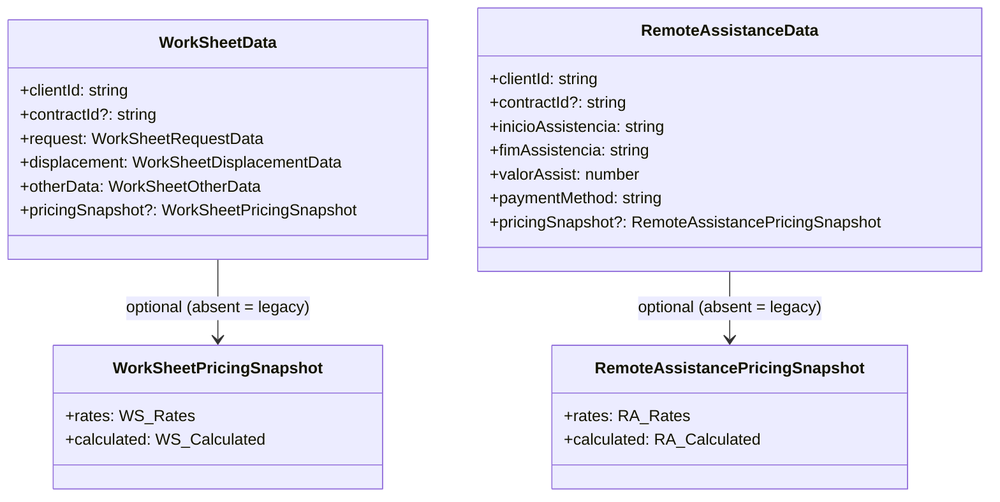
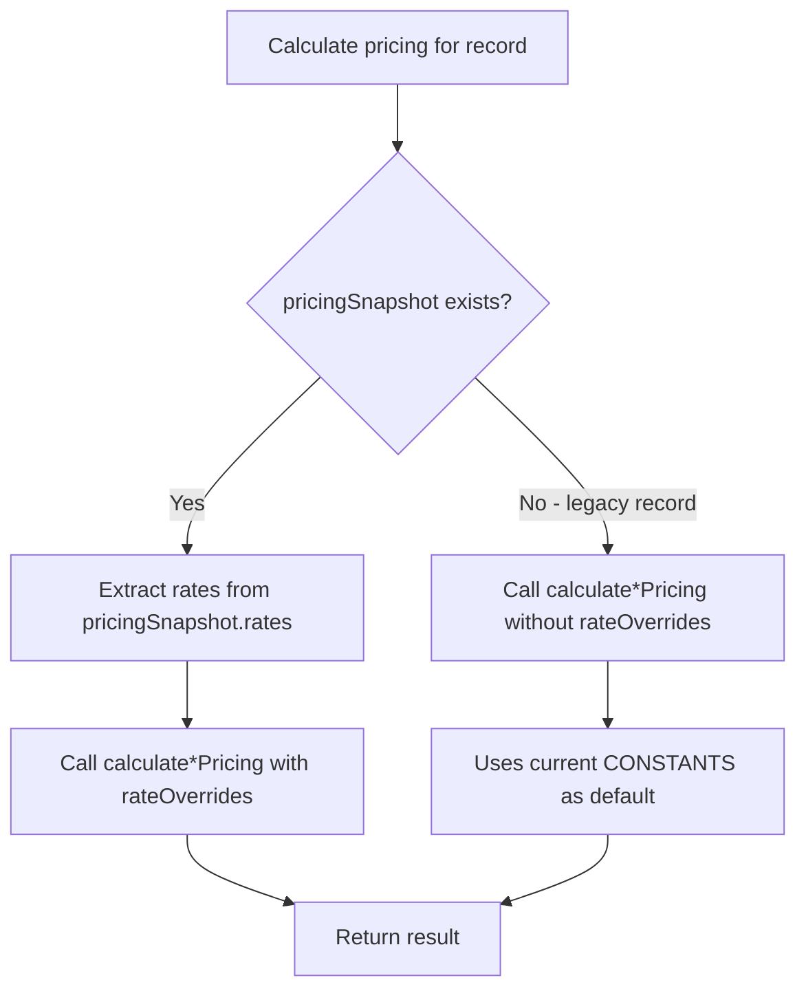
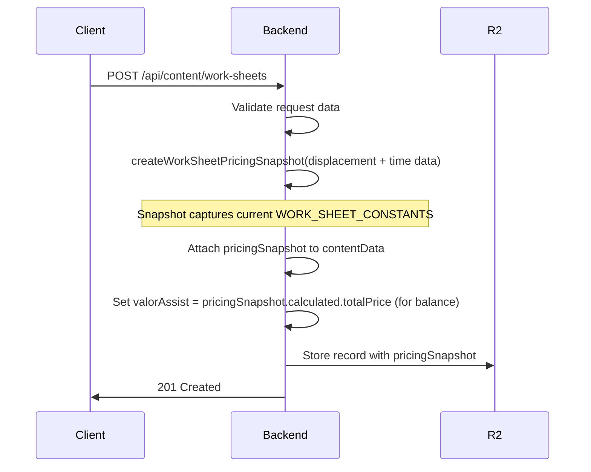
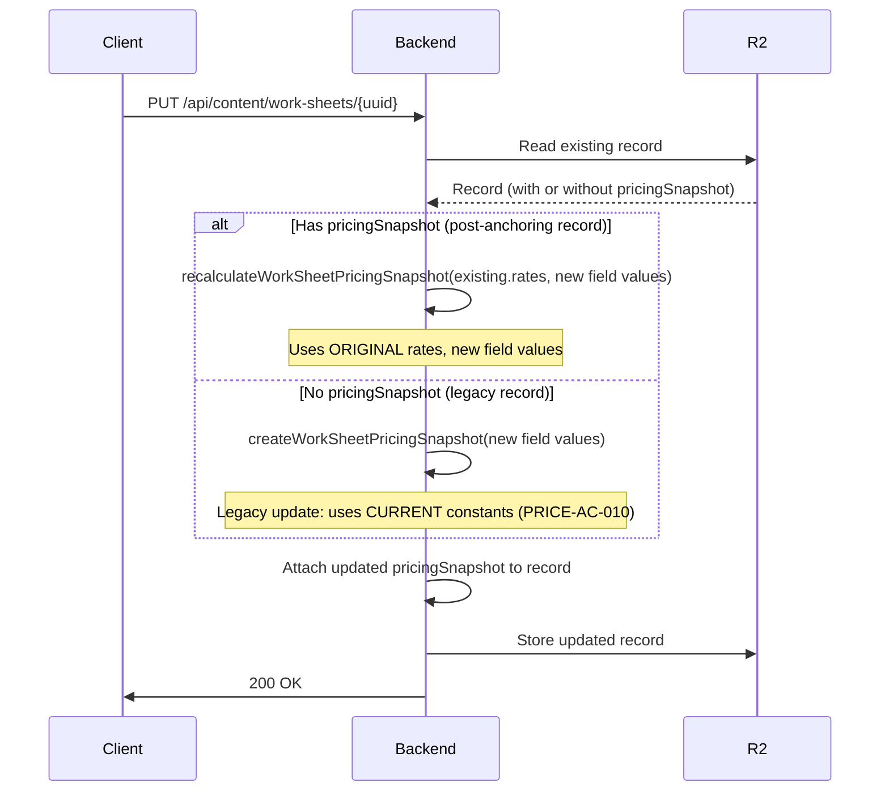
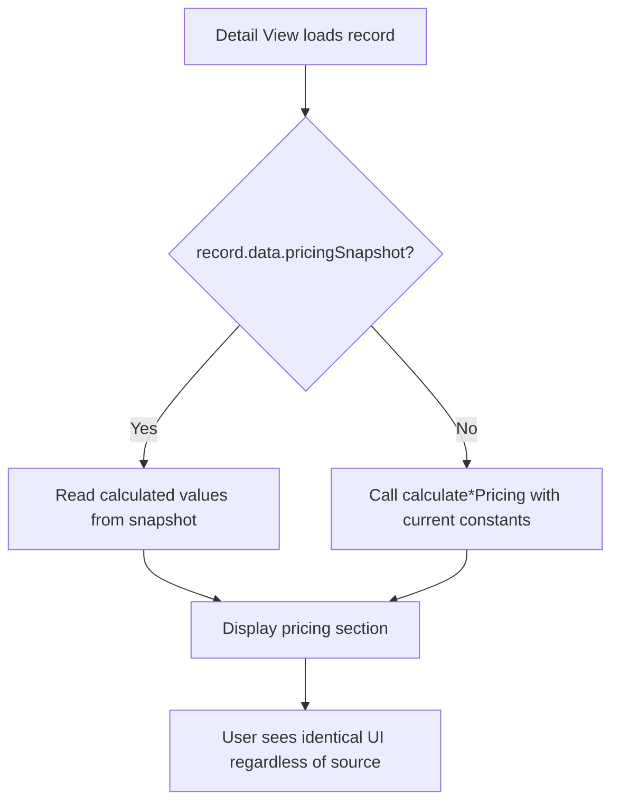
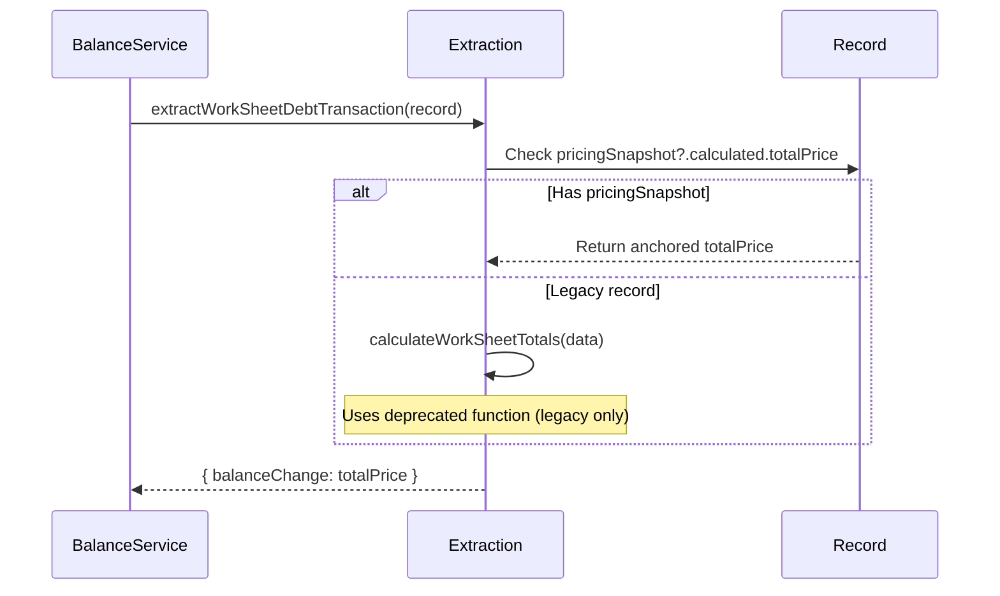

# Anchored Pricing for Worksheets & Remote Assistance — Design

## Writing Plan

| # | Section | REQ-IDs covered | Completeness focus | Impact on existing |
|---|---------|-----------------|--------------------|--------------------|
| 1 | Data Model — Pricing Snapshot Types | PRICE-BR-001, PRICE-BR-005, PRICE-BR-006 | Typed schema, nullability, invariants for legacy records | Adds optional fields to `WorkSheetData` and `RemoteAssistanceData` |
| 2 | Pricing Calculation — Rate Override Support | PRICE-BR-002, PRICE-BR-007, PRICE-AC-010, PRICE-AC-011 | Error case (missing rates), fallback logic, edge cases (null snapshot) | Modifies `calculateWorkSheetPricing()` and `calculateRemoteAssistancePricing()` signatures |
| 3 | Backend — Snapshot at Creation & Update | PRICE-BR-001, PRICE-BR-002, PRICE-BR-003, PRICE-BR-007, PRICE-AC-009, PRICE-AC-013 | Error case (constants unavailable), update recalculation with anchored rates | Modifies POST/PUT handlers in `work-sheets.ts` and `remote-assistance.ts` |
| 4 | Frontend — Detail View Pricing Display | PRICE-BR-004, PRICE-BR-008, PRICE-UX-001, PRICE-AC-003, PRICE-AC-006, PRICE-AC-008, PRICE-AC-011, PRICE-AC-012 | Legacy fallback, no visual distinction, no rate exposure | Modifies `WorkSheetsDetailView.vue` and `RemoteAssistanceDetailView.vue` |
| 5 | Balance Integration | PRICE-BR-009 | Transparent consumption, no distinction between anchored/fallback | Modifies `extractWorkSheetDebtTransaction()` in `balance-extraction.ts` |

**Decision: Snapshot storage approach**
Options: [A] Dedicated `pricingSnapshot` sub-object / [B] Flat fields
Chosen: [A]
Reason: Clean separation from existing data, explicit about what was anchored, optional field naturally handles legacy records.

---

## 1. Data Model — Pricing Snapshot Types

**File:** `packages/shared/src/types/work-sheets/types.ts`
**File:** `packages/shared/src/types/remote-assistance/types.ts`

### 1.1 Work Sheet Pricing Snapshot

```typescript
/**
 * Snapshot of pricing rates captured at Work Sheet creation time.
 * Once stored, these rates are NEVER updated — they anchor the price to creation-time values.
 */
export interface WorkSheetPricingSnapshot {
  /** Rates active at creation time */
  rates: {
    hourlyRateWeekday: number;       // from WORK_SHEET_CONSTANTS.HOURLY_RATE_WEEKDAY
    hourlyRateWeekendHoliday: number; // from WORK_SHEET_CONSTANTS.HOURLY_RATE_WEEKEND_HOLIDAY
    mileageRatePerKm: number;        // from WORK_SHEET_CONSTANTS.MILEAGE_RATE_PER_KM
    travelFeeShort: number;          // from WORK_SHEET_CONSTANTS.TRAVEL_FEE_SHORT
    travelFeeLong: number;           // from WORK_SHEET_CONSTANTS.TRAVEL_FEE_LONG
    travelFeeThresholdKm: number;    // from WORK_SHEET_CONSTANTS.TRAVEL_FEE_THRESHOLD_KM
    minimumHours: number;            // from WORK_SHEET_CONSTANTS.MINIMUM_HOURS
  };
  /** Calculated totals using anchored rates */
  calculated: {
    hourlyRate: number;     // effective rate used (weekday or weekend)
    laborHours: number;     // hours charged (min 1h applied)
    laborPrice: number;     // laborHours × hourlyRate
    travelFee: number;      // 0 if no displacement
    mileagePrice: number;   // 0 if no displacement
    totalPrice: number;     // laborPrice + travelFee + mileagePrice
  };
}
```

**Addition to `WorkSheetData`:**

```typescript
export interface WorkSheetData {
  // ... existing fields unchanged ...

  /** Pricing snapshot anchored at creation time. Absent for legacy records. */
  pricingSnapshot?: WorkSheetPricingSnapshot;
}
```

### 1.2 Remote Assistance Pricing Snapshot

```typescript
/**
 * Snapshot of pricing rates captured at Remote Assistance creation time.
 * Once stored, these rates are NEVER updated.
 */
export interface RemoteAssistancePricingSnapshot {
  /** Rates active at creation time */
  rates: {
    priceBusinessHours: number;           // from REMOTE_ASSISTANCE_CONSTANTS.PRICE_BUSINESS_HOURS
    priceAfterHours: number;              // from REMOTE_ASSISTANCE_CONSTANTS.PRICE_AFTER_HOURS
    billingIncrementMinutes: number;      // from REMOTE_ASSISTANCE_CONSTANTS.BILLING_INCREMENT_MINUTES
    businessHoursMorningStart: number;    // from REMOTE_ASSISTANCE_CONSTANTS.BUSINESS_HOURS_MORNING_START
    businessHoursMorningEnd: number;      // from REMOTE_ASSISTANCE_CONSTANTS.BUSINESS_HOURS_MORNING_END
    businessHoursAfternoonStart: number;  // from REMOTE_ASSISTANCE_CONSTANTS.BUSINESS_HOURS_AFTERNOON_START
    businessHoursAfternoonEnd: number;    // from REMOTE_ASSISTANCE_CONSTANTS.BUSINESS_HOURS_AFTERNOON_END
  };
  /** Calculated totals using anchored rates */
  calculated: {
    totalValue: number;
    businessHoursValue: number;
    offHoursValue: number;
    totalMinutes: number;
    billingMinutes: number;
    businessMinutes: number;
    offHoursMinutes: number;
    isZeroCost: boolean;
  };
}
```

**Addition to `RemoteAssistanceData`:**

```typescript
export interface RemoteAssistanceData {
  // ... existing fields unchanged ...

  /** Pricing snapshot anchored at creation time. Absent for legacy records. */
  pricingSnapshot?: RemoteAssistancePricingSnapshot;
}
```

### 1.3 Invariants and Edge Cases

| Invariant | Rule |
|-----------|------|
| Legacy records | `pricingSnapshot` is `undefined` — system falls back to dynamic calculation |
| New records | `pricingSnapshot` is always populated at creation — never `undefined` for new records |
| Immutability | `pricingSnapshot.rates` is NEVER modified after initial write |
| Update recalculation | `pricingSnapshot.calculated` is recalculated using `pricingSnapshot.rates` when record fields change (PRICE-BR-007) |
| Null safety | All `rates` fields are required numbers — no optional sub-fields |
| Zero-cost records | For Contrato/Garantia payment in Remote Assistance: `calculated.isZeroCost = true`, `calculated.totalValue = 0` |

### 1.4 Relationship Diagram



---

## 2. Pricing Calculation — Rate Override Support

**File:** `packages/shared/src/types/work-sheets/validation.ts`
**File:** `packages/shared/src/types/remote-assistance/validation.ts`

### 2.1 Work Sheet — Modified Signature

The existing `calculateWorkSheetPricing()` accepts a `WorkSheetPricingInput`. We extend it with an optional `rateOverrides` parameter that, when provided, replaces the global constants.

```typescript
/**
 * Optional rate overrides for anchored pricing.
 * When provided, these replace WORK_SHEET_CONSTANTS values in the calculation.
 */
export interface WorkSheetRateOverrides {
  hourlyRateWeekday: number;
  hourlyRateWeekendHoliday: number;
  mileageRatePerKm: number;
  travelFeeShort: number;
  travelFeeLong: number;
  travelFeeThresholdKm: number;
  minimumHours: number;
}

export interface WorkSheetPricingInput {
  weekendHoliday: boolean;
  hasDisplacement: boolean;
  totalKms: number;
  arrivalTime: string;
  departureTime: string;
  /** When provided, overrides WORK_SHEET_CONSTANTS. Used for anchored pricing recalculation. */
  rateOverrides?: WorkSheetRateOverrides;
}
```

**Behavior change in `calculateWorkSheetPricing()`:**

```typescript
export function calculateWorkSheetPricing(input: WorkSheetPricingInput): WorkSheetPricingResult {
  const rates = input.rateOverrides ?? {
    hourlyRateWeekday: WORK_SHEET_CONSTANTS.HOURLY_RATE_WEEKDAY,
    hourlyRateWeekendHoliday: WORK_SHEET_CONSTANTS.HOURLY_RATE_WEEKEND_HOLIDAY,
    mileageRatePerKm: WORK_SHEET_CONSTANTS.MILEAGE_RATE_PER_KM,
    travelFeeShort: WORK_SHEET_CONSTANTS.TRAVEL_FEE_SHORT,
    travelFeeLong: WORK_SHEET_CONSTANTS.TRAVEL_FEE_LONG,
    travelFeeThresholdKm: WORK_SHEET_CONSTANTS.TRAVEL_FEE_THRESHOLD_KM,
    minimumHours: WORK_SHEET_CONSTANTS.MINIMUM_HOURS,
  };

  const hourlyRate = input.weekendHoliday
    ? rates.hourlyRateWeekendHoliday
    : rates.hourlyRateWeekday;

  // ... rest of calculation uses `rates.mileageRatePerKm`, `rates.travelFeeShort`, etc.
  // instead of WORK_SHEET_CONSTANTS directly
}
```

**Backward compatibility:** When `rateOverrides` is omitted (existing callers), behavior is identical — constants are used as before. No breaking change.

### 2.2 Remote Assistance — Modified Signature

```typescript
/**
 * Optional rate overrides for anchored pricing.
 * When provided, these replace REMOTE_ASSISTANCE_CONSTANTS values in the calculation.
 */
export interface RemoteAssistanceRateOverrides {
  priceBusinessHours: number;
  priceAfterHours: number;
  billingIncrementMinutes: number;
  businessHoursMorningStart: number;
  businessHoursMorningEnd: number;
  businessHoursAfternoonStart: number;
  businessHoursAfternoonEnd: number;
}

export interface RemoteAssistancePricingInput {
  startTime: string;
  endTime: string;
  isWeekendOrHoliday: boolean;
  paymentMethod?: 'Contrato' | 'Faturação' | 'Garantia' | '';
  /** When provided, overrides REMOTE_ASSISTANCE_CONSTANTS. Used for anchored pricing recalculation. */
  rateOverrides?: RemoteAssistanceRateOverrides;
}
```

**Behavior change in `calculateRemoteAssistancePricing()`:**

```typescript
export function calculateRemoteAssistancePricing(
  input: RemoteAssistancePricingInput
): RemoteAssistancePricingResult {
  const rates = input.rateOverrides ?? {
    priceBusinessHours: REMOTE_ASSISTANCE_CONSTANTS.PRICE_BUSINESS_HOURS,
    priceAfterHours: REMOTE_ASSISTANCE_CONSTANTS.PRICE_AFTER_HOURS,
    billingIncrementMinutes: REMOTE_ASSISTANCE_CONSTANTS.BILLING_INCREMENT_MINUTES,
    businessHoursMorningStart: REMOTE_ASSISTANCE_CONSTANTS.BUSINESS_HOURS_MORNING_START,
    businessHoursMorningEnd: REMOTE_ASSISTANCE_CONSTANTS.BUSINESS_HOURS_MORNING_END,
    businessHoursAfternoonStart: REMOTE_ASSISTANCE_CONSTANTS.BUSINESS_HOURS_AFTERNOON_START,
    businessHoursAfternoonEnd: REMOTE_ASSISTANCE_CONSTANTS.BUSINESS_HOURS_AFTERNOON_END,
  };

  // ... uses rates.priceBusinessHours, rates.priceAfterHours, etc.
  // instead of REMOTE_ASSISTANCE_CONSTANTS directly
}
```

### 2.3 Fallback Logic Flow



### 2.4 Error Cases and Edge Cases

| Scenario | Behavior |
|----------|----------|
| `rateOverrides` omitted | Falls back to global constants (existing behavior) |
| `rateOverrides` provided with valid rates | Uses provided rates exclusively |
| Legacy record (no `pricingSnapshot`) | No `rateOverrides` passed → dynamic calculation with current constants |
| Record update with `pricingSnapshot` | Passes `pricingSnapshot.rates` as `rateOverrides` → recalculates with original rates |
| Record update without `pricingSnapshot` (legacy) | No `rateOverrides` → uses current constants (PRICE-AC-010) |
| Zero/negative rate in override | Treated as-is — calculation produces 0 or negative price (data integrity is backend's responsibility) |

---

## 3. Backend — Snapshot at Creation & Update

**File:** `packages/backend/src/routes/work-sheets.ts`
**File:** `packages/backend/src/routes/remote-assistance.ts`

### 3.1 Snapshot Helper Functions

New shared utility functions that build the pricing snapshot at write time.

**File:** `packages/shared/src/types/work-sheets/validation.ts` (alongside existing pricing functions)

```typescript
import { WORK_SHEET_CONSTANTS, WorkSheetPricingSnapshot } from './types';

/**
 * Creates a pricing snapshot by capturing current constants and calculating totals.
 * Called at record creation and on every update that may affect pricing.
 */
export function createWorkSheetPricingSnapshot(input: {
  weekendHoliday: boolean;
  hasDisplacement: boolean;
  totalKms: number;
  arrivalTime: string;
  departureTime: string;
}): WorkSheetPricingSnapshot {
  const rates: WorkSheetPricingSnapshot['rates'] = {
    hourlyRateWeekday: WORK_SHEET_CONSTANTS.HOURLY_RATE_WEEKDAY,
    hourlyRateWeekendHoliday: WORK_SHEET_CONSTANTS.HOURLY_RATE_WEEKEND_HOLIDAY,
    mileageRatePerKm: WORK_SHEET_CONSTANTS.MILEAGE_RATE_PER_KM,
    travelFeeShort: WORK_SHEET_CONSTANTS.TRAVEL_FEE_SHORT,
    travelFeeLong: WORK_SHEET_CONSTANTS.TRAVEL_FEE_LONG,
    travelFeeThresholdKm: WORK_SHEET_CONSTANTS.TRAVEL_FEE_THRESHOLD_KM,
    minimumHours: WORK_SHEET_CONSTANTS.MINIMUM_HOURS,
  };

  const result = calculateWorkSheetPricing({
    ...input,
    rateOverrides: rates,
  });

  return {
    rates,
    calculated: {
      hourlyRate: result.hourlyRate,
      laborHours: result.laborHours,
      laborPrice: result.laborPrice,
      travelFee: result.travelFee,
      mileagePrice: result.mileagePrice,
      totalPrice: result.totalPrice,
    },
  };
}

/**
 * Recalculates pricing using EXISTING anchored rates (for record updates).
 * Rates are preserved from creation; only calculated values are updated.
 */
export function recalculateWorkSheetPricingSnapshot(
  existingRates: WorkSheetPricingSnapshot['rates'],
  input: {
    weekendHoliday: boolean;
    hasDisplacement: boolean;
    totalKms: number;
    arrivalTime: string;
    departureTime: string;
  }
): WorkSheetPricingSnapshot {
  const result = calculateWorkSheetPricing({
    ...input,
    rateOverrides: existingRates,
  });

  return {
    rates: existingRates, // preserved from creation
    calculated: {
      hourlyRate: result.hourlyRate,
      laborHours: result.laborHours,
      laborPrice: result.laborPrice,
      travelFee: result.travelFee,
      mileagePrice: result.mileagePrice,
      totalPrice: result.totalPrice,
    },
  };
}
```

**File:** `packages/shared/src/types/remote-assistance/validation.ts`

```typescript
import { REMOTE_ASSISTANCE_CONSTANTS, RemoteAssistancePricingSnapshot } from './types';

/**
 * Creates a pricing snapshot by capturing current constants and calculating totals.
 */
export function createRemoteAssistancePricingSnapshot(input: {
  startTime: string;
  endTime: string;
  isWeekendOrHoliday: boolean;
  paymentMethod?: 'Contrato' | 'Faturação' | 'Garantia' | '';
}): RemoteAssistancePricingSnapshot {
  const rates: RemoteAssistancePricingSnapshot['rates'] = {
    priceBusinessHours: REMOTE_ASSISTANCE_CONSTANTS.PRICE_BUSINESS_HOURS,
    priceAfterHours: REMOTE_ASSISTANCE_CONSTANTS.PRICE_AFTER_HOURS,
    billingIncrementMinutes: REMOTE_ASSISTANCE_CONSTANTS.BILLING_INCREMENT_MINUTES,
    businessHoursMorningStart: REMOTE_ASSISTANCE_CONSTANTS.BUSINESS_HOURS_MORNING_START,
    businessHoursMorningEnd: REMOTE_ASSISTANCE_CONSTANTS.BUSINESS_HOURS_MORNING_END,
    businessHoursAfternoonStart: REMOTE_ASSISTANCE_CONSTANTS.BUSINESS_HOURS_AFTERNOON_START,
    businessHoursAfternoonEnd: REMOTE_ASSISTANCE_CONSTANTS.BUSINESS_HOURS_AFTERNOON_END,
  };

  const result = calculateRemoteAssistancePricing({
    ...input,
    rateOverrides: rates,
  });

  return {
    rates,
    calculated: {
      totalValue: result.totalValue,
      businessHoursValue: result.businessHoursValue,
      offHoursValue: result.offHoursValue,
      totalMinutes: result.totalMinutes,
      billingMinutes: result.billingMinutes,
      businessMinutes: result.businessMinutes,
      offHoursMinutes: result.offHoursMinutes,
      isZeroCost: result.isZeroCost,
    },
  };
}

/**
 * Recalculates pricing using EXISTING anchored rates (for record updates).
 */
export function recalculateRemoteAssistancePricingSnapshot(
  existingRates: RemoteAssistancePricingSnapshot['rates'],
  input: {
    startTime: string;
    endTime: string;
    isWeekendOrHoliday: boolean;
    paymentMethod?: 'Contrato' | 'Faturação' | 'Garantia' | '';
  }
): RemoteAssistancePricingSnapshot {
  const result = calculateRemoteAssistancePricing({
    ...input,
    rateOverrides: existingRates,
  });

  return {
    rates: existingRates, // preserved from creation
    calculated: {
      totalValue: result.totalValue,
      businessHoursValue: result.businessHoursValue,
      offHoursValue: result.offHoursValue,
      totalMinutes: result.totalMinutes,
      billingMinutes: result.billingMinutes,
      businessMinutes: result.businessMinutes,
      offHoursMinutes: result.offHoursMinutes,
      isZeroCost: result.isZeroCost,
    },
  };
}
```

### 3.2 Backend POST Handler — Work Sheets

Integration point in `packages/backend/src/routes/work-sheets.ts` POST handler:



**Pseudo-code insertion in POST handler (after validation, before R2 write):**

```typescript
// Build pricing snapshot from current constants
const pricingSnapshot = createWorkSheetPricingSnapshot({
  weekendHoliday: contentData.displacement?.weekendHoliday ?? false,
  hasDisplacement: contentData.displacement?.hasDisplacement ?? false,
  totalKms: contentData.displacement?.totalKms ?? 0,
  arrivalTime: contentData.request?.arrivalTime ?? '',
  departureTime: contentData.request?.departureTime ?? '',
});

// Attach to content data before storage
contentData.pricingSnapshot = pricingSnapshot;
```

### 3.3 Backend POST Handler — Remote Assistance

Same pattern in `packages/backend/src/routes/remote-assistance.ts`:

```typescript
// Build pricing snapshot from current constants
const pricingSnapshot = createRemoteAssistancePricingSnapshot({
  startTime: contentData.inicioAssistencia ?? '',
  endTime: contentData.fimAssistencia ?? '',
  isWeekendOrHoliday: contentData.weekendHoliday ?? false,
  paymentMethod: contentData.paymentMethod ?? '',
});

// Attach to content data before storage
contentData.pricingSnapshot = pricingSnapshot;

// Update valorAssist from snapshot for backward compat with balance extraction
contentData.valorAssist = pricingSnapshot.calculated.totalValue;
```

### 3.4 Backend PUT Handler — Both Types

On update, the system recalculates `calculated` using the ORIGINAL anchored rates (PRICE-BR-007):



**Pseudo-code for PUT handler:**

```typescript
// Determine pricing snapshot for the update
const existingSnapshot = existingRecord.data.pricingSnapshot;

let updatedSnapshot: WorkSheetPricingSnapshot;
if (existingSnapshot) {
  // Record has anchored rates — recalculate with original rates (PRICE-BR-007)
  updatedSnapshot = recalculateWorkSheetPricingSnapshot(
    existingSnapshot.rates,
    {
      weekendHoliday: mergedData.displacement?.weekendHoliday ?? false,
      hasDisplacement: mergedData.displacement?.hasDisplacement ?? false,
      totalKms: mergedData.displacement?.totalKms ?? 0,
      arrivalTime: mergedData.request?.arrivalTime ?? '',
      departureTime: mergedData.request?.departureTime ?? '',
    }
  );
} else {
  // Legacy record — use current constants (PRICE-AC-010)
  updatedSnapshot = createWorkSheetPricingSnapshot({
    weekendHoliday: mergedData.displacement?.weekendHoliday ?? false,
    hasDisplacement: mergedData.displacement?.hasDisplacement ?? false,
    totalKms: mergedData.displacement?.totalKms ?? 0,
    arrivalTime: mergedData.request?.arrivalTime ?? '',
    departureTime: mergedData.request?.departureTime ?? '',
  });
}

mergedData.pricingSnapshot = updatedSnapshot;
```

### 3.5 Error Case — Constants Unavailable (PRICE-AC-013)

The constants are compile-time TypeScript `const` objects — they cannot be "unavailable" at runtime (they're bundled in the Worker code). However, if the calculated result has invalid data (e.g., `NaN` from corrupted input times), the creation is rejected:

```typescript
// After creating snapshot, validate it
if (isNaN(pricingSnapshot.calculated.totalPrice)) {
  throw new Error('Não foi possível calcular o preço. Verifique os dados inseridos.');
}
```

This covers PRICE-AC-013 in the context of this architecture (constants are always available as bundled code; calculation failure from bad inputs is the realistic error case).

### 3.6 Performance (PRICE-NFR-001)

The pricing snapshot creation is pure arithmetic:
- No I/O operations
- No async calls
- O(1) computation (fixed number of arithmetic operations)
- Execution time: sub-microsecond (well under the 50ms threshold)

### 3.7 Error Responses

**POST /api/content/work-sheets** and **POST /api/content/remote-assistance**:

| HTTP Status | Error Code | Trigger Condition |
|-------------|-----------|-------------------|
| 400 | `"Invalid JSON body"` | Request body is not valid JSON |
| 400 | Validation error message | Field validation fails (existing behavior) |
| 400 | `"Não foi possível calcular o preço. Verifique os dados inseridos."` | Pricing snapshot calculation produces NaN (PRICE-AC-013) |
| 500 | `"Storage not available"` | R2 bucket binding missing (existing behavior) |

**PUT /api/content/work-sheets/{uuid}** and **PUT /api/content/remote-assistance/{uuid}**:

| HTTP Status | Error Code | Trigger Condition |
|-------------|-----------|-------------------|
| 400 | `"Invalid JSON body"` | Request body is not valid JSON |
| 400 | Validation error message | Field validation fails (existing behavior) |
| 400 | `"Não foi possível calcular o preço. Verifique os dados inseridos."` | Recalculated pricing snapshot produces NaN |
| 404 | `"Content not found"` | UUID does not exist in R2 (existing behavior) |
| 500 | `"Storage not available"` | R2 bucket binding missing (existing behavior) |

**Response schema (error case):**

```typescript
{
  success: false;
  error: string;    // human-readable error message
  timestamp: string; // ISO 8601
}
```

**Response schema (success case — unchanged from existing):**

```typescript
{
  success: true;
  data: WorkSheet | RemoteAssistance; // includes pricingSnapshot field
  timestamp: string;
}
```

---

## 4. Frontend — Detail View Pricing Display

**File:** `packages/frontend/src/views/work-sheets/WorkSheetsDetailView.vue`
**File:** `packages/frontend/src/views/remote-assistance/RemoteAssistanceDetailView.vue`

### 4.1 Work Sheet Detail — Pricing Computed Property

The existing `pricing` computed property is modified to prefer anchored values:

```typescript
const pricing = computed(() => {
  if (!workSheet.value?.data) return null;

  const snapshot = workSheet.value.data.pricingSnapshot;

  if (snapshot) {
    // Anchored record: use stored calculated values (PRICE-BR-004)
    return {
      hourlyRate: snapshot.calculated.hourlyRate,
      laborHours: snapshot.calculated.laborHours,
      laborPrice: snapshot.calculated.laborPrice,
      hasDisplacement: workSheet.value.data.displacement?.hasDisplacement ?? false,
      travelFee: snapshot.calculated.travelFee,
      mileagePrice: snapshot.calculated.mileagePrice,
      totalKms: workSheet.value.data.displacement?.totalKms ?? 0,
      totalPrice: snapshot.calculated.totalPrice,
    };
  }

  // Legacy fallback: dynamic calculation with current constants (PRICE-AC-011)
  return calculateWorkSheetPricing({
    weekendHoliday: workSheet.value.data.displacement?.weekendHoliday ?? false,
    hasDisplacement: workSheet.value.data.displacement?.hasDisplacement ?? false,
    totalKms: workSheet.value.data.displacement?.totalKms ?? 0,
    arrivalTime: workSheet.value.data.request?.arrivalTime ?? '',
    departureTime: workSheet.value.data.request?.departureTime ?? '',
  });
});
```

**Template impact:** None. The template already renders `pricing.hourlyRate`, `pricing.laborPrice`, etc. The computed returns the same shape — no template changes needed.

**Rate display removal (PRICE-BR-008):** Currently, the template shows `WORK_SHEET_CONSTANTS.MILEAGE_RATE_PER_KM` directly in the mileage breakdown line. This must be replaced with `pricing.mileagePrice / pricing.totalKms` or simply show `pricing.mileagePrice` without exposing the per-km rate from the snapshot. The display already shows the formula `XX km × Y€` — the Y€ value should come from `snapshot.rates.mileageRatePerKm` when available, or `WORK_SHEET_CONSTANTS.MILEAGE_RATE_PER_KM` for legacy. This is acceptable because PRICE-BR-008 states the system SHALL NOT expose *anchored* rates — but displaying the rate used to calculate a line item is part of the pricing breakdown, not "exposing rates" in a configuration sense.

**Decision: Rate display in pricing breakdown**
Options: [A] Show rate per line (km × rate) as today — acceptable since it's a computation detail, not an admin setting / [B] Remove rate detail, show only totals
Chosen: [A]
Reason: PRICE-BR-008 intends to prevent users from seeing the "configuration rates" separately. Showing `45 km × 0.45€` in a calculation breakdown is explaining the math, which is existing UX behavior (PRICE-UX-001 requires no visible UI change).

### 4.2 Remote Assistance Detail — Pricing Computed Property

```typescript
const pricingResult = computed(() => {
  if (
    !remoteAssistance.value?.data.inicioAssistencia ||
    !remoteAssistance.value?.data.fimAssistencia
  ) {
    return null;
  }

  const snapshot = remoteAssistance.value.data.pricingSnapshot;

  if (snapshot) {
    // Anchored record: use stored calculated values (PRICE-BR-004)
    return {
      totalValue: snapshot.calculated.totalValue,
      businessHoursValue: snapshot.calculated.businessHoursValue,
      offHoursValue: snapshot.calculated.offHoursValue,
      totalMinutes: snapshot.calculated.totalMinutes,
      billingMinutes: snapshot.calculated.billingMinutes,
      businessMinutes: snapshot.calculated.businessMinutes,
      offHoursMinutes: snapshot.calculated.offHoursMinutes,
      isZeroCost: snapshot.calculated.isZeroCost,
    };
  }

  // Legacy fallback: dynamic calculation with current constants (PRICE-AC-011)
  return calculateRemoteAssistancePricing({
    startTime: remoteAssistance.value.data.inicioAssistencia ?? '',
    endTime: remoteAssistance.value.data.fimAssistencia ?? '',
    isWeekendOrHoliday: remoteAssistance.value.data.weekendHoliday ?? false,
    paymentMethod: remoteAssistance.value.data.paymentMethod ?? '',
  });
});
```

**Template impact:** The template references `pricingResult.businessMinutes`, `pricingResult.offHoursMinutes`, etc. — all fields match. One change: the template currently references `REMOTE_ASSISTANCE_CONSTANTS.PRICE_BUSINESS_HOURS` and `PRICE_AFTER_HOURS` directly for the breakdown labels. For anchored records, these should come from `snapshot.rates`:

```typescript
// New computed for rate display in breakdown
const displayRates = computed(() => {
  const snapshot = remoteAssistance.value?.data.pricingSnapshot;
  if (snapshot) {
    return {
      businessRate: snapshot.rates.priceBusinessHours,
      afterHoursRate: snapshot.rates.priceAfterHours,
    };
  }
  // Legacy fallback
  return {
    businessRate: REMOTE_ASSISTANCE_CONSTANTS.PRICE_BUSINESS_HOURS,
    afterHoursRate: REMOTE_ASSISTANCE_CONSTANTS.PRICE_AFTER_HOURS,
  };
});
```

Template line updates:
- `{{ REMOTE_ASSISTANCE_CONSTANTS.PRICE_BUSINESS_HOURS }}` → `{{ displayRates.businessRate }}`
- `{{ REMOTE_ASSISTANCE_CONSTANTS.PRICE_AFTER_HOURS }}` → `{{ displayRates.afterHoursRate }}`

### 4.3 Visual Behavior (PRICE-UX-001, PRICE-AC-012)

| Requirement | Implementation |
|-------------|----------------|
| No visible UI change (PRICE-UX-001) | Same computed shape, same template structure — user sees identical pricing section |
| No visual distinction for legacy (PRICE-AC-012) | No badge, warning, or indicator — both paths produce the same result type |
| No rate exposure (PRICE-BR-008) | Rates appear only as part of calculation breakdown (existing behavior), not as a separate "configuration" section |
| Create form unchanged (PRICE-UX-002) | No frontend changes to create forms — snapshot is attached server-side |

### 4.4 Flow Summary



---

## 5. Balance Integration

**File:** `packages/shared/src/balance-extraction.ts`

### 5.1 Current State — Problem

- `extractWorkSheetDebtTransaction()` calls `calculateWorkSheetTotals()` (deprecated) which uses hardcoded OLD rates (€45/€60 hourly). This means even *new* records get wrong balance values if the deprecated function isn't updated.
- `extractRemoteAssistanceDebtTransaction()` reads `remoteAssistance.data.valorAssist` directly — already correct if `valorAssist` is set properly at creation.

### 5.2 Design — Read From Stored Price

**Work Sheet extraction — modified:**

```typescript
export function extractWorkSheetDebtTransaction(workSheet: WorkSheet): TransactionChanges {
  // Warranty work - no transaction
  if (workSheet.data.otherData.warranty) {
    return { contractUsageChanges: {} };
  }

  const paymentMethod = workSheet.data.displacement.paymentMethod;

  // Contract payment - consume contract resources (unchanged)
  if (paymentMethod === 'CONTRATO') {
    // ... existing contract usage logic unchanged ...
  }

  // Other payment methods - add to debt
  // Use anchored price if available; fallback to deprecated calculation for legacy
  const totalPrice = workSheet.data.pricingSnapshot?.calculated.totalPrice
    ?? calculateWorkSheetTotals(workSheet.data).totalPrice;

  return {
    balanceChange: totalPrice,
  };
}
```

**Remote Assistance extraction — unchanged:**

The existing implementation already reads `remoteAssistance.data.valorAssist`. Since the backend now sets `valorAssist = pricingSnapshot.calculated.totalValue` at creation (Section 3.3), balance extraction works correctly without modification.

### 5.3 Transparent Consumption (PRICE-BR-009)

The balance system does not distinguish between anchored and fallback pricing. It simply reads the price value:
- Work Sheet: `pricingSnapshot.calculated.totalPrice` (new) or `calculateWorkSheetTotals()` (legacy fallback)
- Remote Assistance: `data.valorAssist` (populated from snapshot or dynamically)

No changes to balance reporting, export, or display logic.

### 5.4 Deletion of Deprecated Code

Once all new records have `pricingSnapshot`, the deprecated `calculateWorkSheetTotals()` becomes dead code for new records. However, it must remain for legacy record balance recalculations until a data migration (excluded from scope). No deletion in this spec.

### 5.5 Flow



