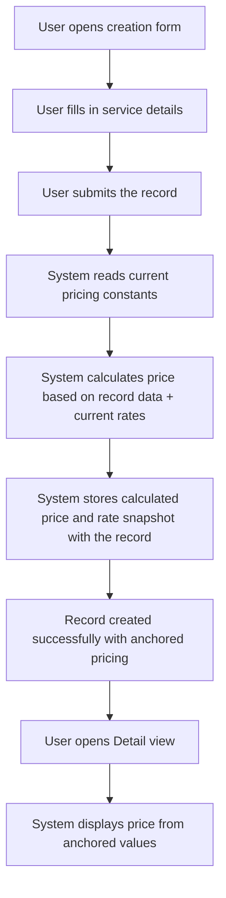
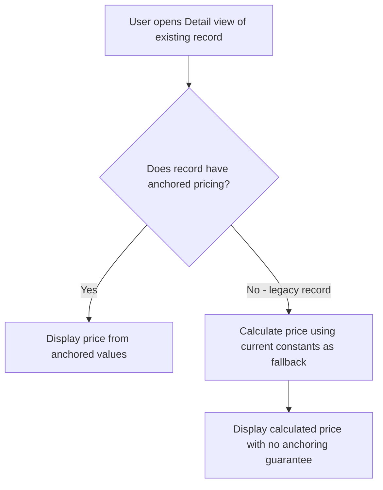

# Anchored Pricing for Worksheets & Remote Assistance - Requirements

## Epic
[ ] **PRICE-E-001**: **As a** system user **I want** the price of a Work Sheet or Remote Assistance record to be captured and stored at the moment of creation **So that** future pricing changes never alter the cost of previously created records

## User Flow

### Passing Cases Flow
[ ] Passing flow diagram

### Non-Passing Cases Flow
[ ] Non-passing flow diagram

## Technical Requirements

### Resolved Questions
[x] **Legacy Record Display (RESOLVED)**: Legacy records created before the anchoring feature will fall back to calculating price using current constants. The price may drift if constants are updated — this is accepted. No visual indicator or backfill migration required.

### Business Rules
[ ] **PRICE-BR-001**: **WHEN** a record is created, the system **SHALL** snapshot all applicable pricing rates and store them with the record
[ ] **PRICE-BR-002**: **WHEN** a record is created, the system **SHALL** calculate the total price using the snapshotted rates and persist the result
[ ] **PRICE-BR-003**: **WHEN** pricing constants are updated in the system, the system **SHALL NOT** recalculate prices for previously created records
[ ] **PRICE-BR-004**: **WHEN** the Detail view is displayed, the system **SHALL** compute the displayed price exclusively from the anchored (stored) values
[ ] **PRICE-BR-005**: **WHEN** a Work Sheet record is created, the system **SHALL** anchor the following rates: weekday hourly rate, weekend/holiday hourly rate, mileage rate per km, travel fee short, travel fee long, travel fee threshold, minimum hours
[ ] **PRICE-BR-006**: **WHEN** a Remote Assistance record is created, the system **SHALL** anchor the following rates: business hours rate, after-hours rate, billing increment minutes, and business hours window boundaries
[ ] **PRICE-BR-007**: **IF** a record with anchored rates is updated, **THEN** the system **SHALL** always recalculate the price using the originally anchored rates — regardless of which fields were modified
[ ] **PRICE-BR-008**: **WHEN** the Detail view is displayed, the system **SHALL NOT** expose the anchored rates — only the final calculated price **SHALL** be shown
[ ] **PRICE-BR-009**: The balance/reporting system **SHALL** consume the price value from the record without distinguishing between anchored and fallback-calculated pricing

### Performance
[ ] **PRICE-NFR-001**: The pricing snapshot **SHALL** add no perceptible delay to record creation (< 50ms additional processing)

### Dependencies & Integration Requirements
**Internal**:
- Work Sheets content type (`work-sheets`)
- Remote Assistance content type (`remote-assistance`)
- Shared pricing constants (`WORK_SHEET_CONSTANTS`, `REMOTE_ASSISTANCE_CONSTANTS`)
- Balance extraction system (reads pricing from records)

**External**: None

## UI/UX Requirements
[ ] **PRICE-UX-001**: The Detail view **SHALL** display the anchored price identically to today — no visible UI change for the user
[ ] **PRICE-UX-002**: The Create form **SHALL NOT** display pricing constants or rates to the user — pricing is computed transparently on submission

## User Stories

### Story: Price Anchoring at Creation (Work Sheet)
[ ] **PRICE-S-001**: **As a** field technician **I want** the Work Sheet price to be locked at the rates valid when I create it **So that** my past work records always reflect the correct billing

#### Acceptance Criteria
[ ] **PRICE-AC-001**: **WHEN** a Work Sheet is created, the system **SHALL** store the complete set of pricing rates active at that moment alongside the record data
[ ] **PRICE-AC-002**: **WHEN** a Work Sheet is created, the system **SHALL** calculate and store the total price (labor + displacement) using those anchored rates
[ ] **PRICE-AC-003**: **WHEN** the Work Sheet Detail view is opened, the system **SHALL** display pricing computed from the anchored rates stored in the record

### Story: Price Anchoring at Creation (Remote Assistance)
[ ] **PRICE-S-002**: **As a** support technician **I want** the Remote Assistance price to be locked at the rates valid when I create it **So that** billing reflects the rates in effect at the time of service

#### Acceptance Criteria
[ ] **PRICE-AC-004**: **WHEN** a Remote Assistance record is created, the system **SHALL** store the complete set of pricing rates (business/after-hours rates, time windows, billing increment) alongside the record data
[ ] **PRICE-AC-005**: **WHEN** a Remote Assistance record is created, the system **SHALL** calculate and store the total value using those anchored rates
[ ] **PRICE-AC-006**: **WHEN** the Remote Assistance Detail view is opened, the system **SHALL** display pricing computed from the anchored rates stored in the record

### Story: Price Immutability After Constant Updates
[ ] **PRICE-S-003**: **As a** business manager **I want** existing records to retain their original prices when I update pricing constants **So that** historical billing remains accurate and auditable

#### Acceptance Criteria
**Common Behavior** (see Story 1 & 2):
[ ] Applies: PRICE-AC-001, PRICE-AC-002, PRICE-AC-004, PRICE-AC-005

**Immutability-Specific Behavior**:
[ ] **PRICE-AC-007**: **WHEN** pricing constants are modified, the system **SHALL** leave all existing record prices unchanged
[ ] **PRICE-AC-008**: **WHEN** a previously created record is viewed after a pricing update, the system **SHALL** display the original anchored price — not a recalculated value

### Story: Record Update with Anchored Rates
[ ] **PRICE-S-004**: **As a** technician **I want** corrections to my record (e.g. fixing arrival/departure time) to recalculate using the original rates **So that** the price remains consistent with the rates in effect when the service was performed

#### Acceptance Criteria
[ ] **PRICE-AC-009**: **WHEN** a record with anchored rates is updated (any field), the system **SHALL** recalculate the price using the anchored rates stored in the record
[ ] **PRICE-AC-010**: **IF** an update is submitted but the record has no anchored rates (legacy record), **THEN** the system **SHALL** use the current constants for calculation

### Story: Legacy Record and Error Handling
[ ] **PRICE-S-005**: **As a** user **I want** to view older records created before price anchoring was implemented **So that** I can still see their pricing information

#### Acceptance Criteria
[ ] **PRICE-AC-011**: **IF** a record does not contain anchored pricing data, **THEN** the system **SHALL** fall back to calculating price using current constants (price may drift with future rate changes — accepted)
[ ] **PRICE-AC-012**: **WHEN** displaying a legacy record, the system **SHALL** show the computed price without any error, warning, or visual distinction from anchored records
[ ] **PRICE-AC-013**: **IF** pricing constants are unavailable or corrupted at record creation time, **THEN** the system **SHALL** reject the creation and display an error message

## Related Documentation
- Work Sheet pricing constants: `WORK_SHEET_CONSTANTS` in `packages/shared/src/types/work-sheets/types.ts`
- Remote Assistance pricing constants: `REMOTE_ASSISTANCE_CONSTANTS` in `packages/shared/src/types/remote-assistance/types.ts`
- Existing pricing functions: `calculateWorkSheetPricing()`, `calculateRemoteAssistancePricing()`
- Balance extraction system (consumes pricing data from records)

### Excluded Scope
- Changes to the pricing calculation logic itself (rates, formulas, time windows)
- UI modifications to the Create form (pricing is already transparent)
- Migration of legacy records to add anchored pricing retroactively
- IVA/VAT calculation anchoring (IVA rate changes are out of scope)
- Contract/Warranty zero-cost behavior (already handled by payment method, unaffected by anchoring)
