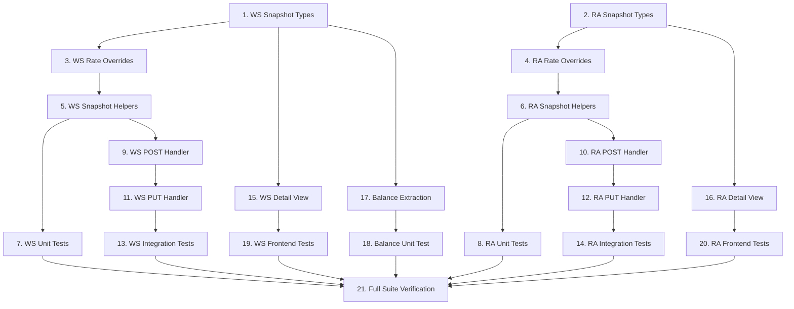

# Implementation Plan: Anchored Pricing for Worksheets & Remote Assistance

## Overview

This plan implements price anchoring at record creation time for Work Sheets and Remote Assistance. It adds pricing snapshot types to the data model, modifies calculation functions to accept rate overrides, integrates snapshot creation/recalculation into backend handlers, updates frontend detail views to prefer anchored values, and modifies balance extraction to read from stored prices.

## Tasks

- [x] 1. Add `WorkSheetPricingSnapshot` interface and `pricingSnapshot` optional field to `WorkSheetData`
  - **Design ref**: [Section 1 — Data Model](design.md#1-data-model--pricing-snapshot-types) (L1-L80)
  - **Test ref**: [MI-03](tests.md) — `createWorkSheetPricingSnapshot()` (shape validation)
  - **Scope**:
    - modify `packages/shared/src/types/work-sheets/types.ts`
  - **Depends on**: —
  - **Covers**: PRICE-BR-001, PRICE-BR-005
  - **Done when**: `WorkSheetPricingSnapshot` interface exported, `WorkSheetData.pricingSnapshot` is optional field, `pnpm type-check` passes

- [x] 2. Add `RemoteAssistancePricingSnapshot` interface and `pricingSnapshot` optional field to `RemoteAssistanceData`
  - **Design ref**: [Section 1 — Data Model](design.md#1-data-model--pricing-snapshot-types) (L82-L140)
  - **Test ref**: [MI-04](tests.md) — `createRemoteAssistancePricingSnapshot()` (shape validation)
  - **Scope**:
    - modify `packages/shared/src/types/remote-assistance/types.ts`
  - **Depends on**: —
  - **Covers**: PRICE-BR-001, PRICE-BR-006
  - **Done when**: `RemoteAssistancePricingSnapshot` interface exported, `RemoteAssistanceData.pricingSnapshot` is optional field, `pnpm type-check` passes

- [x] 3. Add `WorkSheetRateOverrides` interface and `rateOverrides` optional parameter to `calculateWorkSheetPricing()`
  - **Design ref**: [Section 2.1 — Work Sheet Modified Signature](design.md#21-work-sheet--modified-signature) (L145-L195)
  - **Test ref**: [MI-01](tests.md) — `calculateWorkSheetPricing()` with `rateOverrides`
  - **Scope**:
    - modify `packages/shared/src/types/work-sheets/validation.ts`
  - **Depends on**: 1
  - **Covers**: PRICE-BR-002, PRICE-BR-007, PRICE-AC-010
  - **Done when**: `calculateWorkSheetPricing()` uses `rateOverrides` when provided, falls back to constants otherwise; existing tests pass; `pnpm type-check` passes

- [x] 4. Add `RemoteAssistanceRateOverrides` interface and `rateOverrides` optional parameter to `calculateRemoteAssistancePricing()`
  - **Design ref**: [Section 2.2 — Remote Assistance Modified Signature](design.md#22-remote-assistance--modified-signature) (L197-L240)
  - **Test ref**: [MI-02](tests.md) — `calculateRemoteAssistancePricing()` with `rateOverrides`
  - **Scope**:
    - modify `packages/shared/src/types/remote-assistance/validation.ts`
  - **Depends on**: 2
  - **Covers**: PRICE-BR-002, PRICE-BR-007, PRICE-AC-010
  - **Done when**: `calculateRemoteAssistancePricing()` uses `rateOverrides` when provided, falls back to constants otherwise; existing tests pass; `pnpm type-check` passes

- [x] 5. Implement `createWorkSheetPricingSnapshot()` and `recalculateWorkSheetPricingSnapshot()`
  - **Design ref**: [Section 3.1 — Snapshot Helper Functions (Work Sheet)](design.md#31-snapshot-helper-functions) (L250-L310)
  - **Test ref**: [MI-03](tests.md) — `createWorkSheetPricingSnapshot()`, [MI-05](tests.md) — `recalculateWorkSheetPricingSnapshot()`
  - **Scope**:
    - modify `packages/shared/src/types/work-sheets/validation.ts`
  - **Depends on**: 3
  - **Covers**: PRICE-BR-001, PRICE-BR-005, PRICE-BR-007, PRICE-AC-009
  - **Done when**: Both functions exported, `createWorkSheetPricingSnapshot` captures current constants in `rates` and calculates totals, `recalculateWorkSheetPricingSnapshot` preserves existing rates and recalculates; `pnpm type-check` passes

- [x] 6. Implement `createRemoteAssistancePricingSnapshot()` and `recalculateRemoteAssistancePricingSnapshot()`
  - **Design ref**: [Section 3.1 — Snapshot Helper Functions (Remote Assistance)](design.md#31-snapshot-helper-functions) (L312-L375)
  - **Test ref**: [MI-04](tests.md) — `createRemoteAssistancePricingSnapshot()`, [MI-06](tests.md) — `recalculateRemoteAssistancePricingSnapshot()`
  - **Scope**:
    - modify `packages/shared/src/types/remote-assistance/validation.ts`
  - **Depends on**: 4
  - **Covers**: PRICE-BR-001, PRICE-BR-006, PRICE-BR-007, PRICE-AC-009
  - **Done when**: Both functions exported, `createRemoteAssistancePricingSnapshot` captures current constants and calculates totals, `recalculateRemoteAssistancePricingSnapshot` preserves existing rates; `pnpm type-check` passes

- [x] 7. Write unit tests for `calculateWorkSheetPricing()` with `rateOverrides` and snapshot helpers
  - **Design ref**: [Section 2.1](design.md#21-work-sheet--modified-signature), [Section 3.1](design.md#31-snapshot-helper-functions)
  - **Test ref**: [MI-01](tests.md), [MI-03](tests.md), [MI-05](tests.md)
  - **Scope**:
    - create `packages/shared/src/types/work-sheets/__tests__/pricing-snapshot.test.ts`
  - **Depends on**: 5
  - **Covers**: PRICE-BR-001, PRICE-BR-002, PRICE-BR-005, PRICE-BR-007, PRICE-AC-009, PRICE-AC-010
  - **Done when**: MI-01, MI-03, MI-05 test IDs present; all tests pass with `pnpm --filter @clever/shared test`

- [x] 8. Write unit tests for `calculateRemoteAssistancePricing()` with `rateOverrides` and snapshot helpers
  - **Design ref**: [Section 2.2](design.md#22-remote-assistance--modified-signature), [Section 3.1](design.md#31-snapshot-helper-functions)
  - **Test ref**: [MI-02](tests.md), [MI-04](tests.md), [MI-06](tests.md)
  - **Scope**:
    - create `packages/shared/src/types/remote-assistance/__tests__/pricing-snapshot.test.ts`
  - **Depends on**: 6
  - **Covers**: PRICE-BR-001, PRICE-BR-002, PRICE-BR-006, PRICE-BR-007, PRICE-AC-009, PRICE-AC-010
  - **Done when**: MI-02, MI-04, MI-06 test IDs present; all tests pass with `pnpm --filter @clever/shared test`

- [x] 9. Integrate pricing snapshot into Work Sheets POST handler
  - **Design ref**: [Section 3.2 — Backend POST Handler — Work Sheets](design.md#32-backend-post-handler--work-sheets) (L380-L420)
  - **Test ref**: [MI-07](tests.md) — Work Sheet POST handler (snapshot integration)
  - **Scope**:
    - modify `packages/backend/src/routes/work-sheets.ts`
  - **Depends on**: 5
  - **Covers**: PRICE-BR-001, PRICE-BR-002, PRICE-AC-001, PRICE-AC-002, PRICE-AC-013, PRICE-UX-002
  - **Done when**: POST handler calls `createWorkSheetPricingSnapshot()`, attaches result to `contentData.pricingSnapshot`, rejects with 400 if `totalPrice` is NaN; `pnpm type-check` passes

- [x] 10. Integrate pricing snapshot into Remote Assistance POST handler
  - **Design ref**: [Section 3.3 — Backend POST Handler — Remote Assistance](design.md#33-backend-post-handler--remote-assistance) (L422-L450)
  - **Test ref**: [MI-09](tests.md) — Remote Assistance POST handler (snapshot integration)
  - **Scope**:
    - modify `packages/backend/src/routes/remote-assistance.ts`
  - **Depends on**: 6
  - **Covers**: PRICE-BR-001, PRICE-BR-002, PRICE-AC-004, PRICE-AC-005, PRICE-AC-013
  - **Done when**: POST handler calls `createRemoteAssistancePricingSnapshot()`, attaches result, sets `valorAssist = pricingSnapshot.calculated.totalValue`, rejects with 400 if NaN; `pnpm type-check` passes

- [x] 11. Integrate pricing snapshot recalculation into Work Sheets PUT handler
  - **Design ref**: [Section 3.4 — Backend PUT Handler](design.md#34-backend-put-handler--both-types) (L452-L510)
  - **Test ref**: [MI-08](tests.md) — Work Sheet PUT handler (recalculation)
  - **Scope**:
    - modify `packages/backend/src/routes/work-sheets.ts`
  - **Depends on**: 9
  - **Covers**: PRICE-BR-003, PRICE-BR-007, PRICE-AC-007, PRICE-AC-009, PRICE-AC-010
  - **Done when**: PUT handler reads existing `pricingSnapshot` from stored record; if present, calls `recalculateWorkSheetPricingSnapshot()` with existing rates; if absent (legacy), calls `createWorkSheetPricingSnapshot()` with current constants; `pnpm type-check` passes

- [x] 12. Integrate pricing snapshot recalculation into Remote Assistance PUT handler
  - **Design ref**: [Section 3.4 — Backend PUT Handler](design.md#34-backend-put-handler--both-types) (L452-L510)
  - **Test ref**: [MI-10](tests.md) — Remote Assistance PUT handler (recalculation)
  - **Scope**:
    - modify `packages/backend/src/routes/remote-assistance.ts`
  - **Depends on**: 10
  - **Covers**: PRICE-BR-003, PRICE-BR-007, PRICE-AC-009, PRICE-AC-010
  - **Done when**: PUT handler reads existing `pricingSnapshot`; if present, recalculates with anchored rates; if absent, uses current constants; updates `valorAssist`; `pnpm type-check` passes

- [x] 13. Write integration tests for Work Sheets POST/PUT snapshot behavior
  - **Design ref**: [Section 3.2](design.md#32-backend-post-handler--work-sheets), [Section 3.4](design.md#34-backend-put-handler--both-types), [Section 3.5](design.md#35-error-case--constants-unavailable-price-ac-013)
  - **Test ref**: [MI-07](tests.md), [MI-08](tests.md)
  - **Scope**:
    - create `packages/backend/src/__tests__/work-sheets-pricing-snapshot.test.ts`
  - **Depends on**: 11
  - **Covers**: PRICE-BR-001, PRICE-BR-002, PRICE-BR-003, PRICE-BR-007, PRICE-AC-001, PRICE-AC-002, PRICE-AC-009, PRICE-AC-010, PRICE-AC-013
  - **Done when**: MI-07, MI-08 test IDs present; tests mock R2 and verify snapshot creation on POST, recalculation on PUT, NaN rejection; all pass with `pnpm --filter @clever/backend test`

- [x] 14. Write integration tests for Remote Assistance POST/PUT snapshot behavior
  - **Design ref**: [Section 3.3](design.md#33-backend-post-handler--remote-assistance), [Section 3.4](design.md#34-backend-put-handler--both-types)
  - **Test ref**: [MI-09](tests.md), [MI-10](tests.md)
  - **Scope**:
    - create `packages/backend/src/__tests__/remote-assistance-pricing-snapshot.test.ts`
  - **Depends on**: 12
  - **Covers**: PRICE-BR-001, PRICE-BR-002, PRICE-BR-003, PRICE-BR-007, PRICE-AC-004, PRICE-AC-005, PRICE-AC-009, PRICE-AC-010, PRICE-AC-013
  - **Done when**: MI-09, MI-10 test IDs present; tests mock R2 and verify snapshot creation on POST, recalculation on PUT, `valorAssist` consistency; all pass with `pnpm --filter @clever/backend test`

- [x] 15. Modify Work Sheets Detail View pricing computed to prefer anchored snapshot values
  - **Design ref**: [Section 4.1 — Work Sheet Detail Pricing Computed](design.md#41-work-sheet-detail--pricing-computed-property) (L520-L590)
  - **Test ref**: [MI-12](tests.md) — Frontend pricing computed (WorkSheet)
  - **Scope**:
    - modify `packages/frontend/src/views/work-sheets/WorkSheetsDetailView.vue`
  - **Depends on**: 1
  - **Covers**: PRICE-BR-004, PRICE-BR-008, PRICE-UX-001, PRICE-AC-003, PRICE-AC-008, PRICE-AC-011, PRICE-AC-012
  - **Done when**: `pricing` computed reads from `pricingSnapshot.calculated` when present, falls back to `calculateWorkSheetPricing()` for legacy; mileage rate in template uses snapshot rates when available; no visible UI change for user; `pnpm type-check` passes

- [x] 16. Modify Remote Assistance Detail View pricing computed to prefer anchored snapshot values
  - **Design ref**: [Section 4.2 — Remote Assistance Detail Pricing Computed](design.md#42-remote-assistance-detail--pricing-computed-property) (L592-L660)
  - **Test ref**: [MI-13](tests.md) — Frontend pricing computed (RemoteAssistance)
  - **Scope**:
    - modify `packages/frontend/src/views/remote-assistance/RemoteAssistanceDetailView.vue`
  - **Depends on**: 2
  - **Covers**: PRICE-BR-004, PRICE-BR-008, PRICE-UX-001, PRICE-AC-006, PRICE-AC-008, PRICE-AC-011, PRICE-AC-012
  - **Done when**: `pricingResult` computed reads from snapshot when present, falls back for legacy; `displayRates` computed added; template uses `displayRates` instead of direct `REMOTE_ASSISTANCE_CONSTANTS`; no visible UI change; `pnpm type-check` passes

- [x] 17. Modify `extractWorkSheetDebtTransaction()` to read price from `pricingSnapshot`
  - **Design ref**: [Section 5.2 — Read From Stored Price](design.md#52-design--read-from-stored-price) (L680-L730)
  - **Test ref**: [MI-11](tests.md) — `extractWorkSheetDebtTransaction()`
  - **Scope**:
    - modify `packages/shared/src/balance-extraction.ts`
  - **Depends on**: 1
  - **Covers**: PRICE-BR-009
  - **Done when**: Function reads `workSheet.data.pricingSnapshot?.calculated.totalPrice` first, falls back to `calculateWorkSheetTotals()` for legacy; `pnpm type-check` passes

- [x] 18. Write unit test for `extractWorkSheetDebtTransaction()` with anchored pricing
  - **Design ref**: [Section 5.2](design.md#52-design--read-from-stored-price)
  - **Test ref**: [MI-11](tests.md)
  - **Scope**:
    - create `packages/shared/src/__tests__/balance-extraction-pricing.test.ts`
  - **Depends on**: 17
  - **Covers**: PRICE-BR-009
  - **Done when**: MI-11 test ID present; tests verify snapshot path and legacy fallback path; all pass with `pnpm --filter @clever/shared test`

- [x] 19. Write unit tests for Work Sheet Detail View pricing computed
  - **Design ref**: [Section 4.1](design.md#41-work-sheet-detail--pricing-computed-property)
  - **Test ref**: [MI-12](tests.md)
  - **Scope**:
    - create `packages/frontend/src/views/work-sheets/__tests__/pricing-computed.test.ts`
  - **Depends on**: 15
  - **Covers**: PRICE-BR-004, PRICE-AC-003, PRICE-AC-011, PRICE-AC-012
  - **Done when**: MI-12 test ID present; tests verify snapshot path returns snapshot values, legacy path calls `calculateWorkSheetPricing()`, return shape identical; all pass with `pnpm --filter @clever/frontend test`

- [x] 20. Write unit tests for Remote Assistance Detail View pricing computed
  - **Design ref**: [Section 4.2](design.md#42-remote-assistance-detail--pricing-computed-property)
  - **Test ref**: [MI-13](tests.md)
  - **Scope**:
    - create `packages/frontend/src/views/remote-assistance/__tests__/pricing-computed.test.ts`
  - **Depends on**: 16
  - **Covers**: PRICE-BR-004, PRICE-AC-006, PRICE-AC-011, PRICE-AC-012
  - **Done when**: MI-13 test ID present; tests verify snapshot path, legacy fallback, `displayRates` computed; all pass with `pnpm --filter @clever/frontend test`

- [x] 21. Run full type-check and test suite to verify no regressions
  - **Design ref**: All sections
  - **Test ref**: All MI IDs
  - **Scope**:
    - verify all packages
  - **Depends on**: 7, 8, 13, 14, 18, 19, 20
  - **Covers**: PRICE-NFR-001 (performance — pure arithmetic, no async)
  - **Done when**: `pnpm type-check` exits 0, `pnpm test` exits 0, no regressions in existing tests

## Task Dependency Graph



```json
{
  "waves": [
    { "wave": 1, "tasks": [1, 2] },
    { "wave": 2, "tasks": [3, 4] },
    { "wave": 3, "tasks": [5, 6] },
    { "wave": 4, "tasks": [7, 8, 9, 10, 15, 16, 17] },
    { "wave": 5, "tasks": [11, 12, 18, 19, 20] },
    { "wave": 6, "tasks": [13, 14] },
    { "wave": 7, "tasks": [21] }
  ]
}
```

## Notes

- Tasks 1 and 2 are independent and can execute in parallel (data model for WS and RA).
- Tasks 15, 16, 17 can start as soon as their type dependency (Task 1 or 2) is complete — they don't need backend tasks.
- Backend tasks (9-14) follow a strict chain: types → overrides → helpers → POST → PUT → integration tests.
- Task 21 is a final verification gate that runs only after all test tasks pass.
- No migration tasks are needed — legacy records (missing `pricingSnapshot`) fall back gracefully.
