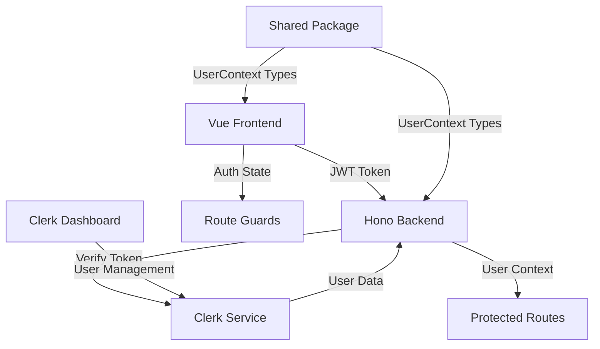

# Design Document: Clerk Authentication

## Overview

This design implements Clerk authentication for the CLEVER dashboard application, providing simple email/password authentication with Admin and User types. The solution integrates Clerk's Vue SDK for frontend authentication and Clerk's backend verification for API protection in a Cloudflare Workers environment using Hono.

## Architecture

The authentication system follows a standard JWT-based flow with shared type definitions:

1. **Frontend**: Vue 3 application with Clerk Vue SDK for authentication UI and state management
2. **Backend**: Hono API with Clerk middleware for JWT verification and user context extraction
3. **Authentication Provider**: Clerk service managing user accounts, sessions, and JWT tokens
4. **Shared Types**: Common authentication interfaces in `@clever/shared` package for type consistency



## Components and Interfaces

### Frontend Components

#### 1. Authentication Plugin Setup
- **File**: `packages/frontend/src/main.ts`
- **Purpose**: Initialize Clerk Vue plugin with publishable key
- **Dependencies**: `@clerk/vue`

#### 2. User Context Interface
```typescript
interface UserContext {
  userId: string;
  email: string;
  firstName: string;
  lastName: string;
  userType: 'Admin' | 'User';
  sessionId: string;
  isAuthenticated: boolean;
}
```

#### 3. Authentication State Management
- **Composables**: Use Clerk's built-in composables for auth state
- **User Information**: Access to user email, name, and type via shared UserContext
- **Session Management**: Handle sign-in/sign-out flows

### Backend Components

#### 1. Clerk Middleware
- **File**: `packages/backend/src/middleware/clerk.ts`
- **Purpose**: JWT verification and user context extraction
- **Dependencies**: `@hono/clerk-auth`
- **Imports**: Uses shared `UserContext` and `AuthenticatedContext` from `@clever/shared`

#### 2. Backend-Specific Types
- **File**: `packages/backend/src/types/auth.ts`
- **Purpose**: Cloudflare Workers environment bindings
- **Contents**: `ClerkBindings` interface for environment variables

#### 3. Shared Authentication Types
- **File**: `packages/shared/src/types.ts`
- **Purpose**: Common authentication interfaces used by both frontend and backend
- **Contents**: `UserContext` and `AuthenticatedContext` interfaces
#### 4. Protected Route Handlers
- **Authentication Check**: Verify user context exists
- **Error Handling**: Return 401 for unauthenticated requests
- **User Context Access**: Make user information available to route handlers

## Data Models

### Clerk User Model
Clerk manages user data with the following relevant fields:
- `id`: Unique user identifier
- `emailAddresses`: Array of email addresses
- `firstName`: User's first name
- `lastName`: User's last name
- `publicMetadata`: Contains user type (Admin/User)

### Shared Authentication Types
Located in `packages/shared/src/types.ts` for use by both frontend and backend:

```typescript
interface UserContext {
  userId: string;
  email: string;
  firstName: string;
  lastName: string;
  userType: 'Admin' | 'User';
  sessionId: string;
  isAuthenticated: boolean;
}

interface AuthenticatedContext {
  user: UserContext;
  [key: string]: any; // Index signature for framework compatibility
}
```

### Frontend User State
```typescript
interface AuthState {
  isLoaded: boolean;
  isSignedIn: boolean;
  user: UserContext | null;
}
```

### Backend-Specific Types
Located in `packages/backend/src/types/auth.ts`:

```typescript
interface ClerkBindings {
  ASSETS: Fetcher;
  CONTENT: R2Bucket;
  CLERK_PUBLISHABLE_KEY: string;
  CLERK_SECRET_KEY: string;
  [key: string]: any; // Index signature for Hono compatibility
}
```

## Correctness Properties

*A property is a characteristic or behavior that should hold true across all valid executions of a system—essentially, a formal statement about what the system should do. Properties serve as the bridge between human-readable specifications and machine-verifiable correctness guarantees.*

### Property 1: Unauthenticated Route Protection
*For any* protected route and unauthenticated user, attempting to access the route should result in redirection to the SignIn page
**Validates: Requirements 1.1, 5.2**

### Property 2: Valid Authentication Flow
*For any* valid user credentials, signing in should result in successful authentication and redirection to the dashboard
**Validates: Requirements 1.2**

### Property 3: Invalid Authentication Handling
*For any* invalid user credentials, sign-in attempts should display an error message and keep the user on the SignIn page
**Validates: Requirements 1.3**

### Property 4: Authenticated Route Access
*For any* authenticated user and protected route, the user should be able to access the route without redirection
**Validates: Requirements 1.4, 5.3**

### Property 5: Session Persistence
*For any* authenticated user session, browser refresh should maintain the authentication state
**Validates: Requirements 1.5**

### Property 6: User Type Assignment
*For any* authenticated user, the system should receive and store a valid user type (Admin or User) from Clerk
**Validates: Requirements 2.1, 2.2**

### Property 7: User Type Availability
*For any* authenticated user, both frontend and backend components should have access to the user's type information
**Validates: Requirements 2.4**

### Property 8: Token Verification
*For any* API request to a protected endpoint, the backend should verify the authentication token and respond appropriately
**Validates: Requirements 3.1**

### Property 9: User Context Creation
*For any* valid authentication token, the backend should extract user information and create a complete User_Context
**Validates: Requirements 3.2**

### Property 10: Invalid Token Handling
*For any* invalid or missing authentication token on protected endpoints, the backend should return a 401 Unauthorized response
**Validates: Requirements 3.3, 5.5**

### Property 11: User Context Structure
*For any* created User_Context, it should contain email, firstName, lastName, userType, and userId fields
**Validates: Requirements 3.4**

### Property 12: User Context Availability
*For any* protected route handler, the User_Context should be accessible and contain valid user information
**Validates: Requirements 3.5**

### Property 13: Authentication State Management
*For any* application load or user authentication, the frontend should properly check and store authentication state
**Validates: Requirements 4.2, 4.3**

### Property 14: Sign-out Flow
*For any* authenticated user who signs out, the system should clear authentication state and redirect to the SignIn page
**Validates: Requirements 4.4**

### Property 15: User Information Access
*For any* frontend component requiring user information, it should be able to access name, email, and userType
**Validates: Requirements 4.5**

### Property 16: Frontend Route Protection
*For any* frontend route except SignIn, the route should require authentication
**Validates: Requirements 5.1**

### Property 17: Backend Endpoint Protection
*For any* API endpoint except health checks and authentication endpoints, the endpoint should require authentication
**Validates: Requirements 5.4**

## Error Handling

### Authentication Errors
- **Invalid Credentials**: Display user-friendly error messages on the SignIn page
- **Token Expiration**: Automatically redirect to SignIn page when tokens expire
- **Network Errors**: Handle Clerk service unavailability gracefully
- **Malformed Tokens**: Return appropriate 401 responses for invalid token formats

### Frontend Error Handling
- **Clerk Service Errors**: Display fallback UI when Clerk components fail to load
- **Route Guard Errors**: Ensure failed authentication checks redirect to SignIn
- **State Management Errors**: Handle authentication state corruption gracefully

### Backend Error Handling
- **JWT Verification Failures**: Return structured error responses for token issues
- **User Context Errors**: Handle cases where user information cannot be retrieved
- **Middleware Errors**: Ensure authentication middleware failures don't crash the application

## Testing Strategy

### Dual Testing Approach
The authentication system will be validated using both unit tests and property-based tests:

- **Unit tests**: Verify specific authentication scenarios, error conditions, and integration points
- **Property tests**: Verify universal authentication properties across all inputs and user states
- Both approaches are complementary and necessary for comprehensive coverage

### Unit Testing Focus
Unit tests will concentrate on:
- Specific authentication flows (sign-in, sign-out, token refresh)
- Error handling scenarios (invalid credentials, network failures)
- Integration between Clerk components and application state
- Route guard behavior for specific routes
- API middleware behavior for specific endpoints

### Property-Based Testing Configuration
Property tests will be implemented using Vitest with the following configuration:
- Minimum 100 iterations per property test (due to randomization)
- Each property test will reference its design document property
- Tag format: **Feature: clerk-authentication, Property {number}: {property_text}**
- Tests will generate random user states, routes, and API requests to verify universal properties

### Test Coverage Areas
1. **Authentication Flows**: Sign-in, sign-out, session management
2. **Route Protection**: Frontend route guards and redirects
3. **API Protection**: Backend endpoint authentication and authorization
4. **User Context**: User information extraction and availability
5. **Error Scenarios**: Invalid tokens, network failures, service unavailability
6. **State Management**: Authentication state persistence and updates

### Testing Tools
- **Frontend**: Vitest with Vue Test Utils for component testing
- **Backend**: Vitest for API endpoint testing
- **Property Testing**: Custom generators for user states, routes, and API requests
- **Integration**: End-to-end testing of authentication flows across frontend and backend