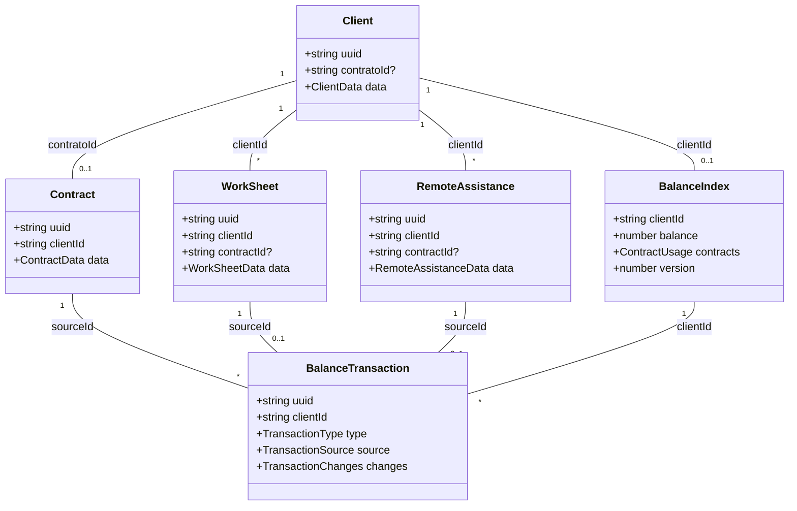
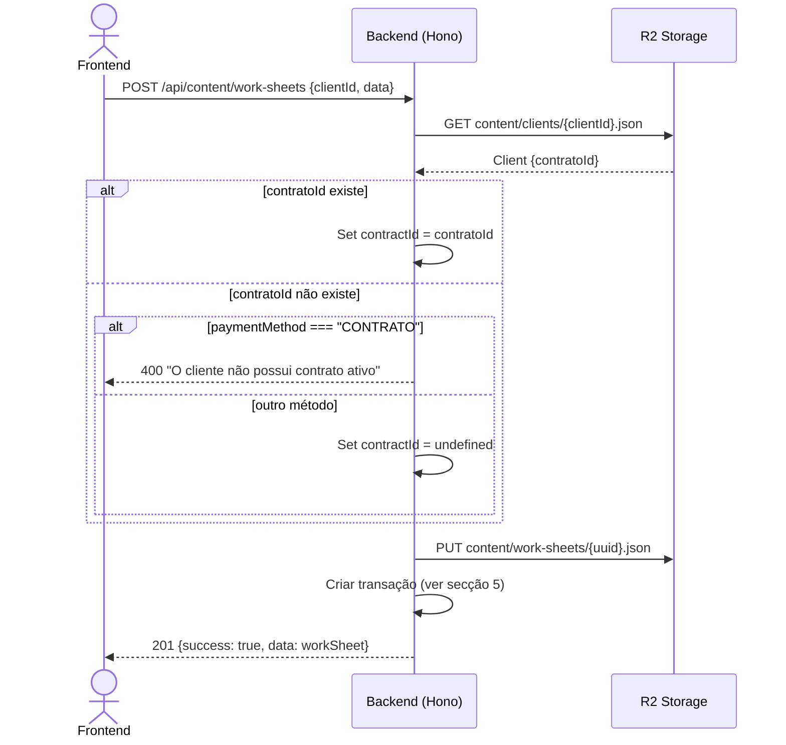

# Design — Refactor Relação Cliente↔Contrato e Sistema de Saldo

## 1. Modelo de dados — Alterações aos tipos partilhados

### 1.1 Alterações ao tipo `ClientData`

| Campo | Estado atual | Estado futuro | Justificação |
|-------|-------------|---------------|--------------|
| `contratos` | `ClientContractReference[]` (opcional) | **Removido** | Relação 1:N eliminada |
| `contratoId` | Não existe | `string` (opcional) | Nova referência 1:1 ao contrato ativo |
| `contrato`, `contratoCPA`, `contratoSoftware` | Campos legacy booleanos | **Removidos** | Substituídos pelo modelo 1:1 |
| `dataInicio`, `dataTermino` | Campos legacy de datas | **Removidos** | Datas vivem no contrato |

- O campo `contratoId` é preenchido automaticamente pelo backend quando um contrato é criado para o cliente
- O campo `contratoId` é limpo (set `undefined`) quando o contrato é eliminado (soft delete)
- A interface `ClientContractReference` deixa de ser necessária e é removida
- O `CreateClientInput` deixa de incluir `contratos`

### 1.2 Alterações ao tipo `ContractData`

| Campo | Estado atual | Estado futuro | Justificação |
|-------|-------------|---------------|--------------|
| `clientId` | `string` (obrigatório) | Sem alteração | Já suporta 1:1 |
| Todos os outros campos | — | Sem alteração | Estrutura CPA/S&H mantida |

- Nenhuma alteração estrutural ao tipo `ContractData`
- A unicidade 1:1 é garantida por validação (secção 2), não por alteração de tipo

### 1.3 Alterações aos tipos `WorkSheetData` e `RemoteAssistanceData`

| Campo | Tipo de conteúdo | Estado atual | Estado futuro | Justificação |
|-------|-----------------|-------------|---------------|--------------|
| `contractId` | `WorkSheetData` | `string` (opcional, seleção manual) | `string` (opcional, preenchido automaticamente pelo backend) | REQ-04.1 — eliminação da seleção manual |
| `contractId` | `RemoteAssistanceData` | `string` (opcional, seleção manual) | `string` (opcional, preenchido automaticamente pelo backend) | REQ-04.1 — eliminação da seleção manual |

- O campo `contractId` mantém-se nos tipos para rastreabilidade
- O frontend deixa de enviar `contractId` — o backend resolve-o a partir do `clientId`
- Se o cliente não tiver contrato ativo, `contractId` fica `undefined`

### 1.4 Tipo `BalanceIndex` — Sem alterações

| Campo | Estado | Justificação |
|-------|--------|--------------|
| `clientId` | Mantido | Já indexado por cliente |
| `balance` | Mantido | Dívida em euros (≥ 0) |
| `contracts: ContractUsage` | Mantido | Recursos restantes (manutenções, deslocações, horas) |
| `version` | Mantido | Bloqueio otimista preservado |

- O `BalanceIndex` já opera no modelo 1:1 (um índice por cliente)
- Nenhuma alteração necessária aos tipos de transação (`BalanceTransaction`, `TransactionChanges`)

### 1.5 Diagrama de relações (modelo futuro)

## 2. Validação 1:1 — Unicidade de contrato por cliente

### 2.1 Validação no backend (API)

| Operação | Endpoint | Validação | Comportamento em caso de falha |
|----------|----------|-----------|-------------------------------|
| Criar contrato | `POST /api/content/contracts` | Consultar índice de contratos para verificar se existe contrato ativo com o mesmo `clientId` | HTTP 400 — `"Este cliente já possui um contrato ativo."` |
| Atualizar contrato | `PUT /api/content/contracts/:uuid` | Nenhuma validação 1:1 adicional (o `clientId` não pode ser alterado — já validado) | — |

- A verificação consulta o `indexes/contracts-index.json` filtrando por `clientId` e `isDeleted === false`
- Contratos com `isDeleted === true` não contam como ativos
- A validação ocorre antes da escrita em R2 — se falhar, nenhum conteúdo é criado
- Quando o contrato é criado com sucesso, o backend atualiza o campo `contratoId` no cliente correspondente (escrita em `content/clients/{clientId}.json`)

### 2.2 Validação no frontend (formulário de criação de contrato)

| Momento | Trigger | Comportamento |
|---------|---------|---------------|
| Seleção de cliente | `@client-selected` no `ClientSearchInput` | Chamada à API: `GET /api/content/contracts?clientId={id}` para verificar se existe contrato ativo |
| Resultado positivo (cliente tem contrato) | Resposta com contrato ativo | Mostrar aviso visual: banner amarelo com ícone ⚠️ e texto "Este cliente já possui um contrato ativo." — desativar botão de submissão |
| Resultado negativo (cliente sem contrato) | Resposta vazia | Esconder aviso — reativar botão de submissão |
| Mudança de cliente | Novo `@client-selected` | Repetir verificação — limpar estado anterior |

- A verificação no frontend é uma conveniência UX — a validação autoritativa é sempre no backend
- O aviso usa classes Tailwind: `bg-yellow-50 border-yellow-400 text-yellow-800`
- O botão de submissão usa `:disabled="clientHasActiveContract"` com estilo `opacity-50 cursor-not-allowed`

### 2.3 Sincronização do campo `contratoId` no cliente

| Evento | Ação no backend | Campo afetado |
|--------|----------------|---------------|
| Contrato criado | Ler cliente → set `contratoId = contract.uuid` → escrever cliente | `content/clients/{clientId}.json` |
| Contrato eliminado (soft delete) | Ler cliente → set `contratoId = undefined` → escrever cliente | `content/clients/{clientId}.json` |
| Contrato atualizado (renovação) | Nenhuma alteração ao `contratoId` (UUID mantém-se) | — |

- A atualização do cliente é síncrona (dentro do handler do POST/DELETE do contrato)
- Usa bloqueio otimista (`version`) para evitar conflitos de escrita concorrente

## 3. Resolução automática de contrato — Folhas de obra e assistências remotas

### 3.1 Fluxo de resolução no backend

| Passo | Ação | Detalhe |
|-------|------|---------|
| 1 | Receber `clientId` do request body | O frontend envia apenas `clientId` — nunca `contractId` |
| 2 | Ler cliente de R2 | `content/clients/{clientId}.json` → extrair `contratoId` |
| 3 | Se `contratoId` existe | Set `contractId = contratoId` no conteúdo antes de guardar |
| 4 | Se `contratoId` não existe | Set `contractId = undefined` — conteúdo criado sem referência a contrato |
| 5 | Determinar tipo de transação | Baseado no `paymentMethod` (ver secção 5) |
| 6 | Se pagamento é "CONTRATO"/"Contrato" e cliente não tem contrato | Rejeitar criação — HTTP 400: "O cliente não possui contrato ativo para consumir recursos." |

- A resolução aplica-se a `POST /api/content/work-sheets` e `POST /api/content/remote-assistance`
- O campo `contractId` no request body é ignorado pelo backend (sempre resolvido a partir do cliente)
- A resolução é síncrona — ocorre antes da escrita do conteúdo em R2

### 3.2 Regras por método de pagamento

| Tipo de conteúdo | Método de pagamento | Contrato necessário? | Transação criada |
|-----------------|--------------------|--------------------|-----------------|
| Folha de obra | `CONTRATO` | Sim | DEBT — consome manutenção + deslocação |
| Folha de obra | `Garantia` (warranty=true) | Não | Nenhuma |
| Folha de obra | Outros (CARTÃO MB, DINHEIRO, etc.) | Não | DEBT — adiciona valor à dívida |
| Assistência remota | `Contrato` | Sim | DEBT — consome horas de assistência |
| Assistência remota | `Garantia` | Não | Nenhuma |
| Assistência remota | Outros (Faturação) | Não | DEBT — adiciona valor à dívida |

### 3.3 Diagrama de sequência — Criação de folha de obra

## 4. Renovação de contrato

### 4.1 Contrato de API para renovação

| Aspeto | Detalhe |
|--------|---------|
| Endpoint | `PUT /api/content/contracts/:uuid` (mesmo endpoint de atualização) |
| Identificação | O backend deteta renovação quando os campos de recursos (manutenções, deslocações, horas) ou datas são alterados |
| UUID | Mantém-se o mesmo — o contrato é atualizado in-place |
| `clientId` | Não pode ser alterado (validação existente preservada) |
| Campos atualizáveis | `planIdCPA`, `planIdSH`, `inicioContratoCPA`, `fimContratoCPA`, `inicioContratoSH`, `fimContratoSH`, `manutencoesPorAnoCPA`, `deslocacoesPorAnoCPA`, `horasAssistenciaAnualCPA`, `manutencoesPorAnoSH`, `deslocacoesPorAnoSH`, `horasAssistenciaAnualSH`, `cpaEquipments`, `shEquipments`, `modalidadePagamentoCPA`, `modalidadePagamentoSH` |

### 4.2 Regras de transação na renovação

| Condição | Ação |
|----------|------|
| Recursos do contrato alterados (novos valores ≠ valores anteriores) | Criar transação ADD com os **novos** valores de recursos |
| Apenas datas ou plano alterados (recursos iguais) | Nenhuma transação ADD criada |
| Transação ADD criada | `source = "contract-renovation"`, `sourceId = contract.uuid` |

- A comparação de recursos usa os campos: `manutencoesPorAnoCPA`, `deslocacoesPorAnoCPA`, `horasAssistenciaAnualCPA`, `manutencoesPorAnoSH`, `deslocacoesPorAnoSH`, `horasAssistenciaAnualSH`
- A função `extractContractAddTransaction()` existente é reutilizada para extrair os novos valores
- Os novos recursos são **somados** ao saldo existente (não substituem)
- A transação ADD de renovação é distinguível da criação inicial pelo campo `source: "contract-renovation"`

### 4.3 Fluxo de renovação no backend

| Passo | Ação |
|-------|------|
| 1 | Receber PUT com dados atualizados |
| 2 | Ler contrato existente de R2 |
| 3 | Validar dados (validação existente) |
| 4 | Comparar recursos: contrato existente vs. dados novos |
| 5 | Atualizar contrato em R2 |
| 6 | Se recursos alterados → chamar `balanceMiddleware.onContractUpdated()` com contrato anterior e novo |
| 7 | `onContractUpdated()` calcula diferença e cria transação ADD |

- O passo 6 já existe no código atual (`contractsRouter.put`) — apenas a lógica de comparação de recursos precisa de ser refinada no `balance-middleware`
- O `contratoId` no cliente não é alterado (UUID mantém-se)

## 5. Transações e cálculo de saldo simplificado

### 5.1 Tipos de transação

| Tipo | Source | Trigger | Recursos afetados |
|------|--------|---------|-------------------|
| ADD | `contract` | Criação de contrato | +manutenções, +deslocações, +horas (valores do contrato CPA+S&H somados) |
| ADD | `contract-renovation` | Renovação de contrato (recursos alterados) | +manutenções, +deslocações, +horas (novos valores do contrato) |
| DEBT | `work-sheet` | Folha de obra com pagamento "CONTRATO" | -1 manutenção, -1 deslocação (se `hasDisplacement`) |
| DEBT | `work-sheet` | Folha de obra com outro pagamento (não Garantia) | +valor em € à dívida |
| DEBT | `remote-assistance` | Assistência remota com pagamento "Contrato" | -horas (calculadas a partir de `horasTotais`) |
| DEBT | `remote-assistance` | Assistência remota com outro pagamento (não Garantia) | +`valorAssist` em € à dívida |
| — | — | Pagamento "Garantia" (folha de obra ou assistência remota) | Nenhuma transação criada |

### 5.2 Regras de cálculo do saldo

| Regra | Detalhe |
|-------|---------|
| Saldo = soma de todas as transações | `balance` (dívida €) e `contracts` (recursos) calculados incrementalmente |
| Valores ilimitados (-1) | Se o recurso é -1, nunca é decrementado — permanece -1 após qualquer DEBT |
| Adição a ilimitado | Se o recurso atual é -1 e uma transação ADD adiciona valor, resultado = -1 |
| Recálculo determinístico | `calculateBalanceFromTransactions()` processa transações por ordem cronológica e produz sempre o mesmo resultado |
| Bloqueio otimista | `version` incrementado a cada transação — conflito de versão → operação falha com HTTP 409; utilizador repete ou recalcula saldo |
| Dívida nunca negativa | `balance` (€) é sempre ≥ 0 — validação impede transações que resultem em dívida negativa |

### 5.3 Validação antes de transação DEBT

| Verificação | Condição de rejeição | Mensagem |
|-------------|---------------------|----------|
| Manutenções | `manutencoesPorAno` atual = 0 e DEBT consome manutenção | "Recursos insuficientes no contrato do cliente." |
| Deslocações | `deslocacoesPorAno` atual = 0 e DEBT consome deslocação | "Recursos insuficientes no contrato do cliente." |
| Horas | `horasAssistenciaAnuais` atual < horas pedidas e não é ilimitado | "Recursos insuficientes no contrato do cliente." |
| Ilimitado | Recurso = -1 | Nunca rejeitado — validação passa sempre |

- A validação usa `validateTransactionAgainstBalance()` existente
- Se a validação falha, o conteúdo (folha de obra / assistência remota) **não é criado**
- A rejeição retorna HTTP 400 com a mensagem em Português

### 5.4 Índice de saldo — Ciclo de vida

| Evento | Ação sobre `balance/{clientId}/index.json` |
|--------|---------------------------------------------|
| Contrato criado para cliente | Criar índice (se não existe) ou atualizar com transação ADD |
| Renovação de contrato | Atualizar índice com transação ADD |
| Folha de obra criada (pagamento CONTRATO) | Atualizar índice com transação DEBT (recursos) |
| Folha de obra criada (outro pagamento, não Garantia) | Atualizar índice com transação DEBT (dívida €) |
| Assistência remota criada (pagamento Contrato) | Atualizar índice com transação DEBT (horas) |
| Assistência remota criada (outro pagamento, não Garantia) | Atualizar índice com transação DEBT (dívida €) |
| Cliente sem contrato e sem transações | Índice não existe — frontend mostra zeros |

### 5.5 Indicador de aviso de uso baixo (< 20%)

| Condição | Cálculo |
|----------|---------|
| Recurso finito | `(recurso_atual / recurso_original) * 100 < 20` → aviso |
| Recurso ilimitado (-1) | Nunca mostra aviso |
| Recurso original = 0 | Nunca mostra aviso (divisão por zero evitada) |

- O `recurso_original` é obtido da primeira transação ADD do contrato (soma dos recursos CPA+S&H)
- A função `calculateUsagePercentage()` existente é reutilizada
- O aviso é visual no frontend (secção 7) — não bloqueia operações

## 6. Tratamento de erros

### 6.1 Tabela de erros por cenário

| Cenário | HTTP | Código interno | Mensagem (PT) | Comportamento |
|---------|------|---------------|---------------|---------------|
| Cliente já tem contrato ativo (criação) | 400 | `CONTRACT_ALREADY_EXISTS` | "Este cliente já possui um contrato ativo." | Contrato não criado; frontend mostra aviso prévio |
| Folha de obra com pagamento CONTRATO, cliente sem contrato | 400 | `NO_ACTIVE_CONTRACT` | "O cliente não possui contrato ativo para consumir recursos." | Folha de obra não criada |
| Assistência remota com pagamento Contrato, cliente sem contrato | 400 | `NO_ACTIVE_CONTRACT` | "O cliente não possui contrato ativo para consumir recursos." | Assistência remota não criada |
| Recursos insuficientes (manutenções, deslocações ou horas) | 400 | `INSUFFICIENT_RESOURCES` | "Recursos insuficientes no contrato do cliente." | Conteúdo não criado; transação não registada |
| Conflito de versão no saldo (concorrência) | 409 | `VERSION_CONFLICT` | "Conflito ao atualizar saldo. Tente novamente." | Operação falha imediatamente; utilizador pode repetir a ação ou recalcular o saldo manualmente |
| Erro de rede/R2 durante transação | 500 | `TRANSACTION_FAILED` | "Erro ao processar transação. Tente novamente." | Conteúdo não criado; transação não registada |
| Cliente não encontrado (resolução de contrato) | 404 | `CLIENT_NOT_FOUND` | "Cliente não encontrado." | Conteúdo não criado |

### 6.2 Regras de tratamento

- Todas as validações de negócio (1:1, recursos, contrato ativo) retornam HTTP 400 com `{ success: false, error: mensagem }`
- Erros de sistema (R2, rede) retornam HTTP 500 com mensagem genérica
- O campo `retryable` no `BalanceError` existente distingue erros recuperáveis (conflito de versão) de erros definitivos (validação)
- Em caso de conflito de versão, a operação falha imediatamente — sem retry automático. O utilizador pode repetir a ação ou usar a funcionalidade de recálculo de saldo
- Nenhum conteúdo é persistido se a transação de saldo falhar — atomicidade garantida pela ordem de operações: validar → criar transação → guardar conteúdo
- Erros de transação são registados no `FailedTransaction` existente para recuperação administrativa

### 6.3 Recálculo manual de saldo

| Aspeto | Detalhe |
|--------|---------|
| Trigger | Botão "Recalcular saldo" no detalhe do cliente (visível apenas para Admin) |
| Endpoint | `POST /api/balance/{clientId}/recalculate` |
| Lógica | Ler todas as transações do cliente → `calculateBalanceFromTransactions()` → escrever novo índice |
| Resultado | Índice de saldo reconstruído a partir do histórico completo de transações |
| Permissão | Apenas Admin |

- O recálculo é idempotente — pode ser executado múltiplas vezes sem efeitos colaterais
- Resolve inconsistências causadas por conflitos de versão ou falhas parciais
- Usa a função `calculateBalanceFromTransactions()` existente que processa transações por ordem cronológica

### 6.4 Ordem de operações (atomicidade)

| Passo | Operação | Falha → |
|-------|----------|---------|
| 1 | Validar dados do conteúdo | HTTP 400 — nada persistido |
| 2 | Resolver contrato do cliente | HTTP 400/404 — nada persistido |
| 3 | Validar recursos disponíveis | HTTP 400 — nada persistido |
| 4 | Criar transação de saldo | HTTP 500 — nada persistido |
| 5 | Atualizar índice de saldo | HTTP 500 — transação criada mas índice desatualizado (recuperável por recálculo) |
| 6 | Guardar conteúdo em R2 | HTTP 500 — transação e índice criados mas conteúdo não guardado (inconsistência — registada em FailedTransaction) |

- O passo 5→6 tem um risco residual de inconsistência — mitigado pelo recálculo de saldo (`calculateBalanceFromTransactions`) que reconstrói o índice a partir das transações
- Em caso de falha no passo 6, o conteúdo pode ser recriado manualmente — a transação já existe e será contabilizada

## 7. Alterações ao frontend — Vistas e formulários

### 7.1 Alterações por componente

| Componente | Alteração | REQ-IDs |
|-----------|-----------|---------|
| `ClientsDetailView.vue` | Adicionar secção "Contrato" com resumo do contrato associado (tipo, plano, datas, estado). Se sem contrato: "Sem contrato ativo" + botão "Criar Contrato" (link para `/contracts/create?clientId={uuid}`) | REQ-01.3 |
| `ClientsDetailView.vue` | Adicionar secção "Saldo" com: dívida (€), manutenções restantes, deslocações restantes, horas restantes. Indicador de aviso (amarelo) quando recurso < 20%. Valores ilimitados mostrados como "Ilimitado". Botão "Recalcular saldo" (Admin only) | REQ-03.3 |
| `ContractsCreateView.vue` | Adicionar verificação em tempo real ao selecionar cliente: se cliente tem contrato ativo → banner amarelo "Este cliente já possui um contrato ativo." + desativar botão submissão | REQ-01.4 |
| `WorkSheetsCreateView.vue` | Remover campo de seleção de contrato (`contractId`) do formulário. O backend resolve automaticamente | REQ-04.1 |
| `WorkSheetsUpdateView.vue` | Remover campo de seleção de contrato (`contractId`) do formulário | REQ-04.1 |
| `RemoteAssistanceCreateView.vue` | Remover campo de seleção de contrato (`contractId`) do formulário. O backend resolve automaticamente | REQ-04.1 |
| `RemoteAssistanceUpdateView.vue` | Remover campo de seleção de contrato (`contractId`) do formulário | REQ-04.1 |

### 7.2 Secção "Contrato" no detalhe do cliente

| Estado | Conteúdo apresentado |
|--------|---------------------|
| Cliente com contrato ativo | Card com: tipos de contrato (CPA/S&H), plano(s), data início, data fim, estado (ativo/expirado). Link para detalhe do contrato |
| Cliente sem contrato | Texto "Sem contrato ativo" (cinzento) + botão "Criar Contrato" (verde primário #75AE93) |

- A informação do contrato é obtida via resolução de relação existente (`relations.contratoId`)
- Se a relação falha (contrato eliminado), mostrar estado de erro com `RelationInfoDisplay`

### 7.3 Secção "Saldo" no detalhe do cliente

| Campo | Formato | Aviso |
|-------|---------|-------|
| Dívida | `{valor}€` (ex: "150€") | — |
| Manutenções restantes | Número ou "Ilimitado" | Amarelo se < 20% do original |
| Deslocações restantes | Número ou "Ilimitado" | Amarelo se < 20% do original |
| Horas restantes | Número ou "Ilimitado" | Amarelo se < 20% do original |

- Dados obtidos via `GET /api/balance/{clientId}` (endpoint existente no `balance-routes.ts`)
- Se cliente sem saldo (sem contrato/transações): mostrar todos os valores a zero sem erros
- Indicador de aviso: `bg-yellow-50 text-yellow-800 border-yellow-400` com ícone ⚠️
- Botão "Recalcular saldo" visível apenas para Admin (`usePermissions()`)

### 7.4 Formulário de criação de contrato — Validação 1:1

- Novo estado reativo: `clientHasActiveContract: Ref<boolean>`
- No evento `@client-selected`: chamar `GET /api/content/contracts?search={clientId}` e filtrar por `isDeleted === false`
- Se encontrado contrato ativo: `clientHasActiveContract = true` → mostrar banner + desativar submit
- Se cliente mudado: reset `clientHasActiveContract = false`
- Banner: `
⚠️ Este cliente já possui um contrato ativo.
`

### 7.5 Remoção do campo `contractId` nos formulários

- Remover o campo `contractId` das `formSections` de work-sheets e remote-assistance
- Remover qualquer referência a `ContractSearchInput` ou seleção de contrato nestes formulários
- O campo `contractId` continua a existir nos tipos TypeScript (preenchido pelo backend)
- Nos `DetailView` de work-sheets e remote-assistance, o `contractId` continua visível como informação de leitura (resolvido via relações)

## 8. Relações e configuração de relações

### 8.1 Alterações ao `CONTENT_RELATION_CONFIGS`

| Content type | Campo | Estado atual | Estado futuro | Justificação |
|-------------|-------|-------------|---------------|--------------|
| `clients` | `contratoId` | Não configurado (sem relações) | Adicionar: `{ fieldName: 'contratoId', targetType: 'contracts', required: false, displayName: 'Contrato' }` | REQ-01.2 — resolução Cliente→Contrato |
| `work-sheets` | `contractId` | Configurado (opcional) | Sem alteração à configuração | Campo mantido para resolução; preenchimento automático pelo backend |
| `remote-assistance` | `contractId` | Configurado (opcional) | Sem alteração à configuração | Campo mantido para resolução; preenchimento automático pelo backend |

- A adição de `contratoId` ao `clients` permite que o sistema de relações resolva automaticamente o contrato associado nas respostas da API
- As respostas de `GET /api/content/clients/{uuid}` passam a incluir `relations.contratoId` com o contrato resolvido (ou erro se não encontrado)
- Nenhuma alteração necessária aos type guards existentes (`isRelationError`, `isResolvedRelation`)

### 8.2 Resolução de relações nas respostas da API

| Endpoint | Relação resolvida | Comportamento |
|----------|------------------|---------------|
| `GET /api/content/clients/{uuid}` | `relations.contratoId` → Contrato completo | Novo — contrato resolvido automaticamente |
| `GET /api/content/clients` (lista) | `relations.contratoId` → Contrato completo | Novo — contrato resolvido para cada cliente na lista |
| `GET /api/content/contracts/{uuid}` | `relations.clientId` → Cliente completo | Existente — sem alteração |
| `GET /api/content/work-sheets/{uuid}` | `relations.clientId`, `relations.contractId` | Existente — `contractId` agora preenchido automaticamente |
| `GET /api/content/remote-assistance/{uuid}` | `relations.clientId`, `relations.contractId` | Existente — `contractId` agora preenchido automaticamente |

- A resolução de `contratoId` no cliente segue o mesmo padrão das relações existentes: leitura do conteúdo referenciado em R2, retorno como `ResolvedRelation` ou `RelationError`
- Se `contratoId` é `undefined` (cliente sem contrato), a relação não é resolvida (campo ausente em `relations`)

---

## [MI] — Strategy

_(Ver `tests.md` para a tabela completa de estratégia de testes por interface)_
