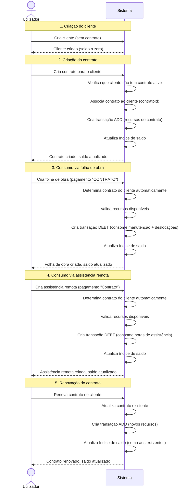

# Requisitos — Refactor Relação Cliente↔Contrato e Sistema de Saldo

## Ativos visuais

_(Sem links Figma para este spec)_

## Âmbito

### Incluído

- Restrição da relação Cliente↔Contrato de 1:N para 1:1 (um cliente = um contrato)
- Validação na criação de contrato: rejeitar se o cliente já tem contrato ativo
- Reformulação completa do cálculo de saldo do cliente baseado no contrato único
- Eliminação da seleção manual de contrato nas folhas de obra e assistências remotas
- Consumo automático de recursos do contrato único do cliente
- Renovação de contrato no modelo 1:1
- Atualização das vistas de detalhe e listagem para refletir o modelo 1:1

### Excluído

- Migração de dados existentes (os dados são completamente novos)
- Alterações ao sistema de autenticação Clerk
- Alterações ao sistema de permissões (Admin/User)
- Novos tipos de conteúdo
- Alterações à estrutura de armazenamento R2 (chaves e padrões mantidos)
- Alterações ao sistema de equipamentos dos contratos

## Restrições

- O sistema de transações imutáveis existente deve ser mantido (transações nunca são editadas ou eliminadas)
- O padrão de valores ilimitados (-1) para recursos de contrato deve ser preservado
- O bloqueio otimista (versão) para atualizações concorrentes deve ser mantido
- Todas as mensagens de erro e labels de UI devem estar em Português de Portugal
- O padrão mobile-first com alvos de toque mínimos de 44px deve ser respeitado
- A resolução de relações no backend deve continuar a funcionar automaticamente

---

## REQ-01 — Relação 1:1 Cliente↔Contrato

### REQ-01.1 — Unicidade de contrato por cliente

**WHEN** um utilizador cria um novo contrato para um cliente, o sistema **SHALL** verificar que esse cliente não possui já um contrato ativo. **IF** o cliente já tiver um contrato ativo, **THEN** o sistema **SHALL** rejeitar a criação e apresentar a mensagem: "Este cliente já possui um contrato ativo."

| CA-ID | Critério de aceitação |
|-------|----------------------|
| CA-01.1.1 | A criação de contrato é rejeitada quando o cliente já tem contrato ativo |
| CA-01.1.2 | A mensagem de erro é apresentada em Português |
| CA-01.1.3 | A validação ocorre tanto no frontend (antes do envio) como no backend (na API) |

### REQ-01.2 — Remoção da referência múltipla no cliente

O sistema **SHALL** substituir o campo `contratos` (lista de referências) no tipo Cliente por um campo `contratoId` (referência única ao contrato ativo).

| CA-ID | Critério de aceitação |
|-------|----------------------|
| CA-01.2.1 | O tipo Cliente contém um campo `contratoId` (string, opcional) em vez de `contratos` (array) |
| CA-01.2.2 | A resolução de relação Cliente→Contrato funciona com o campo `contratoId` |

### REQ-01.3 — Visualização do contrato no detalhe do cliente

**WHEN** um utilizador visualiza o detalhe de um cliente com contrato ativo, o sistema **SHALL** apresentar um resumo do contrato associado (tipo de contrato, plano, datas, estado).

**IF** o cliente não tiver contrato ativo, **THEN** o sistema **SHALL** apresentar a indicação "Sem contrato ativo" e um botão para criar contrato.

| CA-ID | Critério de aceitação |
|-------|----------------------|
| CA-01.3.1 | O detalhe do cliente mostra o resumo do contrato quando existe |
| CA-01.3.2 | O detalhe do cliente mostra "Sem contrato ativo" quando não existe contrato |
| CA-01.3.3 | Existe um botão/link para criar contrato quando o cliente não tem contrato |

### REQ-01.4 — Seleção de cliente na criação de contrato

**WHEN** um utilizador seleciona um cliente no formulário de criação de contrato, o sistema **SHALL** verificar em tempo real se esse cliente já possui contrato ativo e apresentar um aviso visual imediato caso possua.

| CA-ID | Critério de aceitação |
|-------|----------------------|
| CA-01.4.1 | Ao selecionar um cliente com contrato ativo, aparece um aviso visual imediato |
| CA-01.4.2 | O botão de submissão é desativado quando o cliente selecionado já tem contrato |
| CA-01.4.3 | O aviso desaparece quando se seleciona um cliente sem contrato |

---

## REQ-02 — Renovação de contrato

### REQ-02.1 — Processo de renovação

**WHEN** um utilizador pretende renovar o contrato de um cliente, o sistema **SHALL** permitir a atualização do contrato existente (mesma entidade) com novos valores de plano, datas e recursos, sem criar um novo contrato.

| CA-ID | Critério de aceitação |
|-------|----------------------|
| CA-02.1.1 | A renovação atualiza o contrato existente em vez de criar um novo |
| CA-02.1.2 | Os campos de plano, datas e recursos podem ser alterados na renovação |
| CA-02.1.3 | O UUID do contrato permanece o mesmo após renovação |

### REQ-02.2 — Transação de renovação

**WHEN** um contrato é renovado, o sistema **SHALL** criar uma transação do tipo ADD com os novos valores de recursos do contrato renovado, adicionando-os ao saldo existente do cliente.

| CA-ID | Critério de aceitação |
|-------|----------------------|
| CA-02.2.1 | Uma transação ADD é criada automaticamente após renovação |
| CA-02.2.2 | A transação contém os novos valores de recursos (manutenções, deslocações, horas) |
| CA-02.2.3 | Os novos recursos são somados ao saldo existente (não substituem) |
| CA-02.2.4 | A fonte da transação é identificada como "contract-renovation" |

### REQ-02.3 — Histórico de renovações

**WHILE** um contrato tem renovações anteriores, o sistema **SHALL** manter o registo completo de todas as transações ADD associadas ao contrato, permitindo rastrear o histórico de renovações.

| CA-ID | Critério de aceitação |
|-------|----------------------|
| CA-02.3.1 | Todas as transações ADD de renovação são preservadas no histórico |
| CA-02.3.2 | O histórico de transações permite distinguir criação inicial de renovações |

---

## REQ-03 — Reformulação do sistema de saldo

### REQ-03.1 — Saldo baseado no contrato único

O sistema **SHALL** calcular o saldo do cliente exclusivamente a partir do seu contrato único, sem necessidade de agregar dados de múltiplos contratos.

| CA-ID | Critério de aceitação |
|-------|----------------------|
| CA-03.1.1 | O saldo do cliente reflete os recursos do seu contrato único (manutenções, deslocações, horas) |
| CA-03.1.2 | O saldo inclui o valor de dívida em euros (≥ 0) |
| CA-03.1.3 | Clientes sem contrato têm saldo com todos os recursos a zero |

### REQ-03.2 — Índice de saldo simplificado

O sistema **SHALL** manter um índice de saldo por cliente que contenha: dívida atual (€), manutenções restantes, deslocações restantes e horas de assistência restantes.

| CA-ID | Critério de aceitação |
|-------|----------------------|
| CA-03.2.1 | O índice de saldo é criado automaticamente quando o contrato é criado |
| CA-03.2.2 | O índice de saldo é atualizado a cada transação (ADD ou DEBT) |
| CA-03.2.3 | O índice suporta valores ilimitados (-1) para recursos de contrato |

### REQ-03.3 — Visualização do saldo no detalhe do cliente

**WHEN** um utilizador visualiza o detalhe de um cliente, o sistema **SHALL** apresentar o saldo atual com: dívida em euros, manutenções restantes, deslocações restantes e horas restantes.

**WHILE** qualquer recurso do contrato estiver abaixo de 20% do valor original, o sistema **SHALL** apresentar um indicador de aviso visual.

| CA-ID | Critério de aceitação |
|-------|----------------------|
| CA-03.3.1 | O detalhe do cliente mostra a dívida atual em euros |
| CA-03.3.2 | O detalhe do cliente mostra os recursos restantes do contrato |
| CA-03.3.3 | Recursos abaixo de 20% apresentam indicador de aviso |
| CA-03.3.4 | Valores ilimitados (-1) são apresentados como "Ilimitado" |
| CA-03.3.5 | Clientes sem saldo mostram valores a zero sem erros |

### REQ-03.4 — Recálculo de saldo

O sistema **SHALL** ser capaz de recalcular o saldo de um cliente a partir do histórico completo de transações, produzindo sempre o mesmo resultado independentemente do momento do recálculo.

| CA-ID | Critério de aceitação |
|-------|----------------------|
| CA-03.4.1 | O recálculo a partir de transações produz o mesmo resultado que o índice em cache |
| CA-03.4.2 | O recálculo processa transações por ordem cronológica |

---

## REQ-04 — Transações automáticas sem seleção de contrato

### REQ-04.1 — Eliminação da seleção manual de contrato

O sistema **SHALL** eliminar o campo de seleção de contrato nos formulários de folhas de obra e assistências remotas. O contrato do cliente é determinado automaticamente a partir da relação 1:1.

| CA-ID | Critério de aceitação |
|-------|----------------------|
| CA-04.1.1 | O formulário de criação de folha de obra não contém campo de seleção de contrato |
| CA-04.1.2 | O formulário de criação de assistência remota não contém campo de seleção de contrato |
| CA-04.1.3 | O campo `contractId` é preenchido automaticamente no backend a partir do `clientId` |

### REQ-04.2 — Transação DEBT por folha de obra

**WHEN** uma folha de obra é criada com método de pagamento "CONTRATO", o sistema **SHALL** criar automaticamente uma transação DEBT que consome recursos do contrato único do cliente.

**WHEN** uma folha de obra é criada com método de pagamento "Garantia", o sistema **SHALL** não criar qualquer transação.

**WHEN** uma folha de obra é criada com outro método de pagamento, o sistema **SHALL** criar uma transação DEBT que adiciona o valor à dívida em euros do cliente.

| CA-ID | Critério de aceitação |
|-------|----------------------|
| CA-04.2.1 | Pagamento "CONTRATO": consome 1 manutenção e deslocações aplicáveis |
| CA-04.2.2 | Pagamento "Garantia": nenhuma transação é criada |
| CA-04.2.3 | Outros pagamentos: o valor total é adicionado à dívida em euros |
| CA-04.2.4 | A transação identifica a folha de obra como fonte (sourceId) |

### REQ-04.3 — Transação DEBT por assistência remota

**WHEN** uma assistência remota é criada com método de pagamento "Contrato", o sistema **SHALL** criar automaticamente uma transação DEBT que consome horas de assistência do contrato único do cliente.

**WHEN** uma assistência remota é criada com método de pagamento "Garantia", o sistema **SHALL** não criar qualquer transação.

**WHEN** uma assistência remota é criada com outro método de pagamento, o sistema **SHALL** criar uma transação DEBT que adiciona o valor à dívida em euros do cliente.

| CA-ID | Critério de aceitação |
|-------|----------------------|
| CA-04.3.1 | Pagamento "Contrato": consome horas de assistência do contrato |
| CA-04.3.2 | Pagamento "Garantia": nenhuma transação é criada |
| CA-04.3.3 | Outros pagamentos: o valor total é adicionado à dívida em euros |
| CA-04.3.4 | A transação identifica a assistência remota como fonte (sourceId) |

### REQ-04.4 — Validação de recursos disponíveis

**IF** uma transação DEBT consumir recursos que excedem o saldo disponível do cliente (exceto recursos ilimitados), **THEN** o sistema **SHALL** rejeitar a operação e apresentar a mensagem: "Recursos insuficientes no contrato do cliente."

| CA-ID | Critério de aceitação |
|-------|----------------------|
| CA-04.4.1 | A transação é rejeitada se os recursos do contrato forem insuficientes |
| CA-04.4.2 | Recursos ilimitados (-1) nunca são considerados insuficientes |
| CA-04.4.3 | A mensagem de erro é apresentada em Português |
| CA-04.4.4 | O conteúdo (folha de obra / assistência remota) não é criado se a transação for rejeitada |

---

## Cenário nominal

### Fluxo principal: Ciclo de vida Cliente → Contrato → Consumo

---

## Regras de negócio

| RB-ID | Condição | Ação | Erro |
|-------|----------|------|------|
| RB-01 | Cliente já tem contrato ativo | Rejeitar criação de novo contrato | "Este cliente já possui um contrato ativo." |
| RB-02 | Folha de obra com pagamento "CONTRATO" e cliente sem contrato | Rejeitar criação da folha de obra | "O cliente não possui contrato ativo para consumir recursos." |
| RB-03 | Assistência remota com pagamento "Contrato" e cliente sem contrato | Rejeitar criação da assistência remota | "O cliente não possui contrato ativo para consumir recursos." |
| RB-04 | Transação DEBT excede recursos disponíveis (exceto ilimitados) | Rejeitar a operação | "Recursos insuficientes no contrato do cliente." |
| RB-05 | Eliminação de contrato | Permitida (soft delete); saldo e transações preservados | — |
| RB-06 | Eliminação de cliente com contrato ativo | Permitida (soft delete); contrato e saldo preservados | — |
| RB-07 | Renovação de contrato | Atualizar contrato existente + criar transação ADD | — |
| RB-08 | Pagamento "Garantia" em folha de obra ou assistência remota | Nenhuma transação de saldo é criada | — |
| RB-09 | Recurso ilimitado (-1) | Nunca é considerado insuficiente; nunca é decrementado | — |
| RB-10 | Transações são imutáveis | Transações nunca podem ser editadas ou eliminadas após criação | — |

---

## Cenários alternativos e de erro

| Trigger | Comportamento | Resultado |
|---------|--------------|-----------|
| Utilizador tenta criar segundo contrato para cliente com contrato ativo | Sistema valida no frontend (aviso imediato) e no backend (rejeição) | Criação rejeitada; mensagem "Este cliente já possui um contrato ativo." |
| Folha de obra com pagamento "CONTRATO" mas cliente sem contrato | Sistema rejeita a criação | Mensagem "O cliente não possui contrato ativo para consumir recursos." |
| Assistência remota com pagamento "Contrato" mas cliente sem contrato | Sistema rejeita a criação | Mensagem "O cliente não possui contrato ativo para consumir recursos." |
| Transação DEBT excede manutenções disponíveis | Sistema rejeita a operação | Mensagem "Recursos insuficientes no contrato do cliente." |
| Transação DEBT excede deslocações disponíveis | Sistema rejeita a operação | Mensagem "Recursos insuficientes no contrato do cliente." |
| Transação DEBT excede horas de assistência disponíveis | Sistema rejeita a operação | Mensagem "Recursos insuficientes no contrato do cliente." |
| Conflito de versão na atualização do saldo (concorrência) | Sistema tenta novamente com backoff exponencial | Atualização bem-sucedida após retry; erro se exceder tentativas |
| Erro de rede durante criação de transação | Transação não é criada; conteúdo não é guardado | Mensagem de erro genérica ao utilizador |
| Cliente eliminado (soft delete) com contrato ativo | Contrato e saldo preservados; cliente marcado como eliminado | Dados históricos mantidos para auditoria |
| Renovação de contrato com recursos parcialmente consumidos | Novos recursos são somados ao saldo existente | Saldo reflete recursos anteriores + novos recursos da renovação |
| Visualização de saldo para cliente sem qualquer transação | Sistema apresenta valores a zero | Nenhum erro; interface mostra "0" para todos os campos |

---

## [MA] Mirror — Critérios de aceitação

| REQ-ID | CA-ID | Given | When | Then | Prioridade |
|--------|-------|-------|------|------|------------|
| REQ-01.1 | CA-01.1.1 | Cliente com contrato ativo existente | Utilizador tenta criar novo contrato para esse cliente | Criação rejeitada | Alta |
| REQ-01.1 | CA-01.1.2 | Cliente com contrato ativo existente | Criação de contrato rejeitada | Mensagem de erro em Português apresentada | Alta |
| REQ-01.1 | CA-01.1.3 | Cliente com contrato ativo existente | Tentativa de criação via formulário e via API | Ambos rejeitam a criação | Alta |
| REQ-01.2 | CA-01.2.1 | Tipo Cliente no sistema | Inspecção da estrutura de dados | Campo `contratoId` (string, opcional) presente; campo `contratos` (array) ausente | Alta |
| REQ-01.2 | CA-01.2.2 | Cliente com `contratoId` preenchido | Sistema resolve relações do cliente | Relação Cliente→Contrato resolvida corretamente | Alta |
| REQ-01.3 | CA-01.3.1 | Cliente com contrato ativo | Utilizador abre detalhe do cliente | Resumo do contrato visível (tipo, plano, datas) | Média |
| REQ-01.3 | CA-01.3.2 | Cliente sem contrato | Utilizador abre detalhe do cliente | Indicação "Sem contrato ativo" visível | Média |
| REQ-01.3 | CA-01.3.3 | Cliente sem contrato | Utilizador abre detalhe do cliente | Botão "Criar contrato" disponível | Média |
| REQ-01.4 | CA-01.4.1 | Formulário de criação de contrato aberto | Utilizador seleciona cliente com contrato ativo | Aviso visual imediato apresentado | Alta |
| REQ-01.4 | CA-01.4.2 | Cliente com contrato ativo selecionado no formulário | Utilizador tenta submeter | Botão de submissão desativado | Alta |
| REQ-01.4 | CA-01.4.3 | Aviso visível por cliente com contrato | Utilizador seleciona outro cliente sem contrato | Aviso desaparece; botão reativado | Média |
| REQ-02.1 | CA-02.1.1 | Cliente com contrato existente | Utilizador renova o contrato | Contrato existente é atualizado (não criado novo) | Alta |
| REQ-02.1 | CA-02.1.2 | Contrato em renovação | Utilizador altera plano, datas e recursos | Campos atualizados com sucesso | Alta |
| REQ-02.1 | CA-02.1.3 | Contrato renovado | Verificação do UUID | UUID do contrato permanece o mesmo | Alta |
| REQ-02.2 | CA-02.2.1 | Contrato renovado com novos recursos | Renovação concluída | Transação ADD criada automaticamente | Alta |
| REQ-02.2 | CA-02.2.2 | Transação ADD de renovação criada | Inspecção da transação | Contém novos valores de manutenções, deslocações e horas | Alta |
| REQ-02.2 | CA-02.2.3 | Cliente com saldo existente (ex: 5 manutenções restantes) | Renovação adiciona 12 manutenções | Saldo passa a 17 manutenções | Alta |
| REQ-02.2 | CA-02.2.4 | Transação ADD de renovação criada | Inspecção da fonte | Fonte identificada como "contract-renovation" | Média |
| REQ-02.3 | CA-02.3.1 | Contrato com múltiplas renovações | Consulta do histórico de transações | Todas as transações ADD de renovação presentes | Média |
| REQ-02.3 | CA-02.3.2 | Histórico de transações do cliente | Filtragem por tipo | Transações de criação e renovação distinguíveis pela fonte | Média |
| REQ-03.1 | CA-03.1.1 | Cliente com contrato (CPA: 12 manutenções, 6 deslocações, 50h) | Consulta do saldo | Saldo reflete 12 manutenções, 6 deslocações, 50h | Alta |
| REQ-03.1 | CA-03.1.2 | Cliente com dívida de 150€ | Consulta do saldo | Dívida apresentada como 150€ (≥ 0) | Alta |
| REQ-03.1 | CA-03.1.3 | Cliente sem contrato | Consulta do saldo | Todos os recursos a zero, dívida a zero | Alta |
| REQ-03.2 | CA-03.2.1 | Cliente sem saldo; contrato acabado de criar | Após criação do contrato | Índice de saldo criado com recursos do contrato | Alta |
| REQ-03.2 | CA-03.2.2 | Índice de saldo existente | Transação ADD ou DEBT processada | Índice atualizado com novos valores | Alta |
| REQ-03.2 | CA-03.2.3 | Contrato com deslocações ilimitadas (-1) | Consulta do índice de saldo | Deslocações apresentadas como -1 | Alta |
| REQ-03.3 | CA-03.3.1 | Cliente com dívida de 200€ | Utilizador abre detalhe do cliente | Dívida "200€" visível | Média |
| REQ-03.3 | CA-03.3.2 | Cliente com 3 manutenções e 2 deslocações restantes | Utilizador abre detalhe do cliente | Valores "3" e "2" visíveis | Média |
| REQ-03.3 | CA-03.3.3 | Contrato original com 12 manutenções; 2 restantes (16%) | Utilizador abre detalhe do cliente | Indicador de aviso visível nas manutenções | Média |
| REQ-03.3 | CA-03.3.4 | Contrato com horas ilimitadas (-1) | Utilizador abre detalhe do cliente | Horas apresentadas como "Ilimitado" | Média |
| REQ-03.3 | CA-03.3.5 | Cliente sem qualquer transação | Utilizador abre detalhe do cliente | Valores a zero sem erros na interface | Média |
| REQ-03.4 | CA-03.4.1 | Cliente com 10 transações processadas | Recálculo a partir do histórico | Resultado idêntico ao índice em cache | Alta |
| REQ-03.4 | CA-03.4.2 | Transações criadas em ordem não cronológica | Recálculo executado | Transações processadas por ordem cronológica | Alta |
| REQ-04.1 | CA-04.1.1 | Formulário de criação de folha de obra | Inspecção dos campos | Campo de seleção de contrato ausente | Alta |
| REQ-04.1 | CA-04.1.2 | Formulário de criação de assistência remota | Inspecção dos campos | Campo de seleção de contrato ausente | Alta |
| REQ-04.1 | CA-04.1.3 | Folha de obra criada com clientId | Processamento no backend | Campo contractId preenchido automaticamente a partir do contrato do cliente | Alta |
| REQ-04.2 | CA-04.2.1 | Folha de obra com pagamento "CONTRATO" | Criação concluída | Transação DEBT consome 1 manutenção e deslocações | Alta |
| REQ-04.2 | CA-04.2.2 | Folha de obra com pagamento "Garantia" | Criação concluída | Nenhuma transação criada | Alta |
| REQ-04.2 | CA-04.2.3 | Folha de obra com pagamento "Faturação" e valor 50€ | Criação concluída | Transação DEBT adiciona 50€ à dívida | Alta |
| REQ-04.2 | CA-04.2.4 | Transação DEBT criada por folha de obra | Inspecção da transação | sourceId aponta para UUID da folha de obra | Média |
| REQ-04.3 | CA-04.3.1 | Assistência remota com pagamento "Contrato" e 2h | Criação concluída | Transação DEBT consome 2 horas de assistência | Alta |
| REQ-04.3 | CA-04.3.2 | Assistência remota com pagamento "Garantia" | Criação concluída | Nenhuma transação criada | Alta |
| REQ-04.3 | CA-04.3.3 | Assistência remota com pagamento "Faturação" e valor 30€ | Criação concluída | Transação DEBT adiciona 30€ à dívida | Alta |
| REQ-04.3 | CA-04.3.4 | Transação DEBT criada por assistência remota | Inspecção da transação | sourceId aponta para UUID da assistência remota | Média |
| REQ-04.4 | CA-04.4.1 | Cliente com 0 manutenções restantes | Folha de obra com pagamento "CONTRATO" | Criação rejeitada | Alta |
| REQ-04.4 | CA-04.4.2 | Cliente com deslocações ilimitadas (-1) | Folha de obra com pagamento "CONTRATO" | Criação permitida (ilimitado nunca insuficiente) | Alta |
| REQ-04.4 | CA-04.4.3 | Recursos insuficientes | Tentativa de criação rejeitada | Mensagem em Português apresentada | Alta |
| REQ-04.4 | CA-04.4.4 | Recursos insuficientes | Transação rejeitada | Folha de obra / assistência remota não é guardada | Alta |
