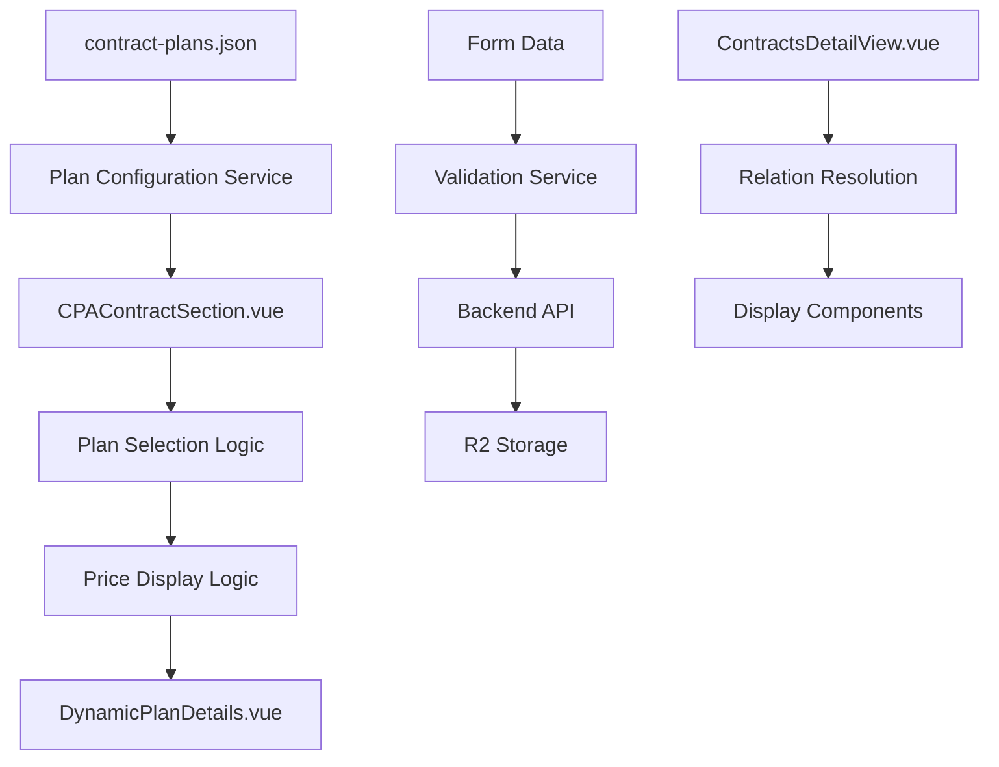

# Design Document

## Overview

This design addresses critical issues in the CLEVER dashboard contract
management system, specifically focusing on the contract form and detail view
components. The solution involves fixing CPA plan selection logic, correcting
price table display behavior, improving toggle switch visual consistency,
ensuring complete data storage and display, and streamlining the form by
removing redundant client information fields.

The design maintains the existing Vue 3 + TypeScript architecture while
implementing targeted fixes to improve user experience and data integrity.

## Architecture

### Component Structure

The contract form system consists of several interconnected components:

```
ContractFormTemplate.vue (main form container)
├── CPAContractSection.vue (CPA-specific form section)
│   ├── CPAEquipmentManager.vue (equipment management)
│   ├── ContractDatesSection.vue (date selection)
│   └── DynamicPlanDetails.vue (price table display)
├── SHContractSection.vue (S&H-specific form section)
├── DisplayToggleSwitch.vue (section toggle controls)
└── ContractCreateTemplate.vue / ContractUpdateTemplate.vue (form wrappers)
```

### Data Flow Architecture



## Components and Interfaces

### 1. Enhanced Plan Selection Service

Create a new service to handle plan filtering and selection logic:

```typescript
interface PlanSelectionService {
  getAvailablePlans(contractType: 'CPA' | 'CPA_1500' | 'S&H'): ContractPlan[];
  requiresDistance(contractType: string, planId: string): boolean;
  shouldShowPriceTable(
    contractType: string,
    planId: string,
    distance?: string
  ): boolean;
  getPlanDetails(contractType: string, planId: string): ContractPlan | null;
}
```

### 2. Updated CPAContractSection Component

The component will be enhanced with:

- Dynamic plan filtering based on contract type
- Improved price table display logic
- Better state management for form fields

```typescript
interface CPAContractSectionProps {
  formData: ContractFormData;
  cpaEquipments: ContractEquipment[];
  selectedPlanDetails: ContractPlan | null;
  isLoadingPlan?: boolean;
}

interface CPAContractSectionEmits {
  'update-field': (field: string, value: any) => void;
  'equipment-updated': (equipment: ContractEquipment) => void;
  'plan-selected': (planId: string) => void;
}
```

### 3. Enhanced DisplayToggleSwitch Component

Improved toggle component with consistent styling and behavior:

```typescript
interface DisplayToggleSwitchProps {
  title: string;
  isActive: boolean;
  disabled?: boolean;
}

interface DisplayToggleSwitchEmits {
  toggle: (active: boolean) => void;
}
```

### 4. Form Data Validation Service

Enhanced validation service that handles different contract type requirements:

```typescript
interface ContractValidationService {
  validateCPAContract(data: Partial<ContractData>): ValidationResult;
  validateSHContract(data: Partial<ContractData>): ValidationResult;
  validateContractDates(startDate: string, endDate: string): ValidationResult;
  getValidationErrors(data: ContractData): ValidationError[];
}
```

## Data Models

### Enhanced Contract Form Data

The existing ContractData interface already supports all required fields. Key
fields for the fixes:

```typescript
interface ContractData {
  // CPA Contract Information
  cpaContractType: 'CPA' | 'CPA_1500' | ''; // Enhanced to distinguish between types
  planIdCPA: string; // Will be filtered based on contract type
  distanceCPA: 'under180km' | 'over180km' | ''; // Required for CPA, not for CPA_1500
  hasPOSPackage: boolean; // For CPA_1500 PREMIUM only

  // Other existing fields remain unchanged...
}
```

### Plan Configuration Structure

The existing contract-plans.json structure supports the required functionality:

```typescript
interface ContractPlanConfig {
  CPA: { plans: ContractPlan[] }; // 3 plans with distance-based pricing
  CPA_1500: { plans: ContractPlan[] }; // 3 plans with flat pricing
  'S&H': { plans: ContractPlan[] }; // 6 plans with distance-based pricing
}
```

## Implementation Strategy

### Phase 1: Plan Selection Logic Fix

1. **Create Plan Selection Service**
   - Implement `getAvailablePlans()` method to filter plans by contract type
   - Add `requiresDistance()` method to determine distance requirement
   - Add `shouldShowPriceTable()` method for display logic

2. **Update CPAContractSection Component**
   - Replace hardcoded plan options with dynamic filtering
   - Implement reactive plan options based on contract type selection
   - Add plan clearing logic when contract type changes

### Phase 2: Price Table Display Logic Fix

1. **Enhanced Price Display Logic**
   - Update `shouldShowPlanDetails` computed property
   - Implement contract type-specific display rules
   - Add proper handling for CPA_1500 flat pricing

2. **DynamicPlanDetails Component Updates**
   - Ensure proper handling of different pricing structures
   - Add loading states for plan changes
   - Improve error handling for missing plan data

### Phase 3: Toggle Switch Visual Improvements

1. **DisplayToggleSwitch Component Enhancement**
   - Standardize CSS classes and animations
   - Improve accessibility with proper ARIA attributes
   - Add consistent hover and focus states
   - Implement smooth transitions

2. **Form Section Integration**
   - Ensure consistent toggle behavior across all sections
   - Add proper state management for section visibility
   - Implement smooth show/hide animations

### Phase 4: Data Storage and Display Verification

1. **Backend Data Handling**
   - Verify all form fields are included in API endpoints
   - Ensure proper validation of contract type-specific fields
   - Add proper error handling for missing or invalid data

2. **Detail View Enhancement**
   - Verify all stored fields are displayed
   - Add proper formatting for contract type display
   - Enhance error handling for relation resolution
   - Add missing field displays if any are identified

### Phase 5: Client Information Form Simplification

1. **Remove Client Information Fields from Create Form**
   - Remove client information input fields from create form
   - Keep only the client selection dropdown
   - Ensure client data is properly resolved from relations

2. **Implement Read-Only Client Field in Update Form**
   - Make client field read-only in update forms using form section modification
   - Display selected client information without allowing changes
   - Provide clear visual indicators for read-only state
   - Ensure client ID is included in update requests

3. **Form Layout Optimization**
   - Reorganize form sections after client field changes
   - Maintain proper form flow and validation
   - Update form styling for improved layout

## Error Handling

### Plan Selection Errors

- Handle missing or invalid contract-plans.json configuration
- Provide fallback behavior for unknown plan types
- Display user-friendly error messages for configuration issues

### Price Display Errors

- Handle missing pricing data gracefully
- Display appropriate messages when price information is unavailable
- Provide fallback display for malformed price structures

### Form Validation Errors

- Implement contract type-specific validation rules
- Display clear, contextual error messages in Portuguese
- Provide real-time validation feedback

### Data Storage Errors

- Handle API errors during form submission
- Provide retry mechanisms for failed submissions
- Maintain form state during error recovery

## Correctness Properties

_A property is a characteristic or behavior that should hold true across all
valid executions of a system—essentially, a formal statement about what the
system should do. Properties serve as the bridge between human-readable
specifications and machine-verifiable correctness guarantees._

### Property 1: Plan Filtering Consistency

_For any_ contract type selection (CPA, CPA_1500, S&H, or empty), the system
should return exactly the plans defined for that contract type in the
configuration, with empty selection returning no plans **Validates: Requirements
1.1, 1.2, 1.3**

### Property 2: Plan Selection State Management

_For any_ contract type change, the previously selected plan should be cleared
and the available plan options should be updated to match the new contract type
**Validates: Requirements 1.4, 1.5**

### Property 3: Price Table Display Logic

_For any_ plan selection, the price table should be displayed immediately after
plan selection regardless of contract type (CPA_1500, CPA, or S&H) **Validates:
Requirements 2.1, 2.2, 2.3, 2.4, 2.5**

### Property 4: Toggle Visual State Consistency

_For any_ toggle switch state (on/off), the visual styling should consistently
reflect the state with appropriate colors (green for on, gray for off) and
smooth animations **Validates: Requirements 3.1, 3.2, 3.3**

### Property 5: Toggle Section Visibility

_For any_ toggle state change, the associated form section should be shown or
hidden with smooth transitions that match the toggle state **Validates:
Requirements 3.4, 3.5**

### Property 6: Form Data Persistence

_For any_ valid contract form submission, all form field values should be stored
in the backend and retrievable, maintaining data integrity across the storage
round trip **Validates: Requirements 4.1, 4.2, 4.3, 4.4, 4.5**

### Property 7: Detail View Display Completeness

_For any_ stored contract, all non-empty fields should be displayed in the
detail view with appropriate formatting and styling **Validates: Requirements
5.1, 5.2, 5.3, 5.4**

### Property 8: Relation Error Display

_For any_ contract with relation resolution errors, clear error messages with
appropriate styling should be displayed instead of missing or malformed data
**Validates: Requirements 5.5**

### Property 9: Contract Type Validation Rules

_For any_ contract form submission, validation should require distance selection
for CPA and S&H contracts but not for CPA_1500 contracts **Validates:
Requirements 6.1, 6.2, 6.3**

### Property 10: Validation Error Handling

_For any_ validation failure, clear Portuguese error messages should be
displayed, and when errors are corrected, the messages should be immediately
removed **Validates: Requirements 6.4, 6.5**

### Property 11: Configuration Loading and Structure

_For any_ contract plan configuration access, the system should load plans from
the configuration file and apply the correct pricing structure (flat for
CPA_1500, distance-based for CPA and S&H) **Validates: Requirements 7.1, 7.2,
7.3, 7.4**

### Property 12: Configuration Error Handling

_For any_ missing or malformed configuration data, the system should handle
errors gracefully with appropriate error messages **Validates: Requirements
7.5**

### Property 13: Client Form Simplification

_For any_ contract create form, only the client selection dropdown should be
present without additional client information input fields **Validates:
Requirements 8.1, 8.4**

### Property 14: Client Field Read-Only Behavior

_For any_ contract update form, the client field should be displayed as
read-only with clear visual indicators and should not allow modifications while
still including the client ID in update requests **Validates: Requirements 8.2,
8.6, 8.7**

### Property 15: Client Data Usage

_For any_ client selection in contract forms, the system should use existing
client data from the selection and maintain client information display in detail
views through resolved relations **Validates: Requirements 8.3, 8.5**

### Property 16: UI Consistency

_For any_ form interaction, visual feedback, animations, error states, and
loading indicators should follow consistent patterns across all form components
**Validates: Requirements 9.1, 9.2, 9.3, 9.4**

### Property 18: JavaScript Error Prevention

_For any_ form data access in watchers, callbacks, or event handlers, the system
should include proper null checks to prevent "formData is not defined" errors
and handle component lifecycle properly **Validates: Requirements 10.1, 10.2,
10.3, 10.4, 10.5, 10.6, 10.7**

## Technical Implementation Details

### JavaScript Error Prevention Solution

The JavaScript error "formData is not defined" occurs when Vue watchers or
callbacks attempt to access reactive references after component unmount or
during component recreation. This is particularly problematic in complex forms
with multiple watchers and dynamic sections.

#### Root Cause Analysis

1. **Duplicate Watchers**: Multiple watchers observing the same reactive arrays
   without proper cleanup
2. **Missing Null Checks**: Watchers accessing `formData.value` without checking
   if it exists
3. **Lifecycle Issues**: Watchers continuing to execute after component unmount
4. **Closure Problems**: Callbacks referencing destroyed reactive references

#### Solution Implementation

1. **Watcher Cleanup Pattern**

```typescript
// Proper watcher cleanup with null checks
const stopWatcher = watch(
  () => formData.value?.someField,
  newValue => {
    if (formData.value && newValue) {
      // Safe access with null checks
      updateFieldValue('field', newValue);
    }
  }
);

// Add to cleanup functions
cleanupFunctions.push(stopWatcher);

// Component cleanup
onBeforeUnmount(() => {
  cleanupFunctions.forEach(cleanup => cleanup());
  cleanupFunctions.length = 0;
});
```

2. **Safe Form Data Access**

```typescript
// Safe initialization functions
const initializeData = () => {
  if (!formData.value) return; // Early return if formData not available

  // Safe field updates
  if (!formData.value.someField) {
    updateFieldValue('someField', defaultValue);
  }
};
```

3. **Display Toggle Handler Safety**

```typescript
// Safe toggle handlers with null checks
const handleToggle = (active: boolean) => {
  if (active && formData.value && !formData.value.hasContract) {
    updateFieldValue('hasContract', true);
    initializeData();
  }
};
```

4. **Equipment Watcher Deduplication**

```typescript
// Remove duplicate watchers - use only the cleanup-enabled versions
// Replace multiple equipment watchers with single, properly managed watchers
const stopEquipmentWatcher = watch(
  equipments,
  newEquipments => {
    if (formData.value) {
      updateFieldValue('equipments', newEquipments);
    }
  },
  { deep: true }
);
cleanupFunctions.push(stopEquipmentWatcher);
```

#### Testing Strategy

1. **Scenario Testing**: Create CPA-only contract, then update to add S&H
   section
2. **Lifecycle Testing**: Verify proper cleanup on component unmount
3. **Error Monitoring**: Ensure no "formData is not defined" errors in console
4. **Form Submission**: Verify successful form submission after section
   additions

### Property 17: Responsive Design Consistency

_For any_ screen size or device type, all form components should maintain proper
responsive design principles and functionality **Validates: Requirements 9.5**
