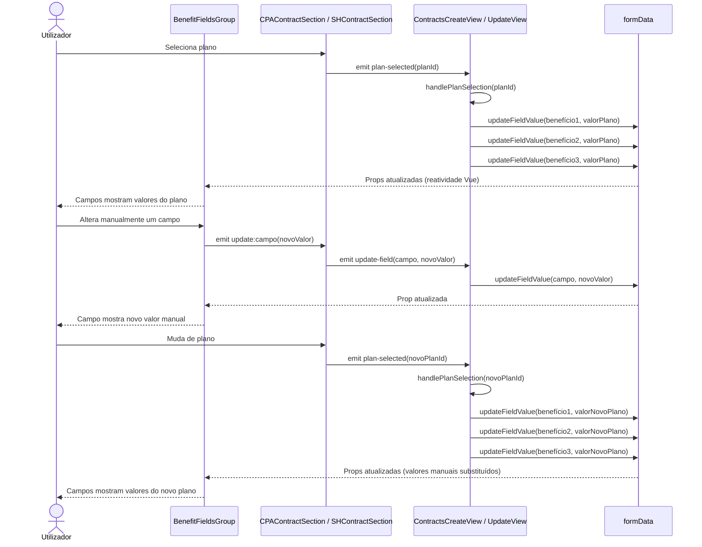

# Design — Edição Manual dos Benefícios do Plano de Contrato

## 1. Visão geral e decisões de design

- Os 6 campos de benefícios (`horasAssistenciaAnualCPA/SH`, `deslocacoesPorAnoCPA/SH`, `manutencoesPorAnoCPA/SH`) já existem na interface `ContractData` e são persistidos no R2 — não há alterações ao modelo de dados nem ao backend
- Atualmente os campos são populados automaticamente pelo `handleCPAPlanSelection` / `handleSHPlanSelection` e nunca apresentados como inputs editáveis ao utilizador
- A alteração é exclusivamente frontend: substituir a exibição read-only por inputs numéricos editáveis dentro das secções CPA e S&H
- Criar um componente reutilizável `BenefitFieldsGroup.vue` que encapsula os 3 campos de benefícios com validação inline, usado tanto na secção CPA como na S&H
- O pré-preenchimento automático pelo plano continua a funcionar como base — os handlers existentes (`handleCPAPlanSelection`, `handleSHPlanSelection`) continuam a chamar `updateFieldValue` para popular os campos, mas agora o utilizador pode alterar os valores depois
- Quando o utilizador muda de plano, os valores manuais são substituídos pelos do novo plano (comportamento existente mantido)
- A validação dos valores manuais é feita inline no componente (frontend) e reforçada no `validateContractCreation` / `validateContractUpdate` existentes no shared
- Sem alterações ao backend (`contracts.ts` routes) — os campos já são aceites e persistidos tal como estão
- Sem alterações ao `contract-plans.json` — a configuração dos planos permanece inalterada

## 2. Modelo de dados — campos de benefícios

Campos existentes na interface `ContractData` (sem alterações):

| Campo | Tipo | Secção | Valor por defeito | Significado de -1 |
|-------|------|--------|-------------------|-------------------|
| `horasAssistenciaAnualCPA` | `number` | CPA | Valor do plano (tipicamente 0 para CPA) | Ilimitado |
| `deslocacoesPorAnoCPA` | `number` | CPA | Valor do plano (`callouts`) | Ilimitado |
| `manutencoesPorAnoCPA` | `number` | CPA | Valor do plano (`maintenancePerYear`) | Ilimitado |
| `horasAssistenciaAnualSH` | `number` | S&H | Valor do plano (`hoursPerYear`) | Ilimitado |
| `deslocacoesPorAnoSH` | `number` | S&H | Valor do plano (`displacementsIncluded`) | Ilimitado |
| `manutencoesPorAnoSH` | `number` | S&H | Valor do plano (tipicamente 0 para S&H) | Ilimitado |

- Domínio de valores válidos: inteiros ≥ 0 ou -1 (ilimitado)
- Os valores são populados automaticamente na seleção de plano e editáveis manualmente pelo utilizador
- O valor final guardado no contrato é sempre o que o utilizador definiu (override manual ou valor do plano não alterado)

## 3. Componente BenefitFieldsGroup — interface e comportamento

Novo componente Vue: `packages/frontend/src/components/contracts/BenefitFieldsGroup.vue`

### Props

| Prop | Tipo | Obrigatório | Descrição |
|------|------|-------------|-----------|
| `horasAssistencia` | `number` | Sim | Valor atual de horas de assistência anual |
| `deslocacoesPorAno` | `number` | Sim | Valor atual de deslocações por ano |
| `manutencoesPorAno` | `number` | Sim | Valor atual de manutenções por ano |
| `disabled` | `boolean` | Não (default: false) | Desativa os campos (ex: antes de selecionar plano) |

### Emits

| Evento | Payload | Quando |
|--------|---------|--------|
| `update:horasAssistencia` | `number` | Utilizador altera o campo de horas |
| `update:deslocacoesPorAno` | `number` | Utilizador altera o campo de deslocações |
| `update:manutencoesPorAno` | `number` | Utilizador altera o campo de manutenções |

### Campos renderizados

| Label (PT) | Campo associado | Input type | Placeholder |
|-------------|----------------|------------|-------------|
| HORAS DE ASSISTÊNCIA ANUAL | `horasAssistencia` | `number` | "0" |
| DESLOCAÇÕES POR ANO | `deslocacoesPorAno` | `number` | "0" |
| MANUTENÇÕES POR ANO | `manutencoesPorAno` | `number` | "0" |

### Comportamento

- Layout em grid de 3 colunas (desktop) / 1 coluna (mobile), consistente com o grid existente nas secções CPA/S&H
- Cada campo é um `<input type="number">` com classe `config-input` e min target de 44px
- Validação inline em tempo real: ao perder foco ou ao alterar valor, valida segundo as regras da secção 6
- Se o valor for inválido, mostra mensagem de erro em PT junto ao campo (classe `form-error`)
- Se o valor for corrigido, a mensagem de erro desaparece imediatamente
- O valor -1 é aceite e apresentado como "-1" no input (a label "Ilimitado" aparece apenas na vista de detalhe, não no formulário)
- Campos desativados (`disabled`) quando nenhum plano está selecionado

## 4. Integração nos componentes de secção (CPA + S&H)

### Alterações por componente

| Componente | Ficheiro | Alteração | Posição no template |
|------------|----------|-----------|---------------------|
| `CPAContractSection` | `components/contracts/CPAContractSection.vue` | Adicionar `BenefitFieldsGroup` com props CPA | Após `ContractDatesSection`, antes de `DynamicPlanDetails` |
| `SHContractSection` | `components/contracts/SHContractSection.vue` | Adicionar `BenefitFieldsGroup` com props S&H | Após `ContractDatesSection`, antes de `DynamicPlanDetails` |

### Binding de props e emits no CPAContractSection

| Prop do BenefitFieldsGroup | Fonte no formData | Emit → update-field |
|---------------------------|-------------------|---------------------|
| `horasAssistencia` | `formData.horasAssistenciaAnualCPA` | `('update-field', 'horasAssistenciaAnualCPA', value)` |
| `deslocacoesPorAno` | `formData.deslocacoesPorAnoCPA` | `('update-field', 'deslocacoesPorAnoCPA', value)` |
| `manutencoesPorAno` | `formData.manutencoesPorAnoCPA` | `('update-field', 'manutencoesPorAnoCPA', value)` |
| `disabled` | `!formData.planIdCPA` | — |

### Binding de props e emits no SHContractSection

| Prop do BenefitFieldsGroup | Fonte no formData | Emit → update-field |
|---------------------------|-------------------|---------------------|
| `horasAssistencia` | `formData.horasAssistenciaAnualSH` | `('update-field', 'horasAssistenciaAnualSH', value)` |
| `deslocacoesPorAno` | `formData.deslocacoesPorAnoSH` | `('update-field', 'deslocacoesPorAnoSH', value)` |
| `manutencoesPorAno` | `formData.manutencoesPorAnoSH` | `('update-field', 'manutencoesPorAnoSH', value)` |
| `disabled` | `!formData.planIdSH` | — |

- Ambos os componentes já recebem `formData` como prop e emitem `update-field` — o padrão existente é reutilizado sem alterações à interface dos componentes pai
- O `BenefitFieldsGroup` propaga as alterações via `$emit('update-field', campo, valor)` no componente de secção, que por sua vez propaga ao `ContractsCreateView` / `ContractsUpdateView`

## 5. Fluxo de pré-preenchimento e re-preenchimento

### Fluxo por evento

| Evento | Origem | Ação nos campos de benefícios | REQ |
|--------|--------|-------------------------------|-----|
| Seleção de plano CPA | `handleCPAPlanSelection` em `ContractsCreateView` / `ContractsUpdateView` | Extrai `maintenancePerYear` → `manutencoesPorAnoCPA`, `callouts` → `deslocacoesPorAnoCPA`, `horasAssistenciaAnualCPA` = 0. Chama `updateFieldValue` para cada campo. | REQ-03.1 |
| Seleção de plano S&H | `handleSHPlanSelection` em `ContractsCreateView` / `ContractsUpdateView` | Extrai `hoursPerYear` → `horasAssistenciaAnualSH`, `displacementsIncluded` → `deslocacoesPorAnoSH`, `manutencoesPorAnoSH` = 0. Chama `updateFieldValue` para cada campo. | REQ-03.2 |
| Mudança de plano (CPA ou S&H) | Mesmo handler acima (re-invocado) | Substitui todos os valores de benefícios pelos do novo plano, sobrepondo quaisquer alterações manuais | REQ-03.3 |
| Edição manual pelo utilizador | `BenefitFieldsGroup` emit → secção → `updateFieldValue` | Atualiza o campo individual no `formData`. Não afeta os outros campos. | REQ-01, REQ-02 |

### Mapeamento plano → campos

| Campo do plano (`contract-plans.json`) | Campo CPA no formData | Campo S&H no formData |
|----------------------------------------|----------------------|----------------------|
| `maintenancePerYear` | `manutencoesPorAnoCPA` | — (S&H não usa, define 0) |
| `callouts` (número ou string "sem limite") | `deslocacoesPorAnoCPA` (-1 se ilimitado) | — |
| `hoursPerYear` | — (CPA não usa, define 0) | `horasAssistenciaAnualSH` |
| `displacementsIncluded` (número ou "ilimitadas") | — | `deslocacoesPorAnoSH` (-1 se ilimitado) |

### Diagrama de sequência — pré-preenchimento e override manual

## 6. Validação — regras e mensagens de erro

### Regras de validação por campo

| Regra | Condição | Resultado | REQ |
|-------|----------|-----------|-----|
| Valor inteiro ≥ 0 | `Number.isInteger(v) && v >= 0` | Aceite | REQ-04.1 (CA-04.1.1) |
| Valor -1 (ilimitado) | `v === -1` | Aceite | REQ-04.1 (CA-04.1.2) |
| Valor negativo ≠ -1 | `v < 0 && v !== -1` | Rejeitado | REQ-04.1 (CA-04.1.3) |
| Valor não numérico | `isNaN(v)` ou input vazio | Rejeitado | REQ-04.1 (CA-04.1.4) |
| Campo vazio na submissão | `v === '' \|\| v === undefined` | Rejeitado | RB-07 |

### Mensagens de erro (PT)

| Cenário | Mensagem |
|---------|----------|
| Valor negativo (≠ -1) | "O valor deve ser 0 ou superior, ou -1 para ilimitado" |
| Valor não numérico | "Introduza um valor numérico válido" |
| Campo vazio | "Este campo é obrigatório" |

### Onde a validação é executada

| Camada | Ficheiro | Momento | Tipo |
|--------|----------|---------|------|
| Componente `BenefitFieldsGroup` | `BenefitFieldsGroup.vue` | `@input` / `@blur` | Inline — mostra/esconde erro junto ao campo |
| Validação de submissão (Create) | `ContractsCreateView.vue` → `validateContractCreate` | Antes de submeter | Bloqueia submissão se campos inválidos |
| Validação de submissão (Update) | `ContractsUpdateView.vue` → `validateContractUpdate` | Antes de submeter | Bloqueia submissão se campos inválidos |
| Validação shared (backend) | `@clever/shared` → `validation.ts` → `validateContractCreation` / `validateContractUpdate` | No handler da rota | Rejeita request com 400 |

- A função de validação é a mesma lógica reutilizada: `validateBenefitValue(value: unknown): string | null` — retorna `null` se válido, ou a mensagem de erro em PT
- Esta função é definida no `BenefitFieldsGroup.vue` (frontend-only, sem necessidade de partilhar com o backend pois o backend já tem validação equivalente em `validation.ts`)

## 7. Persistência — Create e Update views

### Alterações por vista

| Vista | Ficheiro | Alteração |
|-------|----------|-----------|
| `ContractsCreateView` | `views/contracts/ContractsCreateView.vue` | Nenhuma alteração ao handler de submissão — os campos de benefícios já são incluídos no `formData` e enviados ao backend via `api.create()` |
| `ContractsUpdateView` | `views/contracts/ContractsUpdateView.vue` | Nenhuma alteração ao handler de submissão — os campos de benefícios já são incluídos no `formData` e enviados ao backend via `api.update()` |
| `ContractsCreateView` | `views/contracts/ContractsCreateView.vue` | Adicionar validação dos campos de benefícios no `validateContractCreate` — verificar que os 3 campos CPA (se CPA ativo) e os 3 campos S&H (se S&H ativo) são válidos |
| `ContractsUpdateView` | `views/contracts/ContractsUpdateView.vue` | Adicionar validação dos campos de benefícios no `validateContractUpdate` — mesma lógica |

### Fluxo de dados na submissão

| Passo | Ação | Dados |
|-------|------|-------|
| 1 | Utilizador clica "Guardar" | `formData` contém todos os campos incluindo benefícios (manuais ou do plano) |
| 2 | `validateContractCreate/Update` executa | Valida benefícios: inteiro ≥ 0 ou -1 para cada campo ativo |
| 3 | Se válido → `api.create()` / `api.update()` | Envia `formData` completo ao backend |
| 4 | Backend `validateContractCreation/Update` | Revalida benefícios (defesa em profundidade) |
| 5 | Backend guarda no R2 | Valores de benefícios guardados tal como o utilizador definiu |

- Na edição (`ContractsUpdateView`), os campos de benefícios são pré-preenchidos com os valores existentes do contrato carregado — o utilizador vê os valores atuais e pode alterá-los
- Não é necessário distinguir entre valores "do plano" e valores "manuais" — o contrato guarda sempre o valor final

## 8. Tratamento de erros

| Cenário | Comportamento no BenefitFieldsGroup | Comportamento na submissão | REQ |
|---------|-------------------------------------|---------------------------|-----|
| Utilizador introduz valor negativo (-3) | Mensagem "O valor deve ser 0 ou superior, ou -1 para ilimitado" junto ao campo, campo destacado com borda vermelha | Submissão bloqueada, campo destacado | REQ-04.1.3, REQ-04.3 |
| Utilizador introduz texto ("abc") | Mensagem "Introduza um valor numérico válido" junto ao campo, campo destacado | Submissão bloqueada, campo destacado | REQ-04.1.4, REQ-04.3 |
| Utilizador deixa campo vazio | Mensagem "Este campo é obrigatório" junto ao campo, campo destacado | Submissão bloqueada, campo destacado | RB-07, REQ-04.3 |
| Utilizador corrige valor inválido para válido | Mensagem de erro desaparece imediatamente, borda volta ao normal | Submissão desbloqueada (se todos os campos válidos) | REQ-04.2.3 |
| Utilizador introduz -1 | Sem erro — valor aceite como ilimitado | Submissão permitida | REQ-04.1.2 |
| Utilizador introduz 0 | Sem erro — valor aceite | Submissão permitida | REQ-04.1.1 |

- As mensagens de erro são sempre em Português de Portugal (REQ-04.2.1)
- As mensagens aparecem imediatamente abaixo do campo com valor inválido, usando a classe `form-error` existente (REQ-04.2.2)
- O destaque visual dos campos inválidos usa borda vermelha (`border-color: red`) consistente com o padrão existente no formulário (REQ-04.3.2)
- A validação inline é reativa — executa no `@input` para feedback imediato
