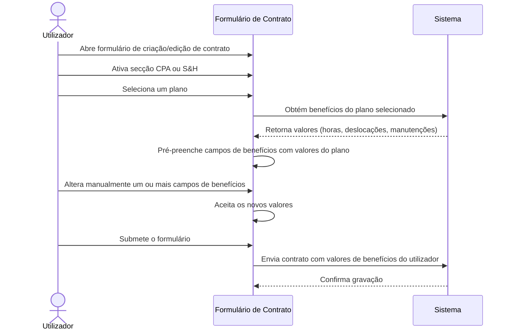

# Requisitos — Edição Manual dos Benefícios do Plano de Contrato

## Glossário

| Termo | Definição |
|-------|-----------|
| Benefícios do plano | Conjunto de 3 valores associados a um plano de contrato: Horas de Assistência Anual, Deslocações por Ano, Manutenções por Ano |
| Override manual | Ação do utilizador de alterar um valor de benefício que foi pré-preenchido automaticamente pelo plano selecionado |
| Valor ilimitado | Representado por -1 no sistema; apresentado como "Ilimitado" na interface |
| Pré-preenchimento | Preenchimento automático dos campos de benefícios com base na configuração do plano selecionado |
| Plano de contrato | Configuração predefinida (Essential Care, Professional Care, Premium Care, etc.) que define os benefícios base de um contrato |
| Equipamento adicional | Equipamento além do primeiro num contrato CPA; pode justificar benefícios diferentes dos padrão do plano |

## Âmbito

### Incluído

- Tornar editáveis os 3 campos de benefícios (Horas de Assistência Anual, Deslocações por Ano, Manutenções por Ano) nos formulários de criação e edição de contratos
- Aplica-se às secções CPA e S&H do formulário de contrato
- Manter o pré-preenchimento automático pelo plano como valor inicial editável
- Validação dos valores introduzidos manualmente
- Suporte ao valor ilimitado (-1) nos campos editáveis

### Excluído

- Alterações à configuração dos planos em `contract-plans.json`
- Alterações ao sistema de saldo ou transações
- Alterações à vista de detalhe do contrato (apenas formulários de criação/edição)
- Novos campos ou tipos de benefícios
- Alterações ao sistema de equipamentos
- Alterações ao cálculo de preços

## Restrições

- Os campos de benefícios devem aceitar apenas valores numéricos inteiros ≥ 0 ou -1 (ilimitado)
- As labels de interface devem estar em Português de Portugal
- O padrão mobile-first com alvos de toque mínimos de 44px deve ser respeitado
- O pré-preenchimento automático pelo plano deve continuar a funcionar como base
- Os valores guardados no contrato são os valores finais definidos pelo utilizador (não os do plano)
- A convenção de -1 para valores ilimitados deve ser mantida em todo o sistema

---

## REQ-01 — Edição manual dos benefícios CPA

### REQ-01.1 — Campos de benefícios CPA editáveis

**WHEN** um utilizador cria ou edita um contrato com secção CPA ativa, o sistema **SHALL** apresentar os campos Horas de Assistência Anual, Deslocações por Ano e Manutenções por Ano como campos de input numérico editáveis.

| CA-ID | Critério de aceitação |
|-------|----------------------|
| CA-01.1.1 | O campo "Horas de Assistência Anual CPA" é um input numérico editável no formulário de criação |
| CA-01.1.2 | O campo "Deslocações por Ano CPA" é um input numérico editável no formulário de criação |
| CA-01.1.3 | O campo "Manutenções por Ano CPA" é um input numérico editável no formulário de criação |
| CA-01.1.4 | Os 3 campos são igualmente editáveis no formulário de edição |

### REQ-01.2 — Persistência dos valores manuais CPA

**WHEN** um utilizador submete o formulário de contrato com valores de benefícios CPA alterados manualmente, o sistema **SHALL** guardar os valores introduzidos pelo utilizador (não os valores padrão do plano).

| CA-ID | Critério de aceitação |
|-------|----------------------|
| CA-01.2.1 | O valor guardado de horasAssistenciaAnualCPA corresponde ao valor introduzido pelo utilizador |
| CA-01.2.2 | O valor guardado de deslocacoesPorAnoCPA corresponde ao valor introduzido pelo utilizador |
| CA-01.2.3 | O valor guardado de manutencoesPorAnoCPA corresponde ao valor introduzido pelo utilizador |

## REQ-02 — Edição manual dos benefícios S&H

### REQ-02.1 — Campos de benefícios S&H editáveis

**WHEN** um utilizador cria ou edita um contrato com secção S&H ativa, o sistema **SHALL** apresentar os campos Horas de Assistência Anual, Deslocações por Ano e Manutenções por Ano como campos de input numérico editáveis.

| CA-ID | Critério de aceitação |
|-------|----------------------|
| CA-02.1.1 | O campo "Horas de Assistência Anual S&H" é um input numérico editável no formulário de criação |
| CA-02.1.2 | O campo "Deslocações por Ano S&H" é um input numérico editável no formulário de criação |
| CA-02.1.3 | O campo "Manutenções por Ano S&H" é um input numérico editável no formulário de criação |
| CA-02.1.4 | Os 3 campos são igualmente editáveis no formulário de edição |

### REQ-02.2 — Persistência dos valores manuais S&H

**WHEN** um utilizador submete o formulário de contrato com valores de benefícios S&H alterados manualmente, o sistema **SHALL** guardar os valores introduzidos pelo utilizador (não os valores padrão do plano).

| CA-ID | Critério de aceitação |
|-------|----------------------|
| CA-02.2.1 | O valor guardado de horasAssistenciaAnualSH corresponde ao valor introduzido pelo utilizador |
| CA-02.2.2 | O valor guardado de deslocacoesPorAnoSH corresponde ao valor introduzido pelo utilizador |
| CA-02.2.3 | O valor guardado de manutencoesPorAnoSH corresponde ao valor introduzido pelo utilizador |

## REQ-03 — Pré-preenchimento automático pelo plano

### REQ-03.1 — Auto-populate na seleção de plano CPA

**WHEN** um utilizador seleciona um plano CPA, o sistema **SHALL** pré-preencher os campos de benefícios CPA com os valores definidos na configuração do plano, permitindo ao utilizador alterá-los posteriormente.

| CA-ID | Critério de aceitação |
|-------|----------------------|
| CA-03.1.1 | Ao selecionar um plano CPA, o campo Manutenções por Ano é preenchido com o valor do plano |
| CA-03.1.2 | Ao selecionar um plano CPA, o campo Deslocações por Ano é preenchido com o valor do plano (incluindo -1 para ilimitado) |
| CA-03.1.3 | Ao selecionar um plano CPA, o campo Horas de Assistência Anual é preenchido com o valor do plano |
| CA-03.1.4 | Os valores pré-preenchidos são editáveis após o preenchimento automático |

### REQ-03.2 — Auto-populate na seleção de plano S&H

**WHEN** um utilizador seleciona um plano S&H, o sistema **SHALL** pré-preencher os campos de benefícios S&H com os valores definidos na configuração do plano, permitindo ao utilizador alterá-los posteriormente.

| CA-ID | Critério de aceitação |
|-------|----------------------|
| CA-03.2.1 | Ao selecionar um plano S&H, o campo Horas de Assistência Anual é preenchido com o valor do plano |
| CA-03.2.2 | Ao selecionar um plano S&H, o campo Deslocações por Ano é preenchido com o valor do plano |
| CA-03.2.3 | Ao selecionar um plano S&H, o campo Manutenções por Ano é preenchido com o valor do plano |
| CA-03.2.4 | Os valores pré-preenchidos são editáveis após o preenchimento automático |

### REQ-03.3 — Re-preenchimento na mudança de plano

**WHEN** um utilizador muda o plano selecionado (CPA ou S&H), o sistema **SHALL** substituir os valores dos campos de benefícios pelos valores do novo plano, sobrepondo quaisquer alterações manuais anteriores.

| CA-ID | Critério de aceitação |
|-------|----------------------|
| CA-03.3.1 | Ao mudar de plano, os campos de benefícios são atualizados com os valores do novo plano |
| CA-03.3.2 | Quaisquer valores manuais anteriores são substituídos pelos do novo plano |

## REQ-04 — Validação dos valores manuais

### REQ-04.1 — Validação de valores numéricos

O sistema **SHALL** aceitar apenas valores numéricos inteiros ≥ 0 ou -1 (ilimitado) nos campos de benefícios do plano.

| CA-ID | Critério de aceitação |
|-------|----------------------|
| CA-04.1.1 | Valores inteiros ≥ 0 são aceites (0, 1, 2, 10, etc.) |
| CA-04.1.2 | O valor -1 é aceite como representação de ilimitado |
| CA-04.1.3 | Valores negativos diferentes de -1 são rejeitados com mensagem de erro |
| CA-04.1.4 | Valores não numéricos são rejeitados com mensagem de erro |

### REQ-04.2 — Mensagens de erro em Português

**IF** um utilizador introduz um valor inválido num campo de benefícios, **THEN** o sistema **SHALL** apresentar uma mensagem de erro em Português de Portugal junto ao campo.

| CA-ID | Critério de aceitação |
|-------|----------------------|
| CA-04.2.1 | A mensagem de erro é apresentada em Português de Portugal |
| CA-04.2.2 | A mensagem de erro é apresentada junto ao campo com valor inválido |
| CA-04.2.3 | A mensagem de erro desaparece quando o utilizador corrige o valor |

### REQ-04.3 — Bloqueio de submissão com valores inválidos

**IF** qualquer campo de benefícios contém um valor inválido, **THEN** o sistema **SHALL** impedir a submissão do formulário e destacar os campos com erro.

| CA-ID | Critério de aceitação |
|-------|----------------------|
| CA-04.3.1 | O formulário não é submetido enquanto existirem campos de benefícios com valores inválidos |
| CA-04.3.2 | Os campos com valores inválidos são destacados visualmente |

---

## [MA] Mirror — Critérios de aceitação

| REQ-ID | CA-ID | Given | When | Then | Prioridade |
|--------|-------|-------|------|------|------------|
| REQ-01.1 | CA-01.1.1 | Formulário de criação de contrato com secção CPA ativa | O utilizador visualiza a secção de benefícios CPA | O campo "Horas de Assistência Anual CPA" é um input numérico editável | Alta |
| REQ-01.1 | CA-01.1.2 | Formulário de criação de contrato com secção CPA ativa | O utilizador visualiza a secção de benefícios CPA | O campo "Deslocações por Ano CPA" é um input numérico editável | Alta |
| REQ-01.1 | CA-01.1.3 | Formulário de criação de contrato com secção CPA ativa | O utilizador visualiza a secção de benefícios CPA | O campo "Manutenções por Ano CPA" é um input numérico editável | Alta |
| REQ-01.1 | CA-01.1.4 | Formulário de edição de contrato com secção CPA ativa | O utilizador visualiza a secção de benefícios CPA | Os 3 campos de benefícios CPA são editáveis | Alta |
| REQ-01.2 | CA-01.2.1 | Contrato CPA com horas alteradas manualmente para 20 | O utilizador submete o formulário | O valor guardado de horasAssistenciaAnualCPA é 20 | Alta |
| REQ-01.2 | CA-01.2.2 | Contrato CPA com deslocações alteradas manualmente para 5 | O utilizador submete o formulário | O valor guardado de deslocacoesPorAnoCPA é 5 | Alta |
| REQ-01.2 | CA-01.2.3 | Contrato CPA com manutenções alteradas manualmente para 4 | O utilizador submete o formulário | O valor guardado de manutencoesPorAnoCPA é 4 | Alta |
| REQ-02.1 | CA-02.1.1 | Formulário de criação de contrato com secção S&H ativa | O utilizador visualiza a secção de benefícios S&H | O campo "Horas de Assistência Anual S&H" é um input numérico editável | Alta |
| REQ-02.1 | CA-02.1.2 | Formulário de criação de contrato com secção S&H ativa | O utilizador visualiza a secção de benefícios S&H | O campo "Deslocações por Ano S&H" é um input numérico editável | Alta |
| REQ-02.1 | CA-02.1.3 | Formulário de criação de contrato com secção S&H ativa | O utilizador visualiza a secção de benefícios S&H | O campo "Manutenções por Ano S&H" é um input numérico editável | Alta |
| REQ-02.1 | CA-02.1.4 | Formulário de edição de contrato com secção S&H ativa | O utilizador visualiza a secção de benefícios S&H | Os 3 campos de benefícios S&H são editáveis | Alta |
| REQ-02.2 | CA-02.2.1 | Contrato S&H com horas alteradas manualmente para 25 | O utilizador submete o formulário | O valor guardado de horasAssistenciaAnualSH é 25 | Alta |
| REQ-02.2 | CA-02.2.2 | Contrato S&H com deslocações alteradas manualmente para 6 | O utilizador submete o formulário | O valor guardado de deslocacoesPorAnoSH é 6 | Alta |
| REQ-02.2 | CA-02.2.3 | Contrato S&H com manutenções alteradas manualmente para 3 | O utilizador submete o formulário | O valor guardado de manutencoesPorAnoSH é 3 | Alta |
| REQ-03.1 | CA-03.1.1 | Formulário de contrato CPA sem plano selecionado | O utilizador seleciona o plano "Professional Care" CPA | O campo Manutenções por Ano é preenchido com o valor do plano | Alta |
| REQ-03.1 | CA-03.1.2 | Formulário de contrato CPA sem plano selecionado | O utilizador seleciona o plano "Professional Care" CPA (2023) | O campo Deslocações por Ano é preenchido com -1 (ilimitado) | Alta |
| REQ-03.1 | CA-03.1.3 | Formulário de contrato CPA sem plano selecionado | O utilizador seleciona um plano CPA | O campo Horas de Assistência Anual é preenchido com o valor do plano | Alta |
| REQ-03.1 | CA-03.1.4 | Campos de benefícios CPA pré-preenchidos pelo plano | O utilizador clica num campo de benefícios | O campo é editável e aceita novos valores | Alta |
| REQ-03.2 | CA-03.2.1 | Formulário de contrato S&H sem plano selecionado | O utilizador seleciona o plano "Gold" S&H | O campo Horas de Assistência Anual é preenchido com 15 | Alta |
| REQ-03.2 | CA-03.2.2 | Formulário de contrato S&H sem plano selecionado | O utilizador seleciona o plano "Gold" S&H | O campo Deslocações por Ano é preenchido com 3 | Alta |
| REQ-03.2 | CA-03.2.3 | Formulário de contrato S&H sem plano selecionado | O utilizador seleciona o plano "Gold" S&H | O campo Manutenções por Ano é preenchido com o valor do plano | Alta |
| REQ-03.2 | CA-03.2.4 | Campos de benefícios S&H pré-preenchidos pelo plano | O utilizador clica num campo de benefícios | O campo é editável e aceita novos valores | Alta |
| REQ-03.3 | CA-03.3.1 | Campos de benefícios CPA com valores manuais (ex: horas=20) | O utilizador muda o plano CPA para outro | Os campos são atualizados com os valores do novo plano | Média |
| REQ-03.3 | CA-03.3.2 | Campos de benefícios com valores manuais | O utilizador muda de plano | Os valores manuais anteriores são substituídos pelos do novo plano | Média |
| REQ-04.1 | CA-04.1.1 | Campo de benefícios editável | O utilizador introduz o valor 5 | O valor é aceite sem erro | Alta |
| REQ-04.1 | CA-04.1.2 | Campo de benefícios editável | O utilizador introduz o valor -1 | O valor é aceite como ilimitado | Alta |
| REQ-04.1 | CA-04.1.3 | Campo de benefícios editável | O utilizador introduz o valor -3 | Uma mensagem de erro é apresentada | Alta |
| REQ-04.1 | CA-04.1.4 | Campo de benefícios editável | O utilizador introduz texto "abc" | Uma mensagem de erro é apresentada | Alta |
| REQ-04.2 | CA-04.2.1 | Campo de benefícios com valor inválido | O sistema apresenta erro | A mensagem está em Português de Portugal | Média |
| REQ-04.2 | CA-04.2.2 | Campo de benefícios com valor inválido | O sistema apresenta erro | A mensagem aparece junto ao campo | Média |
| REQ-04.2 | CA-04.2.3 | Campo de benefícios com erro visível | O utilizador corrige o valor para um válido | A mensagem de erro desaparece | Média |
| REQ-04.3 | CA-04.3.1 | Formulário com campo de benefícios inválido | O utilizador tenta submeter | O formulário não é submetido | Alta |
| REQ-04.3 | CA-04.3.2 | Formulário com campo de benefícios inválido | O utilizador tenta submeter | Os campos inválidos são destacados visualmente | Alta |

---

## Cenário nominal

## Regras de negócio

| RB-ID | Condição | Ação | Erro |
|-------|----------|------|------|
| RB-01 | Utilizador seleciona um plano | Pré-preencher os 3 campos de benefícios com valores do plano | — |
| RB-02 | Utilizador muda de plano | Substituir valores atuais (incluindo manuais) pelos do novo plano | — |
| RB-03 | Utilizador introduz valor ≥ 0 ou -1 | Aceitar o valor | — |
| RB-04 | Utilizador introduz valor negativo ≠ -1 | Rejeitar e mostrar erro | "O valor deve ser 0 ou superior, ou -1 para ilimitado" |
| RB-05 | Utilizador introduz valor não numérico | Rejeitar e mostrar erro | "Introduza um valor numérico válido" |
| RB-06 | Utilizador não altera valores pré-preenchidos | Guardar os valores do plano como estão | — |
| RB-07 | Campo de benefícios vazio na submissão | Rejeitar e mostrar erro | "Este campo é obrigatório" |

## Cenários alternativos e de erro

| Trigger | Comportamento | Resultado |
|---------|--------------|-----------|
| Utilizador introduz valor negativo (-3, -5) num campo de benefícios | O sistema apresenta mensagem de erro junto ao campo | Submissão bloqueada até correção |
| Utilizador introduz texto não numérico ("abc") | O sistema apresenta mensagem de erro junto ao campo | Submissão bloqueada até correção |
| Utilizador deixa campo de benefícios vazio | O sistema apresenta mensagem de erro "Este campo é obrigatório" | Submissão bloqueada até preenchimento |
| Utilizador muda de plano após alterações manuais | Os valores manuais são substituídos pelos do novo plano | Utilizador pode voltar a editar manualmente |
| Utilizador desativa secção CPA/S&H após editar benefícios | Os valores de benefícios da secção desativada são limpos | Sem impacto nos benefícios da outra secção |
| Utilizador introduz -1 (ilimitado) | O valor é aceite e guardado como -1 | Apresentado como "Ilimitado" na vista de detalhe |
