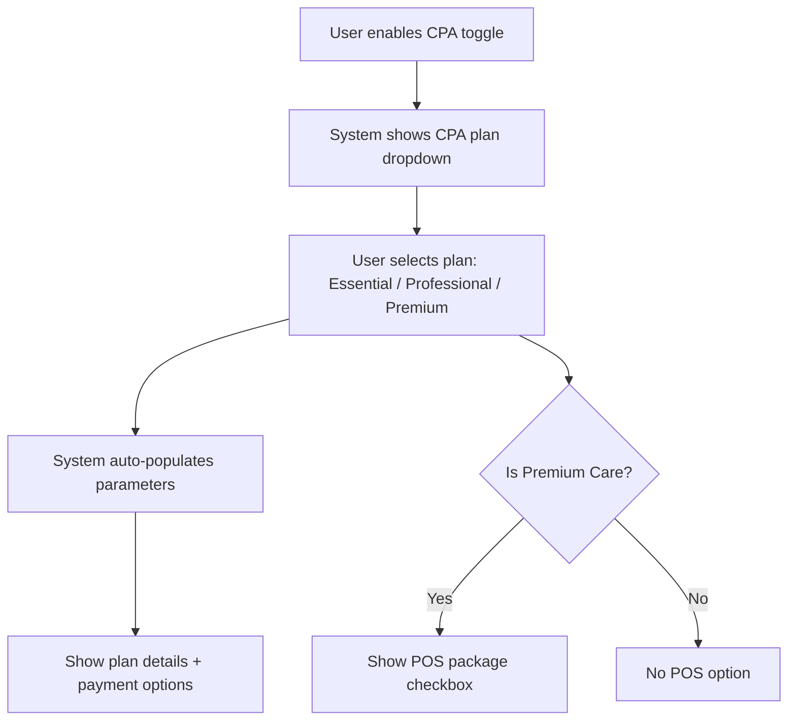
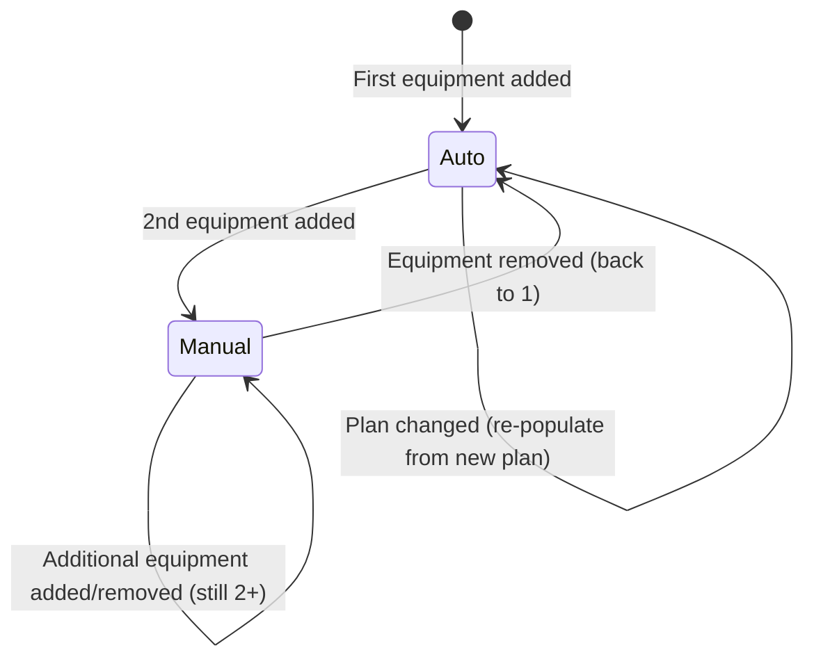
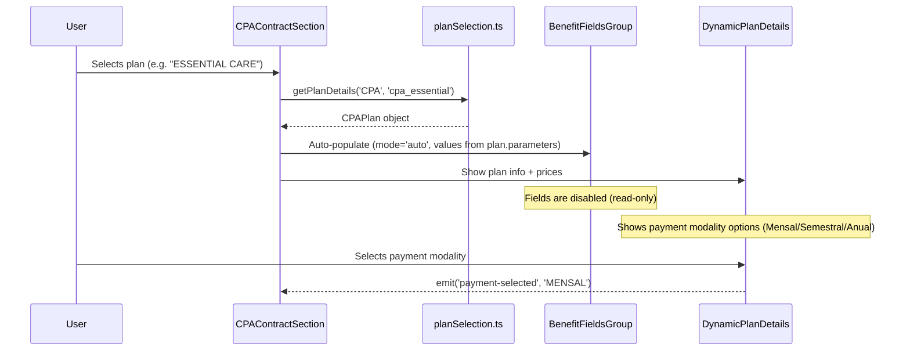
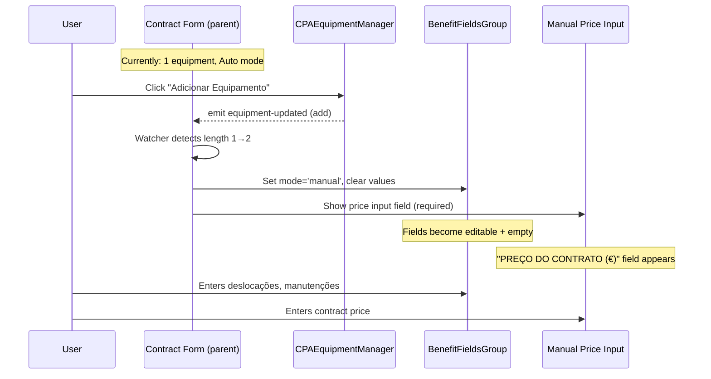
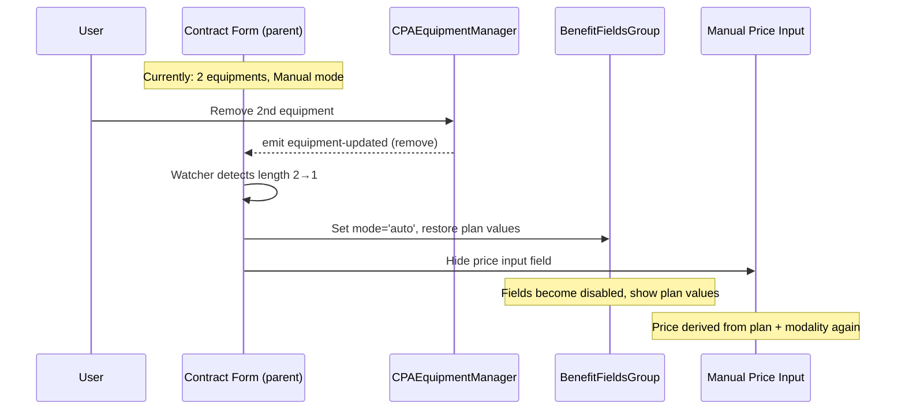
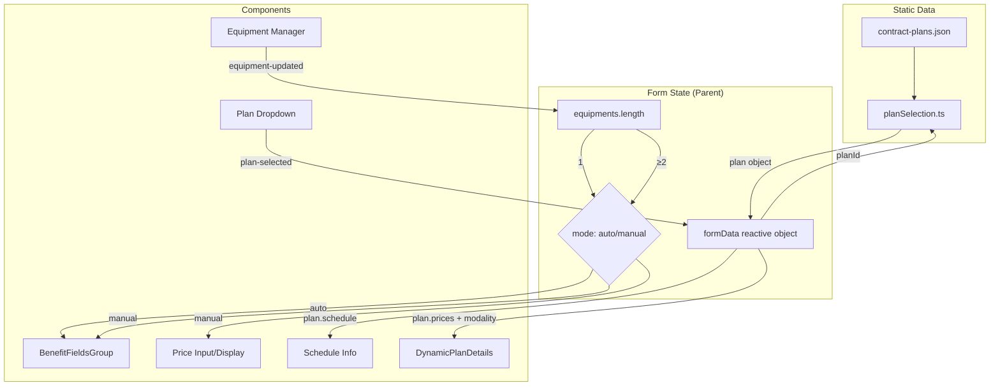

# Contract Plans Refactor — Design

## 1. Plan Data Model Refactor

### 1.1 New Plan Data Schema

The current `contract-plans.json` is replaced with a new structure sourced from the Excel files. The `ContractPlanConfig` type and related interfaces are updated accordingly.

**Decision: CPA pricing is flat (no distance zones)**
Options: [A] Distance-based as per original requirements / [B] Flat pricing per Excel
Chosen: [B]
Reason: Excel files are the source of truth; CPA sheet has no distance differentiation.

**Decision: Payment modalities reduced**
Options: [A] Keep all 4 modalities / [B] Match Excel (CPA: 3, S&H: 2)
Chosen: [B]
Reason: Excel is source of truth. CPA has Anual/Semestral/Mensal. S&H has Anual/Mensal only.

**Decision: POS package price updated**
Options: [A] Keep €100/year / [B] Update to €200/year per Excel
Chosen: [B]
Reason: Excel is source of truth.

#### `ContractPlan` interface (updated)

```typescript
/**
 * Base plan parameter fields — shared between CPA and S&H
 * These are the values that auto-populate the contract form for 1 equipment,
 * and that the user must manually specify for 2+ equipments.
 */
interface PlanBaseParameters {
  manutencoesPorAno: number;          // Maintenances per year
  deslocacoesPorAno: number;          // Displacements per year (-1 = unlimited)
}

/**
 * Work schedule info — READ-ONLY display, never overridable by user.
 * Derived from plan definition, shown as informational text.
 */
interface PlanScheduleInfo {
  deslocacao: string;    // e.g. "Segunda a Sexta-Feira, entre as 9:00 e as 19:00"
  remoteSupport: string; // e.g. "Segunda a Sexta-Feira entre as 9:00 e as 19:00"
}

/**
 * CPA-specific plan parameters
 */
interface CPAPlanParameters extends PlanBaseParameters {
  // No additional fields — CPA doesn't have "horas por ano"
}

/**
 * S&H-specific plan parameters
 */
interface SHPlanParameters extends PlanBaseParameters {
  horasPorAno: number;  // Hours per year
}

/**
 * CPA Plan definition — flat pricing (no distance zones)
 */
interface CPAPlan {
  id: string;
  name: string;                       // e.g. "ESSENTIAL CARE"
  description: string;                // Plan feature description
  parameters: CPAPlanParameters;
  schedule: PlanScheduleInfo;         // Read-only display info
  weekendSupport: boolean;
  posPackage?: {                      // Only for PREMIUM CARE
    description: string;
    pricePerYear: number;             // €200
  };
  prices: {
    mensal: number;
    semestral: number;
    anual: number;
  };
}

/**
 * S&H Plan definition — distance-based pricing
 */
interface SHPlan {
  id: string;
  name: string;                       // e.g. "SIMPLE"
  description: string;
  parameters: SHPlanParameters;
  schedule: PlanScheduleInfo;         // Read-only display info
  weekendSupport: boolean;
  prices: {
    under180km: {
      mensal: number;
      anual: number;
    };
    over180km: {
      mensal: number;
      anual: number;
    };
  };
}

/**
 * Top-level config — replaces ContractPlanConfig
 * Note: CPA_1500 key is REMOVED (unified into CPA)
 */
interface ContractPlanConfig {
  CPA: {
    name: string;
    description: string;
    plans: CPAPlan[];
  };
  'S&H': {
    name: string;
    description: string;
    plans: SHPlan[];
  };
}
```

#### Invariants & Validation Assertions

- `CPAPlan.prices.mensal > 0`, `CPAPlan.prices.semestral > 0`, `CPAPlan.prices.anual > 0`
- `SHPlan.prices.under180km.mensal > 0`, `SHPlan.prices.under180km.anual > 0`
- `SHPlan.prices.over180km.mensal > 0`, `SHPlan.prices.over180km.anual > 0`
- `SHPlan.prices.over180km.mensal >= SHPlan.prices.under180km.mensal` (distance premium non-negative)
- `parameters.manutencoesPorAno >= 0`
- `parameters.deslocacoesPorAno >= 1 || parameters.deslocacoesPorAno === -1` (at least 1, or unlimited)
- `parameters.horasPorAno > 0` (S&H only, always positive)
- `schedule.deslocacao` is non-empty string
- `schedule.remoteSupport` is non-empty string
- `CPAPlan.id` is unique within CPA plans
- `SHPlan.id` is unique within S&H plans
- Plan arrays are non-empty (at least 1 plan per contract type)

**Decision: "Intervalos de trabalho" is read-only**
Options: [A] Storable/overridable contract field / [B] Read-only display from plan
Chosen: [B]
Reason: User confirmed schedule info is never manually specified — it's always derived from the selected plan definition.

### 1.2 New `contract-plans.json` Data Values

#### CPA Plans (from `cpa_contracts.xlsx`)

| Plan | ID | Manutenções/ano | Deslocações/ano | Mensal | Semestral | Anual |
|------|----|----------------|----------------|--------|-----------|-------|
| ESSENTIAL CARE | `cpa_essential` | 1 | 1 | €40 | €225 | €425 |
| PROFESSIONAL CARE | `cpa_professional` | 1 | 2 | €60 | €345 | €675 |
| PREMIUM CARE | `cpa_premium` | 2 | 3 | €84 | €457 | €895 |

- PREMIUM CARE has POS package: +€200/year (10h assistência POS)

**CPA Schedule Info (read-only display per plan):**

| Plan | Deslocação | Assistência Remota |
|------|-----------|-------------------|
| ESSENTIAL CARE | Segunda a Sexta-Feira, entre as 9:00 e as 19:00 | Segunda a Sexta-Feira entre as 9:00 e as 19:00 |
| PROFESSIONAL CARE | Segunda a Sábado, entre as 9:00 e as 20:00 | Segunda a Sábado entre as 9:00 e as 22:00 |
| PREMIUM CARE | Sempre (Semana e Fim de Semana, qualquer hora) | Segunda a Sexta-Feira entre as 8:00 e as 23:00, Fim de Semana entre as 8:00 e as 18:00 |

#### S&H Plans (from `software_hardware_contracts.xlsx`)

| Plan | ID | Horas/ano | Deslocações/ano | ≤180km Mensal | ≤180km Anual | >180km Mensal | >180km Anual |
|------|----|----------|----------------|---------------|-------------|---------------|-------------|
| SIMPLE | `sh_simple` | 10 | 2 | €35 | €390 | €40 | €450 |
| BRASS | `sh_brass` | 10 | 2 | €40 | €445 | €45 | €505 |
| SILVER | `sh_silver` | 10 | 2 | €50 | €555 | €55 | €615 |
| GOLD | `sh_gold` | 15 | 3 | €55 | €610 | €60 | €670 |
| DIAMOND | `sh_diamond` | 15 | 3 | €60 | €665 | €65 | €715 |
| PLATINUM | `sh_platinum` | 15 | 3 | €70 | €775 | €75 | €815 |

**S&H Schedule Info (read-only display per plan):**

| Plan | Deslocação | Assistência Remota |
|------|-----------|-------------------|
| SIMPLE | Seg. a Sexta-Feira entre as 9:00 e as 19:00 | Seg. a Sexta-Feira entre as 9:00 e as 23:00 |
| BRASS | Seg. a Sexta-Feira entre as 9:00 e as 19:00 e aos Sábados entre as 10:00 e as 18:00 | Seg. a Sábado entre as 9:00 e as 23:00 |
| SILVER | Seg. a Sexta-Feira entre as 9:00 e as 19:00 e aos Fins de Semana entre as 10:00 e as 18:00 | Seg. a Domingo entre as 9:00 e as 23:00 |
| GOLD | Seg. a Sexta-Feira entre as 9:00 e as 19:00 | Seg. a Sexta-Feira entre as 9:00 e as 23:00 |
| DIAMOND | Seg. a Sexta-Feira entre as 9:00 e as 19:00 e aos Sábados entre as 10:00 e as 18:00 | Seg. a Sábado entre as 9:00 e as 23:00 |
| PLATINUM | Seg. a Sexta-Feira entre as 9:00 e as 19:00 e aos Fins de Semana entre as 10:00 e as 18:00 | Seg. a Domingo entre as 9:00 e as 23:00 |

Note: S&H plans have `manutencoesPorAno: 0` — maintenance count is not a service parameter for S&H (hours-based model). The `manutencoesPorAno` field in the base parameters is set to 0 for all S&H plans.

### 1.3 Files to Delete

| File | Reason |
|------|--------|
| `packages/frontend/src/composables/usePlanData.ts` | Stale duplicate with hardcoded data that contradicts the canonical JSON source. All consumers must use `planSelection.ts` service instead. |

### 1.4 Files to Modify

| File | Change |
|------|--------|
| `packages/frontend/src/config/contract-plans.json` | Complete replacement with new data structure |
| `packages/shared/src/types/contracts/types.ts` | Update `ContractPlan`, `ContractPlanConfig`, remove `CPA_1500` key, add new parameter types |
| `packages/frontend/src/services/planSelection.ts` | Remove `CPA_1500` from `ContractType`, update `requiresDistance()` (CPA no longer requires distance), update price access logic |
| `packages/frontend/src/composables/usePlanSelection.ts` | Simplify — no longer needs CPA_1500 handling |

## 2. CPA Type Unification

### 2.1 Contract Data Type Changes

The `cpaContractType` field is removed from `ContractData`. CPA is now a single unified type — no subtype selector.

```typescript
// BEFORE (current)
interface ContractData {
  cpaContractType: 'CPA' | 'CPA_1500' | '';
  distanceCPA: 'under180km' | 'over180km' | '';
  // ...
}

// AFTER (new)
interface ContractData {
  // cpaContractType: REMOVED — no subtypes
  // distanceCPA: REMOVED — CPA has flat pricing, no distance needed
  // ...all other CPA fields remain
}
```

**Fields removed from `ContractData`:**
- `cpaContractType` — no longer needed (unified CPA, no subtypes)
- `distanceCPA` — CPA has flat pricing, distance zones only apply to S&H

**Existing contract data compatibility:** Contracts stored in R2 that have `cpaContractType: 'CPA_1500'` or `cpaContractType: 'CPA'` will be treated as unified CPA. The fields are simply ignored at read time. No data migration needed.

### 2.2 Plan Service Changes

```typescript
// BEFORE
export type ContractType = 'CPA' | 'CPA_1500' | 'S&H';

// AFTER
export type ContractType = 'CPA' | 'S&H';
```

`planSelection.ts` changes:
- Remove `CPA_1500` from `ContractType`
- `requiresDistance('CPA')` now returns `false` (only S&H requires distance)
- `shouldShowPriceTable()` simplified — CPA always shows prices when plan selected (no distance check)
- `getAvailablePlans('CPA')` returns the unified plan list directly

### 2.3 CPAContractSection Component Changes

**Remove:**
- "TIPO DE CONTRATO CPA" dropdown (the CPA/CPA_1500 selector)
- "DISTÂNCIA" dropdown (CPA no longer uses distance zones)
- `handleContractTypeChange()` function
- Conditional logic for `showPOSPackageOption` tied to CPA_1500

**Keep:**
- Plan select dropdown (now shows unified CPA plans directly)
- POS package checkbox (now shown for `cpa_premium` plan only — regardless of former subtype)

**Updated layout:** From 3-column grid (type + plan + distance) to single plan selector.



### 2.4 Files to Modify

| File | Change |
|------|--------|
| `packages/shared/src/types/contracts/types.ts` | Remove `cpaContractType`, `distanceCPA` from `ContractData`. Remove `CPA_1500` from `ContractPlanConfig`. |
| `packages/frontend/src/services/planSelection.ts` | Remove `CPA_1500` from `ContractType`. `requiresDistance('CPA')` → `false`. Simplify price access. |
| `packages/frontend/src/components/contracts/CPAContractSection.vue` | Remove subtype selector, remove distance dropdown, simplify to plan-only selection. |
| `packages/frontend/src/components/contracts/DynamicPlanDetails.vue` | Simplify `requiresDistanceForPricing` — CPA never requires distance. Update `paymentOptions` computed to handle flat pricing (no nested distance object). |
| `packages/frontend/src/composables/usePlanSelection.ts` | Remove CPA_1500 handling. |
| `packages/shared/src/types/contracts/validation.ts` | Remove `cpaContractType` required check, remove distance validation for CPA. |

## 3. Equipment Count Reactive Logic

### 3.1 Mode Definition

Each contract section (CPA or S&H) operates in one of two mutually exclusive modes based on equipment count:

| Mode | Condition | Behavior |
|------|-----------|----------|
| **Auto mode** | Exactly 1 equipment | Plan's base price and parameters auto-populate. Fields are read-only. |
| **Manual mode** | 2 or more equipments | All price/parameter fields cleared and require manual user input. |

This logic applies **identically** to both CPA and S&H sections (PLANS-BR-012).

### 3.2 Mode Transitions



#### Auto → Manual transition (adding 2nd equipment)

1. System detects `equipments.length >= 2`
2. Clear all auto-populated values: price fields become empty, parameter fields become empty
3. Mark price and parameter fields as **required** + **editable**
4. Show visual indication: "Preço e parâmetros devem ser especificados manualmente"

#### Manual → Auto transition (removing back to 1 equipment)

1. System detects `equipments.length === 1`
2. Restore plan's base price and parameters from plan definition
3. Mark parameter fields as **read-only** (auto-populated)
4. Remove manual-entry visual indicators

#### Plan change in Auto mode

1. User selects different plan
2. System overwrites current values with new plan's base parameters
3. Fields remain read-only

#### Plan change in Manual mode

1. User selects different plan
2. Manual values are **NOT** cleared — user retains their custom entries
3. Schedule info (read-only) updates to reflect new plan

### 3.3 Pricing Model Change — Remove Discount-per-Equipment

**Current behavior (to be removed):**
- Each CPA equipment has a `desconto` field (0-100%)
- First equipment: 0% discount
- Additional equipments: default 10% discount
- Total price = base + Σ(base × (1 - discount%)) for additional equipments
- `DynamicPlanDetails` calculates composite pricing per equipment

**New behavior:**
- Equipments no longer have a `desconto` field
- 1 equipment → base price from plan (auto mode)
- 2+ equipments → user manually specifies the total contract price (manual mode)
- No automatic price calculation for multi-equipment scenarios

**`ContractEquipment` type change:**

```typescript
// BEFORE
interface ContractEquipment {
  id: string;
  modelo: string;
  numeroSerie: string;
  desconto: number;    // REMOVED
  observacoes: string;
}

// AFTER
interface ContractEquipment {
  id: string;
  modelo: string;
  numeroSerie: string;
  observacoes: string;
}
```

### 3.4 Contract Price Field

A new field is needed to store the contract price (for manual mode). In auto mode, the price is derived from the plan + payment modality.

```typescript
// New fields added to ContractData
interface ContractData {
  // CPA section
  precoCPA?: number;  // Manual price (set when 2+ equipments). Undefined in auto mode.
  
  // S&H section  
  precoSH?: number;   // Manual price (set when 2+ equipments). Undefined in auto mode.
}
```

**Price display logic:**
- Auto mode (1 equip): price shown from plan's `prices` object based on selected payment modality
- Manual mode (2+ equip): price shown from `precoCPA` / `precoSH` field (user-entered)

### 3.5 Parameters Stored in Contract Data

The overridable parameters need to be stored on the contract. Current fields already exist for some:

```typescript
interface ContractData {
  // CPA parameters (existing fields, behavior changes)
  horasAssistenciaAnualCPA: number;   // RENAMED from "horas" — for CPA this is now unused (CPA has no hours param)
  deslocacoesPorAnoCPA: number;       // Existing — auto or manual
  manutencoesPorAnoCPA: number;       // Existing — auto or manual

  // S&H parameters (existing fields, behavior changes)
  horasAssistenciaAnualSH: number;    // Existing — auto or manual (S&H has hours)
  deslocacoesPorAnoSH: number;        // Existing — auto or manual
  manutencoesPorAnoSH: number;        // Existing — kept at 0 for S&H (not applicable)
}
```

**Note:** `horasAssistenciaAnualCPA` exists but CPA plans don't have an "hours" parameter. This field will be set to 0 for CPA. The `BenefitFieldsGroup` component will conditionally show/hide the "Horas" field based on contract type (visible only for S&H).

### 3.6 Reactive Watcher Logic (Composable)

The mode transition logic is implemented as a reactive watcher on equipment array length:

```typescript
// Pseudocode for the reactive behavior
watch(equipmentCount, (newCount, oldCount) => {
  if (oldCount === 1 && newCount >= 2) {
    // Auto → Manual: clear auto-populated values
    clearParameterFields();
    clearPriceField();
    setFieldsEditable(true);
  } else if (oldCount >= 2 && newCount === 1) {
    // Manual → Auto: restore plan defaults
    restoreFromPlan(selectedPlan);
    setFieldsEditable(false);
  }
});
```

This logic lives in the parent form component (or a dedicated composable) that manages the contract section state — not inside individual child components.

### 3.7 Files to Modify

| File | Change |
|------|--------|
| `packages/shared/src/types/contracts/types.ts` | Remove `desconto` from `ContractEquipment`. Add `precoCPA?`, `precoSH?` fields. Remove `horasAssistenciaAnualCPA` (or keep at 0 — see note above). |
| `packages/frontend/src/components/contracts/CPAEquipmentManager.vue` | Remove discount logic, remove default discount assignment, remove discount info callout |
| `packages/frontend/src/components/contracts/EquipmentCard.vue` | Remove `showDiscount` prop, remove discount input field |
| `packages/frontend/src/components/contracts/DynamicPlanDetails.vue` | Remove multi-equipment pricing calculation (`calculateEquipmentCosts`). Simplify to show plan base price only in auto mode. |
| `packages/frontend/src/components/contracts/CPAContractSection.vue` | Add mode-aware parameter population, price field for manual mode |
| `packages/frontend/src/components/contracts/SHContractSection.vue` | Same — add mode-aware parameter population, price field for manual mode |
| Parent form component (Create/Update views) | Add reactive watcher on equipment count, implement mode transitions |

## 4. Plan Parameters & BenefitFieldsGroup Refactor

### 4.1 Field Inventory by Contract Type

Based on the data model (Section 1) and mode logic (Section 3):

| Field | CPA | S&H | Auto mode (1 equip) | Manual mode (2+ equip) |
|-------|-----|-----|---------------------|----------------------|
| Manutenções/Deslocações por ano | ✅ `deslocacoesPorAnoCPA` | ✅ `deslocacoesPorAnoSH` | Read-only, auto-populated | Editable, required |
| Manutenções por ano | ✅ `manutencoesPorAnoCPA` | ❌ (always 0, hidden) | Read-only, auto-populated | Editable, required |
| Horas por ano | ❌ (hidden) | ✅ `horasAssistenciaAnualSH` | Read-only, auto-populated | Editable, required |
| Preço | Derived from plan | Derived from plan + distance | Shown from plan prices | `precoCPA` / `precoSH` — editable, required |
| Intervalos de trabalho | ✅ (display-only) | ✅ (display-only) | Read-only from plan | Read-only from plan (never manual) |

### 4.2 BenefitFieldsGroup Component Refactor

The current `BenefitFieldsGroup` always shows 3 fields (horas, deslocações, manutenções) for both CPA and S&H. This needs to be conditional.

**New props:**

```typescript
interface BenefitFieldsGroupProps {
  // Field values
  horasAssistencia?: number;      // Only shown for S&H
  deslocacoesPorAno: number;
  manutencoesPorAno?: number;     // Only shown for CPA
  
  // Mode control
  mode: 'auto' | 'manual';       // Controls read-only vs editable
  contractType: 'CPA' | 'S&H';   // Controls which fields are visible
  
  // Validation  
  showErrors?: boolean;           // Show validation errors (for manual mode on save attempt)
}
```

**Field visibility rules:**
- `contractType === 'CPA'`: Show `manutencoesPorAno` + `deslocacoesPorAno`. Hide `horasAssistencia`.
- `contractType === 'S&H'`: Show `horasAssistencia` + `deslocacoesPorAno`. Hide `manutencoesPorAno`.

**Mode behavior:**
- `mode === 'auto'`: Fields are `disabled`, display auto-populated plan values. Visual style: gray background, "Valores do plano" indicator.
- `mode === 'manual'`: Fields are editable, empty by default, required. Visual style: white background, red border if empty on validation.

### 4.3 UX Visual Feedback

**Auto mode indicators:**
- Fields have `bg-gray-100` background (disabled style)
- Small info text below the group: "Valores preenchidos automaticamente pelo plano selecionado"
- Plan schedule info displayed as read-only text block

**Manual mode indicators:**
- Fields have standard white background (editable)
- Info banner above the group: "Com múltiplos equipamentos, os valores devem ser especificados manualmente"
- Required field markers (red asterisk)

**Transition animation:**
- Use CSS transition on background-color and border-color (200ms ease)
- Fields smoothly transition from gray (auto) to white (manual) and vice versa

### 4.4 Price Field Component

A new price input field is needed for manual mode. This is a separate concern from `BenefitFieldsGroup`.

**In auto mode:** The `DynamicPlanDetails` component shows payment options (mensal/semestral/anual) with plan prices. User selects a modality.

**In manual mode:** A simple number input replaces the payment option cards:
- Label: "PREÇO DO CONTRATO (€)"
- Input type: number, min 0, step 0.01
- Required when in manual mode
- The payment modality selector is still shown (user picks how often they pay)
- But the price is manually entered rather than derived from plan

### 4.5 Schedule Info Display

A read-only section that shows the plan's work schedule, always visible regardless of mode:

```
┌─────────────────────────────────────────┐
│ INTERVALOS DE TRABALHO                  │
│                                         │
│ Deslocação: Seg. a Sexta entre as 9-19h │
│ Assistência Remota: Seg. a Sexta 9-23h  │
└─────────────────────────────────────────┘
```

This section updates when the plan selection changes. It's purely informational — never editable.

### 4.6 Files to Modify

| File | Change |
|------|--------|
| `packages/frontend/src/components/contracts/BenefitFieldsGroup.vue` | Add `mode` + `contractType` props, conditional field rendering, auto/manual visual states |
| `packages/frontend/src/components/contracts/DynamicPlanDetails.vue` | Simplify — remove equipment pricing. Show base prices in auto mode. In manual mode, show only schedule info + payment modality selector. |
| `packages/frontend/src/components/contracts/CPAContractSection.vue` | Pass mode to BenefitFieldsGroup, add price input for manual mode, add schedule info display |
| `packages/frontend/src/components/contracts/SHContractSection.vue` | Same changes as CPA section |

## 5. Validation Updates

### 5.1 Validation Rules Summary

The validation logic in `packages/shared/src/types/contracts/validation.ts` needs significant changes to reflect the new pricing model.

**Rules removed:**
- `cpaContractType` required check (field removed)
- `distanceCPA` required check (field removed)
- Equipment `desconto` validation (0-100 range, first equip 0%)
- "First equipment should have 0% discount" rule

**Rules added (multi-equipment price/parameter validation):**
- When `cpaEquipments.length >= 2`: `precoCPA` is required and must be > 0
- When `shEquipments.length >= 2`: `precoSH` is required and must be > 0
- When `cpaEquipments.length >= 2`: `deslocacoesPorAnoCPA` required, `manutencoesPorAnoCPA` required
- When `shEquipments.length >= 2`: `deslocacoesPorAnoSH` required, `horasAssistenciaAnualSH` required

**Rules preserved:**
- At least one contract type active
- Plan selection required for each active section
- Distance required for S&H (`distanceSH`)
- Payment modality required for each active section
- At least one equipment per active section
- Equipment `modelo` required
- Date validation (end > start)
- Payment method required

### 5.2 Updated `validateContractEquipment()`

```typescript
function validateContractEquipment(equipment: ContractEquipment): string[] {
  const errors: string[] = [];
  
  if (!equipment.id) {
    errors.push('ID do equipamento é obrigatório');
  }
  
  if (equipment.modelo && typeof equipment.modelo !== 'string') {
    errors.push('Modelo deve ser um texto');
  }
  
  if (equipment.numeroSerie && typeof equipment.numeroSerie !== 'string') {
    errors.push('Número de série deve ser um texto');
  }
  
  // desconto validation REMOVED — field no longer exists
  
  if (equipment.observacoes && typeof equipment.observacoes !== 'string') {
    errors.push('Observações devem ser um texto');
  }
  
  return errors;
}
```

### 5.3 Updated `validateContractCreation()` — CPA section

```typescript
// CPA Contract validation (key changes)
if (data.hasCPAContract) {
  // REMOVED: cpaContractType check (field removed)
  
  if (!data.planIdCPA) {
    errors.push('Por favor, selecione um plano CPA');
  }
  
  // REMOVED: distanceCPA check (CPA has flat pricing)
  
  if (!data.modalidadePagamentoCPA) {
    errors.push('Por favor, selecione a modalidade de pagamento CPA');
  }
  
  // Equipment validation
  if (!data.cpaEquipments || data.cpaEquipments.length === 0) {
    errors.push('Por favor, adicione pelo menos um equipamento CPA');
  } else {
    // Model required for each equipment
    data.cpaEquipments.forEach((equipment, index) => {
      const equipmentErrors = validateContractEquipment(equipment);
      equipmentErrors.forEach(error => errors.push(`Equipamento ${index + 1}: ${error}`));
      
      if (!equipment.modelo?.trim()) {
        errors.push(`Por favor, introduza o modelo do equipamento CPA ${index + 1}`);
      }
      // REMOVED: first equipment 0% discount check
    });
    
    // NEW: Multi-equipment price and parameter validation
    if (data.cpaEquipments.length >= 2) {
      if (!data.precoCPA || data.precoCPA <= 0) {
        errors.push('Por favor, introduza o preço do contrato CPA');
      }
      if (typeof data.deslocacoesPorAnoCPA !== 'number' || 
          (data.deslocacoesPorAnoCPA !== -1 && data.deslocacoesPorAnoCPA <= 0)) {
        errors.push('Por favor, especifique as deslocações por ano CPA');
      }
      if (typeof data.manutencoesPorAnoCPA !== 'number' || data.manutencoesPorAnoCPA < 0) {
        errors.push('Por favor, especifique as manutenções por ano CPA');
      }
    }
  }
}
```

### 5.4 Updated `validateContractCreation()` — S&H section

```typescript
// S&H Contract validation (key changes)
if (data.hasSHContract) {
  if (!data.planIdSH) {
    errors.push('Por favor, selecione um plano S&H');
  }
  
  if (!data.distanceSH) {
    errors.push('Por favor, selecione a distância para o contrato S&H');
  }
  
  if (!data.modalidadePagamentoSH) {
    errors.push('Por favor, selecione a modalidade de pagamento S&H');
  }
  
  // Equipment validation
  if (!data.shEquipments || data.shEquipments.length === 0) {
    errors.push('Por favor, adicione pelo menos um equipamento S&H');
  } else {
    data.shEquipments.forEach((equipment, index) => {
      if (!equipment.modelo?.trim()) {
        errors.push(`Por favor, introduza o modelo do equipamento S&H ${index + 1}`);
      }
    });
    
    // NEW: Multi-equipment price and parameter validation
    if (data.shEquipments.length >= 2) {
      if (!data.precoSH || data.precoSH <= 0) {
        errors.push('Por favor, introduza o preço do contrato S&H');
      }
      if (typeof data.deslocacoesPorAnoSH !== 'number' || 
          (data.deslocacoesPorAnoSH !== -1 && data.deslocacoesPorAnoSH <= 0)) {
        errors.push('Por favor, especifique as deslocações por ano S&H');
      }
      if (typeof data.horasAssistenciaAnualSH !== 'number' || data.horasAssistenciaAnualSH <= 0) {
        errors.push('Por favor, especifique as horas de assistência anual S&H');
      }
    }
  }
}
```

### 5.5 Single-Equipment Validation (Auto Mode)

When only 1 equipment exists, the plan must be selected (parameters come from plan):

```typescript
// For both CPA and S&H:
// If 1 equipment and no plan → error
if (data.cpaEquipments?.length === 1 && !data.planIdCPA) {
  errors.push('Por favor, selecione um plano CPA para preencher os parâmetros');
}
```

This matches PLANS-AC-018: "IF the user attempts to save with 1 equipment and no plan selected, THEN the system SHALL display a validation error requiring plan selection."

### 5.6 Error Messages (Portuguese)

| Condition | Message |
|-----------|---------|
| Multi-equip, missing price | "Por favor, introduza o preço do contrato {CPA/S&H}" |
| Multi-equip, missing deslocações | "Por favor, especifique as deslocações por ano {CPA/S&H}" |
| Multi-equip, missing manutenções (CPA) | "Por favor, especifique as manutenções por ano CPA" |
| Multi-equip, missing horas (S&H) | "Por favor, especifique as horas de assistência anual S&H" |
| 1 equip, no plan | "Por favor, selecione um plano {CPA/S&H} para preencher os parâmetros" |

### 5.7 Files to Modify

| File | Change |
|------|--------|
| `packages/shared/src/types/contracts/validation.ts` | Remove discount validation, remove cpaContractType/distanceCPA checks, add multi-equipment price/parameter validation |

## 6. Component Flow & Interactions

### 6.1 Plan Selection Flow (Single Equipment — Auto Mode)



### 6.2 Equipment Count Change Flow (Auto → Manual)



### 6.3 Equipment Count Change Flow (Manual → Auto)



### 6.4 CPA Section Component Hierarchy (After Refactor)

```
CPAContractSection
├── Plan Select (dropdown: Essential / Professional / Premium)
├── CPAEquipmentManager
│   └── EquipmentCard × N (no discount field)
├── ContractDatesSection
├── ScheduleInfoDisplay (read-only, from plan.schedule)
├── BenefitFieldsGroup (mode-aware: auto/manual, CPA fields only)
├── ManualPriceInput (visible only in manual mode)
└── DynamicPlanDetails (simplified: plan info + payment modality)
```

### 6.5 S&H Section Component Hierarchy (After Refactor)

```
SHContractSection
├── Plan Select (dropdown: Simple → Platinum)
├── Distance Select (under180km / over180km)
├── SHEquipmentCard × N
├── ContractDatesSection
├── ScheduleInfoDisplay (read-only, from plan.schedule)
├── BenefitFieldsGroup (mode-aware: auto/manual, S&H fields only)
├── ManualPriceInput (visible only in manual mode)
└── DynamicPlanDetails (simplified: plan info + payment modality)
```

### 6.6 Data Flow Diagram



### 6.7 Error Handling

| Scenario | Behavior |
|----------|----------|
| Plan not found in JSON | Show error state in DynamicPlanDetails ("Plano não encontrado") |
| Save attempt with missing manual fields | Inline validation errors per field + scroll to first error |
| Equipment removal leaves 0 equipments | "Pelo menos um equipamento é obrigatório" error on save |
| Plan JSON fails to load | BenefitFieldsGroup disabled, plan select shows error option |

### 6.8 Performance Considerations

- Plan data loaded once from JSON (static import, < 5KB) — no network call
- Mode transitions use `nextTick()` to avoid double-render
- Plan details cached with `markRaw()` to prevent deep reactivity overhead
- Equipment array uses `key={equipment.id}` for efficient list diffing
- All form reactivity remains under 200ms (PLANS-NFR-001)
