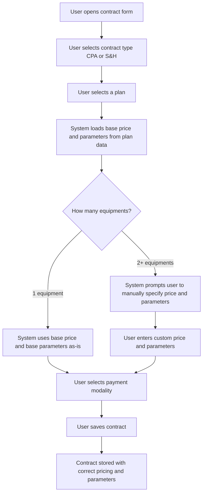
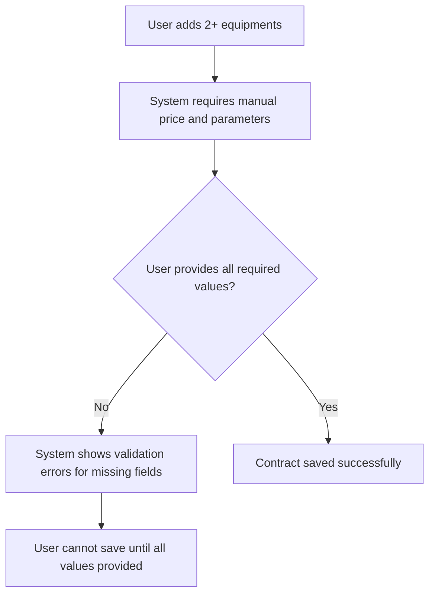

# Contract Plans Refactor - Requirements

## Epic
[ ] **PLANS-E-001**: **As a** staff member managing contracts **I want** the contract plans to reflect the new pricing structure and parameters from updated data sources **So that** contracts are created with accurate plan definitions and the correct pricing logic for single vs. multiple equipment scenarios

## User Flow

### Passing Cases Flow
[ ] Passing flow diagram

### Non-Passing Cases Flow
[ ] Non-passing flow diagram

## Technical Requirements

### Resolved decisions
[ ] **PLANS-DEC-001**: CPA_1500 and CPA (2023) subtypes are both removed — there is now only one "CPA" type, no subtypes at all
[ ] **PLANS-DEC-002**: Plan tiers remain the same names (Essential, Professional, Premium for CPA; Simple through Platinum for S&H) — only data values are updated
[ ] **PLANS-DEC-003**: "Intervalos de trabalho" is a single-choice field with options: "semana" or "qualquer hora/dia"

### Business Rules
[ ] **PLANS-BR-001**: When a contract section (CPA or S&H) has exactly 1 equipment, the plan's base price and base parameters are used without modification
[ ] **PLANS-BR-002**: When a contract section (CPA or S&H) has 2 or more equipments, the base price and all base parameters must be manually specified by the user — the system does not auto-calculate
[ ] **PLANS-BR-003**: The previous discount-per-equipment pricing model is removed entirely from CPA equipment
[ ] **PLANS-BR-012**: The multi-equipment pricing logic applies identically to both CPA and S&H contract sections [Kiro addition]
[ ] **PLANS-BR-004**: Plan data definitions must be sourced from `software_hardware_contracts.xlsx` (S&H) and `cpa_contracts.xlsx` (CPA)
[ ] **PLANS-BR-005**: Parameters applicable to both CPA and S&H plans: Manutenções/Deslocações por ano, Intervenções adicionais, Intervalos de trabalho (single choice: "semana" or "qualquer hora/dia")
[ ] **PLANS-BR-006**: Parameter applicable only to S&H plans: Horas por ano
[ ] **PLANS-BR-007**: When the user switches from 1 equipment to 2+ equipments, the system clears auto-populated values and requires manual entry
[ ] **PLANS-BR-008**: When the user removes equipments back to exactly 1, the system restores the plan's base values automatically
[ ] **PLANS-BR-009**: The "CPA contract type" selector (CPA 2023 vs CPA_1500) is removed from the form — selecting CPA activates a single plan list directly
[ ] **PLANS-BR-010**: The unified CPA type retains distance-based pricing (under180km / over180km) — same as S&H
[ ] **PLANS-BR-011**: Existing plan tier names are preserved (Essential, Professional, Premium for CPA; Simple through Platinum for S&H) with updated values from the Excel sources

### Performance
[ ] **PLANS-NFR-001**: Plan data loading and form reactivity must remain under 200ms for user interactions

### Dependencies & Integration Requirements
**Internal**: Contract creation form, plan selection feature, data type definitions, input validation
**External**: Excel data files (software_hardware_contracts.xlsx, cpa_contracts.xlsx) as source of truth for plan definitions

## UI/UX Requirements
[ ] **PLANS-UX-001**: When multiple equipments are present, price and parameter fields must be clearly editable with visual indication that manual input is required
[ ] **PLANS-UX-002**: When a single equipment is present, parameter fields display base values and may be read-only or clearly marked as auto-populated
[ ] **PLANS-UX-003**: The transition between auto-populated (1 equipment) and manual-entry (2+ equipments) modes must be smooth with clear user feedback

## User Stories

### Story: Single Equipment Contract Creation
[ ] **PLANS-S-001**: **As a** staff member **I want** the system to use the plan's base price and parameters when I have one equipment **So that** I don't need to manually enter values that are already defined in the plan

#### Acceptance Criteria
[ ] **PLANS-AC-001**: **WHEN** a plan is selected and exactly 1 equipment exists, the system **SHALL** auto-populate the price and all parameters with the plan's base values
[ ] **PLANS-AC-002**: **WHILE** only 1 equipment is assigned, the system **SHALL** display the base price from the plan data source without user modification
[ ] **PLANS-AC-003**: **WHEN** a plan is selected with 1 equipment, the system **SHALL** populate Manutenções/Deslocações por ano from the plan definition
[ ] **PLANS-AC-004**: **WHEN** a plan is selected with 1 equipment, the system **SHALL** populate Intervenções adicionais from the plan definition
[ ] **PLANS-AC-005**: **WHEN** a plan is selected with 1 equipment, the system **SHALL** populate Intervalos de trabalho from the plan definition
[ ] **PLANS-AC-006**: **WHERE** the contract is S&H type with 1 equipment, the system **SHALL** additionally populate Horas por ano from the plan definition

### Story: Multiple Equipment Contract Creation
[ ] **PLANS-S-002**: **As a** staff member **I want** to manually specify the price and parameters when I add multiple equipments **So that** I can negotiate custom terms for multi-equipment contracts

#### Acceptance Criteria
**Common Behavior** (see Story 1):
[ ] Applies: PLANS-AC-001 (inverted — base values NOT auto-applied)

**Multi-Equipment Behavior**:
[ ] **PLANS-AC-007**: **WHEN** the user adds a 2nd equipment, the system **SHALL** clear auto-populated base values and require manual entry for price and all parameters
[ ] **PLANS-AC-008**: **WHILE** 2 or more equipments exist, the system **SHALL** require the user to manually specify the contract price
[ ] **PLANS-AC-009**: **WHILE** 2 or more equipments exist, the system **SHALL** require the user to manually specify Manutenções/Deslocações por ano, Intervenções adicionais, and Intervalos de trabalho
[ ] **PLANS-AC-010**: **WHERE** the contract is S&H type with 2+ equipments, the system **SHALL** additionally require manual entry for Horas por ano
[ ] **PLANS-AC-011**: **WHEN** the user removes equipments back to exactly 1, the system **SHALL** restore the plan's base price and parameters automatically

### Story: Plan Data Update from Excel Sources
[ ] **PLANS-S-003**: **As a** staff member **I want** the available plans to reflect the latest data from the Excel source files **So that** new contracts always use up-to-date plan definitions

#### Acceptance Criteria
[ ] **PLANS-AC-012**: The system **SHALL** define CPA plans based on data from `cpa_contracts.xlsx`
[ ] **PLANS-AC-013**: The system **SHALL** define S&H plans based on data from `software_hardware_contracts.xlsx`
[ ] **PLANS-AC-014**: The system **SHALL** remove the previous discount-per-equipment field from the equipment form
[ ] **PLANS-AC-015**: The system **SHALL** no longer calculate pricing using a discount percentage per equipment

### Story: CPA Type Unification
[ ] **PLANS-S-004**: **As a** staff member **I want** CPA contracts to have a single unified type without subtypes **So that** the form is simpler and I don't need to choose between CPA 2023 and CPA 1500

#### Acceptance Criteria
[ ] **PLANS-AC-019**: The system **SHALL** present CPA as a single contract type without the subtype selector (CPA 2023 / CPA_1500)
[ ] **PLANS-AC-020**: **WHEN** the user enables CPA, the system **SHALL** show one unified plan list directly (Essential, Professional, Premium)
[ ] **PLANS-AC-021**: The system **SHALL** require distance selection (under180km / over180km) for the unified CPA type
[ ] **PLANS-AC-022**: The system **SHALL** retain the POS package option for CPA Premium Care plan only (+100€/year)

### Story: Validation for Multi-Equipment Contracts
[ ] **PLANS-S-005**: **As a** staff member **I want** the system to prevent saving a contract with missing manual values **So that** I don't create incomplete contracts when multiple equipments are present

#### Acceptance Criteria
[ ] **PLANS-AC-016**: **IF** the user attempts to save a contract with 2+ equipments and missing price, **THEN** the system **SHALL** display a validation error indicating the price is required
[ ] **PLANS-AC-017**: **IF** the user attempts to save a contract with 2+ equipments and missing parameters, **THEN** the system **SHALL** display validation errors for each missing parameter
[ ] **PLANS-AC-018**: **IF** the user attempts to save with 1 equipment and no plan selected, **THEN** the system **SHALL** display a validation error requiring plan selection

## Related Documentation
- Current plan data: `packages/frontend/src/config/contract-plans.json`
- Plan selection service: `packages/frontend/src/services/planSelection.ts`
- Contract types: `packages/shared/src/types/contracts/types.ts`
- Contract validation: `packages/shared/src/types/contracts/validation.ts`

### Excluded scope
- Migration of existing contracts to the new pricing model (separate spec)
- Changes to payment modality options (mensal, trimestral, semestral, anual)
- Changes to the distance-based pricing zones (under180km / over180km)
- Changes to POS package pricing (remains +100€/year for CPA Premium Care)
- Changes to contract dates, client relation, or payment method fields
- Server-side data interface changes (data structure remains compatible)
