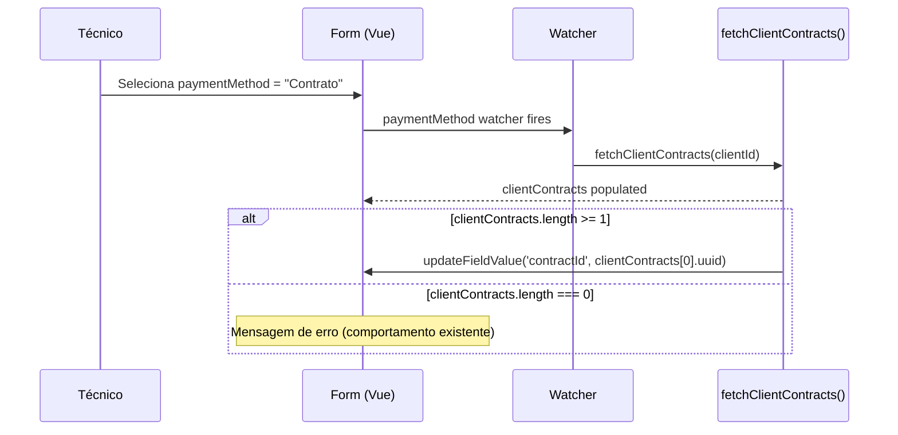

# Pré-Seleção de Contrato no Pagamento - Design

## Context & Scope

Os formulários de criação de Folhas de Obra (`WorkSheetsCreateView.vue`) e Assistências Remotas (`RemoteAssistanceCreateView.vue`) já possuem o mecanismo de fetch de contratos por cliente e auto-seleção quando existe apenas 1 contrato. A lacuna atual é que quando existem múltiplos contratos, o dropdown mostra um placeholder ("Selecionar contrato...") em vez de pré-selecionar o primeiro.

**Âmbito:**
- Modificar `fetchClientContracts()` em ambos os create views para sempre pré-selecionar `clientContracts[0].uuid` após um fetch com sucesso (independentemente do tamanho da lista)
- Alteração mínima — remover a guarda `if (clientContracts.value.length === 1)`

**Fora do âmbito:**
- Sem alterações no backend
- Sem novos composables ou componentes
- Sem alteração em Update views
- Sem lógica de ordenação de contratos
- Sem alterações visuais

## Goals & Non-Goals

**Goals:**
- Pré-selecionar o primeiro contrato sempre que `clientContracts` tem ≥1 item (comportamento unificado para single e multiple)
- Comportamento idêntico em Folhas de Obra e Assistências Remotas
- Re-disparar pré-seleção quando o cliente muda e o método de pagamento já é "Contrato"

**Non-Goals:**
- Não implementar ordenação/sorting de contratos (usa a ordem do sistema — PRESEL-BR-007)
- Não afetar Update views
- Não extrair composable partilhado (a alteração é uma modificação de uma linha em cada view)
- Não alterar estilos/design visual

## Architecture Overview

**Impacto no código existente:**

🔗 [packages/frontend/src/views/work-sheets/WorkSheetsCreateView.vue](../../../packages/frontend/src/views/work-sheets/WorkSheetsCreateView.vue)
Contract change: em `fetchClientContracts()`, remover a guarda `if (clientContracts.value.length === 1)` — assignar sempre `clientContracts.value[0].uuid` quando a lista tem itens

🔗 [packages/frontend/src/views/remote-assistance/RemoteAssistanceCreateView.vue](../../../packages/frontend/src/views/remote-assistance/RemoteAssistanceCreateView.vue)
Contract change: mesma modificação — remover a guarda condicional, assignar sempre o primeiro contrato

Ambos os ficheiros já possuem o computed `selectedContract` que reage a `formData.contractId` — a caixa verde de informação do contrato aparece automaticamente quando `contractId` é definido.

O watcher de `clientId` em ambos os ficheiros já limpa `contractId` e re-faz o fetch — logo a re-seleção ao mudar de cliente (PRESEL-S-005) é tratada pela mesma correção.

## Key Decisions

> **Decision: Sem extração de composable partilhado**
> Options: (A) Extrair `useContractPreselect` partilhado / (B) Modificar `fetchClientContracts` inline em cada view
> Chosen: (B) Modificação inline
> Reason: A alteração é a remoção de uma condição em cada ficheiro. Extrair um composable para uma operação de uma linha adiciona abstração desnecessária.

> **Decision: "Primeiro contrato" = índice 0 do array retornado**
> Options: (A) Ordenar contratos antes de selecionar / (B) Usar ordem do array tal como está
> Chosen: (B) Ordem tal como está
> Reason: PRESEL-BR-007 declara explicitamente que não há garantias de ordenação.

> **Decision: Pré-seleção dispara sempre no fetch, mesmo para contrato único**
> Options: (A) Manter guarda `length === 1` para single e adicionar `length > 1` para multi / (B) Remover guarda — caminho unificado
> Chosen: (B) Caminho unificado
> Reason: Simplifica a lógica. O caso de contrato único já funcionava por este mesmo caminho — agora é um comportamento consistente.

## Correctness Properties

### P-1 — Pré-seleção seleciona sempre o primeiro contrato
**Requirement**: PRESEL-AC-001, AC-003
**Property**: Para qualquer array não-vazio de contratos retornado por fetchClientContracts, WHEN paymentMethod é "Contrato"/"CONTRATO", the system SHALL definir contractId como contracts[0].uuid
**Test approach**: fast-check — gerar arrays de 1..N mock contracts (UUIDs aleatórios), verificar contractId === array[0].uuid

### P-2 — Contratos vazios não produzem seleção
**Requirement**: PRESEL-AC-006, AC-007
**Property**: Para qualquer cliente com 0 contratos, WHEN paymentMethod é "Contrato"/"CONTRATO", the system SHALL deixar contractId como string vazia
**Test approach**: fast-check — gerar arrays vazios, verificar contractId === ''

### P-3 — Mudança de cliente re-dispara pré-seleção
**Requirement**: PRESEL-AC-009
**Property**: Para qualquer sequência de (clientA, clientB) onde clientB tem contratos, WHEN clientId muda de A para B enquanto paymentMethod é "Contrato", the system SHALL definir contractId como contracts[0].uuid de clientB
**Test approach**: fast-check — gerar pares de client IDs com listas de contratos diferentes, verificar que contractId atualiza para o primeiro contrato do novo cliente
