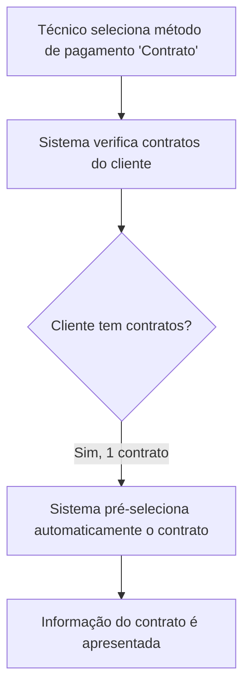
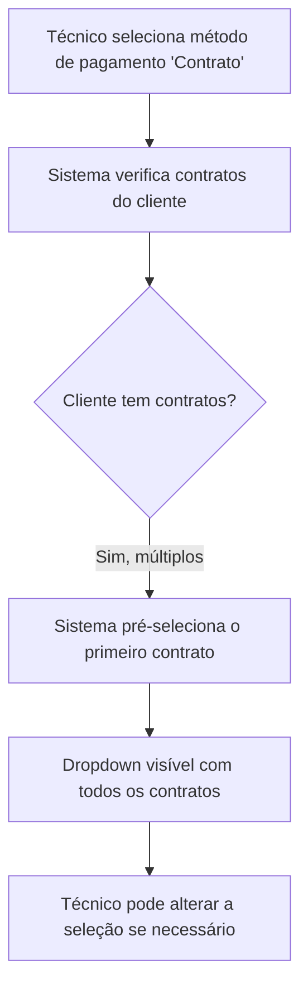
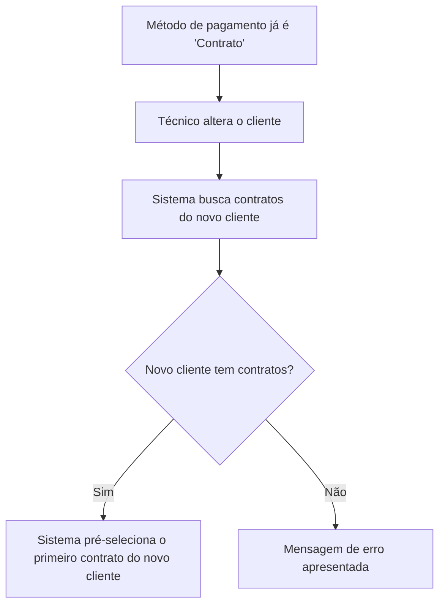
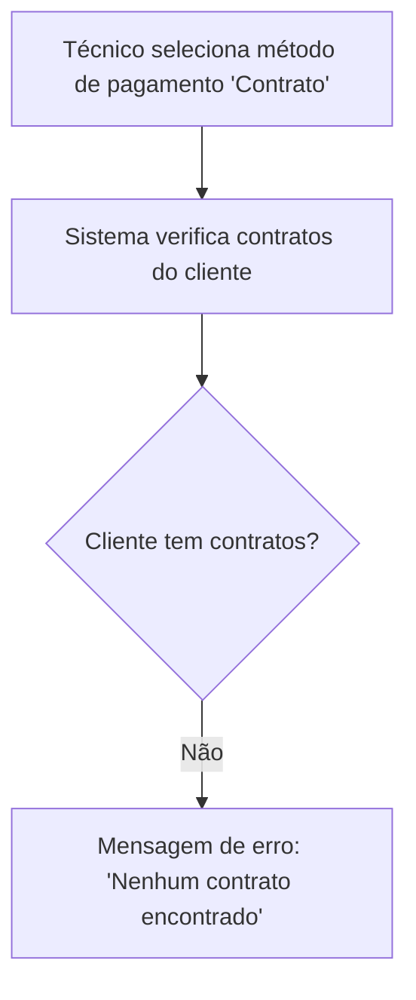

# Pré-Seleção de Contrato no Pagamento - Requirements

## Epic
[ ] **PRESEL-E-001**: **As a** técnico **I want** o contrato do cliente ser automaticamente pré-selecionado quando escolho "Contrato" como método de pagamento **So that** não tenho de procurar e selecionar manualmente o contrato, poupando tempo no preenchimento de formulários

## User Flow
### Passing Cases Flow
[ ] Fluxo nominal (cliente com 1 contrato)

[ ] Fluxo nominal (cliente com múltiplos contratos)

[ ] Fluxo nominal (alteração de cliente com pagamento já em "Contrato")

### Non-Passing Cases Flow
[ ] Fluxo de exceção (cliente sem contratos)

## Technical Requirements

### Business Rules
[ ] **PRESEL-BR-001**: Quando o método de pagamento é alterado para "Contrato" e o cliente tem contratos associados, o sistema deve pré-selecionar automaticamente o primeiro contrato da lista
[ ] **PRESEL-BR-002**: Quando o cliente tem apenas um contrato, esse contrato é pré-selecionado sem necessidade de interação do utilizador
[ ] **PRESEL-BR-003**: Quando o cliente tem múltiplos contratos, o primeiro é pré-selecionado mas o dropdown permanece acessível para o técnico alterar a seleção
[ ] **PRESEL-BR-004**: O comportamento de pré-seleção aplica-se tanto às Folhas de Obra como às Assistências Remotas
[ ] **PRESEL-BR-005**: Se o cliente não tiver contratos associados, nenhuma pré-seleção ocorre e a mensagem de erro existente é apresentada
[ ] **PRESEL-BR-006**: Quando o cliente é alterado e o método de pagamento já é "Contrato", o sistema deve re-disparar a pré-seleção para o novo cliente
[ ] **PRESEL-BR-007**: "Primeiro contrato" significa o primeiro contrato na ordem retornada pelo sistema (sem ordenação específica garantida)

### Dependencies & Integration Requirements
**Internal**: Formulários de criação de Folhas de Obra e Assistências Remotas, relação contrato–cliente
**External**: Nenhuma

## UI/UX Requirements
[ ] **PRESEL-UX-001**: A pré-seleção deve ocorrer sem delay percetível após a seleção do método de pagamento (máximo tempo de carregamento já existente)
[ ] **PRESEL-UX-002**: Quando existem múltiplos contratos, o dropdown deve mostrar o primeiro contrato já selecionado (não o placeholder "Selecionar contrato...")
[ ] **PRESEL-UX-003**: A informação visual do contrato selecionado (caixa verde) deve aparecer imediatamente após a pré-seleção

## User Stories

### Story: Pré-seleção automática com contrato único
[ ] **PRESEL-S-001**: **As a** técnico **I want** que o contrato seja automaticamente selecionado quando escolho "Contrato" como pagamento e o cliente só tem um contrato **So that** poupo tempo sem interação adicional

#### Acceptance Criteria
[ ] **PRESEL-AC-001**: **WHEN** o técnico seleciona "Contrato" como método de pagamento e o cliente tem exatamente 1 contrato, the system **SHALL** pré-selecionar automaticamente esse contrato
[ ] **PRESEL-AC-002**: **WHEN** o contrato é pré-selecionado, the system **SHALL** apresentar a informação do contrato (nome do plano e período)

### Story: Pré-seleção automática com múltiplos contratos
[ ] **PRESEL-S-002**: **As a** técnico **I want** que o primeiro contrato seja pré-selecionado quando o cliente tem vários contratos **So that** tenho um valor por defeito mas posso alterar se necessário

#### Acceptance Criteria
[ ] **PRESEL-AC-003**: **WHEN** o técnico seleciona "Contrato" como método de pagamento e o cliente tem mais de 1 contrato, the system **SHALL** pré-selecionar automaticamente o primeiro contrato na ordem disponibilizada pelo sistema
[ ] **PRESEL-AC-004**: **WHEN** existem múltiplos contratos e um é pré-selecionado, the system **SHALL** manter o dropdown visível para permitir alteração
[ ] **PRESEL-AC-005**: **WHEN** o técnico altera a seleção no dropdown, the system **SHALL** atualizar a informação do contrato apresentada

### Story: Cliente sem contratos
[ ] **PRESEL-S-003**: **As a** técnico **I want** ser informado quando o cliente não tem contratos **So that** sei que devo escolher outro método de pagamento

#### Acceptance Criteria
[ ] **PRESEL-AC-006**: **IF** o cliente não tem contratos associados, **THEN** the system **SHALL** apresentar a mensagem "Nenhum contrato encontrado para este cliente"
[ ] **PRESEL-AC-007**: **IF** o cliente não tem contratos, **THEN** the system **SHALL** não pré-selecionar nenhum valor no campo de seleção de contrato

### Story: Consistência entre tipos de conteúdo
[ ] **PRESEL-S-004**: **As a** técnico **I want** que a pré-seleção funcione de forma idêntica em Folhas de Obra e Assistências Remotas **So that** a experiência seja consistente

#### Acceptance Criteria
[ ] **PRESEL-AC-008**: The system **SHALL** aplicar a mesma lógica de pré-seleção de contrato nas Folhas de Obra (método "CONTRATO") e nas Assistências Remotas (método "Contrato")

### Story: Re-seleção ao alterar cliente
[ ] **PRESEL-S-005**: **As a** técnico **I want** que ao alterar o cliente enquanto o método de pagamento já é "Contrato", o sistema pré-selecione automaticamente o contrato do novo cliente **So that** não preciso de re-selecionar manualmente o contrato quando mudo de cliente

#### Acceptance Criteria
[ ] **PRESEL-AC-009**: **WHEN** o técnico altera o cliente e o método de pagamento já é "Contrato", the system **SHALL** buscar os contratos do novo cliente e pré-selecionar o primeiro
[ ] **PRESEL-AC-010**: **WHEN** o técnico altera o cliente e o novo cliente não tem contratos, the system **SHALL** limpar a seleção anterior e apresentar a mensagem de erro

## Related Documentation
- Formulários de criação de Folhas de Obra
- Formulários de criação de Assistências Remotas

### Excluded scope
- Não altera o comportamento dos formulários de atualização (Update views) — apenas criação (confirmado)
- Não altera a lógica de fetch de contratos (apenas a seleção por defeito)
- Não altera o design visual dos componentes de contrato
- Não implementa ordenação dos contratos (usa a ordem retornada pelo sistema)
- Não aplica ao formulário de edição (Update) — apenas criação
