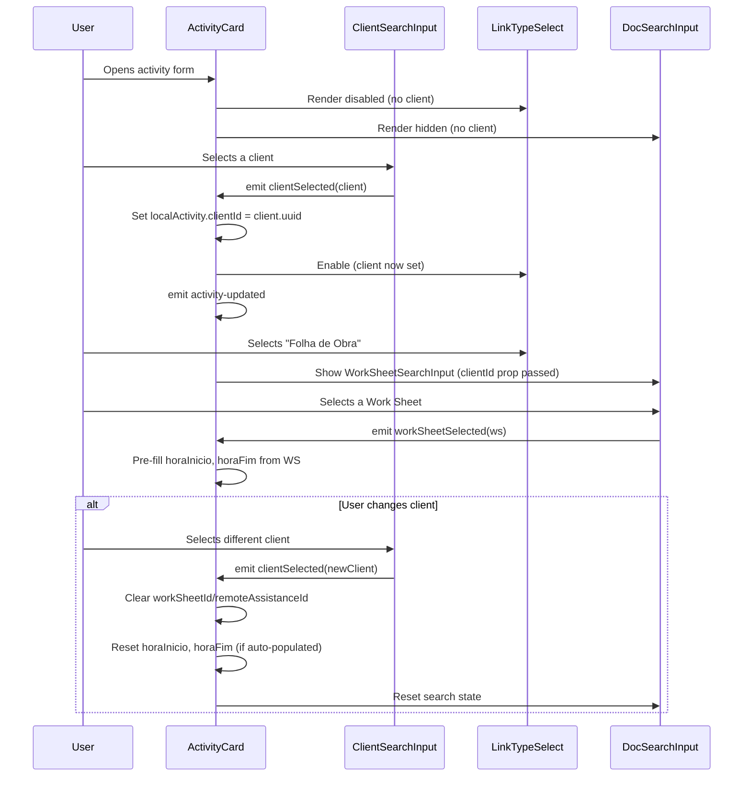
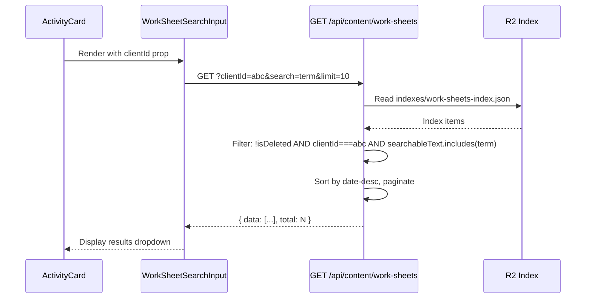
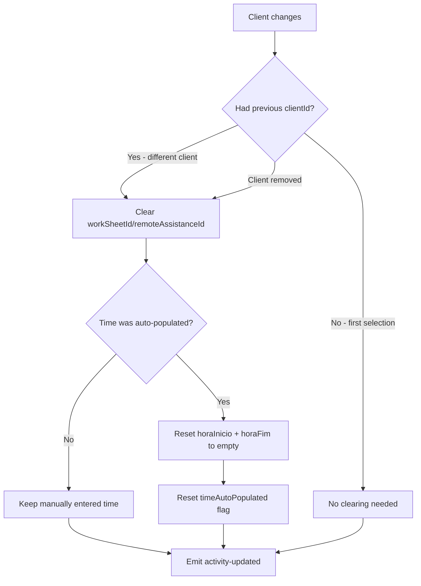

# Registo Diário - Client-Activity Link - Design

## 1. Data Model — Activity `clientId` field

### Modified interface: `Activity` (shared/src/types/daily-records/types.ts)

```typescript
export interface Activity {
  /** Activity type classification */
  tipoAtividade: 'Interno' | 'Externo';
  /** Client UUID — mandatory for new activities, optional for legacy data */
  clientId?: string;
  /** Activity subject (required) */
  assunto: string;
  /** Start time in HH:MM format (24-hour) */
  horaInicio: string;
  /** End time in HH:MM format (24-hour) */
  horaFim: string;
  /** Break time in minutes */
  tempoPausa: number;
  /** Calculated total hours in HH:MM format */
  totalHoras: string;
  /** Optional activity description */
  descricao?: string;
  /** Link type for optional relations */
  tipoLigacao: 'Nenhuma' | 'Folha de Obra' | 'Assistência Remota';
  /** Work sheet UUID when tipoLigacao is 'Folha de Obra' */
  workSheetId?: string;
  /** Remote assistance UUID when tipoLigacao is 'Assistência Remota' */
  remoteAssistanceId?: string;
}
```

### Invariants

- `clientId` is **optional at type level** to preserve backward compatibility with existing stored data
- All **new** activities (create flow) MUST have `clientId` set — enforced by validation, not by type system
- Editing a legacy activity without `clientId` is allowed without forcing client selection (DR-DEC-003)
- If `clientId` changes, `workSheetId` and `remoteAssistanceId` MUST be cleared (invariant enforced in UI logic)
- `clientId` is persisted (DR-DEC-002) — not transient

### Edge cases

- **null/undefined clientId on existing data**: Valid — represents legacy activity. UI shows client field as empty, link fields remain editable only if user was previously linked
- **clientId set but linked document belongs to different client**: Possible only if data was created before this feature. No migration — display-time only

### Relation resolution impact

The existing `resolveDailyRecordRelations` utility already resolves the client name from `workSheetId`/`remoteAssistanceId → clientId`. Adding `clientId` directly to Activity does NOT change relation resolution — the field is used for **filtering at creation time**, not for display-time resolution.

No new relation key is added to the response. The `clientId` on Activity is stored data for filtering purposes only.

### Non-functional design notes

- **DR-UX-003** (44px touch targets): No new custom UI elements introduced. The existing `ClientSearchInput` component already meets 44px minimum height via Tailwind `rounded-touch` class. No design action needed — project-wide constraint.
- **DR-UX-005** (typeahead/autocomplete): Satisfied by reusing the existing `ClientSearchInput` component unchanged — same typeahead pattern as all other content types.
- **DR-BR-004/005/006**: These requirements describe preserved existing behavior (Ligação kept, Nenhuma valid, time auto-population unchanged). No design changes needed — existing code handles them. Confirmed in code exploration.

### Modifications to existing code (explicit delta)

| File | Change type | What changes | What is NOT deleted |
|------|-------------|--------------|---------------------|
| `shared/src/types/daily-records/types.ts` | ADD field | `clientId?: string` added to `Activity` interface | All existing fields preserved |
| `shared/src/types/daily-records/validation.ts` | MODIFY signature + ADD logic | `validateActivity` gets `options` param; new clientId check block added at top | All existing validation rules unchanged |
| `backend/src/routes/content-route-template.ts` | ADD filter + ADD query param | `clientId` filter in `listFiltered`; `clientId` read in GET handler | All existing filters/params preserved |
| `frontend/components/common/WorkSheetSearchInput.vue` | ADD prop + MODIFY search call | `clientId` prop; include in search params | All existing props/behavior preserved |
| `frontend/components/common/RemoteAssistanceSearchInput.vue` | ADD prop + MODIFY search call | `clientId` prop; include in search params | All existing props/behavior preserved |
| `frontend/components/daily-records/ActivityCard.vue` | ADD field + ADD handlers | ClientSearchInput, handleClientSelected, isLegacyActivity, timeAutoPopulated, conditional disabled states | All existing fields/handlers preserved |

No files are deleted. No existing behavior is removed. All changes are additive or extend existing interfaces.


## 2. Frontend — ActivityCard client integration

### Field order in ActivityCard (DR-DEC-006)

```
1. Tipo de Atividade  (existing — select)
2. Cliente            (NEW — ClientSearchInput)
3. Ligação            (existing — select, conditionally disabled)
4. Linked document    (existing — WorkSheetSearchInput or RemoteAssistanceSearchInput, conditionally disabled)
5. Assunto            (existing — text input)
6. Time fields        (existing — horaInicio, horaFim, tempoPausa, totalHoras)
7. Descrição          (existing — textarea)
```

### Component interaction flow



### Conditional states (edit mode)

| State | Client field | Ligação select | Document search |
|-------|-------------|----------------|-----------------|
| No client selected (new activity) | Enabled, empty | **Disabled** | Hidden |
| Client selected | Enabled, shows client | Enabled | Shown if tipoLigacao ≠ 'Nenhuma' |
| Legacy activity (no clientId, has linked doc) | Enabled, empty | Enabled | Enabled (backward compat DR-AC-011) |
| Legacy activity — user wants to change link | Requires client first (DR-AC-012) | Disabled until client set | Hidden until client set |

### ClientSearchInput integration

Reuse existing `ClientSearchInput` component from `components/common/`. Props:

```typescript
<ClientSearchInput
  v-model="localActivity.clientId"
  :readonly="!isEditMode"
  :disabled="!isEditMode"
  @client-selected="handleClientSelected"
/>
```

No modifications needed to `ClientSearchInput` itself — it already supports `v-model` (clientId string) and emits `clientSelected` with the full Client object.

### Backward compatibility (DR-DEC-003, DR-AC-011)

Detection logic for legacy activities:

```typescript
const isLegacyActivity = computed(() => {
  // Activity has a linked document but no clientId assigned
  return !localActivity.value.clientId && 
    (!!localActivity.value.workSheetId || !!localActivity.value.remoteAssistanceId);
});
```

When `isLegacyActivity` is true:
- Ligação select and document search remain **enabled** (user can edit without selecting client)
- Client field is shown but not enforced
- If user clears the linked document and wants to re-select, client becomes required (DR-AC-012)

### Error cases

- **ClientSearchInput API failure**: Search results show empty, user informed via component's existing error handling
- **User removes client after selecting**: Same as "no client selected" state — disable link fields, clear linked doc


## 3. Backend — Client-filtered document search

### Approach

Add a `clientId` query parameter to the existing generic `listFiltered` method in `content-route-template.ts`. Both `work-sheets` and `remote-assistance` already index `clientId` in their `extractIndexFields` — so filtering is index-level (no full document fetch needed).

No new endpoints. No new routes.

### Modified: `content-route-template.ts` — listFiltered

```typescript
// Add clientId to the filters parameter
async listFiltered(
  filters: {
    collaborator?: string;
    date?: string;
    search?: string;
    expirationMonth?: string;
    clientId?: string;  // NEW — filter by client UUID
  },
  page: number = 1,
  limit: number = 50
): Promise<{ items: ContentWithRelations<T['data']>[]; total: number }> {
  // ... existing filter logic ...

  // NEW filter block (added after existing filters)
  if (filters.clientId) {
    const clientIdValue = filters.clientId;
    filtered = filtered.filter(
      (item: Record<string, unknown>) => item.clientId === clientIdValue
    );
  }

  // ... rest of method unchanged ...
}
```

### Modified: GET handler in `content-route-template.ts`

```typescript
// Read clientId from query params (alongside existing params)
const clientId = c.req.query('clientId');

// Include in hasFilters check
const hasFilters = !!(collaborator || date || search || expirationMonth || clientId);

// Pass to listFiltered
const { items, total } = await storage.listFiltered(
  { collaborator, date, search, expirationMonth, clientId },
  page,
  limit
);
```

### Frontend search inputs — prop addition

Both `WorkSheetSearchInput` and `RemoteAssistanceSearchInput` need a new optional `clientId` prop:

```typescript
// WorkSheetSearchInput.vue — new prop
interface Props {
  modelValue?: string;
  placeholder?: string;
  disabled?: boolean;
  readonly?: boolean;
  hasError?: boolean;
  clientId?: string;  // NEW — filter results by client
}
```

When `clientId` is provided, the search API call includes it:

```typescript
const searchParams = {
  ...(query.length >= 1 ? { search: query } : {}),
  limit: 10,
  ...(props.clientId ? { clientId: props.clientId } : {}),
};
```

### API request/response

**Request**: `GET /api/content/work-sheets?clientId={uuid}&search={query}&limit=10`

**Response** (unchanged schema):
```typescript
{
  success: true,
  data: WorkSheet[],        // filtered by clientId
  total: number,
  page: number,
  limit: number,
  timestamp: string
}
```

**Error responses** (unchanged):
- 401: Unauthenticated
- 403: Insufficient permissions
- 500: Internal server error

**Empty results** (not an error — DR-AC-009):
```typescript
{ success: true, data: [], total: 0, page: 1, limit: 10, timestamp: "..." }
```

### Sequence diagram — filtered search



### Performance (DR-NFR-001)

The filtering happens on the in-memory index (JSON array loaded from R2). For the expected data volume (~100-500 work sheets/remote assistances total), filtering by clientId + search term on the index is well under 2 seconds even on mobile connections. The bottleneck is the R2 GET for the index file (typically <200ms).

### Error cases

| Scenario | Behavior |
|----------|----------|
| clientId not found in any index item | Empty results returned (not an error) |
| Invalid clientId format | Treated as filter — zero matches, empty results |
| R2 index unavailable | 500 error from storage layer (existing behavior) |
| Client has 0 work sheets | Empty results — UI shows empty state message (DR-AC-009) |


## 4. Frontend — Client change cascade logic

### Event handling in ActivityCard

```typescript
// Track whether time fields were auto-populated (to know what to clear)
const timeAutoPopulated = ref(false);

const handleClientSelected = (client: Client | null) => {
  const previousClientId = localActivity.value.clientId;
  const newClientId = client?.uuid || '';

  // Update clientId
  localActivity.value.clientId = newClientId;

  // If client changed (not initial selection from empty)
  if (previousClientId && previousClientId !== newClientId) {
    // Clear linked document (DR-AC-007, DR-BR-003)
    localActivity.value.workSheetId = undefined;
    localActivity.value.remoteAssistanceId = undefined;

    // Reset time fields if they were auto-populated (DR-AC-008)
    if (timeAutoPopulated.value) {
      localActivity.value.horaInicio = '';
      localActivity.value.horaFim = '';
      timeAutoPopulated.value = false;
    }
  }

  // If client removed entirely
  if (!newClientId) {
    // Same clearing logic as change
    localActivity.value.workSheetId = undefined;
    localActivity.value.remoteAssistanceId = undefined;
    if (timeAutoPopulated.value) {
      localActivity.value.horaInicio = '';
      localActivity.value.horaFim = '';
      timeAutoPopulated.value = false;
    }
  }

  emitUpdate();
};
```

### Time auto-population tracking

```typescript
const handleWorkSheetSelected = async (workSheet: WorkSheet | null) => {
  if (workSheet) {
    localActivity.value.workSheetId = workSheet.uuid;
    // Pre-fill time from work sheet
    const timeData = await fetchWorkSheetTime(workSheet.uuid);
    if (timeData) {
      localActivity.value.horaInicio = timeData.horaInicio;
      localActivity.value.horaFim = timeData.horaFim;
      timeAutoPopulated.value = true;  // Mark as auto-populated
    }
  } else {
    localActivity.value.workSheetId = undefined;
    // Clear auto-populated time
    if (timeAutoPopulated.value) {
      localActivity.value.horaInicio = '';
      localActivity.value.horaFim = '';
      timeAutoPopulated.value = false;
    }
  }
  emitUpdate();
};
// Same pattern for handleRemoteAssistanceSelected
```

### Cascade flow diagram



### Edge cases

| Scenario | Behavior |
|----------|----------|
| User selects client → selects WS → changes client | WS cleared, time cleared (was auto-populated) |
| User selects client → types time manually → changes client | WS cleared, time KEPT (was manual) |
| User selects client → selects WS → manually edits time → changes client | Time cleared (was initially auto-populated, even if manually tweaked after) |
| User removes client (clears field) | Same as changing to a different client — clears linked doc + auto-populated time |
| User selects same client again (re-select from dropdown) | No change — previousClientId === newClientId, no clearing |

**Decision: Time clearing strategy**
Options: [A] Clear time only if untouched since auto-population / [B] Clear time whenever it was originally auto-populated, even if user edited after
Chosen: [B]
Reason: Simpler to implement (single boolean flag), and the safer default — prevents stale time data from a wrong document from persisting after client change.

### Visual feedback (DR-UX-004)

When client changes and linked document is cleared:
- The document search field resets to empty state (visual clearing is the feedback)
- Time fields visibly become empty if they were auto-populated
- No toast/notification needed — the field clearing itself is the visual indication per the requirement


## 5. Validation — Mandatory client + backward compatibility

### Modified: `validateActivity` (shared/src/types/daily-records/validation.ts)

Add `clientId` validation with a context flag to distinguish create vs edit-of-legacy:

```typescript
/**
 * Validate a single activity
 * @param activity - Activity to validate
 * @param index - Activity index for error messages
 * @param options - Validation context options
 */
export function validateActivity(
  activity: Activity,
  index: number,
  options?: { isNewRecord?: boolean }
): string[] {
  const errors: string[] = [];
  const prefix = `Atividade ${index + 1}:`;
  const isNew = options?.isNewRecord ?? true; // Default: treat as new (strict)

  // Client validation (DR-BR-001, DR-DEC-004)
  if (isNew && !activity.clientId) {
    errors.push(`${prefix} Cliente é obrigatório`);
  }

  // DR-AC-012: If editing legacy data and user wants to change linked document,
  // client must be set. This is enforced by the UI (disabled fields), not by
  // validation — because at submission time, if tipoLigacao !== 'Nenhuma' and
  // a document is selected, client must be set:
  if (!isNew && activity.tipoLigacao !== 'Nenhuma' && 
      (activity.workSheetId || activity.remoteAssistanceId) && 
      !activity.clientId) {
    errors.push(`${prefix} Cliente é obrigatório quando existe ligação a documento`);
  }

  // ... existing validations unchanged ...
}
```

### Validation rules summary

| Context | clientId required? | Reason |
|---------|-------------------|--------|
| New activity (create) | YES — always | DR-BR-001, DR-DEC-004 |
| Edit existing — has clientId | YES — preserved | Already set, no change needed |
| Edit existing — no clientId, no linked doc | NO | DR-DEC-003, DR-AC-011 |
| Edit existing — no clientId, has linked doc (legacy) | NO (unless doc changed) | DR-AC-011 |
| Edit existing — no clientId, user selects new linked doc | YES | DR-AC-012 |

### How create vs edit is distinguished

The `validateDailyRecordCreation` function always passes `{ isNewRecord: true }`.
The `validateDailyRecordUpdate` function passes `{ isNewRecord: false }`.

```typescript
export function validateDailyRecordCreation(data: DailyRecordCreationData): string[] {
  const errors: string[] = [];
  // ... date validation ...

  if (!data.atividades || data.atividades.length === 0) {
    errors.push('Pelo menos uma atividade é obrigatória');
  } else {
    data.atividades.forEach((activity, index) => {
      const activityErrors = validateActivity(activity, index, { isNewRecord: true });
      errors.push(...activityErrors);
    });
  }

  return errors;
}

export function validateDailyRecordUpdate(data: DailyRecordCreationData): string[] {
  const errors: string[] = [];
  // ... date validation ...

  if (!data.atividades || data.atividades.length === 0) {
    errors.push('Pelo menos uma atividade é obrigatória');
  } else {
    data.atividades.forEach((activity, index) => {
      const activityErrors = validateActivity(activity, index, { isNewRecord: false });
      errors.push(...activityErrors);
    });
  }

  return errors;
}
```

### Invariants enforced by validation

1. **New activity must have clientId** — creation rejects without it
2. **Linked document requires client** — if tipoLigacao is not 'Nenhuma' and a doc ID is present, clientId must also be present (for updates)
3. **Legacy data without client is valid** — editing fields other than the link does not force client selection
4. **Existing validations unchanged** — tipoAtividade, time format, tipoLigacao, conditional workSheetId/remoteAssistanceId all remain as-is

### Error messages (Portuguese)

| Rule | Message |
|------|---------|
| Missing client on new activity | `Atividade N: Cliente é obrigatório` |
| Missing client when linked doc exists (edit) | `Atividade N: Cliente é obrigatório quando existe ligação a documento` |

