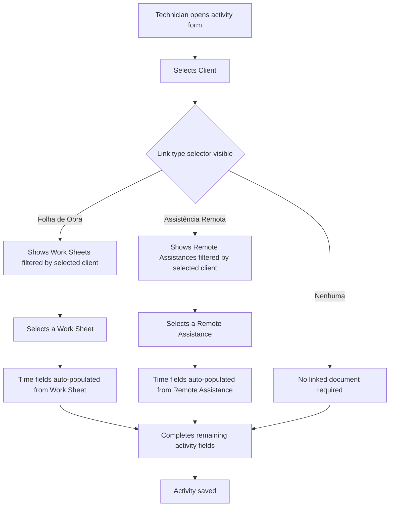
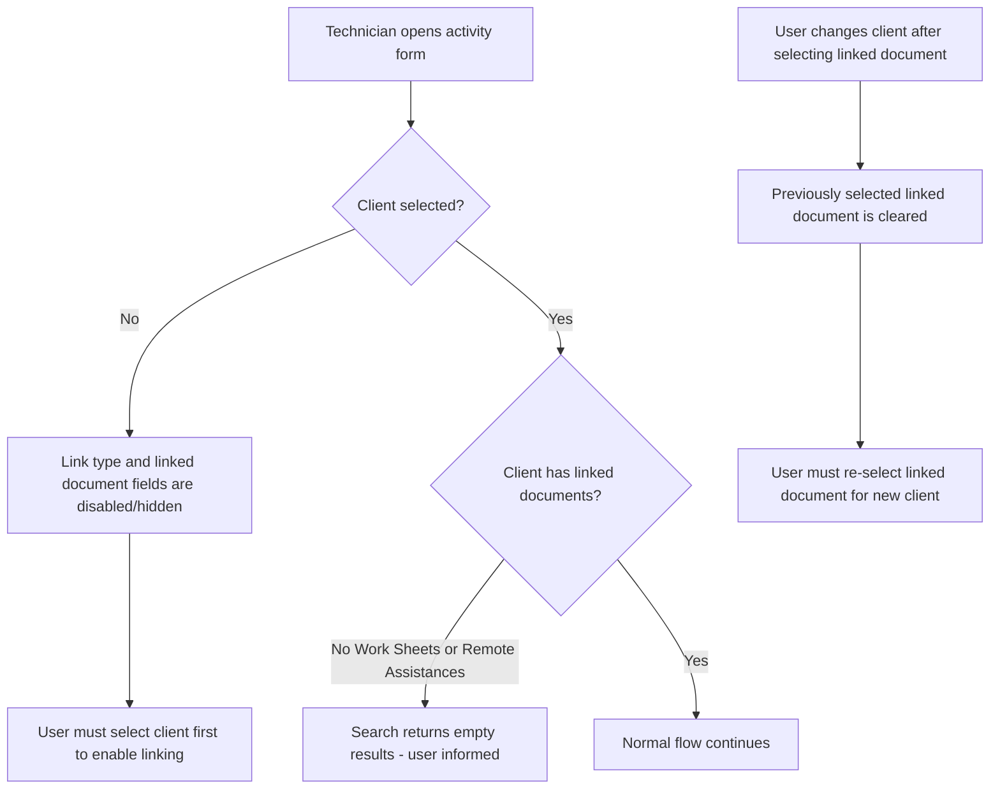

# Registo Diário - Client-Activity Link - Requirements

## Epic
[ ] **DR-E-001**: **As a** technician **I want** to select a client first in each daily record activity and then choose a Work Sheet or Remote Assistance belonging to that client **So that** I only see relevant linked documents and avoid linking activities to the wrong client's records

## User Flow

### Passing Cases Flow
[ ] Passing flow diagram

### Non-Passing Cases Flow
[ ] Non-passing flow diagram

## Technical Requirements

### Resolved decisions
[ ] **DR-DEC-001**: The "Ligação" (link type) selector is KEPT — it determines whether to search Work Sheets or Remote Assistances for the selected client
[ ] **DR-DEC-002**: The selected client is stored on the Activity data (persisted, not transient)
[ ] **DR-DEC-003**: Existing activities without a client field remain backward compatible — editing is allowed without forcing client selection on legacy data
[ ] **DR-DEC-004**: Client field is mandatory for all new activities (not just when linking a document)
[ ] **DR-DEC-005**: The client field is used only within the activity card (create/edit) — no impact on daily record list views or filters
[ ] **DR-DEC-006**: Field order in activity card: Tipo de Atividade → Cliente → Ligação → Linked document → Assunto → Time → Descrição

### Business Rules
[ ] **DR-BR-001**: The client field is mandatory for all new activities — every activity must be associated with a client
[ ] **DR-BR-002**: The linked document search results must only show documents belonging to the selected client
[ ] **DR-BR-003**: Changing the selected client must clear any previously selected linked document
[ ] **DR-BR-004**: The "Ligação" selector determines whether the user searches Work Sheets or Remote Assistances — it is kept to simplify the search scope
[ ] **DR-BR-005**: The activity can still have "Nenhuma" (no link) — client selection does not force a linked document
[ ] **DR-BR-006**: Time auto-population from linked documents continues to work as before after selection
[ ] **DR-BR-007**: The client field must be filled before the "Ligação" selector and linked document search become available

### Performance
[ ] **DR-NFR-001**: Filtered search results for a client's linked documents shall load within 2 seconds on mobile connections

### Dependencies & Integration Requirements
**Internal**: Work Sheets (associated with a client), Remote Assistances (associated with a client), Clients (search/select)
**External**: None

## UI/UX Requirements
[ ] **DR-UX-001**: Client selection field appears before the link type selector in the activity card (order: Tipo Atividade → Cliente → Ligação → Linked document → Assunto → Time → Descrição)
[ ] **DR-UX-002**: Link type selector and linked document search are disabled or hidden until a client is selected
[ ] **DR-UX-003**: All touch targets maintain 44px minimum height (mobile-first)
[ ] **DR-UX-004**: When client changes, a visual indication (field clearing) confirms the linked document was reset
[ ] **DR-UX-005**: The client field uses the existing typeahead/autocomplete search pattern for consistency with other content types

## User Stories

### Story: Technician links activity to client's Work Sheet
[ ] **DR-S-001**: **As a** technician **I want** to select a client and then pick one of their Work Sheets **So that** my daily activity is correctly associated with the right client's work

#### Acceptance Criteria
[ ] **DR-AC-001**: The system **SHALL** display a mandatory client search/select field in each activity card, positioned before the "Ligação" selector
[ ] **DR-AC-002**: **WHEN** a client is selected, the system **SHALL** enable the "Ligação" selector and linked document search
[ ] **DR-AC-003**: **WHEN** the user selects "Folha de Obra" as link type, the system **SHALL** display only Work Sheets belonging to the selected client
[ ] **DR-AC-004**: **WHEN** the user selects a Work Sheet, the system **SHALL** auto-populate the start and end time fields from that Work Sheet

### Story: Technician links activity to client's Remote Assistance
[ ] **DR-S-002**: **As a** technician **I want** to select a client and then pick one of their Remote Assistances **So that** my daily activity is correctly linked to the assistance I provided

#### Acceptance Criteria
**Common Behavior** (see Story 1):
[ ] Applies: DR-AC-001, DR-AC-002

**Story-Specific Behavior**:
[ ] **DR-AC-005**: **WHEN** the user selects "Assistência Remota" as link type, the system **SHALL** display only Remote Assistances belonging to the selected client
[ ] **DR-AC-006**: **WHEN** the user selects a Remote Assistance, the system **SHALL** auto-populate the start and end time fields from that Remote Assistance

### Story: Technician changes client after linking
[ ] **DR-S-003**: **As a** technician **I want** the system to clear my linked document when I change the client **So that** I don't accidentally keep a link to a document from a different client

#### Acceptance Criteria
[ ] **DR-AC-007**: **WHEN** the selected client changes, the system **SHALL** clear the currently selected Work Sheet or Remote Assistance
[ ] **DR-AC-008**: **WHEN** the selected client changes, the system **SHALL** reset the time fields that were auto-populated from the previous linked document

### Story: No linked documents available for client
[ ] **DR-S-004**: **As a** technician **I want** to be informed when a client has no Work Sheets or Remote Assistances **So that** I know I need to choose "Nenhuma" or select a different client

#### Acceptance Criteria
[ ] **DR-AC-009**: **IF** the search returns no results for the selected client and link type, **THEN** the system **SHALL** display an informative empty state message
[ ] **DR-AC-010**: **WHILE** no client is selected, the system **SHALL** keep the link type selector and linked document fields in a disabled state

### Story: Editing legacy activities without client
[ ] **DR-S-005**: **As a** technician **I want** to edit existing activities that were created without a client selection **So that** I can still modify legacy data without being forced to add a client

#### Acceptance Criteria
[ ] **DR-AC-011**: **IF** an existing activity has a linked document but no client assigned, **THEN** the system **SHALL** allow editing all fields without requiring client selection
[ ] **DR-AC-012**: **IF** an existing activity has no client assigned and the user wants to change the linked document, **THEN** the system **SHALL** require client selection before showing filtered results

## Related Documentation
- Work Sheets are associated with a client
- Remote Assistances are associated with a client
- The current activity form uses a link type field to toggle between Work Sheet and Remote Assistance search

### Excluded scope
- No changes to how Work Sheets or Remote Assistances store their client association
- No changes to the time auto-population logic (only filtering of which documents appear)
- No combined search showing both Work Sheets and Remote Assistances in a single list
- No mandatory linking — "Nenhuma" remains a valid option
- No changes to the Daily Record data model beyond adding client context to each activity
