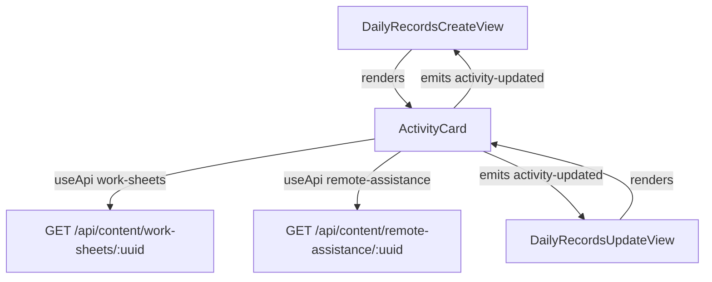
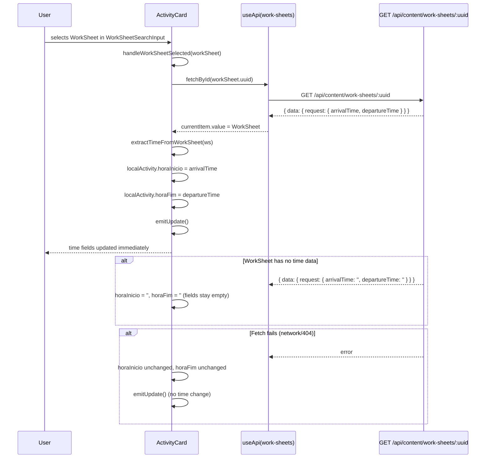
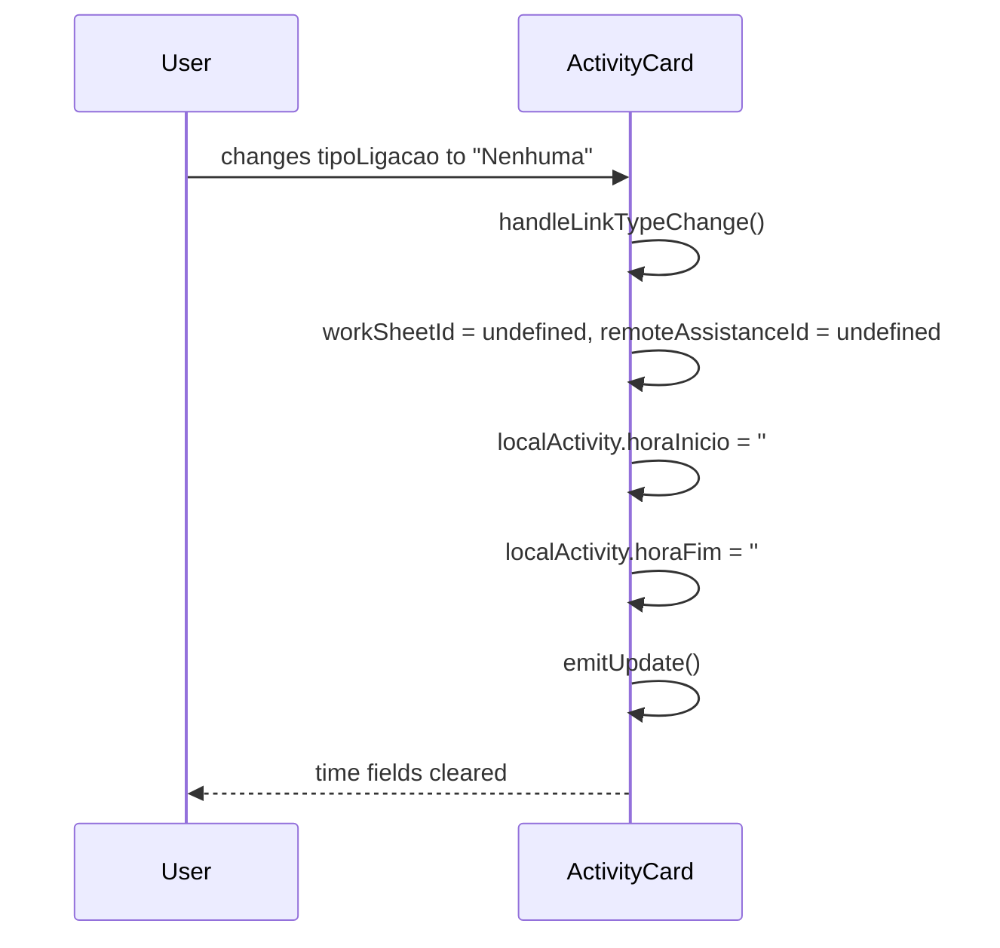

# Daily Record Time Prefill — Design

## 1. Component Architecture & Touch Points

### Scope

This feature is a pure frontend change. No backend routes, no shared types, no storage schema changes are required. The existing GET endpoints for `work-sheets` and `remote-assistance` already return the full document data including time fields.

### Single file modified: `ActivityCard.vue`

`packages/frontend/src/components/daily-records/ActivityCard.vue`

All activity field rendering — including `tipoLigacao`, the linked document selectors, `horaInicio`, and `horaFim` — lives entirely inside `ActivityCard.vue`. Both `DailyRecordsCreateView.vue` and `DailyRecordsUpdateView.vue` delegate to this component via `<ActivityCard>`. This means the pre-fill logic has exactly one implementation point.

**What changes in `ActivityCard.vue`:**
- Add two `useApi` composable instances (one for `work-sheets`, one for `remote-assistance`)
- Add a `extractTimeFromWorkSheet(ws)` helper function
- Add a `extractTimeFromRemoteAssistance(ra)` helper function
- Modify `handleWorkSheetSelected()` to fetch and pre-fill
- Modify `handleRemoteAssistanceSelected()` to fetch and pre-fill
- Modify `handleLinkTypeChange()` to clear time fields when switching to `Nenhuma`

**What does NOT change:**
- `DailyRecordsCreateView.vue` — no changes
- `DailyRecordsUpdateView.vue` — no changes
- All shared types (`Activity`, `WorkSheet`, `RemoteAssistance`) — no changes
- All backend routes — no changes
- `horaInicio` / `horaFim` input fields — no changes to template markup
- `emitUpdate()` — no changes

> **Decision: Fetch location**
> Options: [A] fetch inside `ActivityCard.vue` / [B] emit to parent, parent fetches and passes back
> Chosen: A
> Reason: `ActivityCard` already owns all its field state and emits only `activity-updated`; fetching inside keeps the change isolated to one file and avoids adding API logic to both parent views.

### Component relationship diagram



---

## 2. Time Extraction Logic

### WorkSheet time fields

`WorkSheetData.request.arrivalTime` — stored as `HH:MM` string (24-hour).
`WorkSheetData.request.departureTime` — stored as `HH:MM` string (24-hour).

No conversion needed. Direct assignment.

```typescript
function extractTimeFromWorkSheet(ws: WorkSheet): { horaInicio: string; horaFim: string } {
  const arrivalTime = ws.data.request.arrivalTime ?? '';
  const departureTime = ws.data.request.departureTime ?? '';
  return {
    horaInicio: arrivalTime,
    horaFim: departureTime,
  };
}
```

**Invariants:**
- If `arrivalTime` is `undefined`, `null`, or `''` → return `''` for `horaInicio` (no pre-fill, per DRTP-BR-003)
- If `departureTime` is `undefined`, `null`, or `''` → return `''` for `horaFim` (no pre-fill, per DRTP-BR-003)
- Valid values are already in `HH:MM` format — no parsing required

### RemoteAssistance time fields

`RemoteAssistanceData.inicioAssistencia` — stored as ISO date string with time (e.g. `"2024-07-14T09:30:00.000Z"`).
`RemoteAssistanceData.fimAssistencia` — stored as ISO date string with time.

Conversion required: extract `HH:MM` from the ISO string using the local time portion.

```typescript
function extractTimeFromRemoteAssistance(ra: RemoteAssistance): { horaInicio: string; horaFim: string } {
  const horaInicio = extractHHMM(ra.data.inicioAssistencia);
  const horaFim = extractHHMM(ra.data.fimAssistencia);
  return { horaInicio, horaFim };
}

function extractHHMM(isoString: string | undefined | null): string {
  if (!isoString) return '';
  const date = new Date(isoString);
  if (isNaN(date.getTime())) return '';
  const hours = date.getHours().toString().padStart(2, '0');
  const minutes = date.getMinutes().toString().padStart(2, '0');
  return `${hours}:${minutes}`;
}
```

**Invariants:**
- If `inicioAssistencia` is `undefined`, `null`, or `''` → return `''` (no pre-fill, per DRTP-BR-003)
- If `fimAssistencia` is `undefined`, `null`, or `''` → return `''` (no pre-fill, per DRTP-BR-003)
- If the ISO string is malformed (fails `new Date()` parse) → return `''` (graceful degradation)
- Time is extracted using `Date` local time — consistent with how the rest of the app handles time display

**Edge case — empty string result:**
When both `horaInicio` and `horaFim` extracted values are `''`, the pre-fill writes empty strings to the fields. This is the correct behavior per DRTP-AC-012: the fields remain empty and the user fills them manually.

---

## 3. Pre-fill Trigger Flow

### Trigger events and their actions

| Event | Trigger condition | Action |
|-------|------------------|--------|
| WorkSheet selected | `@work-sheet-selected` fires with a WorkSheet object | Fetch WS by ID → extract times → write to `localActivity.horaInicio` / `horaFim` |
| RemoteAssistance selected | `@remote-assistance-selected` fires with a RA object | Fetch RA by ID → extract times → write to `localActivity.horaInicio` / `horaFim` |
| Link type changed to `Nenhuma` | `handleLinkTypeChange` detects `tipoLigacao === 'Nenhuma'` | Clear `horaInicio` and `horaFim` |
| Link type switched (FO → AR or AR → FO) | `handleLinkTypeChange` clears the old ID; new document selector appears; user selects new document | Pre-fill fires on the new document selection (same path as first selection) |

### Sequence diagram — WorkSheet selection



### Sequence diagram — link type cleared



### Modified handler implementations

**`handleWorkSheetSelected`** (replaces current no-op):
```typescript
const handleWorkSheetSelected = (workSheet: WorkSheet) => {
  workSheetApi.fetchById(workSheet.uuid)
    .then(() => {
      const ws = workSheetApi.currentItem.value;
      if (ws) {
        const { horaInicio, horaFim } = extractTimeFromWorkSheet(ws);
        localActivity.value.horaInicio = horaInicio;
        localActivity.value.horaFim = horaFim;
      }
    })
    .catch((err: unknown) => {
      console.error('Time prefill fetch failed (work-sheet):', JSON.stringify({ error: String(err) }, null, 2));
      // Fields unchanged on error — user fills manually
    })
    .finally(() => {
      emitUpdate();
    });
};
```

**`handleRemoteAssistanceSelected`** (replaces current no-op):
```typescript
const handleRemoteAssistanceSelected = (remoteAssistance: RemoteAssistance) => {
  remoteAssistanceApi.fetchById(remoteAssistance.uuid)
    .then(() => {
      const ra = remoteAssistanceApi.currentItem.value;
      if (ra) {
        const { horaInicio, horaFim } = extractTimeFromRemoteAssistance(ra);
        localActivity.value.horaInicio = horaInicio;
        localActivity.value.horaFim = horaFim;
      }
    })
    .catch((err: unknown) => {
      console.error('Time prefill fetch failed (remote-assistance):', JSON.stringify({ error: String(err) }, null, 2));
      // Fields unchanged on error — user fills manually
    })
    .finally(() => {
      emitUpdate();
    });
};
```

**`handleLinkTypeChange`** (extends current implementation — adds time clearing):
```typescript
const handleLinkTypeChange = () => {
  if (localActivity.value.tipoLigacao === 'Nenhuma') {
    localActivity.value.workSheetId = undefined;
    localActivity.value.remoteAssistanceId = undefined;
    localActivity.value.horaInicio = '';  // ← added
    localActivity.value.horaFim = '';     // ← added
  } else if (localActivity.value.tipoLigacao === 'Folha de Obra') {
    localActivity.value.remoteAssistanceId = undefined;
  } else if (localActivity.value.tipoLigacao === 'Assistência Remota') {
    localActivity.value.workSheetId = undefined;
  }
  emitUpdate();
};
```

**Note on link type switch (FO → AR or AR → FO):** When the user switches between link types, `handleLinkTypeChange` clears the old document ID but does NOT clear the time fields at that moment — the old times remain visible until the user selects a new document, at which point the new document's times overwrite them. This is consistent with DRTP-AC-015 and DRTP-AC-016 which specify overwrite on new document selection, not on type switch.

---

## 4. Manual Override Preservation

No additional state is required to implement DRTP-BR-006 / DRTP-AC-010 / DRTP-AC-011.

**Why:** Pre-fill writes to `localActivity.horaInicio` / `localActivity.horaFim` only inside the `handleWorkSheetSelected` and `handleRemoteAssistanceSelected` callbacks — i.e., only when the user actively selects a document. The `v-model` bindings on the time input fields remain fully functional at all times. After a pre-fill, the user can type directly into the fields; those edits update `localActivity` via `v-model` and are preserved in the component's local state until the user selects a different linked document (which triggers another pre-fill and overwrites).

**Invariant:** Pre-fill is a write-once-on-selection operation. It does not watch `workSheetId` or `remoteAssistanceId` reactively. There is no watcher or computed property that would overwrite manual edits.

---

## 5. API Fetch Strategy inside ActivityCard

### Composable instances

Two `useApi` instances are added at the top of `ActivityCard.vue`'s `<script setup>`:

```typescript
import type { WorkSheet } from '@clever/shared';
import type { RemoteAssistance } from '@clever/shared';
import { useApi } from '@/composables/useApi';

const workSheetApi = useApi<WorkSheet>('work-sheets');
const remoteAssistanceApi = useApi<RemoteAssistance>('remote-assistance');
```

Each instance is independent and scoped to the component. Since `ActivityCard` is rendered once per activity entry, each card has its own fetch state. This is acceptable — the fetch is a one-shot operation triggered by user selection, not a background poll.

### Loading state

No loading spinner is shown on the time fields during the fetch. The fetch is expected to complete in under 200ms on a local network (DRTP-NFR-001: no perceptible delay). The fields remain in their previous state (empty or prior value) during the brief fetch window. If the fetch takes longer than expected, the user can still type into the fields manually.

> **Decision: Loading indicator on time fields**
> Options: [A] No indicator — fields remain in prior state during fetch / [B] Show a spinner or disabled state on `horaInicio`/`horaFim` during fetch
> Chosen: A
> Reason: The fetch is a fast internal API call; adding a loading state adds complexity for a sub-200ms operation. If the fetch fails, fields remain editable. DRTP-NFR-001 requires no perceptible delay, not a loading indicator.

### Error handling

If `fetchById` rejects (network error, 404, 500):
- The `.catch()` block logs the error
- Time fields are left unchanged (not cleared, not overwritten)
- `emitUpdate()` is called in `.finally()` so the activity state is still synced to the parent
- The user can fill the time fields manually

This satisfies DRTP-AC-012 (graceful degradation when no time data is available) and DRTP-BR-003 (no modification when data is absent).

### API response shape

Both endpoints return the standard `ApiResponse<ContentWithRelations<T>>` envelope. The relevant fields for pre-fill are:

**WorkSheet GET `/api/content/work-sheets/:uuid`**
```typescript
{
  success: true,
  data: {
    uuid: string,
    contentType: 'work-sheets',
    data: {
      request: {
        arrivalTime: string,   // HH:MM — source for horaInicio
        departureTime: string, // HH:MM — source for horaFim
        // ...other fields
      },
      // ...other sections
    },
    relations: Record<string, ResolvedRelation | RelationError>,
    createdAt: string,
    updatedAt: string
  }
}
```

**RemoteAssistance GET `/api/content/remote-assistance/:uuid`**
```typescript
{
  success: true,
  data: {
    uuid: string,
    contentType: 'remote-assistance',
    data: {
      inicioAssistencia: string, // ISO date string with time — source for horaInicio
      fimAssistencia: string,    // ISO date string with time — source for horaFim
      // ...other fields
    },
    relations: Record<string, ResolvedRelation | RelationError>,
    createdAt: string,
    updatedAt: string
  }
}
```

**Error responses:**

| HTTP status | Trigger condition | Handling in ActivityCard |
|-------------|------------------|--------------------------|
| 404 | UUID not found in R2 | `.catch()` — fields unchanged, user fills manually |
| 500 | R2 read error or unexpected server error | `.catch()` — fields unchanged, user fills manually |
| 401 | Clerk auth token expired | `.catch()` — fields unchanged (user will be redirected by auth middleware on next action) |

### No duplicate fetch guard

The `WorkSheetSearchInput` and `RemoteAssistanceSearchInput` components emit `@work-sheet-selected` / `@remote-assistance-selected` once per user selection. There is no risk of duplicate fetches from the same selection event. If the user selects the same document twice, the fetch runs again and overwrites with the same values — this is harmless.

---

## 6. Create vs Update Form Parity

Both `DailyRecordsCreateView.vue` and `DailyRecordsUpdateView.vue` render `<ActivityCard :is-edit-mode="true">` for each activity. Since all pre-fill logic lives inside `ActivityCard`, both forms automatically get the same behavior with zero additional changes.

**Confirmed by code inspection:**
- Create view: `<ActivityCard v-for="..." :is-edit-mode="true" @activity-updated="handleActivityUpdate(index, $event, templateUpdateFieldValue)" />`
- Update view: `<ActivityCard v-for="..." :is-edit-mode="true" @activity-updated="handleActivityUpdate(index, $event)" />`

The only difference between the two views is how `handleActivityUpdate` syncs back to the template — this is unaffected by the pre-fill change.

**Excluded by spec:** Pre-fill does NOT trigger on form load for existing activities that already have a linked document. The Update view deep-copies `dailyRecord.data.atividades` into `activities.value` on mount — this populates the existing `workSheetId`/`remoteAssistanceId` values but does NOT call `handleWorkSheetSelected` or `handleRemoteAssistanceSelected`. Pre-fill only fires on active user selection. This is consistent with the exclusion stated in `requirements.md`.
