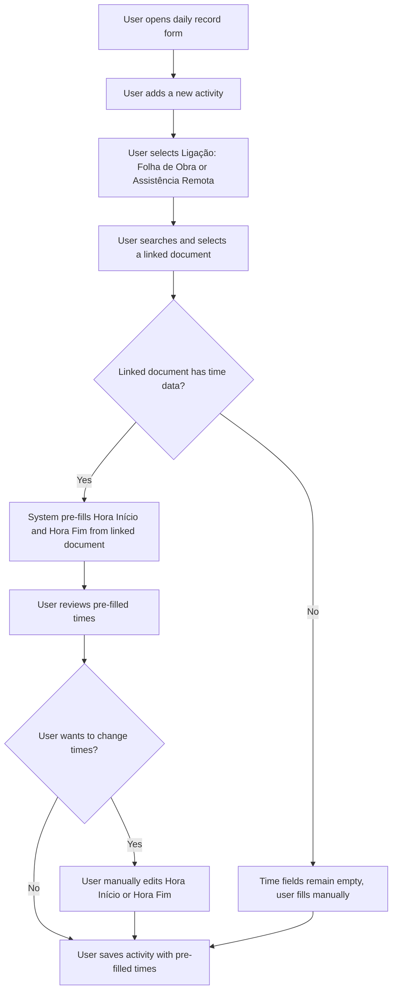
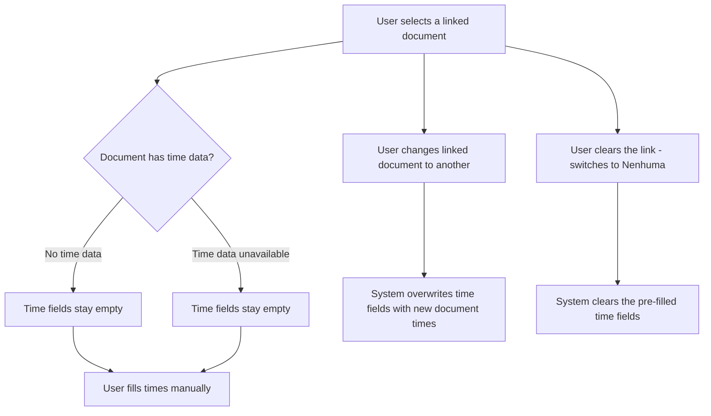

# Daily Record Time Prefill - Requirements

## Epic

[ ] **DRTP-E-001**: **As a** field worker **I want** the activity start and end times to be automatically filled when I link an activity to a Folha de Obra or Assistência Remota **So that** I don't have to manually re-enter times that are already recorded in the linked document

## User Flow

### Passing Cases Flow

[ ] Passing flow diagram

### Non-Passing Cases Flow

[ ] Non-passing flow diagram

## Technical Requirements

### Open questions

None.

### Business Rules

[ ] **DRTP-BR-001**: When a Folha de Obra is selected as the linked document, the activity's Hora Início SHALL be populated from the Folha de Obra's arrival time and Hora Fim from the departure time

[ ] **DRTP-BR-002**: When an Assistência Remota is selected as the linked document, the activity's Hora Início SHALL be populated from the start time of the assistance and Hora Fim from the end time of the assistance

[ ] **DRTP-BR-003**: If the linked document's time fields are empty or absent, the activity's time fields SHALL remain empty (no pre-fill occurs)

[ ] **DRTP-BR-004**: When the user changes the linked document to a different document of the same type, the time fields SHALL be overwritten with the new document's times — including any manually edited values — covered by DRTP-AC-004, DRTP-AC-008

[ ] **DRTP-BR-005**: When the user clears the link by switching the link type back to "Nenhuma", the pre-filled time fields SHALL be cleared — covered by DRTP-AC-009

[ ] **DRTP-BR-006**: After pre-fill, the user MAY manually edit the time fields; manual edits SHALL be preserved unless the linked document is changed — covered by DRTP-AC-010, DRTP-AC-011

### Performance

[ ] **DRTP-NFR-001**: The time pre-fill SHALL occur immediately upon document selection, with no perceptible delay to the user — covered by DRTP-AC-013

### Dependencies & Integration Requirements

**Internal**:
- Folha de Obra records — source of arrival time and departure time for pre-fill
- Assistência Remota records — source of start time and end time for pre-fill
- Daily record activity form — the form where pre-fill is applied

**External**: None

## UI/UX Requirements

**UX-001**: Time fields SHALL be visually updated immediately when a linked document is selected — covered by DRTP-AC-013

**UX-002**: Pre-filled time values SHALL be editable — covered by DRTP-AC-011

**UX-003**: No visual indicator is required to distinguish a pre-filled value from a manually entered value

**UX-004**: The pre-fill behavior applies in both the Create and Update daily record forms — covered by DRTP-AC-014

## User Stories

### Story: Pre-fill times from Folha de Obra

[ ] **DRTP-S-001**: **As a** field worker **I want** the activity times to be automatically filled when I select a Folha de Obra **So that** I avoid re-entering times already recorded in the work sheet

#### Acceptance Criteria

[ ] **DRTP-AC-001**: **WHEN** the user selects a Folha de Obra in an activity entry, the system **SHALL** populate Hora Início with the Folha de Obra's arrival time

[ ] **DRTP-AC-002**: **WHEN** the user selects a Folha de Obra in an activity entry, the system **SHALL** populate Hora Fim with the Folha de Obra's departure time

[ ] **DRTP-AC-003**: **WHEN** the selected Folha de Obra has no arrival time or departure time recorded, the system **SHALL** leave the corresponding activity time field empty

[ ] **DRTP-AC-004**: **WHEN** the user selects a different Folha de Obra after a previous selection, the system **SHALL** overwrite Hora Início and Hora Fim with the new document's times

### Story: Pre-fill times from Assistência Remota

[ ] **DRTP-S-002**: **As a** field worker **I want** the activity times to be automatically filled when I select an Assistência Remota **So that** I avoid re-entering times already recorded in the remote assistance record

#### Acceptance Criteria

[ ] **DRTP-AC-005**: **WHEN** the user selects an Assistência Remota in an activity entry, the system **SHALL** populate Hora Início with the start time of the assistance

[ ] **DRTP-AC-006**: **WHEN** the user selects an Assistência Remota in an activity entry, the system **SHALL** populate Hora Fim with the end time of the assistance

[ ] **DRTP-AC-007**: **WHEN** the selected Assistência Remota has no start time or end time recorded, the system **SHALL** leave the corresponding activity time field empty

[ ] **DRTP-AC-008**: **WHEN** the user selects a different Assistência Remota after a previous selection, the system **SHALL** overwrite Hora Início and Hora Fim with the new document's times

### Story: Clear times when link is removed

[ ] **DRTP-S-003**: **As a** field worker **I want** the pre-filled times to be cleared when I remove the link **So that** I don't accidentally submit times from a document I no longer intend to link

#### Acceptance Criteria

[ ] **DRTP-AC-009**: **WHEN** the user changes the link type to "Nenhuma" after a linked document was selected, the system **SHALL** clear Hora Início and Hora Fim

### Story: Manual override after pre-fill

[ ] **DRTP-S-004**: **As a** field worker **I want** to be able to manually correct the pre-filled times **So that** I can adjust for any discrepancy between the linked document and the actual activity

#### Acceptance Criteria

[ ] **DRTP-AC-010**: **WHEN** the user manually edits Hora Início or Hora Fim after a pre-fill, the system **SHALL** preserve the manually entered value until the user selects a different linked document

[ ] **DRTP-AC-011**: **WHILE** a linked document is selected, the time fields **SHALL** remain editable

### Story: No pre-fill when document has no time data

[ ] **DRTP-S-005**: **As a** field worker **I want** the form to behave gracefully when the linked document has no time data **So that** I can still complete the activity record manually

#### Acceptance Criteria

[ ] **DRTP-AC-012**: **IF** the linked document's time fields are empty or absent, **THEN** the system **SHALL** not modify the activity's Hora Início or Hora Fim fields

### Story: Pre-fill applies in both create and update forms

[ ] **DRTP-S-006**: **As a** field worker **I want** the time pre-fill to work whether I am creating a new daily record or editing an existing one **So that** I benefit from the same convenience in both situations

#### Acceptance Criteria

[ ] **DRTP-AC-013**: **WHEN** a linked document is selected, the system **SHALL** update the time fields immediately without requiring any additional user action

[ ] **DRTP-AC-014**: **WHEN** the user is creating a new daily record or editing an existing one, the pre-fill behavior **SHALL** apply in the same way

### Story: Pre-fill when switching between link types

[ ] **DRTP-S-007**: **As a** field worker **I want** the times to be updated correctly when I switch from one link type to another **So that** the times always reflect the currently selected document

#### Acceptance Criteria

[ ] **DRTP-AC-015**: **WHEN** the user changes the link type from "Folha de Obra" to "Assistência Remota" and selects a new document, the system **SHALL** overwrite Hora Início and Hora Fim with the Assistência Remota's times

[ ] **DRTP-AC-016**: **WHEN** the user changes the link type from "Assistência Remota" to "Folha de Obra" and selects a new document, the system **SHALL** overwrite Hora Início and Hora Fim with the Folha de Obra's times

## Related Documentation

- Folha de Obra module — provides arrival time and departure time
- Assistência Remota module — provides start time and end time of the assistance
- Daily Records module — the form where the pre-fill feature is applied

### Excluded scope

- Pre-filling break time from linked documents — not in scope
- Pre-filling subject or description from linked documents — not in scope
- Pre-filling times when no link type is selected — not applicable
- No changes to stored data or server-side logic are required — this feature affects only the form behavior
- Validation rule changes — existing time validation rules are unchanged
- Pre-filling times on the Update form for existing activities that already have a linked document — the pre-fill only triggers when the user actively selects or changes a linked document, not on form load
