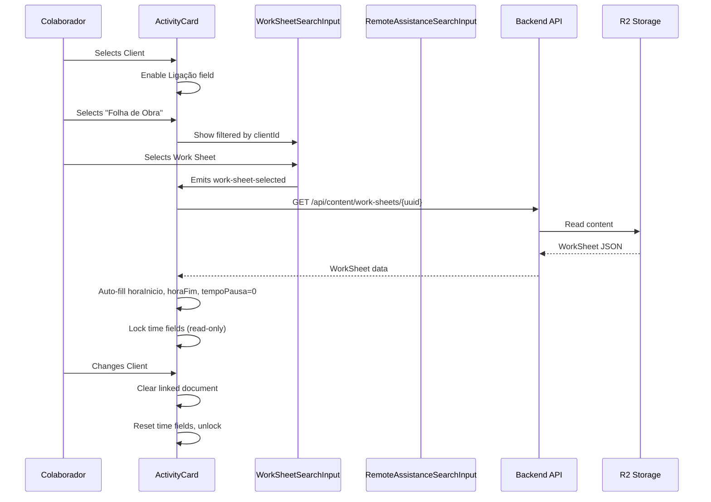
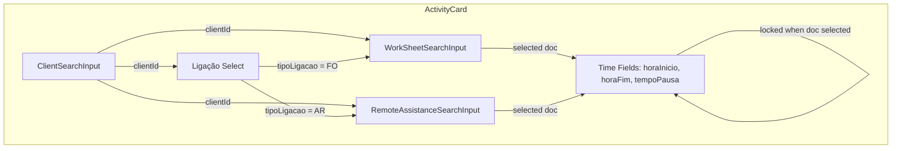
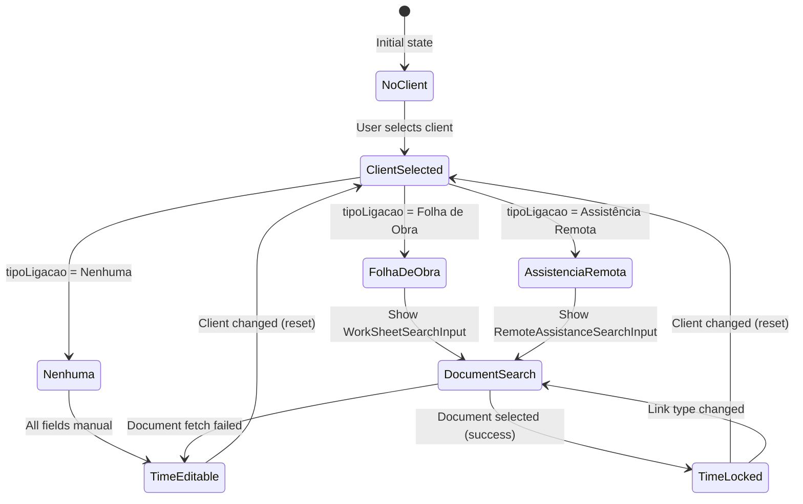

# Registo Diário — Fluxo de Ligação - Design

## Context & Scope

This design covers the "Ligação" (link) flow for daily activity records. Each activity within a daily record must have a mandatory client and a mandatory link type (Nenhuma / Folha de Obra / Assistência Remota). When linked to a document, time fields auto-fill and become read-only. The collaborator name must also appear in the list view.

**Actors:** Colaborador (field worker using the system)

**What changes:**
- ActivityCard component: add conditional read-only state for time fields when linked to a document
- ActivityCard component: add Pausa = 0 auto-fill on document selection
- DailyRecordsListView: add collaborator name display per list item
- Validation: enforce clientId and tipoLigacao as mandatory in both create and update

**What already exists and is preserved:**
- Activity type model already has `clientId`, `tipoLigacao`, `workSheetId`, `remoteAssistanceId` fields
- WorkSheetSearchInput and RemoteAssistanceSearchInput already filter by `clientId` prop
- ActivityCard already handles link type change, client selection clearing, and time auto-fill from linked documents
- Backend validation already enforces `tipoLigacao` and conditional document ID

**What is missing (this design addresses):**
- Time fields are NOT locked (read-only) when a document is selected — user can still edit them
- Pausa is not set to 0 on document selection
- Ligação field is not disabled when no client is selected (only legacy workaround exists)
- Collaborator name not shown in list view
- Error handling for failed document fetches (graceful degradation)

---

## Goals & Non-Goals

**Goals:**
- Lock time fields (horaInicio, horaFim, tempoPausa) in read-only state when a linked document is selected
- Auto-set tempoPausa to 0 when a document is selected
- Disable Ligação field until a client is selected (non-legacy activities)
- Display collaborator name in each list item
- Handle document fetch failures gracefully (keep fields editable)
- Identical behavior in create and update views

**Non-Goals:**
- Creating new work sheets or remote assistance records from within the daily record form
- Filtering list view by link type
- Bulk editing of activities
- Auto-filling the Assunto field
- Changing available link type options

---

## Architecture Overview

**Component interaction:**

---

## Data Models

### Activity Interface (existing — no structural changes)

🔗 [packages/shared/src/types/daily-records/types.ts](../../../packages/shared/src/types/daily-records/types.ts)
Contract: No field additions. All fields already exist. Behavioral change only (enforcement of mandatory fields in validation).

### Time Extraction Contracts

**Work Sheets:**
- `data.request.arrivalTime` → `horaInicio` (HH:MM string, direct copy)
- `data.request.departureTime` → `horaFim` (HH:MM string, direct copy)
- `tempoPausa` → hardcoded to `0`

**Remote Assistance:**
- `data.inicioAssistencia` → extract HH:MM from ISO datetime string → `horaInicio`
- `data.fimAssistencia` → extract HH:MM from ISO datetime string → `horaFim`
- `tempoPausa` → hardcoded to `0`

### DailyRecordData.technician (existing)

🔗 [packages/shared/src/types/daily-records/types.ts](../../../packages/shared/src/types/daily-records/types.ts)
Contract: `technician?: TechnicianUser` with `{ userId, firstName, lastName }` — used for collaborator display in list view.

---

## API / Interfaces

No new API endpoints required. The existing endpoints are sufficient:

🔗 [packages/backend/src/routes/daily-records.ts](../../../packages/backend/src/routes/daily-records.ts)
- `GET /api/content/work-sheets/{uuid}` — already used by ActivityCard to fetch time data
- `GET /api/content/remote-assistance/{uuid}` — already used by ActivityCard to fetch time data
- `GET /api/content/daily-records` — list endpoint already returns `technician` in index data

Contract: No API changes. The index already stores `technicianName` and `technicianUserId` fields (see `extractIndexFields` in daily-records routes).

---

## Form Logic — Conditional Fields

### State Machine per Activity

### Field States

| State | Ligação field | Document search | horaInicio | horaFim | tempoPausa | Assunto |
|-------|--------------|-----------------|------------|---------|------------|---------|
| No Client | disabled | hidden | editable | editable | editable | editable |
| Client + Nenhuma | enabled | hidden | editable | editable | editable | editable |
| Client + FO/AR (no doc) | enabled | visible | editable | editable | editable | editable |
| Client + FO/AR (doc selected, OK) | enabled | visible | **read-only** | **read-only** | **read-only (=0)** | editable |
| Client + FO/AR (doc fetch failed) | enabled | visible | editable | editable | editable | editable |

### Behavioral Rules

1. **Ligação disabled until client selected** — `select` element gets `:disabled="!localActivity.clientId && !isLegacyActivity"` (already exists)
2. **Time fields read-only when document selected** — new `timeFieldsLocked` computed:
   - `true` when `timeAutoPopulated === true` AND document is currently selected
   - Applied via `:readonly` and `:disabled` on time inputs + visual indicator (gray background)
3. **tempoPausa = 0 on document selection** — set in `handleWorkSheetSelected` and `handleRemoteAssistanceSelected`
4. **Client change clears everything** — already implemented in `handleClientSelected`, resets `timeAutoPopulated`
5. **Fetch failure = keep editable** — already handled in `.catch()` blocks (fields unchanged on error)
6. **Read-only visual indicator** — time inputs get `bg-gray-100 cursor-not-allowed` styling + optional lock icon

### Implementation Boundary

🔗 [packages/frontend/src/components/daily-records/ActivityCard.vue](../../../packages/frontend/src/components/daily-records/ActivityCard.vue)
Contract changes:
- Add `timeFieldsLocked` computed property: `timeAutoPopulated.value && (!!localActivity.value.workSheetId || !!localActivity.value.remoteAssistanceId)`
- Add `:disabled="timeFieldsLocked"` to horaInicio, horaFim, tempoPausa inputs
- Set `localActivity.value.tempoPausa = 0` in both document selection handlers
- Add error state display when fetch fails (notification message)

---

## Validation Rules

### Frontend Validation (already exists — minor enforcement change)

🔗 [packages/shared/src/types/daily-records/validation.ts](../../../packages/shared/src/types/daily-records/validation.ts)
Contract: `validateActivity()` already enforces:
- `clientId` mandatory for new records (`isNewRecord: true`)
- `tipoLigacao` mandatory (not empty, valid enum value)
- `workSheetId` required when `tipoLigacao === 'Folha de Obra'`
- `remoteAssistanceId` required when `tipoLigacao === 'Assistência Remota'`

No changes needed to validation logic — it already covers all DR-LIG-AC-012 to AC-015 requirements.

### Backend Validation (already exists)

🔗 [packages/backend/src/routes/daily-records.ts](../../../packages/backend/src/routes/daily-records.ts)
Contract: `validateDailyRecordCreate` and `validateDailyRecordUpdateData` already call `validateActivity()` from shared package. No changes needed.

**Decision: No validation code changes required**
Options: [A] Add extra frontend-only validation / [B] Rely on existing shared validation
Chosen: [B] — shared validation already covers all required cases. Adding frontend-only would be duplicate.

---

## List View — Collaborator Display

### Data Source

The daily-records index already stores `technicianName` per record (populated by `extractIndexFields`). However, the list endpoint returns full content objects, not index entries. The `technician` field is in `data.technician` of each DailyRecord.

### Display Logic

🔗 [packages/frontend/src/views/daily-records/DailyRecordsListView.vue](../../../packages/frontend/src/views/daily-records/DailyRecordsListView.vue)
Contract change: Add collaborator name badge in `#itemMeta` slot
- Source: `item.data.technician?.firstName + ' ' + item.data.technician?.lastName`
- Fallback: "Não atribuído" when `item.data.technician` is null/undefined (legacy data)
- Position: First badge in the meta row (before date badge)
- Style: `bg-amber-100 text-amber-800` badge with user icon

---

## Error Handling

### Document Fetch Failure (DR-LIG-S-007)

**Current behavior:** `.catch()` logs error, fields remain unchanged (whatever value was there before fetch).

**Required behavior (AC-018, AC-019):**
1. Time fields stay editable (don't lock) — already handled by not setting `timeAutoPopulated = true` in catch path
2. Show informative message: "Os tempos não puderam ser preenchidos automaticamente"

🔗 [packages/frontend/src/components/daily-records/ActivityCard.vue](../../../packages/frontend/src/components/daily-records/ActivityCard.vue)
Contract change:
- Add `fetchError` ref: `ref<string | null>(null)`
- On fetch failure: set `fetchError.value = 'Os tempos não puderam ser preenchidos automaticamente'`
- On new document selection (retry): clear `fetchError.value`
- Display: small warning text below time fields when `fetchError` is set
- Visual: `text-amber-600 text-xs` with warning icon

### Edge Cases

- **Document selected but fetch returns no time data** (empty arrivalTime/departureTime): Treat as fetch failure — keep fields editable, show warning
- **Client changed after fetch error**: Error message cleared (fresh state)
- **Link type changed**: Error message cleared

---

## Key Decisions

**Decision: Pausa = 0 (not extracted from document)**
Options: [A] Extract pause from document if available / [B] Always set to 0
Chosen: [B] — Neither work-sheets nor remote-assistance store a "pause" field. The pause is a daily-record concept. Setting to 0 reflects that the document time range has no breaks.

**Decision: Read-only via disabled attribute (not CSS-only)**
Options: [A] CSS visual only (gray styling) / [B] HTML disabled attribute + styling
Chosen: [B] — Using `:disabled` prevents actual input modification, not just visual cues. Safer against keyboard/paste input.

**Decision: Collaborator from data.technician (not from createdBy)**
Options: [A] Use `createdBy` field (Clerk user ID) and resolve name / [B] Use `data.technician` object
Chosen: [B] — `data.technician` already contains `firstName` and `lastName`, no extra API call needed. Already populated by auto-assign middleware.

---

## Open Questions

No open questions — all decisions are grounded in existing patterns and requirements.
