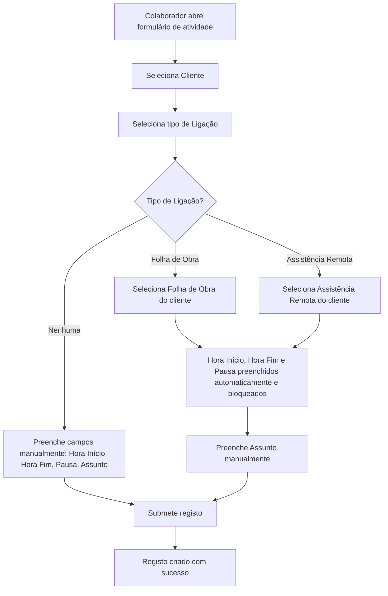
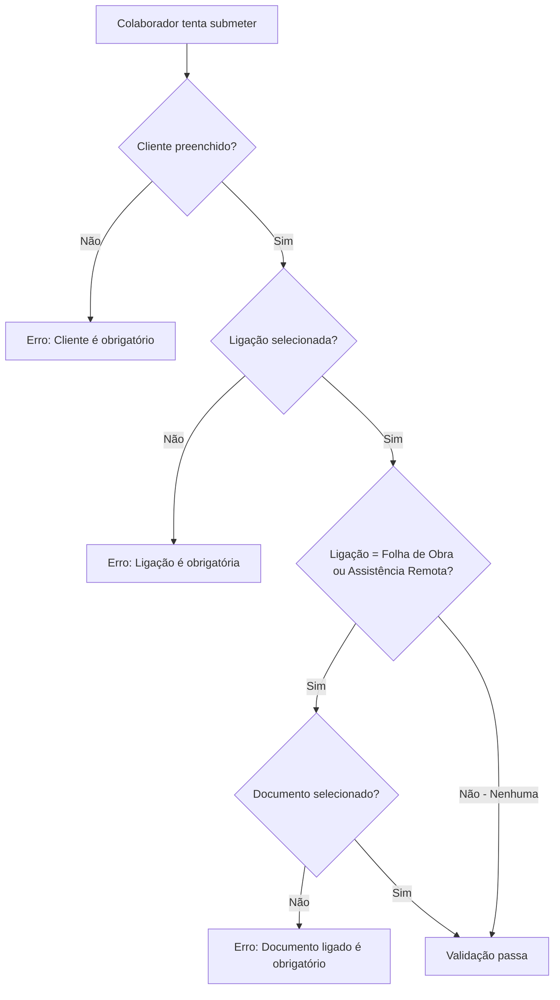

# Registo Diário — Fluxo de Ligação - Requirements

## Epic
[ ] **DR-LIG-E-001**: **As a** colaborador **I want** que cada atividade no registo diário tenha um cliente obrigatório e uma ligação obrigatória (com opção "Nenhuma") **So that** os registos estejam sempre associados ao contexto correto e os tempos sejam preenchidos automaticamente quando ligados a documentos existentes

## User Flow

### Passing Cases Flow
[ ] Fluxo nominal — criação de atividade com ligação

### Non-Passing Cases Flow
[ ] Fluxo de erros

## Technical Requirements

### Business Rules
[ ] **DR-LIG-BR-001**: O campo Cliente é obrigatório em cada atividade — o utilizador não pode submeter sem selecionar um cliente
[ ] **DR-LIG-BR-002**: O campo Ligação é obrigatório em cada atividade — o utilizador deve sempre selecionar uma opção (Nenhuma, Folha de Obra, ou Assistência Remota)
[ ] **DR-LIG-BR-003**: Quando a Ligação é "Nenhuma", o utilizador preenche todos os campos da atividade manualmente (hora início, hora fim, pausa, assunto, descrição)
[ ] **DR-LIG-BR-004**: Quando a Ligação é "Folha de Obra", o utilizador seleciona uma Folha de Obra e os campos Hora Início, Hora Fim e Pausa são preenchidos automaticamente a partir do documento selecionado
[ ] **DR-LIG-BR-005**: Quando a Ligação é "Assistência Remota", o utilizador seleciona uma Assistência Remota e os campos Hora Início, Hora Fim e Pausa são preenchidos automaticamente a partir do documento selecionado
[ ] **DR-LIG-BR-006**: Quando os campos de tempo e pausa são preenchidos automaticamente (ligação a documento), o utilizador não pode alterá-los manualmente — ficam em modo leitura
[ ] **DR-LIG-BR-007**: Na vista de lista do Registo Diário, o nome do colaborador (técnico) deve ser visível em cada item
[ ] **DR-LIG-BR-008**: Ao mudar o cliente selecionado, o documento ligado é limpo (se existente) e os campos de tempo/pausa auto-preenchidos são repostos ao estado editável
[ ] **DR-LIG-BR-009**: O campo Assunto é sempre preenchido manualmente pelo utilizador, independentemente do tipo de ligação selecionado
[ ] **DR-LIG-BR-010**: O comportamento dos campos (bloqueio/preenchimento automático) é idêntico nas vistas de criação e edição

### Performance
[ ] **DR-LIG-NFR-001**: O preenchimento automático dos campos de tempo após seleção de documento deve ocorrer em menos de 2 segundos

### Dependencies & Integration Requirements
**Internal**: Folhas de Obra (work-sheets), Assistências Remotas (remote-assistance), Clientes (clients)
**External**: Nenhuma

## UI/UX Requirements
[ ] **DR-LIG-UX-001**: Os campos de tempo e pausa bloqueados devem ter indicação visual clara de que são apenas de leitura (estilo desabilitado, fundo cinza, ou ícone de cadeado)
[ ] **DR-LIG-UX-002**: O nome do colaborador na lista deve ser visível sem necessidade de abrir o detalhe do registo
[ ] **DR-LIG-UX-003**: Mínimo 44px de área de toque em todos os campos interativos (mobile-first)

## User Stories

### Story: Atividade com Ligação Nenhuma (Caso Nominal)
[ ] **DR-LIG-S-001**: **As a** colaborador **I want** criar uma atividade com ligação "Nenhuma" **So that** posso registar trabalho não associado a documentos existentes

#### Acceptance Criteria
[ ] **DR-LIG-AC-001**: **WHEN** o utilizador seleciona "Nenhuma" no campo Ligação, the system **SHALL** permitir a edição manual dos campos Hora Início, Hora Fim e Pausa
[ ] **DR-LIG-AC-002**: **WHEN** o utilizador seleciona "Nenhuma" no campo Ligação, the system **SHALL** não exibir campos de seleção de documento (Folha de Obra ou Assistência Remota)
[ ] **DR-LIG-AC-003**: The system **SHALL** exigir o preenchimento do campo Cliente antes de permitir a seleção da Ligação

### Story: Atividade com Ligação a Folha de Obra
[ ] **DR-LIG-S-002**: **As a** colaborador **I want** ligar uma atividade a uma Folha de Obra existente **So that** os tempos são preenchidos automaticamente e o registo fica associado ao documento

#### Acceptance Criteria
[ ] **DR-LIG-AC-004**: **WHEN** o utilizador seleciona "Folha de Obra" no campo Ligação, the system **SHALL** exibir o campo de pesquisa de Folhas de Obra filtrado pelo cliente selecionado
[ ] **DR-LIG-AC-005**: **WHEN** o utilizador seleciona uma Folha de Obra, the system **SHALL** preencher automaticamente os campos Hora Início, Hora Fim e Pausa com os valores do documento (Pausa = 0)
[ ] **DR-LIG-AC-006**: **WHILE** uma Folha de Obra está selecionada como ligação, the system **SHALL** bloquear os campos Hora Início, Hora Fim e Pausa em modo de leitura (o utilizador não pode alterar)

### Story: Atividade com Ligação a Assistência Remota
[ ] **DR-LIG-S-003**: **As a** colaborador **I want** ligar uma atividade a uma Assistência Remota existente **So that** os tempos são preenchidos automaticamente e o registo fica associado ao documento

#### Acceptance Criteria
[ ] **DR-LIG-AC-007**: **WHEN** o utilizador seleciona "Assistência Remota" no campo Ligação, the system **SHALL** exibir o campo de pesquisa de Assistências Remotas filtrado pelo cliente selecionado
[ ] **DR-LIG-AC-008**: **WHEN** o utilizador seleciona uma Assistência Remota, the system **SHALL** preencher automaticamente os campos Hora Início, Hora Fim e Pausa com os valores do documento (Pausa = 0)
[ ] **DR-LIG-AC-009**: **WHILE** uma Assistência Remota está selecionada como ligação, the system **SHALL** bloquear os campos Hora Início, Hora Fim e Pausa em modo de leitura (o utilizador não pode alterar)

### Story: Mudança de Cliente Limpa Ligação
[ ] **DR-LIG-S-004**: **As a** colaborador **I want** que ao mudar o cliente, a ligação anterior seja removida **So that** não fico com um documento ligado que pertence a outro cliente

#### Acceptance Criteria
[ ] **DR-LIG-AC-010**: **WHEN** o utilizador altera o cliente selecionado, the system **SHALL** limpar o documento ligado e repor os campos Hora Início, Hora Fim e Pausa ao estado editável
[ ] **DR-LIG-AC-011**: **WHEN** o utilizador remove o cliente, the system **SHALL** limpar o documento ligado e desabilitar o campo de Ligação

### Story: Validação Obrigatória de Campos
[ ] **DR-LIG-S-005**: **As a** colaborador **I want** que o sistema valide os campos obrigatórios antes de submeter **So that** não crio registos incompletos

#### Acceptance Criteria
[ ] **DR-LIG-AC-012**: **IF** o campo Cliente está vazio ao submeter, **THEN** the system **SHALL** exibir erro "Cliente é obrigatório" e bloquear a submissão
[ ] **DR-LIG-AC-013**: **IF** o campo Ligação não tem opção selecionada ao submeter, **THEN** the system **SHALL** exibir erro "Ligação é obrigatória" e bloquear a submissão
[ ] **DR-LIG-AC-014**: **IF** a Ligação é "Folha de Obra" e nenhuma folha está selecionada ao submeter, **THEN** the system **SHALL** exibir erro "Folha de obra é obrigatória" e bloquear a submissão
[ ] **DR-LIG-AC-015**: **IF** a Ligação é "Assistência Remota" e nenhuma assistência está selecionada ao submeter, **THEN** the system **SHALL** exibir erro "Assistência remota é obrigatória" e bloquear a submissão

### Story: Colaborador Visível na Lista
[ ] **DR-LIG-S-006**: **As a** utilizador **I want** ver o nome do colaborador em cada item na vista de lista **So that** posso identificar rapidamente quem criou cada registo

#### Acceptance Criteria
[ ] **DR-LIG-AC-016**: The system **SHALL** exibir o nome do colaborador (técnico) em cada item da lista de Registos Diários
[ ] **DR-LIG-AC-017**: **IF** o registo não tem colaborador associado (dados legados), **THEN** the system **SHALL** exibir "Não atribuído" no lugar do nome

### Story: Falha ao Carregar Documento Ligado
[ ] **DR-LIG-S-007**: **As a** colaborador **I want** que se o carregamento do documento falhar, eu possa preencher os campos manualmente **So that** não fico bloqueado por uma falha de rede

#### Acceptance Criteria
[ ] **DR-LIG-AC-018**: **IF** o carregamento dos dados do documento ligado falha, **THEN** the system **SHALL** manter os campos Hora Início, Hora Fim e Pausa editáveis para preenchimento manual
[ ] **DR-LIG-AC-019**: **IF** o carregamento dos dados do documento ligado falha, **THEN** the system **SHALL** exibir uma mensagem informativa de que os tempos não puderam ser preenchidos automaticamente

## Related Documentation
- Folhas de Obra (work-sheets): campos `arrivalTime` e `departureTime`
- Assistências Remotas (remote-assistance): campos `inicioAssistencia` e `fimAssistencia`
- Automatic Technician Assignment: o colaborador é atribuído automaticamente via middleware

### Excluded scope
- Alteração do tipo de Ligação disponível (apenas Nenhuma, Folha de Obra, Assistência Remota)
- Criação de Folhas de Obra ou Assistências Remotas a partir do formulário de Registo Diário
- Filtros de lista baseados no tipo de Ligação
- Edição em massa de múltiplas atividades
- Auto-preenchimento do campo Assunto (sempre manual)
