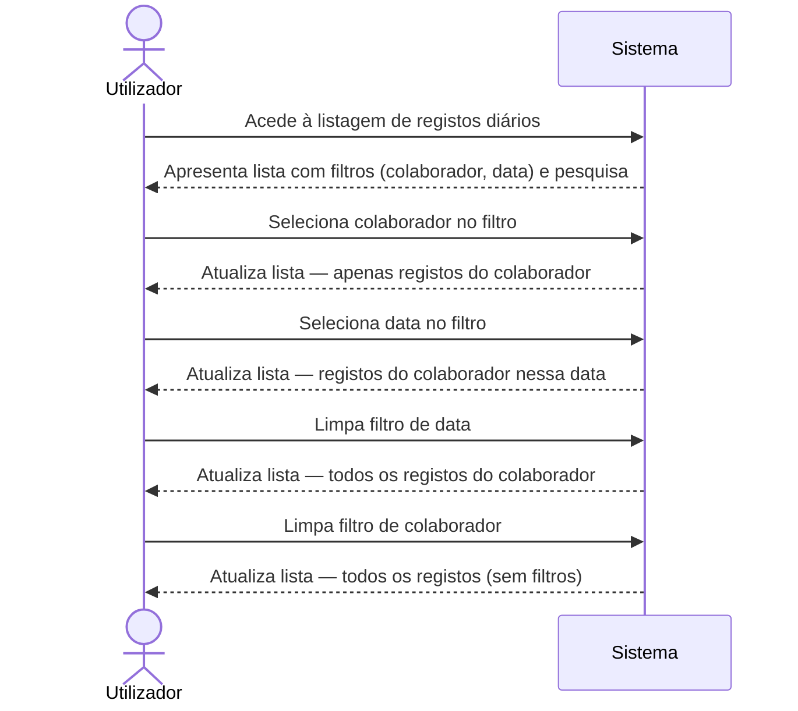

# Requisitos — Filtros na Listagem de Registos Diários de Atividade

## Âmbito

Esta especificação cobre a adição de filtros dedicados à página de listagem de Registos Diários de Atividade, permitindo ao utilizador filtrar por colaborador (técnico responsável) e por dia (data do registo).

### Incluído

- Filtro por colaborador na listagem de registos diários
- Filtro por dia (data do registo) na listagem de registos diários
- Combinação dos dois filtros em simultâneo
- Limpeza individual e total dos filtros
- Coexistência com a pesquisa por texto já existente

### Excluído

- Alterações aos formulários de criação ou edição de registos diários
- Alterações à vista de detalhe de registos diários
- Filtros noutros tipos de conteúdo (folhas de obra, assistências remotas, etc.)
- Exportação de dados filtrados
- Filtros avançados adicionais (tipo de atividade, ligações, horas)

## Restrições

- Os filtros devem seguir o design mobile-first com alvos tácteis mínimos de 44px
- A interface deve manter os rótulos em Português de Portugal
- Os filtros devem funcionar em conjunto com a pesquisa por texto e a paginação existentes
- O filtro de colaborador deve apresentar apenas colaboradores que tenham registos diários existentes

## Requisitos

### REQ-01 — Filtro por colaborador

**WHEN** o utilizador acede à listagem de registos diários, o sistema **SHALL** apresentar um filtro de seleção de colaborador que lista todos os colaboradores com registos diários existentes.

- **CA-01.1**: O filtro de colaborador apresenta a lista de colaboradores com registos diários, ordenada alfabeticamente por nome.
- **CA-01.2**: Ao selecionar um colaborador, a lista apresenta apenas os registos diários desse colaborador.
- **CA-01.3**: O filtro apresenta o nome completo do colaborador (primeiro nome + apelido).

### REQ-02 — Filtro por dia

**WHEN** o utilizador acede à listagem de registos diários, o sistema **SHALL** apresentar um filtro de seleção de data que permite escolher um dia específico.

- **CA-02.1**: O filtro de data permite selecionar um dia específico no formato dd/mm/aaaa.
- **CA-02.2**: Ao selecionar uma data, a lista apresenta apenas os registos diários dessa data.
- **CA-02.3**: O filtro de data apresenta o valor por defeito vazio (sem filtro aplicado).

### REQ-03 — Combinação de filtros

**WHILE** o utilizador tem filtros ativos, o sistema **SHALL** aplicar todos os filtros em conjunto (AND lógico), incluindo a pesquisa por texto existente.

- **CA-03.1**: Ao selecionar colaborador e data em simultâneo, a lista apresenta apenas os registos que satisfazem ambos os critérios.
- **CA-03.2**: Os filtros funcionam em conjunto com a pesquisa por texto existente.
- **CA-03.3**: Os filtros funcionam em conjunto com a paginação existente.

### REQ-04 — Limpeza de filtros

**WHEN** o utilizador pretende remover um filtro, o sistema **SHALL** permitir limpar cada filtro individualmente.

- **CA-04.1**: Cada filtro pode ser limpo individualmente, repondo o valor por defeito.
- **CA-04.2**: Ao limpar um filtro, a lista atualiza-se imediatamente para refletir os filtros restantes.

### REQ-05 — Estado sem resultados

**IF** a combinação de filtros ativos não produz resultados, **THEN** o sistema **SHALL** apresentar uma mensagem informativa indicando que não foram encontrados registos para os filtros selecionados.

- **CA-05.1**: A mensagem de estado vazio é distinta da mensagem de lista vazia sem filtros.
- **CA-05.2**: Os filtros ativos permanecem visíveis para que o utilizador possa ajustá-los.

### REQ-06 — Acessibilidade e design mobile-first

**WHEN** o utilizador acede à listagem de registos diários em qualquer dispositivo, o sistema **SHALL** apresentar os filtros com design responsivo, alvos tácteis mínimos de 44px e rótulos em Português de Portugal.

- **CA-06.1**: Os filtros têm alvos tácteis mínimos de 44px em dispositivos móveis.
- **CA-06.2**: Os rótulos dos filtros estão em Português de Portugal.
- **CA-06.3**: Os filtros adaptam-se ao ecrã em dispositivos móveis e desktop.

## Critérios de Aceitação [MA]

| REQ-ID | CA-ID | Given | When | Then | Prioridade |
|--------|-------|-------|------|------|------------|
| REQ-01 | CA-01.1 | A listagem de registos diários está carregada e existem registos de múltiplos colaboradores | O utilizador abre o filtro de colaborador | A lista de colaboradores aparece ordenada alfabeticamente por nome completo | Alta |
| REQ-01 | CA-01.2 | A listagem tem registos de vários colaboradores | O utilizador seleciona um colaborador no filtro | A lista apresenta apenas os registos diários desse colaborador | Alta |
| REQ-01 | CA-01.3 | Existem colaboradores com registos diários | O utilizador visualiza as opções do filtro de colaborador | Cada opção mostra o nome completo (primeiro nome + apelido) | Alta |
| REQ-02 | CA-02.1 | A listagem de registos diários está carregada | O utilizador interage com o filtro de data | O filtro permite selecionar um dia específico no formato dd/mm/aaaa | Alta |
| REQ-02 | CA-02.2 | Existem registos em múltiplas datas | O utilizador seleciona uma data no filtro | A lista apresenta apenas os registos diários dessa data | Alta |
| REQ-02 | CA-02.3 | A listagem é carregada pela primeira vez | O utilizador observa o filtro de data | O filtro apresenta o valor por defeito vazio (sem filtro aplicado) | Média |
| REQ-03 | CA-03.1 | Existem registos de vários colaboradores em várias datas | O utilizador seleciona um colaborador E uma data | A lista apresenta apenas os registos que satisfazem ambos os critérios | Alta |
| REQ-03 | CA-03.2 | O utilizador tem um filtro de colaborador ativo | O utilizador escreve texto na barra de pesquisa | A lista filtra pelos registos do colaborador que também correspondem ao texto | Alta |
| REQ-03 | CA-03.3 | O utilizador tem filtros ativos e existem mais resultados que o limite por página | O utilizador navega entre páginas | A paginação aplica-se sobre os resultados já filtrados | Média |
| REQ-04 | CA-04.1 | O utilizador tem o filtro de colaborador ativo | O utilizador limpa o filtro de colaborador | O filtro volta ao valor por defeito e a lista atualiza-se | Alta |
| REQ-04 | CA-04.2 | O utilizador tem ambos os filtros ativos | O utilizador limpa apenas o filtro de data | A lista atualiza-se mostrando todos os registos do colaborador selecionado | Alta |
| REQ-05 | CA-05.1 | O utilizador tem filtros ativos que não produzem resultados | O utilizador observa a listagem | Uma mensagem específica indica que não há registos para os filtros selecionados | Média |
| REQ-05 | CA-05.2 | Não há resultados para os filtros ativos | O utilizador observa a zona de filtros | Os filtros permanecem visíveis e editáveis | Média |
| REQ-06 | CA-06.1 | O utilizador acede à listagem num dispositivo móvel | O utilizador interage com os filtros | Os alvos tácteis dos filtros têm no mínimo 44px | Alta |
| REQ-06 | CA-06.2 | O utilizador visualiza os filtros | O utilizador lê os rótulos | Os rótulos estão em Português de Portugal | Alta |
| REQ-06 | CA-06.3 | O utilizador acede à listagem em desktop e em mobile | O utilizador observa o layout dos filtros | Os filtros adaptam-se ao tamanho do ecrã | Média |

## Cenário Nominal

## Regras de Negócio

| RB-ID | Condição | Ação | Erro |
|-------|----------|------|------|
| RB-01 | O filtro de colaborador é aberto | Apresentar apenas colaboradores que possuem pelo menos um registo diário, ordenados alfabeticamente por nome completo | — |
| RB-02 | O filtro de data é utilizado | A data é apresentada no formato dd/mm/aaaa (Português de Portugal) | — |
| RB-03 | Ambos os filtros estão ativos | Aplicar AND lógico entre colaborador, data e pesquisa por texto | — |
| RB-04 | Um filtro é limpo | Repor o valor por defeito (vazio) e recalcular a lista com os filtros restantes | — |
| RB-05 | A lista é filtrada e tem mais resultados que o limite por página | A paginação aplica-se sobre os resultados filtrados, reiniciando na página 1 | — |
| RB-06 | Não existem registos diários no sistema | O filtro de colaborador apresenta-se vazio (sem opções) | Mensagem de lista vazia padrão |

## Cenários Alternativos e de Erro

| Trigger | Comportamento | Resultado |
|---------|---------------|-----------|
| Não existem registos diários no sistema | O filtro de colaborador não apresenta opções | Mensagem de lista vazia padrão; filtros visíveis mas sem opções de colaborador |
| O colaborador selecionado não tem registos na data escolhida | A combinação de filtros não produz resultados | Mensagem informativa específica para filtros sem resultados; filtros permanecem editáveis |
| O utilizador limpa todos os filtros em sequência | Cada limpeza recalcula a lista progressivamente | A lista volta ao estado inicial (todos os registos, sem filtros) |
| Erro ao carregar a lista de registos | O sistema não consegue obter os dados | Mensagem de erro existente; filtros ficam desativados até nova tentativa |
| O utilizador altera filtros rapidamente em sequência | Múltiplas alterações de filtro em curto espaço de tempo | O sistema aplica apenas o estado final dos filtros, sem estados intermédios visíveis |
