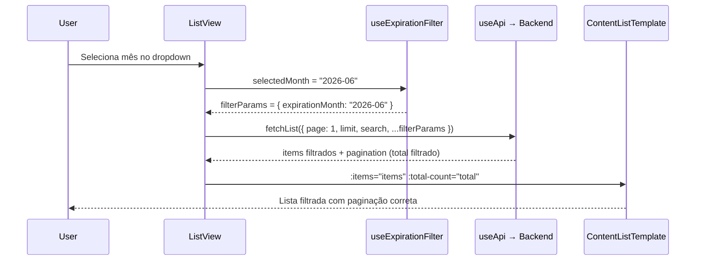

# Expiration Date Filter — Design (Refactored: Server-Side Filtering)

## 1. Data model — expiration date extraction from index

O filtro de expiração opera sobre os campos já presentes nos índices R2 (`indexes/{type}-index.json`). Não é necessário alterar a estrutura dos índices — os campos de data de expiração já são extraídos no `extractIndexFields` de cada content type.

### Campos de expiração por content type

| Content type | Campo(s) no índice | Regra de extração | Tipo retornado |
|-------------|-------------------|-------------------|----------------|
| Licenças (`licenses`) | `dataVencimento` | Leitura direta do campo | `string \| undefined` |
| Contratos (`contracts`) | `fimContratoCPA`, `fimContratoSH` | Usar a data mais próxima (earliest) das duas presentes. Se só uma existe, usar essa. Se nenhuma existe, `undefined`. | `string \| undefined` |

### Regras de extração

- A extração acontece no backend, dentro do `listFiltered`, sobre os campos do índice (não sobre o documento completo)
- Datas são strings ISO (`YYYY-MM-DD`) — comparação lexicográfica funciona
- Para comparar com o mês selecionado (`YYYY-MM`), extrair os primeiros 7 caracteres da data: `date.substring(0, 7)`
- Items onde a data de expiração é `undefined` são excluídos quando o filtro está ativo (REQ-08)
- Items sem data de expiração são incluídos normalmente quando nenhum filtro está ativo (REQ-08)

## 2. Backend — `listFiltered` extension with `expirationMonth`

O método `listFiltered` em `ConfigurableContentStorageService` (ficheiro `content-route-template.ts`) já suporta filtros `collaborator`, `date` e `search` em lógica AND antes da paginação. O filtro `expirationMonth` segue exatamente o mesmo padrão.

### Interface do filtro (alteração)

| Campo | Tipo | Antes | Depois |
|-------|------|-------|--------|
| `filters` param | `object` | `{ collaborator?, date?, search? }` | `{ collaborator?, date?, search?, expirationMonth? }` |
| `expirationMonth` | `string \| undefined` | — | Formato `YYYY-MM` (ex: `"2026-06"`) |

### Lógica de filtragem por `expirationMonth`

- Aplicada após os filtros existentes (`collaborator`, `date`, `search`) e antes do sort + paginação
- Para cada item no índice filtrado:

| Content type | Lógica | Detalhe |
|-------------|--------|---------|
| `contracts` | Calcular data de expiração = `min(fimContratoCPA, fimContratoSH)` das presentes | Se ambas existem, usar a menor. Se só uma, usar essa. |
| `licenses` | Data de expiração = `dataVencimento` | Leitura direta |
| Ambos | Comparar `expirationDate.substring(0, 7) === expirationMonth` | Match por ano-mês |
| Ambos | Se data de expiração é `undefined` → excluir item | REQ-08 |

### Determinação do content type

- O `ConfigurableContentStorageService` já tem acesso a `this.config.contentType`
- Usar `this.config.contentType` para decidir qual regra de extração aplicar
- Não é necessário inspecionar cada item individualmente — todos os items num índice são do mesmo tipo

### Posição na cadeia de filtragem

| Ordem | Filtro | Já existe? |
|-------|--------|-----------|
| 1 | `isDeleted === false` | Sim |
| 2 | `collaborator` | Sim |
| 3 | `date` | Sim |
| 4 | `search` | Sim |
| 5 | `expirationMonth` | **Novo** |
| 6 | Sort | Sim |
| 7 | Paginação (slice) | Sim |

### Impacto na paginação

- O `total` retornado reflete o dataset filtrado (após todos os filtros, incluindo `expirationMonth`) — REQ-03 (CA-03.3)
- A paginação opera sobre o array já filtrado — REQ-09 (CA-09.3)

## 3. Backend — route handler query parameter extraction

O handler GET `/` em `createContentRoutes` precisa de extrair o novo query parameter `expirationMonth` e passá-lo ao `listFiltered`.

### Alteração no handler

| Aspeto | Antes | Depois |
|--------|-------|--------|
| Query params extraídos | `search`, `collaborator`, `date`, `page`, `limit` | + `expirationMonth` |
| Condição `hasFilters` | `Boolean(collaborator \|\| date)` | `Boolean(collaborator \|\| date \|\| expirationMonth)` |
| Chamada `listFiltered` | `{ collaborator, date, search }` | `{ collaborator, date, search, expirationMonth }` |

### Validação do parâmetro

- Formato esperado: `YYYY-MM` (ex: `"2026-06"`)
- Se presente mas inválido (não corresponde a `/^\d{4}-\d{2}$/`): ignorar silenciosamente (tratar como se não tivesse sido enviado)
- Se ausente ou vazio: não aplicar filtro de expiração
- Não é necessário validar se o mês está dentro do range de 12 meses — o backend filtra por qualquer mês válido

### Exemplo de request

```
GET /api/content/contracts?page=1&limit=10&expirationMonth=2026-06
GET /api/content/licenses?page=1&limit=10&search=acme&expirationMonth=2026-06
```

## 4. Frontend — `useExpirationFilter` composable (refactored)

Ficheiro: `packages/frontend/src/composables/useExpirationFilter.ts`

O composable é simplificado: remove `filterItems()` e `getExpirationDate()` (a filtragem agora é server-side). Mantém apenas a gestão do estado do dropdown e a geração de opções.

### Exports removidos

| Export | Motivo da remoção |
|--------|-------------------|
| `getExpirationDate(item)` | Lógica movida para o backend `listFiltered` |
| `filterItems(items)` | Filtragem agora é server-side |

### API retornada (refactored)

| Nome | Tipo | Descrição | REQ |
|------|------|-----------|-----|
| `filterOptions` | `ComputedRef<FilterOption[]>` | 12 opções de mês a partir do mês atual | REQ-02 |
| `selectedMonth` | `Ref<string \| null>` | Valor selecionado (`"YYYY-MM"`) ou `null` | REQ-03, REQ-06 |
| `clearFilter` | `() => void` | Define `selectedMonth` como `null` | REQ-06 |
| `filterParams` | `ComputedRef<Record<string, string>>` | Parâmetros para enviar à API (`{ expirationMonth: "YYYY-MM" }` ou `{}`) | REQ-03, REQ-09 |

### `FilterOption` shape (sem alteração)

| Campo | Tipo | Exemplo |
|-------|------|---------|
| `value` | `string` | `"2026-03"` |
| `label` | `string` | `"Março 2026"` |

### Geração de opções de mês (sem alteração)

- 12 opções a partir do mês atual (inclusive) até 11 meses à frente
- Locale `pt-PT` via `Intl.DateTimeFormat` para nomes dos meses
- Primeira letra maiúscula (meses em português são minúsculos por defeito no `Intl`)
- Formato: `"{NomeMês} {Ano}"` — ex: `"Março 2026"`, `"Fevereiro 2027"`

### `filterParams` — novo export

- Segue o mesmo padrão de `useDailyRecordsFilters.filterParams`
- Quando `selectedMonth` é `null` → retorna `{}`
- Quando `selectedMonth` tem valor → retorna `{ expirationMonth: selectedMonth }`
- Usado no ListView para spread nos parâmetros da API: `api.fetchList({ page, limit, ...filterParams.value })`

### Parâmetro `contentType` — removido

- O composable já não precisa de saber o content type (não faz extração de datas)
- Assinatura simplificada: `useExpirationFilter()` sem parâmetros

## 5. Frontend — `ExpirationDateFilter` component (unchanged)

Ficheiro: `packages/frontend/src/components/common/ExpirationDateFilter.vue`

O componente não precisa de alterações — é puramente presentacional e já funciona corretamente.

### Props e emits (sem alteração)

| Prop | Tipo | Descrição |
|------|------|-----------|
| `options` | `FilterOption[]` | Opções de mês do composable |
| `modelValue` | `string \| null` | Valor selecionado (v-model) |

| Emit | Payload | Descrição |
|------|---------|-----------|
| `update:modelValue` | `string \| null` | Emitido na mudança de seleção ou clear |

### Comportamento existente

- `<select>` nativo com placeholder "Data de Expiração" (REQ-01, CA-01.3)
- Opção "Limpar filtro" visível quando há seleção ativa
- Mínimo 44px de altura (C-01)
- Emite `null` ao selecionar placeholder ou "Limpar filtro" (REQ-06)

### Nota sobre import

- O import de `FilterOption` muda de `@/composables/useExpirationFilter` — o tipo continua a ser exportado pelo composable refactored

## 6. Frontend — ListView integration (contracts + licenses)

### Estratégia de integração

A integração muda fundamentalmente: em vez de filtrar client-side com `filterItems()`, os ListViews passam `expirationMonth` como query parameter à API. O backend filtra antes da paginação.

### Data flow (refactored)



### Data flow (tabela equivalente)

| Passo | Ator | Ação | REQ |
|-------|------|------|-----|
| 1 | User | Seleciona mês no dropdown | REQ-03 |
| 2 | `useExpirationFilter` | `filterParams` atualiza para `{ expirationMonth: "YYYY-MM" }` | REQ-03 |
| 3 | ListView | Chama `fetchList({ page: 1, limit, ...filterParams })` | REQ-03, REQ-09 (CA-09.4) |
| 4 | Backend | Filtra índice por `expirationMonth` + search + paginação | REQ-03 (CA-03.2, CA-03.3) |
| 5 | ListView | Recebe items filtrados + total filtrado | REQ-07 |
| 6 | `ContentListTemplate` | Renderiza lista com paginação correta | REQ-09 (CA-09.3) |

### Alterações por ficheiro

| Ficheiro | Alteração | Detalhe |
|----------|-----------|---------|
| `ContractsListView.vue` | Refactor composable usage | Substituir `useExpirationFilter('contracts')` por `useExpirationFilter()`. Remover `filterItems` do computed `displayedContracts`. Adicionar `filterParams` ao `fetchList` e `handleSearch`. |
| `LicensesListView.vue` | Refactor composable usage | Substituir `useExpirationFilter('licenses')` por `useExpirationFilter()`. Remover `filterItems` do computed `displayedLicenses`. Adicionar `filterParams` ao `fetchList` e `handleSearch`. |

### Padrão de chamada API (ambos os views)

- Antes: `api.fetchList({ page, limit, search })` → client-side `filterItems(items)`
- Depois: `api.fetchList({ page, limit, search, ...filterParams.value })`
- Quando `selectedMonth` é `null`, `filterParams` é `{}` — nenhum parâmetro extra enviado
- Quando o filtro muda: reset para page 1 e re-fetch (REQ-09, CA-09.4)

### Watch no `selectedMonth`

- Adicionar `watch` no `selectedMonth` para re-fetch automático quando o filtro muda
- O watch chama `fetchList` com page 1 (reset de paginação) e os `filterParams` atualizados
- Segue o mesmo padrão usado no `DailyRecordsListView` para os filtros de collaborator/date

### Computed `displayedX` — simplificação

- Antes: `displayedContracts = filterItems(searchFilter(items))`
- Depois: `displayedContracts = items` (a filtragem e search são server-side)
- O computed pode ser removido ou simplificado para apenas retornar `api.items.value`

### Template (sem alteração estrutural)

- O `ExpirationDateFilter` já está no slot `#filters` do `ContentListTemplate`
- O `v-model` continua ligado a `selectedMonth`
- As `options` continuam a vir de `filterOptions`

## 7. Error handling and edge cases

| Cenário | Comportamento | REQ |
|---------|--------------|-----|
| Item sem data de expiração + filtro ativo | Backend exclui item dos resultados (data de expiração = `undefined`) | REQ-08 (CA-08.1) |
| Item sem data de expiração + sem filtro | Item incluído normalmente (filtro não aplicado) | REQ-08 (CA-08.2) |
| Contrato com apenas `fimContratoCPA` | Backend usa `fimContratoCPA` como data de expiração | REQ-04 (CA-04.2) |
| Contrato com apenas `fimContratoSH` | Backend usa `fimContratoSH` como data de expiração | REQ-04 (CA-04.2) |
| Contrato com ambas as datas | Backend usa a mais próxima (min) das duas | REQ-04 (CA-04.1) |
| Contrato sem nenhuma data | Tratado como sem data de expiração — excluído quando filtro ativo | REQ-08 |
| Data de expiração malformada (não ISO) no índice | `substring(0, 7)` não corresponde a nenhum `YYYY-MM` válido → item excluído | REQ-08 |
| Zero items correspondem ao filtro + search | Backend retorna `{ items: [], total: 0 }` → `ContentListTemplate` mostra empty state existente | REQ-07 (CA-07.1, CA-07.2) |
| User navega para fora e volta | `selectedMonth` é ref local — reset para `null` no remount do componente (sem persistência) | C-06 |
| Fronteira de mês — item expira no último dia do mês | ISO date `YYYY-MM-DD` → `substring(0, 7)` → corresponde ao mês selecionado corretamente | REQ-03 |
| `expirationMonth` com formato inválido no query param | Backend ignora silenciosamente (não aplica filtro) | — |
| Erro de rede durante fetch com filtro | `useApi` error handling existente trata o erro — mostra mensagem de erro | — |

- Não é necessário try/catch adicional no backend — a filtragem é comparação de strings sobre dados já carregados do índice
- Não são necessários loading states adicionais — o `useApi` já gere o loading state
- O empty state existente do `ContentListTemplate` cobre todos os cenários de zero resultados
