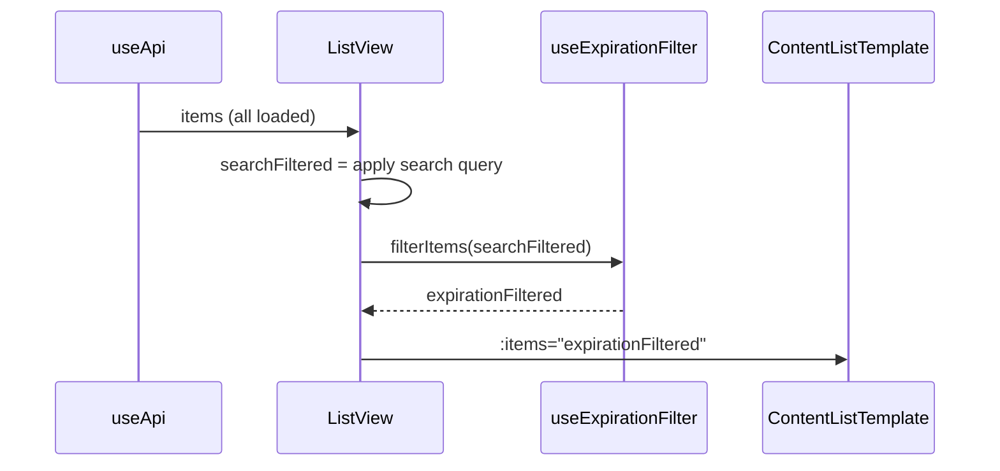

# Expiration Date Filter — Design

## 1. Data model — expiration date extraction

Each content type uses a different strategy to determine its expiration date:

| Content type | Source field(s) | Extraction rule | Return type |
|-------------|----------------|-----------------|-------------|
| Licenças | `data.dataVencimento` | Direct read — single ISO date string | `string \| undefined` |
| Contratos | `data.fimContratoCPA`, `data.fimContratoSH` | Take the soonest (earliest) of the two dates present. If only one exists, use that one. If neither exists, return `undefined`. | `string \| undefined` |

- The extraction logic is a pure function: `getExpirationDate(item: BaseContent): string | undefined`
- It inspects `item.contentType` to decide which rule to apply
- It lives in the composable (section 2), not in a separate utility — scope is too small to justify a file
- Dates are compared as ISO strings (lexicographic comparison works for `YYYY-MM-DD` format)
- Items where the function returns `undefined` are treated as "no expiration date" (see REQ-06)

## 2. Composable — `useExpirationFilter`

File: `packages/frontend/src/composables/useExpirationFilter.ts`

### Interface

| Export | Type | Description |
|--------|------|-------------|
| `useExpirationFilter(contentType)` | Function | Factory — returns all reactive state and methods below |
| `contentType` parameter | `'contracts' \| 'licenses'` | Determines which extraction rule to use |

### Returned API

| Name | Type | Description | REQ |
|------|------|-------------|-----|
| `filterOptions` | `ComputedRef<FilterOption[]>` | 12 month options starting from current month | REQ-02 |
| `selectedMonth` | `Ref<string \| null>` | Currently selected value (`"YYYY-MM"` format) or `null` | REQ-03, REQ-04 |
| `clearFilter` | `() => void` | Sets `selectedMonth` to `null` | REQ-04 |
| `filterItems` | `(items: BaseContent[]) => BaseContent[]` | Filters items by selected month; returns all items if no filter active | REQ-03, REQ-06, REQ-07 |

### `FilterOption` shape

| Field | Type | Example |
|-------|------|---------|
| `value` | `string` | `"2026-03"` |
| `label` | `string` | `"Março 2026"` |

### Month generation rules

- Generate 12 options starting from the current month (inclusive) through 11 months ahead
- Use `pt-PT` locale for month names via `Intl.DateTimeFormat`
- Capitalize first letter of month name (Portuguese months are lowercase by default from `Intl`)
- Format: `"{MonthName} {Year}"` — e.g., `"Março 2026"`, `"Fevereiro 2027"`
- Computed at composable creation time — no reactivity on current date needed (page reload recomputes)

### Filtering logic

- If `selectedMonth` is `null` → return all items unchanged (no filtering)
- For each item, call `getExpirationDate(item)` (section 1)
- If expiration date is `undefined` → exclude item from filtered results (REQ-06)
- Extract `YYYY-MM` from the expiration date and compare with `selectedMonth`
- Return only items where `YYYY-MM` matches

### Coexistence with search (REQ-07)

- The composable does NOT handle search — it only filters by expiration month
- The ListView applies search first (existing logic), then passes the result to `filterItems`
- Both criteria are applied as intersection: item must match search AND expiration month

## 3. Component — `ExpirationDateFilter` dropdown

File: `packages/frontend/src/components/common/ExpirationDateFilter.vue`

### Props

| Prop | Type | Required | Default | Description |
|------|------|----------|---------|-------------|
| `options` | `FilterOption[]` | Yes | — | Month options from composable |
| `modelValue` | `string \| null` | Yes | — | Selected month value (v-model) |

### Emits

| Event | Payload | Description |
|-------|---------|-------------|
| `update:modelValue` | `string \| null` | Emitted on selection change or clear |

### Template structure

- Native `<select>` element with Tailwind styling — simplest viable solution, no custom dropdown library
- Default option: `"Data de Expiração"` (placeholder, value `""`) — REQ-01 (CA-01.3)
- One `<option>` per `FilterOption` in `options` prop
- When selection changes to `""` (placeholder), emit `null` to clear filter — REQ-04

### Styling rules

- Minimum height 44px (touch target — C-01)
- Same border, rounded corners, and focus ring as `SearchBar` input for visual consistency — C-05
- Tailwind classes: `border border-gray-300 rounded-lg py-3 px-4 text-base focus:ring-2 focus:ring-primary-500 focus:border-primary-500`
- Full width on mobile, auto width on larger screens
- Text color: `text-gray-700` when a month is selected, `text-gray-400` for placeholder state

### Placement

- Rendered inside `ContentListTemplate` via a new slot or directly in each ListView
- Positioned between the search bar and the items list — same row as search on desktop, stacked on mobile

## 4. Integration — ListView changes

### Integration strategy

The `ExpirationDateFilter` component is placed directly inside each ListView, not inside `ContentListTemplate`. This avoids modifying the shared template (which serves all content types) for a feature only needed by two.

Each ListView already computes a `displayedX` array from search. The expiration filter is applied as a second stage on that array before passing it to `ContentListTemplate`.

### Data flow

| Step | Actor | Action | REQ |
|------|-------|--------|-----|
| 1 | `useApi` | Loads all items from R2 | — |
| 2 | ListView | Applies existing search filter → `searchFiltered` | — |
| 3 | `useExpirationFilter` | `filterItems(searchFiltered)` → applies month filter | REQ-03, REQ-06 |
| 4 | ListView | Passes result to `ContentListTemplate` as `:items` | REQ-07 |

### Changes per file

| File | Change | Details |
|------|--------|---------|
| `ContractsListView.vue` | Import composable + component | Add `useExpirationFilter('contracts')`, render `ExpirationDateFilter` above `ContentListTemplate`, chain filter in `displayedContracts` computed |
| `LicensesListView.vue` | Import composable + component | Add `useExpirationFilter('licenses')`, render `ExpirationDateFilter` above `ContentListTemplate`, chain filter in `displayedLicenses` computed |

### Computed property pattern (both views)

- Current: `displayedX = searchFilter(items)`
- New: `displayedX = filterItems(searchFilter(items))`
- When no filter is active (`selectedMonth === null`), `filterItems` returns the input unchanged — zero overhead

### Template placement

- The `ExpirationDateFilter` dropdown is rendered in the ListView template, between the `ContentListTemplate` opening tag and its content
- Positioned in a flex row with the search bar area on desktop (`flex flex-col sm:flex-row gap-3`), stacked on mobile
- The dropdown sits next to or below the search bar, before the items list

### Empty state handling

- When the combined search + filter yields zero results, `ContentListTemplate` shows its existing empty state
- The empty state message already handles search context; the filter adds no new empty state — the existing `emptySearchMessage` covers it (REQ-05)

## 5. Error handling and edge cases

| Scenario | Behavior | REQ |
|----------|----------|-----|
| Item has no expiration date + filter active | `getExpirationDate` returns `undefined` → item excluded from results | REQ-06 |
| Item has no expiration date + no filter | Item displayed normally (no filtering applied) | REQ-06 |
| Contract has only `fimContratoCPA` | Use `fimContratoCPA` as expiration date | REQ-03 (CA-03.5) |
| Contract has only `fimContratoSH` | Use `fimContratoSH` as expiration date | REQ-03 (CA-03.5) |
| Contract has both dates | Use the soonest (earliest / min) of the two | REQ-03 (CA-03.5) |
| Contract has neither date | Treated as no expiration date | REQ-06 |
| Expiration date is malformed (not ISO) | `getExpirationDate` returns `undefined` — item excluded when filter active | REQ-06 |
| Zero items match filter + search | `ContentListTemplate` shows existing empty state message | REQ-05 |
| User navigates away and returns | `selectedMonth` is a local ref — resets to `null` on component remount (no persistence) | C-06 |
| Month boundary — item expires on last day of month | ISO date `YYYY-MM-DD` → extract `YYYY-MM` → matches selected month correctly | REQ-03 |

- No try/catch needed — all operations are pure string comparisons on already-loaded data
- No network errors possible — this is entirely client-side
- No loading states needed — filtering is synchronous on in-memory arrays
