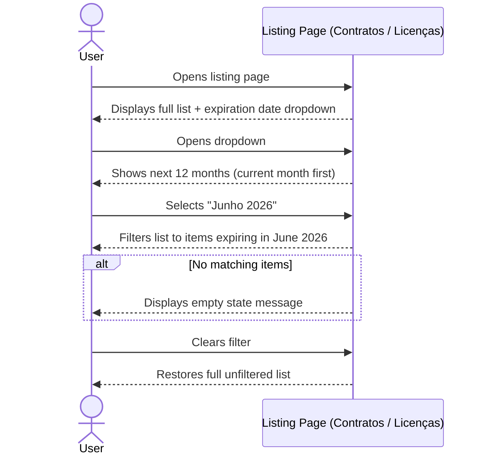

# Expiration Date Filter — Requirements

## Actors

| Actor | Description |
|-------|-------------|
| User | Any authenticated staff member browsing the Contratos or Licenças listing pages |

## Scope

### Included

- Dropdown filter on the Contratos listing page
- Dropdown filter on the Licenças listing page
- Filter values represent the next 12 months from the current date (year + month granularity)
- Filtering narrows the displayed list to items expiring in the selected month
- Clearing the filter restores the full unfiltered list

### Excluded

- No changes to the detail, create, or update views
- No backend API changes (filtering is client-side on already-loaded data)
- No filtering by exact day — month granularity only
- No persistent filter state across page navigation
- No filtering on other content types beyond Contratos and Licenças

## Requirements

### REQ-01 — Filter dropdown presence

The system **SHALL** display an expiration date filter dropdown on the Contratos listing page and on the Licenças listing page.

- **CA-01.1**: The dropdown is visible on the Contratos listing page
- **CA-01.2**: The dropdown is visible on the Licenças listing page
- **CA-01.3**: The dropdown label reads "Data de Expiração" (or equivalent Portuguese label)

### REQ-02 — Dropdown options generation

The system **SHALL** populate the filter dropdown with the next 12 months starting from the current month, each option displaying year and month.

- **CA-02.1**: The dropdown contains exactly 12 options
- **CA-02.2**: The first option corresponds to the current month
- **CA-02.3**: The last option corresponds to 11 months after the current month
- **CA-02.4**: Each option displays the month name and year in a readable format (e.g., "Março 2026")

### REQ-03 — Filtering behavior

**WHEN** the user selects a month from the dropdown, the system **SHALL** filter the listing to show only items whose expiration date falls within the selected month.

- **CA-03.1**: Only items expiring in the selected year-month are displayed
- **CA-03.2**: Items expiring in other months are hidden
- **CA-03.3**: The filter applies immediately upon selection
- **CA-03.4**: For Licenças, the expiration date field is `dataVencimento`
- **CA-03.5**: For Contratos, the expiration date is the soonest of `fimContratoCPA` and `fimContratoSH` (whichever is present; if both exist, use the earliest)

### REQ-04 — Clear filter

**WHEN** the user clears the filter selection, the system **SHALL** restore the full unfiltered listing.

- **CA-04.1**: All items are displayed again after clearing
- **CA-04.2**: The dropdown returns to its default unselected state

### REQ-05 — Empty results

**IF** no items match the selected expiration month, **THEN** the system **SHALL** display an appropriate empty state message.

- **CA-05.1**: A message indicates no items were found for the selected month

### REQ-06 — Items without expiration date

**WHILE** a filter month is selected, the system **SHALL** exclude items that have no expiration date from the filtered results.

- **CA-06.1**: Items without an expiration date are not shown when a filter is active
- **CA-06.2**: Items without an expiration date are shown when no filter is active

### REQ-07 — Coexistence with existing search

The system **SHALL** allow the expiration date filter to work alongside the existing search functionality.

- **CA-07.1**: The user can apply both a search term and an expiration date filter simultaneously
- **CA-07.2**: Results reflect both the search term and the selected expiration month

## Constraints

- **C-01**: Mobile-first — the dropdown must have a minimum touch target of 44px and be usable on small screens
- **C-02**: Client-side only — filtering happens on already-loaded listing data, no new API endpoints
- **C-02.1**: Licenças expiration field: `dataVencimento`
- **C-02.2**: Contratos expiration field: soonest of `fimContratoCPA` / `fimContratoSH` (use whichever is present; if both, use the earliest date)
- **C-03**: Relative date calculation — the 12-month range is computed from the current date at render time, not hardcoded
- **C-04**: Portuguese UI — all labels, month names, and empty state messages in Português (Portugal)
- **C-05**: Consistent pattern — the filter must follow the same visual style and placement on both Contratos and Licenças listing pages
- **C-06**: No persistent state — the filter resets when navigating away from the listing page

## Alternative and Error Scenarios

| Trigger | Behavior | Result |
|---------|----------|--------|
| User selects a month with no matching items | System filters and finds zero results | Empty state message displayed |
| Item has no expiration date field | Item excluded from filtered results | Item still visible when no filter is active |
| User selects a month then clears the filter | System removes the filter | Full listing restored |
| User applies search + filter simultaneously | Both criteria applied together | Only items matching both search and expiration month shown |
| User navigates away and returns to listing | Filter state is not persisted | Listing shows unfiltered results, dropdown in default state |

## [MA] Mirror — Acceptance Criteria

| REQ-ID | CA-ID | Given | When | Then | Priority |
|--------|-------|-------|------|------|----------|
| REQ-01 | CA-01.1 | The user is on the Contratos listing page | The page loads | An expiration date filter dropdown is visible | High |
| REQ-01 | CA-01.2 | The user is on the Licenças listing page | The page loads | An expiration date filter dropdown is visible | High |
| REQ-01 | CA-01.3 | The dropdown is visible | The user reads the label | The label reads "Data de Expiração" or equivalent | Medium |
| REQ-02 | CA-02.1 | The dropdown is open | The user views the options | Exactly 12 options are listed | High |
| REQ-02 | CA-02.2 | The current month is March 2026 | The user opens the dropdown | The first option is "Março 2026" | High |
| REQ-02 | CA-02.3 | The current month is March 2026 | The user opens the dropdown | The last option is "Fevereiro 2027" | High |
| REQ-02 | CA-02.4 | The dropdown is open | The user reads an option | Each option shows month name and year (e.g., "Março 2026") | Medium |
| REQ-03 | CA-03.1 | Items exist with various expiration dates | The user selects "Junho 2026" | Only items expiring in June 2026 are displayed | High |
| REQ-03 | CA-03.2 | Items exist expiring in other months | The user selects "Junho 2026" | Items expiring outside June 2026 are hidden | High |
| REQ-03 | CA-03.3 | The dropdown is available | The user selects a month | The list updates immediately | High |
| REQ-03 | CA-03.4 | A Licença has `dataVencimento` set | The user selects a month | The filter matches against `dataVencimento` | High |
| REQ-03 | CA-03.5 | A Contrato has `fimContratoCPA` and/or `fimContratoSH` | The user selects a month | The filter matches against the soonest of the two dates | High |
| REQ-04 | CA-04.1 | A filter is currently active | The user clears the filter | All items are displayed again | High |
| REQ-04 | CA-04.2 | A filter is currently active | The user clears the filter | The dropdown returns to its default state | Medium |
| REQ-05 | CA-05.1 | No items expire in the selected month | The user selects that month | An empty state message is shown | Medium |
| REQ-06 | CA-06.1 | Some items have no expiration date | The user selects a filter month | Items without expiration date are hidden | High |
| REQ-06 | CA-06.2 | Some items have no expiration date | No filter is active | Items without expiration date are visible | High |
| REQ-07 | CA-07.1 | A search term is entered | The user also selects an expiration month | Both filters apply simultaneously | Medium |
| REQ-07 | CA-07.2 | A search term and expiration filter are active | The user views results | Only items matching both criteria are shown | Medium |

## Nominal Scenario

## Business Rules

| RB-ID | Condition | Action | Error |
|-------|-----------|--------|-------|
| RB-01 | Current date determines the 12-month range | Generate options from current month (inclusive) through 11 months ahead | N/A |
| RB-02 | An item's expiration date falls within the selected year-month | Include the item in filtered results | N/A |
| RB-03 | An item has no expiration date and a filter is active | Exclude the item from filtered results | N/A |
| RB-04 | Both search and expiration filter are active | Apply both criteria (intersection) — item must match search AND fall within selected month | N/A |
| RB-05 | Month names displayed in Portuguese (Portugal) locale | Use "Janeiro", "Fevereiro", "Março", etc. | N/A |
