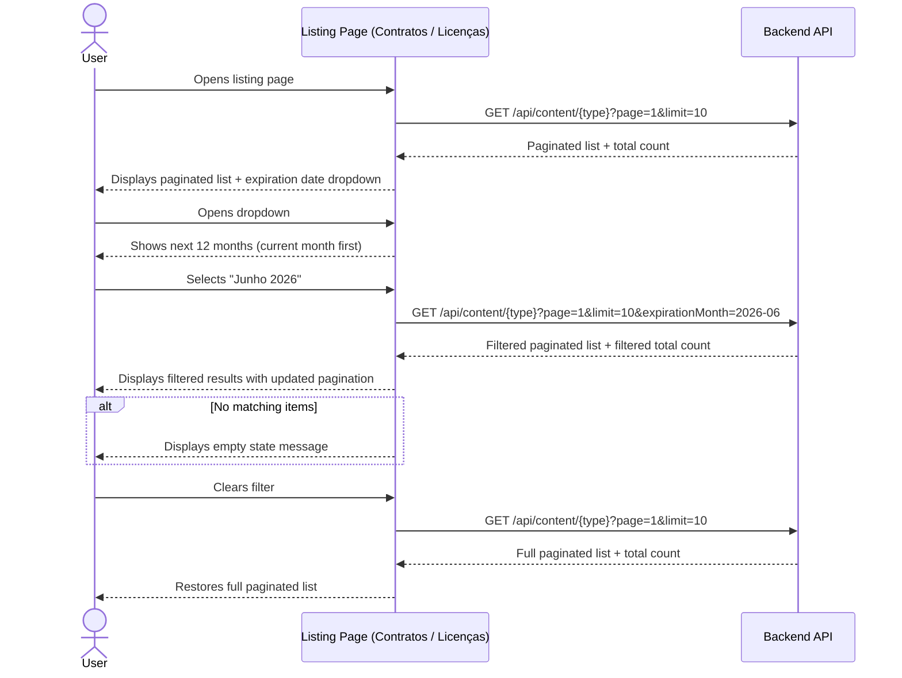

# Expiration Date Filter — Requirements (Refactored)

## Actors

| Actor | Description |
|-------|-------------|
| User | Any authenticated staff member browsing the Contratos or Licenças listing pages |

## Scope

### Included

- Dropdown filter on the Contratos listing page
- Dropdown filter on the Licenças listing page
- Filter values represent the next 12 months from the current date (year + month granularity)
- Backend receives the selected month as a query parameter and filters the index before pagination
- Pagination totals reflect the filtered dataset
- Clearing the filter restores the full unfiltered, paginated list
- Frontend sends the filter value alongside existing search and pagination parameters

### Excluded

- No changes to the detail, create, or update views
- No filtering by exact day — month granularity only
- No persistent filter state across page navigation
- No filtering on other content types beyond Contratos and Licenças
- No client-side filtering — all filtering happens on the backend before pagination

## Requirements

### REQ-01 — Filter dropdown presence

The system **SHALL** display an expiration date filter dropdown on the Contratos listing page and on the Licenças listing page.

- **CA-01.1**: The dropdown is visible on the Contratos listing page
- **CA-01.2**: The dropdown is visible on the Licenças listing page
- **CA-01.3**: The dropdown label reads "Data de Expiração" (or equivalent Portuguese label)

### REQ-02 — Dropdown options generation

The system **SHALL** populate the filter dropdown with the next 12 months starting from the current month, each option displaying year and month.

- **CA-02.1**: The dropdown contains exactly 12 options
- **CA-02.2**: The first option corresponds to the current month
- **CA-02.3**: The last option corresponds to 11 months after the current month
- **CA-02.4**: Each option displays the month name and year in a readable format (e.g., "Março 2026")

### REQ-03 — Backend filter parameter

**WHEN** the user selects a month from the dropdown, the system **SHALL** send the selected month as a query parameter to the list endpoint so that filtering occurs on the server before pagination.

- **CA-03.1**: The list request includes the selected month value (format `YYYY-MM`) as a query parameter
- **CA-03.2**: The backend filters the content index by the selected month before applying pagination
- **CA-03.3**: The pagination total reflects only items matching the selected month
- **CA-03.4**: The filter is applied in AND logic with existing search and other filters

### REQ-04 — Filtering behavior (Contratos)

**WHEN** the backend receives an expiration month filter for Contratos, the system **SHALL** match items whose expiration date falls within the selected month, where the expiration date is the soonest of `fimContratoCPA` and `fimContratoSH`.

- **CA-04.1**: If both `fimContratoCPA` and `fimContratoSH` exist, the earliest date is used
- **CA-04.2**: If only one date exists, that date is used
- **CA-04.3**: Only items whose expiration year-month matches the selected month are returned

### REQ-05 — Filtering behavior (Licenças)

**WHEN** the backend receives an expiration month filter for Licenças, the system **SHALL** match items whose `dataVencimento` falls within the selected month.

- **CA-05.1**: The filter matches against the `dataVencimento` field
- **CA-05.2**: Only items whose expiration year-month matches the selected month are returned

### REQ-06 — Clear filter

**WHEN** the user clears the filter selection, the system **SHALL** restore the full unfiltered, paginated listing.

- **CA-06.1**: All items are displayed again (paginated) after clearing
- **CA-06.2**: The dropdown returns to its default unselected state
- **CA-06.3**: The list request no longer includes the expiration month parameter

### REQ-07 — Empty results

**IF** no items match the selected expiration month (combined with any active search), **THEN** the system **SHALL** display an appropriate empty state message.

- **CA-07.1**: A message indicates no items were found for the selected month
- **CA-07.2**: The pagination total shows zero

### REQ-08 — Items without expiration date

**WHILE** a filter month is selected, the system **SHALL** exclude items that have no expiration date from the filtered results.

- **CA-08.1**: Items without an expiration date are not returned when a filter is active
- **CA-08.2**: Items without an expiration date are returned normally when no filter is active

### REQ-09 — Coexistence with existing search and pagination

The system **SHALL** allow the expiration date filter to work alongside the existing search functionality and pagination.

- **CA-09.1**: The user can apply both a search term and an expiration date filter simultaneously
- **CA-09.2**: Results reflect both the search term and the selected expiration month (AND logic)
- **CA-09.3**: Pagination controls work correctly on the filtered dataset
- **CA-09.4**: Changing the filter resets pagination to page 1

## Constraints

- **C-01**: Mobile-first — the dropdown must have a minimum touch target of 44px and be usable on small screens
- **C-02**: Server-side filtering — the backend filters the index before pagination; the frontend does not filter locally
- **C-02.1**: Licenças expiration field: `dataVencimento`
- **C-02.2**: Contratos expiration field: soonest of `fimContratoCPA` / `fimContratoSH` (use whichever is present; if both, use the earliest date)
- **C-03**: Relative date calculation — the 12-month range is computed from the current date at render time on the frontend, not hardcoded
- **C-04**: Portuguese UI — all labels, month names, and empty state messages in Português (Portugal)
- **C-05**: Consistent pattern — the filter must follow the same visual style and placement on both Contratos and Licenças listing pages
- **C-06**: No persistent state — the filter resets when navigating away from the listing page
- **C-07**: Consistent with existing filters — the expiration month filter follows the same AND-logic pattern as the existing `collaborator` and `date` filters on the backend

## Alternative and Error Scenarios

| Trigger | Behavior | Result |
|---------|----------|--------|
| User selects a month with no matching items | Backend filters and finds zero results | Empty state message displayed, pagination total is zero |
| Item has no expiration date field | Item excluded from filtered results by backend | Item still visible when no filter is active |
| User selects a month then clears the filter | Frontend removes the filter parameter from the request | Full paginated listing restored |
| User applies search + filter simultaneously | Both criteria applied in AND logic on the backend | Only items matching both search and expiration month shown |
| User navigates away and returns to listing | Filter state is not persisted | Listing shows unfiltered results, dropdown in default state |
| User changes filter while on page 2+ | Frontend resets to page 1 and sends new request | Results for page 1 of the filtered dataset displayed |
| Contract has neither `fimContratoCPA` nor `fimContratoSH` | Treated as no expiration date | Excluded when filter active, visible when no filter |

## [MA] Mirror — Acceptance Criteria

| REQ-ID | CA-ID | Given | When | Then | Priority |
|--------|-------|-------|------|------|----------|
| REQ-01 | CA-01.1 | The user is on the Contratos listing page | The page loads | An expiration date filter dropdown is visible | High |
| REQ-01 | CA-01.2 | The user is on the Licenças listing page | The page loads | An expiration date filter dropdown is visible | High |
| REQ-01 | CA-01.3 | The dropdown is visible | The user reads the label | The label reads "Data de Expiração" or equivalent | Medium |
| REQ-02 | CA-02.1 | The dropdown is open | The user views the options | Exactly 12 options are listed | High |
| REQ-02 | CA-02.2 | The current month is March 2026 | The user opens the dropdown | The first option is "Março 2026" | High |
| REQ-02 | CA-02.3 | The current month is March 2026 | The user opens the dropdown | The last option is "Fevereiro 2027" | High |
| REQ-02 | CA-02.4 | The dropdown is open | The user reads an option | Each option shows month name and year (e.g., "Março 2026") | Medium |
| REQ-03 | CA-03.1 | The user selects "Junho 2026" | The frontend sends a list request | The request includes the expiration month parameter with value "2026-06" | High |
| REQ-03 | CA-03.2 | The backend receives a request with expiration month "2026-06" | The backend processes the list | The index is filtered by expiration month before pagination is applied | High |
| REQ-03 | CA-03.3 | 5 items expire in June 2026 out of 100 total | The user selects "Junho 2026" | The pagination total shows 5 | High |
| REQ-03 | CA-03.4 | A search term "ABC" and expiration month "2026-06" are both active | The backend processes the list | Only items matching both "ABC" and June 2026 are returned | High |
| REQ-04 | CA-04.1 | A Contrato has `fimContratoCPA` = "2026-06-15" and `fimContratoSH` = "2026-08-01" | The user selects "Junho 2026" | The item is included (earliest date is June) | High |
| REQ-04 | CA-04.2 | A Contrato has only `fimContratoSH` = "2026-06-20" | The user selects "Junho 2026" | The item is included | High |
| REQ-04 | CA-04.3 | A Contrato expires in July 2026 | The user selects "Junho 2026" | The item is not included | High |
| REQ-05 | CA-05.1 | A Licença has `dataVencimento` = "2026-06-10" | The user selects "Junho 2026" | The item is included | High |
| REQ-05 | CA-05.2 | A Licença has `dataVencimento` = "2026-07-01" | The user selects "Junho 2026" | The item is not included | High |
| REQ-06 | CA-06.1 | A filter is currently active | The user clears the filter | All items are displayed again (paginated) | High |
| REQ-06 | CA-06.2 | A filter is currently active | The user clears the filter | The dropdown returns to its default state | Medium |
| REQ-06 | CA-06.3 | A filter is currently active | The user clears the filter | The list request no longer includes the expiration month parameter | High |
| REQ-07 | CA-07.1 | No items expire in the selected month | The user selects that month | An empty state message is shown | Medium |
| REQ-07 | CA-07.2 | No items expire in the selected month | The user selects that month | The pagination total shows zero | Medium |
| REQ-08 | CA-08.1 | Some items have no expiration date | The user selects a filter month | Items without expiration date are not returned | High |
| REQ-08 | CA-08.2 | Some items have no expiration date | No filter is active | Items without expiration date are returned normally | High |
| REQ-09 | CA-09.1 | A search term is entered | The user also selects an expiration month | Both filters apply simultaneously | Medium |
| REQ-09 | CA-09.2 | A search term and expiration filter are active | The user views results | Only items matching both criteria are shown | Medium |
| REQ-09 | CA-09.3 | An expiration filter is active showing 15 results | The user navigates to page 2 | Page 2 of the filtered dataset is displayed correctly | High |
| REQ-09 | CA-09.4 | The user is on page 3 of unfiltered results | The user selects an expiration month | The view resets to page 1 of the filtered results | High |

## Nominal Scenario

## Business Rules

| RB-ID | Condition | Action | Error |
|-------|-----------|--------|-------|
| RB-01 | Current date determines the 12-month range | Generate dropdown options from current month (inclusive) through 11 months ahead | N/A |
| RB-02 | An item's expiration date falls within the selected year-month | Include the item in filtered results | N/A |
| RB-03 | An item has no expiration date and a filter is active | Exclude the item from filtered results | N/A |
| RB-04 | Both search and expiration filter are active | Apply both criteria in AND logic — item must match search AND fall within selected month | N/A |
| RB-05 | Month names displayed in Portuguese (Portugal) locale | Use "Janeiro", "Fevereiro", "Março", etc. | N/A |
| RB-06 | Contrato has both `fimContratoCPA` and `fimContratoSH` | Use the soonest (earliest) of the two dates as the expiration date | N/A |
| RB-07 | Contrato has only one of `fimContratoCPA` or `fimContratoSH` | Use the available date as the expiration date | N/A |
| RB-08 | User changes filter or search while on page > 1 | Reset pagination to page 1 | N/A |
| RB-09 | Filtering happens on the backend index before pagination | Pagination totals and page counts reflect the filtered dataset | N/A |
