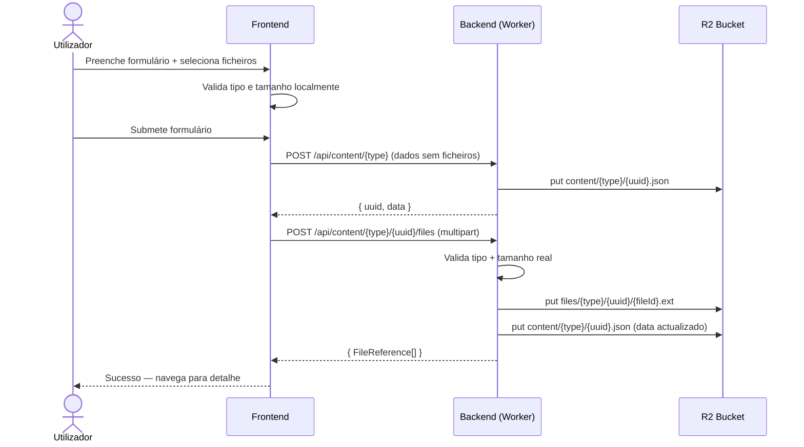

# Sistema de Upload de Ficheiros — Design

## 1. Modelo de Dados

### FileReference

| Campo | Tipo | Obrigatório | Descrição |
|-------|------|-------------|-----------|
| key | string | Sim | Chave R2 completa do ficheiro (ex: `files/work-sheets/{uuid}/{fileId}.jpg`) |
| name | string | Sim | Nome original do ficheiro (ex: "foto-obra.jpg") |
| mimeType | string | Sim | Tipo MIME do ficheiro (ex: "image/jpeg", "application/pdf") |
| size | number | Sim | Tamanho em bytes |

- `FileReference` é definida em `@clever/shared` para reutilização entre frontend e backend
- O `key` serve simultaneamente como identificador único e localização no R2
- Metadados de auditoria (quem/quando carregou) não são guardados na referência — o conteúdo já tem `updatedBy`/`updatedAt`

### Campos de ficheiros no data do conteúdo

Cada tipo de conteúdo define os seus próprios campos de ficheiros no `data`. Um campo pode ser singular (um ficheiro) ou múltiplo (array).

| Tipo de campo | Tipo no data | Exemplo |
|---------------|-------------|---------|
| Ficheiro singular | `FileReference \| null` | `fotos_material` |
| Ficheiros múltiplos | `FileReference[]` | `fotos_instalacao` |

Exemplo conceptual para Instalações:

| Campo no data | Tipo | Descrição |
|---------------|------|-----------|
| fotos_instalacao | FileReference[] | Fotos da instalação (múltiplas) |
| fotos_material | FileReference \| null | Foto do material (singular) |

Exemplo conceptual para Folhas de Obra:

| Campo no data | Tipo | Descrição |
|---------------|------|-----------|
| ficheiros | FileReference[] | Ficheiros anexados à folha de obra |

- Os nomes dos campos são definidos por cada tipo de conteúdo — o componente de upload recebe o nome do campo como prop
- Tipos de conteúdo sem campos de ficheiros não são afetados — sem alteração
- Para ativar noutro tipo: adicionar o(s) campo(s) ao tipo e incluir o componente de upload no formulário (REQ-06)
- Os campos de ficheiros são guardados no `data` do conteúdo como qualquer outro campo

## 2. Armazenamento R2

### Convenção de chaves

| Recurso | Padrão de chave R2 | Exemplo |
|---------|-------------------|---------|
| Conteúdo (existente) | `content/{type}/{uuid}.json` | `content/work-sheets/abc-123.json` |
| Índice (existente) | `indexes/{type}-index.json` | `indexes/work-sheets-index.json` |
| Ficheiro (novo) | `files/{type}/{contentUuid}/{fileId}.{ext}` | `files/work-sheets/abc-123/f1d2e3.jpg` |

- O prefixo `files/` separa ficheiros dos dados de conteúdo (REQ-05.3)
- `fileId` é um UUID gerado no momento do upload
- `ext` é a extensão original do ficheiro (extraída do nome)
- Todos os ficheiros de um registo ficam agrupados sob `files/{type}/{contentUuid}/`

### Operações R2

| Operação | Método R2 | Chave | Metadados HTTP |
|----------|-----------|-------|----------------|
| Upload de ficheiro | `put(key, body, options)` | `files/{type}/{uuid}/{fileId}.{ext}` | `contentType: mimeType` |
| Download de ficheiro | `get(key)` | `files/{type}/{uuid}/{fileId}.{ext}` | — |
| Eliminação de ficheiro | `delete(key)` | `files/{type}/{uuid}/{fileId}.{ext}` | — |
| Listar ficheiros de um registo | `list({ prefix })` | `files/{type}/{uuid}/` | — |

### Regras de armazenamento

- O bucket R2 é o mesmo usado para conteúdo (`R2_BUCKET`) — sem binding adicional
- O body do `put` recebe o binário do ficheiro (ArrayBuffer/ReadableStream), não base64
- O `contentType` no httpMetadata permite ao browser interpretar o ficheiro correctamente no download
- Na eliminação de um registo de conteúdo, os ficheiros associados são eliminados em best-effort: listar por prefixo e eliminar cada um (RB-07)
- Ficheiros parcialmente carregados não existem — o R2 `put` é atómico

## 3. API — Endpoints de Ficheiros

### Novos endpoints

| Método | Rota | Descrição | Body | Resposta |
|--------|------|-----------|------|----------|
| POST | `/api/content/{type}/{uuid}/files` | Upload de um ou mais ficheiros | `multipart/form-data` com campo `files` | `{ success: true, data: FileReference[] }` |
| GET | `/api/content/{type}/{uuid}/files/{fileKey}` | Download de um ficheiro | — | Binário do ficheiro com `Content-Type` correcto |
| DELETE | `/api/content/{type}/{uuid}/files/{fileKey}` | Eliminação de um ficheiro | — | `{ success: true }` |

- `{fileKey}` é o `fileId.ext` (última parte da chave R2)
- O backend reconstrói a chave R2 completa: `files/{type}/{uuid}/{fileKey}`

### Endpoint de upload — detalhes

| Aspecto | Valor |
|---------|-------|
| Content-Type do pedido | `multipart/form-data` |
| Campo do formulário | `files` (múltiplos ficheiros) |
| Campo adicional | `fieldName` (string) — nome do campo no data do conteúdo (ex: "fotos_instalacao") |
| Validação servidor | Tipo MIME + tamanho (ver secção 5) |
| Autenticação | `requireAuth` middleware (existente) |
| Resposta sucesso | Array de `FileReference` criadas |
| Resposta erro | `{ success: false, error: { code: number, message: string } }` |

### Fluxo do upload no backend

- Receber ficheiros via multipart
- Validar cada ficheiro (tipo + tamanho)
- Para cada ficheiro válido: gerar `fileId` (UUID), construir chave R2, fazer `put` no R2
- Construir array de `FileReference` com os metadados
- Ler o conteúdo actual do registo
- Adicionar as novas `FileReference` ao campo indicado por `fieldName` no `data`
- Guardar o conteúdo actualizado (incrementa versão)
- Retornar as `FileReference` criadas

### Fluxo da eliminação no backend

- Receber `fileKey` do URL
- Construir chave R2 completa
- Eliminar o ficheiro do R2
- Ler o conteúdo actual do registo
- Remover a `FileReference` correspondente do campo no `data`
- Guardar o conteúdo actualizado
- Retornar sucesso

### Regras

- O upload não altera outros campos do conteúdo — apenas o campo de ficheiros indicado
- O download serve o ficheiro directamente do R2 com o `Content-Type` original
- A eliminação de ficheiro é uma operação atómica: R2 delete + actualização do conteúdo
- Se o `put` no R2 falhar para um ficheiro, os ficheiros já carregados nesse batch são mantidos — erro parcial reportado
- Endpoints protegidos por `requireAuth` — mesma autenticação que os endpoints de conteúdo existentes

## 4. Fluxo de Submissão

### Fluxo de criação com ficheiros

| Passo | Actor | Acção | Resultado |
|-------|-------|-------|-----------|
| 1 | Utilizador | Preenche formulário e seleciona ficheiros | Ficheiros validados localmente (tipo + tamanho) |
| 2 | Utilizador | Submete o formulário | Frontend envia dados do conteúdo via POST `/api/content/{type}` |
| 3 | Backend | Cria o registo de conteúdo (sem ficheiros) | Registo criado com `uuid`, campo de ficheiros vazio |
| 4 | Frontend | Para cada campo de ficheiros com ficheiros novos: POST `/api/content/{type}/{uuid}/files` | Upload dos ficheiros para R2, referências adicionadas ao `data` |
| 5 | Frontend | Confirma sucesso ao utilizador | Navega para vista de detalhe |

### Fluxo de edição com ficheiros

| Passo | Actor | Acção | Resultado |
|-------|-------|-------|-----------|
| 1 | Utilizador | Abre formulário de edição | Ficheiros existentes carregados e apresentados |
| 2 | Utilizador | Marca ficheiros para remoção e/ou seleciona novos | Estado local actualizado |
| 3 | Utilizador | Submete o formulário | Frontend envia dados do conteúdo via PUT `/api/content/{type}/{uuid}` |
| 4 | Frontend | Para cada ficheiro marcado para remoção: DELETE `/api/content/{type}/{uuid}/files/{fileKey}` | Ficheiro eliminado do R2, referência removida do `data` |
| 5 | Frontend | Para cada campo com ficheiros novos: POST `/api/content/{type}/{uuid}/files` | Upload dos novos ficheiros, referências adicionadas ao `data` |
| 6 | Frontend | Confirma sucesso ao utilizador | Navega para vista de detalhe |

### Fluxo de eliminação de conteúdo com ficheiros

| Passo | Actor | Acção | Resultado |
|-------|-------|-------|-----------|
| 1 | Backend | Recebe DELETE `/api/content/{type}/{uuid}` | Soft delete do conteúdo (existente) |
| 2 | Backend | Lista ficheiros por prefixo `files/{type}/{uuid}/` | Obtém lista de chaves R2 |
| 3 | Backend | Elimina cada ficheiro do R2 | Best-effort — falhas não bloqueiam a eliminação do conteúdo (RB-07) |

### Regras do fluxo

- O conteúdo é criado primeiro, ficheiros depois — garante que o `uuid` existe antes do upload
- Se o upload de ficheiros falhar após a criação do conteúdo, o conteúdo existe sem ficheiros — o utilizador pode tentar novamente via edição
- Eliminações de ficheiros são processadas antes de uploads de novos ficheiros — evita conflitos
- Cada chamada de upload pode conter múltiplos ficheiros para o mesmo campo

## 5. Validação

### Validação no cliente (frontend)

| Regra | Momento | Comportamento | Mensagem de erro |
|-------|---------|---------------|------------------|
| Tipo de ficheiro não aceite | Ao selecionar ficheiro | Ficheiro rejeitado, não adicionado à lista | "Tipo de ficheiro não suportado. Tipos aceites: JPG, PNG, GIF, WEBP, PDF, DOC, DOCX, XLS, XLSX" |
| Ficheiro excede 10 MB | Ao selecionar ficheiro | Ficheiro rejeitado, não adicionado à lista | "O ficheiro excede o tamanho máximo de 10 MB" |
| Ficheiro válido | Ao selecionar ficheiro | Adicionado à lista, pré-visualização se imagem | — |

- Validação por extensão do nome do ficheiro + verificação do `type` do objecto `File`
- Ficheiros rejeitados não afectam os restantes ficheiros seleccionados
- Mensagens de erro apresentadas junto ao ficheiro rejeitado

### Validação no servidor (backend)

| Regra | Momento | Comportamento | Resposta HTTP |
|-------|---------|---------------|---------------|
| Tipo MIME não aceite | Ao receber ficheiro no endpoint de upload | Ficheiro rejeitado | 400 — "Tipo de ficheiro não suportado: {mimeType}" |
| Ficheiro excede 10 MB | Ao receber ficheiro no endpoint de upload | Ficheiro rejeitado | 400 — "O ficheiro excede o tamanho máximo de 10 MB" |
| Conteúdo não encontrado | Ao aceder ao registo para associar ficheiro | Upload rejeitado | 404 — "Conteúdo não encontrado" |
| Ficheiro não encontrado no R2 | Ao tentar download ou eliminação | Operação falha | 404 — "Ficheiro não encontrado" |

### Tipos MIME aceites

| Categoria | Extensões | Tipos MIME |
|-----------|-----------|------------|
| Imagens | .jpg, .jpeg | image/jpeg |
| Imagens | .png | image/png |
| Imagens | .gif | image/gif |
| Imagens | .webp | image/webp |
| Documentos | .pdf | application/pdf |
| Documentos | .doc | application/msword |
| Documentos | .docx | application/vnd.openxmlformats-officedocument.wordprocessingml.document |
| Documentos | .xls | application/vnd.ms-excel |
| Documentos | .xlsx | application/vnd.openxmlformats-officedocument.spreadsheetml.sheet |

- A lista de tipos aceites é definida em `@clever/shared` como constante reutilizável
- O backend valida pelo `Content-Type` do multipart, não pela extensão
- O frontend valida por extensão + `File.type` para feedback imediato
- Constante de tamanho máximo (10 MB = 10_485_760 bytes) também em `@clever/shared`

## 6. Componente FileUploadZone

### Props

| Prop | Tipo | Obrigatório | Default | Descrição |
|------|------|-------------|---------|-----------|
| fieldName | string | Sim | — | Nome do campo no data do conteúdo (ex: "fotos_instalacao") |
| label | string | Sim | — | Label apresentada ao utilizador (PT) |
| multiple | boolean | Não | true | Permite múltiplos ficheiros |
| existingFiles | FileReference[] | Não | [] | Ficheiros já associados ao registo (modo edição) |
| acceptImages | boolean | Não | true | Aceita ficheiros de imagem |
| acceptDocuments | boolean | Não | true | Aceita ficheiros de documento |
| disabled | boolean | Não | false | Desactiva o componente |

### Eventos emitidos

| Evento | Payload | Quando |
|--------|---------|--------|
| files-changed | `{ fieldName: string, newFiles: File[], removedKeys: string[] }` | Quando a lista de ficheiros muda (adição ou remoção) |

### Comportamentos

- Apresenta botão "Selecionar ficheiros" com alvo de toque mínimo 44px (mobile-first)
- Ao selecionar ficheiros: valida tipo e tamanho, rejeita inválidos com mensagem de erro inline
- Ficheiros de imagem válidos: gera pré-visualização via `URL.createObjectURL()` e apresenta como miniatura (REQ-02)
- Ficheiros de documento válidos: apresenta nome, tipo e tamanho na lista
- Ficheiros existentes (modo edição): apresentados com botão de remoção — ao clicar, marcados visualmente (opacidade reduzida + ícone de eliminação)
- Se `multiple: false` e já existe um ficheiro: substituir (marcar antigo para remoção + adicionar novo)
- O componente não faz upload — apenas gere o estado local e emite eventos. O upload é responsabilidade do formulário pai
- Limpa `URL.createObjectURL()` no `onUnmounted` para evitar memory leaks

### Localização do componente

- `packages/frontend/src/components/common/FileUploadZone.vue`
- Reutilizável por qualquer tipo de conteúdo (REQ-06)

## 7. Componente FileDisplay

### Props

| Prop | Tipo | Obrigatório | Default | Descrição |
|------|------|-------------|---------|-----------|
| files | FileReference[] | Sim | — | Lista de ficheiros a apresentar |
| label | string | Não | "Ficheiros" | Título da secção |
| contentType | string | Sim | — | Tipo de conteúdo (para construir URL de download) |
| contentUuid | string | Sim | — | UUID do registo (para construir URL de download) |

### Comportamentos

- Imagens: apresentadas como miniaturas clicáveis — ao clicar, abre imagem em tamanho completo (nova tab ou modal simples) (REQ-03, CA-03.1)
- Documentos: apresentados como links com ícone de tipo, nome e tamanho — ao clicar, inicia download (REQ-03, CA-03.1)
- Ficheiro indisponível (erro 404 no download): apresenta estado visual de "ficheiro indisponível" no lugar da miniatura/link, sem bloquear a vista
- Layout responsivo: grid de miniaturas em mobile (2 colunas), mais colunas em desktop
- Miniaturas carregadas via URL do endpoint de download: `/api/content/{type}/{uuid}/files/{fileKey}`
- Se a lista de ficheiros estiver vazia: não renderiza nada (sem secção vazia)

### Localização do componente

- `packages/frontend/src/components/common/FileDisplay.vue`
- Usado nas vistas de detalhe de qualquer tipo de conteúdo com ficheiros

## 8. Composable useFileUpload

### Interface

| Membro | Tipo | Descrição |
|--------|------|-----------|
| uploading | Ref\<boolean\> | Estado de upload em curso |
| deleting | Ref\<boolean\> | Estado de eliminação em curso |
| error | Ref\<string \| null\> | Mensagem de erro da última operação |
| uploadFiles(contentType, uuid, fieldName, files) | (string, string, string, File[]) => Promise\<FileReference[]\> | Faz upload de ficheiros para um campo específico |
| deleteFile(contentType, uuid, fileKey) | (string, string, string) => Promise\<boolean\> | Elimina um ficheiro |
| getFileUrl(contentType, uuid, fileKey) | (string, string, string) => string | Retorna URL de download do ficheiro |
| clearError() | () => void | Limpa o erro |

### Comportamentos

- `uploadFiles`: envia POST multipart para `/api/content/{type}/{uuid}/files` com os ficheiros e o `fieldName`
- `deleteFile`: envia DELETE para `/api/content/{type}/{uuid}/files/{fileKey}`
- `getFileUrl`: constrói a URL do endpoint de download (sem chamada HTTP)
- Usa `await fetch().then().catch()` seguindo o padrão de promises do projecto
- Erros de rede tratados com mensagem genérica: "Falha no upload. Tente novamente." / "Não foi possível eliminar o ficheiro."
- O composable não gere estado de ficheiros — apenas operações HTTP. O estado é gerido pelo componente `FileUploadZone`

### Localização

- `packages/frontend/src/composables/useFileUpload.ts`

## 9. Integração nas Vistas

### Programação de Instalações (Installations Programming)

| Vista | Alteração | Detalhes |
|-------|-----------|----------|
| InstallationsProgrammingCreateView | Adicionar FileUploadZone | Campo `fotoURL` (multiple: false, acceptDocuments: false) — foto singular |
| InstallationsProgrammingCreateView | Lógica de submissão | Após criar conteúdo, chamar `uploadFiles` para o ficheiro seleccionado |
| InstallationsProgrammingUpdateView | Adicionar FileUploadZone | Campo `fotoURL` com `existingFiles` carregado do registo |
| InstallationsProgrammingUpdateView | Lógica de submissão | Processar eliminação do ficheiro antigo e upload do novo se alterado |
| InstallationsProgrammingDetailView | Adicionar FileDisplay | Secção "Foto" com a imagem do registo |

- O campo `fotoURL` no tipo `InstallationsProgrammingData` passa de `string` para `FileReference | null`
- Folhas de Obra: sem alterações nesta fase — preparado para extensão futura

### Padrão de integração no formulário

- O `FileUploadZone` é adicionado como secção do formulário, não como campo do `ContentFormTemplate`
- O componente pai (Create/Update view) gere o estado dos ficheiros via evento `files-changed`
- Na submissão: primeiro cria/actualiza o conteúdo, depois processa ficheiros (ver secção 4)
- O `useFileUpload` composable é instanciado na view, não no componente de upload

### Padrão de integração no detalhe

- O `FileDisplay` é adicionado como secção adicional na vista de detalhe
- Recebe os ficheiros do `currentItem.data.fotoURL`
- Só renderiza se existir ficheiro — sem secção vazia

### Extensibilidade (REQ-06)

Para adicionar upload a um novo tipo de conteúdo (ex: Folhas de Obra no futuro):
1. Adicionar campo(s) `FileReference[]` ou `FileReference | null` ao tipo em `@clever/shared`
2. Adicionar `FileUploadZone` nas vistas Create e Update com o `fieldName` correcto
3. Adicionar `FileDisplay` na vista Detail
4. Adicionar lógica de upload/eliminação na submissão (copiar padrão de Instalações)

## 10. Tratamento de Erros

### Erros de upload

| Cenário | Origem | Comportamento frontend | Comportamento backend |
|---------|--------|----------------------|----------------------|
| Ficheiro excede 10 MB | Validação cliente | Ficheiro rejeitado na selecção, mensagem inline | — |
| Tipo de ficheiro não suportado | Validação cliente | Ficheiro rejeitado na selecção, mensagem inline | — |
| Ficheiro excede 10 MB (bypass cliente) | Validação servidor | Mensagem de erro genérica | 400 — rejeita ficheiro |
| Tipo MIME não aceite (bypass cliente) | Validação servidor | Mensagem de erro genérica | 400 — rejeita ficheiro |
| Falha de rede durante upload | Rede | "Falha no upload. Tente novamente." — conteúdo já criado, ficheiros não | Nenhuma acção (pedido não chegou) |
| Erro parcial (alguns ficheiros falham) | R2 put | Ficheiros com sucesso mantidos, erro reportado para os falhados | 207 ou 500 com detalhes dos falhados |
| Conteúdo não encontrado | Backend | "Conteúdo não encontrado" | 404 |

### Erros de download/visualização

| Cenário | Origem | Comportamento frontend | Comportamento backend |
|---------|--------|----------------------|----------------------|
| Ficheiro não encontrado no R2 | R2 get | Indicação visual "ficheiro indisponível" no lugar da miniatura/link | 404 |
| Falha de rede no download | Rede | Indicação visual de erro, sem bloquear a vista | — |

### Erros de eliminação

| Cenário | Origem | Comportamento frontend | Comportamento backend |
|---------|--------|----------------------|----------------------|
| Falha na eliminação de ficheiro | R2 delete | "Não foi possível eliminar o ficheiro. Tente novamente." | 500 — referência mantida no data |
| Eliminação de conteúdo com ficheiros | Backend | Comportamento normal de eliminação de conteúdo | Soft delete do conteúdo + eliminação best-effort dos ficheiros (RB-07) |
| Falha na eliminação de ficheiros ao eliminar conteúdo | R2 delete | Sem impacto visível — conteúdo eliminado | Conteúdo eliminado, ficheiros órfãos no R2 (aceitável) |

### Regras gerais

- Erros de ficheiros nunca bloqueiam a operação principal do conteúdo (criar/editar/eliminar)
- Mensagens de erro em Português, consistentes com os cenários definidos nos requisitos
- Erros de validação (tipo/tamanho) são tratados no cliente antes de qualquer chamada HTTP
- Erros de rede usam mensagem genérica — sem expor detalhes técnicos ao utilizador
- Ficheiros órfãos no R2 (upload sem conteúdo associado, ou conteúdo eliminado com falha na limpeza) são aceitáveis — sem mecanismo de limpeza automática nesta fase
