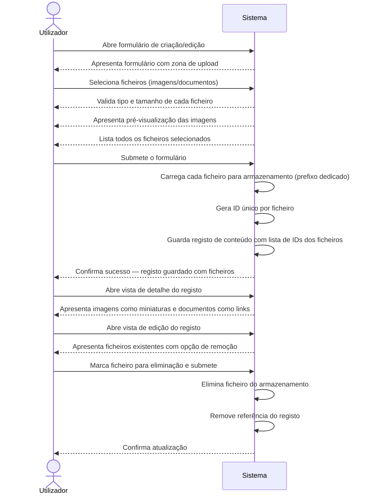

# Sistema de Upload de Ficheiros — Requisitos

## 1. Âmbito e Atores

### Atores

| Ator | Descrição |
|------|-----------|
| Utilizador | Membro da equipa (técnico ou administrativo) que cria/edita registos de conteúdo e necessita de anexar ficheiros ou imagens |
| Sistema | Plataforma CLEVER que armazena, associa e disponibiliza os ficheiros carregados |

### Objetivo

Permitir ao utilizador carregar ficheiros (imagens e documentos) diretamente nos formulários de criação e edição de conteúdo, com armazenamento persistente e associação ao registo.

### Tipos de conteúdo suportados

| Tipo de conteúdo | Suporte inicial | Notas |
|------------------|-----------------|-------|
| Folhas de Obra | ✅ Sim | Primeira implementação |
| Programação de Instalações | ✅ Sim | Primeira implementação |
| Outros tipos (Clientes, Contratos, Licenças, etc.) | ❌ Não (extensível) | Arquitetura preparada para suportar qualquer tipo no futuro |

## 2. Requisitos Funcionais

### REQ-01 — Upload de ficheiros no formulário

**WHEN** o utilizador está a criar ou editar um registo de conteúdo, o sistema **SHALL** permitir o upload de múltiplos ficheiros (imagens e documentos) através do formulário.

- **CA-01.1**: O formulário apresenta uma zona de upload de ficheiros.
- **CA-01.2**: O utilizador pode selecionar múltiplos ficheiros de uma só vez.
- **CA-01.3**: Tipos aceites: imagens (JPG, JPEG, PNG, GIF, WEBP) e documentos (PDF, DOC, DOCX, XLS, XLSX).
- **CA-01.4**: O limite máximo por ficheiro é de 10 MB.
- **CA-01.5**: Não existe limite no número de ficheiros por registo.

### REQ-02 — Pré-visualização de imagens

**WHEN** o utilizador seleciona ficheiros de imagem para upload, o sistema **SHALL** apresentar uma pré-visualização antes da submissão do formulário.

- **CA-02.1**: Imagens selecionadas são apresentadas como miniaturas no formulário.
- **CA-02.2**: A pré-visualização é apresentada imediatamente após a seleção, antes do envio.

### REQ-03 — Visualização de ficheiros existentes

**WHEN** o utilizador abre a vista de detalhe ou edição de um registo com ficheiros associados, o sistema **SHALL** apresentar os ficheiros já carregados.

- **CA-03.1**: Na vista de detalhe, imagens são apresentadas como miniaturas clicáveis e documentos como links para download.
- **CA-03.2**: Na vista de edição, os ficheiros existentes são apresentados com opção de remoção.

### REQ-04 — Eliminação de ficheiros

**WHEN** o utilizador remove um ficheiro na vista de edição e submete o formulário, o sistema **SHALL** eliminar o ficheiro do armazenamento e remover a referência do registo.

- **CA-04.1**: O utilizador pode marcar ficheiros existentes para eliminação.
- **CA-04.2**: Após submissão, os ficheiros marcados são eliminados do armazenamento.
- **CA-04.3**: A referência ao ficheiro é removida do registo de conteúdo.

### REQ-05 — Armazenamento e referência

**WHEN** o utilizador submete um formulário com ficheiros, o sistema **SHALL** armazenar cada ficheiro carregado com um identificador único e guardar apenas a referência (ID) no registo de conteúdo.

- **CA-05.1**: Cada ficheiro recebe um identificador único no momento do upload.
- **CA-05.2**: O registo de conteúdo guarda uma lista de IDs dos ficheiros associados.
- **CA-05.3**: Os ficheiros são armazenados com um prefixo dedicado, separados dos dados de conteúdo.

### REQ-06 — Extensibilidade a outros tipos de conteúdo

**WHERE** novos tipos de conteúdo necessitem de upload de ficheiros no futuro, o sistema **SHALL** permitir a ativação da funcionalidade sem alterações estruturais.

- **CA-06.1**: A funcionalidade de upload é um componente reutilizável, não acoplado a um tipo de conteúdo específico.
- **CA-06.2**: Ativar o upload num novo tipo de conteúdo requer apenas configuração, não desenvolvimento adicional significativo.

## 3. Âmbito Excluído

- Compressão ou redimensionamento automático de imagens
- Conversão de formatos de ficheiro
- Versionamento de ficheiros (substituir = eliminar antigo + carregar novo)
- Upload de ficheiros fora do contexto de criação/edição de conteúdo (ex: upload avulso)
- Partilha de ficheiros entre registos de conteúdo diferentes
- Pesquisa por conteúdo de ficheiros (OCR, full-text search em PDFs)
- Gestão de quotas de armazenamento por utilizador
- Upload via drag-and-drop (pode ser adicionado no futuro, não faz parte desta spec)

## 4. Restrições

- **Tamanho máximo por ficheiro**: 10 MB
- **Tipos de ficheiro aceites**: Imagens (JPG, JPEG, PNG, GIF, WEBP) e documentos (PDF, DOC, DOCX, XLS, XLSX)
- **Contexto de upload**: Apenas durante criação ou edição de um registo de conteúdo
- **Tipos de conteúdo iniciais**: Folhas de Obra e Programação de Instalações
- **Armazenamento**: Mesmo espaço de armazenamento que os dados de conteúdo, com prefixo dedicado para ficheiros
- **Referência**: Apenas o ID do ficheiro é guardado no registo — o ficheiro nunca é embutido nos dados do conteúdo
- **Eliminação**: A remoção de um ficheiro deve eliminar tanto a referência no registo como o ficheiro no armazenamento
- **Interface**: Mobile-first, com alvos de toque mínimos de 44px

## 5. Cenários de Erro

| Trigger | Comportamento | Resultado |
|---------|---------------|-----------|
| Ficheiro excede 10 MB | O sistema rejeita o ficheiro antes do upload | Mensagem de erro: "O ficheiro excede o tamanho máximo de 10 MB" |
| Tipo de ficheiro não suportado | O sistema rejeita o ficheiro antes do upload | Mensagem de erro: "Tipo de ficheiro não suportado. Tipos aceites: JPG, PNG, GIF, WEBP, PDF, DOC, DOCX, XLS, XLSX" |
| Falha de rede durante o upload | O sistema informa o utilizador da falha | Mensagem de erro: "Falha no upload. Tente novamente." O ficheiro não é guardado parcialmente |
| Ficheiro não encontrado no armazenamento | O sistema apresenta um estado de erro no lugar da pré-visualização/link | Indicação visual de ficheiro indisponível, sem bloquear a vista |
| Falha na eliminação do ficheiro | O sistema informa o utilizador | Mensagem de erro: "Não foi possível eliminar o ficheiro. Tente novamente." |
| Upload sem ficheiro selecionado | O botão de submissão do upload permanece inativo | Nenhuma ação é executada |

## 6. [MA] Mirror — Critérios de Aceitação

| REQ-ID | CA-ID | Given | When | Then | Prioridade |
|--------|-------|-------|------|------|------------|
| REQ-01 | CA-01.1 | O utilizador está no formulário de criação/edição de um conteúdo suportado | O formulário é carregado | Uma zona de upload de ficheiros é visível | Alta |
| REQ-01 | CA-01.2 | O utilizador está na zona de upload | O utilizador seleciona múltiplos ficheiros | Todos os ficheiros selecionados são adicionados à lista de upload | Alta |
| REQ-01 | CA-01.3 | O utilizador seleciona um ficheiro | O ficheiro é de tipo aceite (JPG, PNG, GIF, WEBP, PDF, DOC, DOCX, XLS, XLSX) | O ficheiro é aceite para upload | Alta |
| REQ-01 | CA-01.3 | O utilizador seleciona um ficheiro | O ficheiro é de tipo não aceite (ex: EXE, ZIP) | O ficheiro é rejeitado com mensagem de erro | Alta |
| REQ-01 | CA-01.4 | O utilizador seleciona um ficheiro | O ficheiro tem mais de 10 MB | O ficheiro é rejeitado com mensagem de erro de tamanho | Alta |
| REQ-01 | CA-01.4 | O utilizador seleciona um ficheiro | O ficheiro tem 10 MB ou menos | O ficheiro é aceite para upload | Alta |
| REQ-01 | CA-01.5 | O utilizador já tem ficheiros no registo | O utilizador adiciona mais ficheiros | Todos os ficheiros são aceites sem limite de quantidade | Média |
| REQ-02 | CA-02.1 | O utilizador seleciona imagens para upload | As imagens são adicionadas à lista | Miniaturas das imagens são apresentadas no formulário | Alta |
| REQ-02 | CA-02.2 | O utilizador seleciona uma imagem | A imagem é adicionada | A pré-visualização aparece imediatamente, antes da submissão | Alta |
| REQ-03 | CA-03.1 | Um registo tem ficheiros associados | O utilizador abre a vista de detalhe | Imagens são apresentadas como miniaturas clicáveis; documentos como links de download | Alta |
| REQ-03 | CA-03.2 | Um registo tem ficheiros associados | O utilizador abre a vista de edição | Os ficheiros existentes são apresentados com opção de remoção | Alta |
| REQ-04 | CA-04.1 | O utilizador está na vista de edição com ficheiros existentes | O utilizador clica em remover num ficheiro | O ficheiro é marcado para eliminação (visualmente distinto) | Alta |
| REQ-04 | CA-04.2 | Ficheiros estão marcados para eliminação | O utilizador submete o formulário | Os ficheiros marcados são eliminados do armazenamento | Alta |
| REQ-04 | CA-04.3 | Ficheiros foram eliminados do armazenamento | A submissão é concluída | As referências aos ficheiros eliminados são removidas do registo | Alta |
| REQ-05 | CA-05.1 | O utilizador submete um formulário com ficheiros novos | O upload é processado | Cada ficheiro recebe um identificador único | Alta |
| REQ-05 | CA-05.2 | Ficheiros foram carregados com sucesso | O registo é guardado | O registo contém a lista de IDs dos ficheiros associados | Alta |
| REQ-05 | CA-05.3 | Ficheiros são carregados | O armazenamento é efetuado | Os ficheiros são guardados com prefixo dedicado, separados dos dados de conteúdo | Alta |
| REQ-06 | CA-06.1 | A funcionalidade de upload existe | Um programador revê o componente | O componente é reutilizável e não acoplado a um tipo de conteúdo específico | Média |
| REQ-06 | CA-06.2 | Um novo tipo de conteúdo precisa de upload | A funcionalidade é ativada | A ativação requer apenas configuração mínima | Média |

## 7. Cenário Nominal

## 8. Regras de Negócio

| RB-ID | Condição | Ação | Erro |
|-------|----------|------|------|
| RB-01 | Ficheiro excede 10 MB | Rejeitar antes do upload | "O ficheiro excede o tamanho máximo de 10 MB" |
| RB-02 | Tipo de ficheiro não está na lista de aceites | Rejeitar antes do upload | "Tipo de ficheiro não suportado" |
| RB-03 | Upload de imagem aceite | Gerar pré-visualização imediata (miniatura) | — |
| RB-04 | Upload de documento aceite | Apresentar nome e tipo do ficheiro na lista | — |
| RB-05 | Submissão do formulário com ficheiros novos | Carregar ficheiros primeiro, depois guardar registo com IDs | Se upload falhar: não guardar registo, informar utilizador |
| RB-06 | Eliminação de ficheiro marcada + submissão | Eliminar ficheiro do armazenamento e remover referência do registo | Se eliminação falhar: informar utilizador, manter referência |
| RB-07 | Registo de conteúdo é eliminado | Os ficheiros associados devem ser eliminados do armazenamento | [Kiro addition] Se eliminação de ficheiros falhar: registar erro, conteúdo é eliminado na mesma |

## 9. Cenários Alternativos e de Erro

| Trigger | Comportamento | Resultado |
|---------|---------------|-----------|
| Utilizador seleciona ficheiro > 10 MB | Validação no lado do cliente rejeita o ficheiro | Mensagem de erro junto ao ficheiro rejeitado; restantes ficheiros não são afetados |
| Utilizador seleciona tipo de ficheiro não suportado | Validação no lado do cliente rejeita o ficheiro | Mensagem de erro junto ao ficheiro rejeitado; restantes ficheiros não são afetados |
| Falha de rede durante upload de um ficheiro | Upload é interrompido | Mensagem de erro genérica; ficheiros já carregados com sucesso são mantidos; utilizador pode tentar novamente |
| Utilizador submete formulário sem ficheiros | Formulário é submetido normalmente | Registo é guardado sem ficheiros associados (campo de ficheiros vazio) |
| Ficheiro referenciado no registo não existe no armazenamento | Sistema deteta ficheiro em falta ao carregar vista | Indicação visual de "ficheiro indisponível" no lugar da miniatura/link; restante conteúdo não é afetado |
| Utilizador remove todos os ficheiros e submete | Todos os ficheiros são eliminados do armazenamento | Registo é atualizado com lista de ficheiros vazia |
| Utilizador cancela o formulário após selecionar ficheiros | Ficheiros selecionados são descartados | Nenhum ficheiro é carregado; registo não é alterado |
| Eliminação de registo de conteúdo com ficheiros associados | Sistema elimina o registo e os ficheiros associados | Se eliminação de ficheiros falhar, registo é eliminado na mesma (best-effort) [Kiro addition] |
