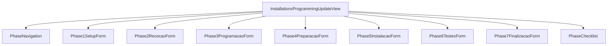
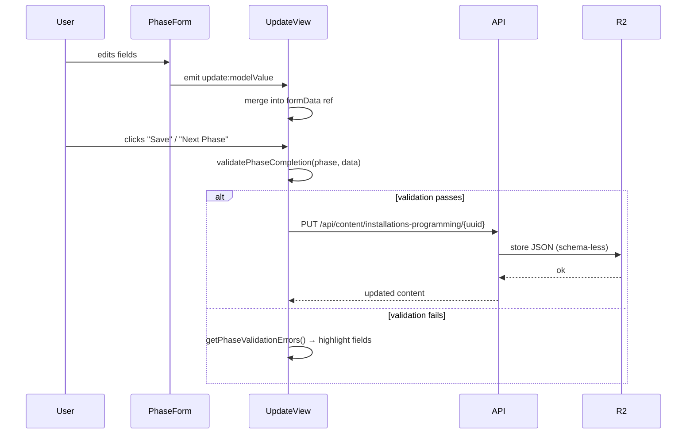

# Programação de Instalações (Phases Refactor) — Design

## 1. Context & Scope

The Installations Programming module uses a 7-phase wizard form backed by `InstallationSevenPhasesData`. This refactor modifies the internal content of phases 1, 2, 3, 4, and 6 without changing phase count, navigation, or the overall content type slug (`installations-programming`).

**What changes:**
- Phase 1 (Setup): `installationType` becomes a repeatable array (multiple entries allowed)
- Phase 2 (Receção do Material): `equipmentConditionOk` toggle removed; replaced by flat "Verificações" checklist + conditional "Equipamento do Cliente" field
- Phase 3 (Programação / Preparação): `software` string replaced by structured hierarchical selection (brand → product → module/tier)
- Phase 4 (Preparação Instalação): each checklist category gains a parent TRUE/FALSE toggle; "Equipamento adicional" relocated to end with reversed conditional
- Phase 6 (Testes): "Falhas detectadas" SIM/NÃO field added with conditional text box

**What stays:**
- Phase 5 (Instalação no Cliente) — unchanged
- Phase 7 (Finalização) — unchanged
- 7-phase navigation (`PhaseNavigation.vue`) — unchanged
- Content type slug `installations-programming` — unchanged
- R2 storage pattern (`content/installations-programming/{uuid}.json`) — unchanged
- Relations system (clientId resolution) — unchanged
- API routes — unchanged (backend stores whatever the form produces)
- Permission model — unchanged

**Existing files impacted:**

🔗 `packages/shared/src/types/installations-programming/types-seven-phases.ts`
Contract change: `Phase1SetupData`, `Phase2RececaoData`, `Phase3ProgramacaoData`, `Phase4PreparacaoData`, `Phase6TestesData` interfaces rewritten. `InstallationSevenPhasesData.installationType` changes from `InstallationType` to `InstallationType[]`.

🔗 `packages/shared/src/types/installations-programming/validation-seven-phases.ts`
Contract change: `validatePhase1`, `validatePhase2`, `validatePhase3`, `validatePhase4`, `validatePhase6` + corresponding error functions rewritten to match new data models.

🔗 `packages/frontend/src/components/installations-programming/Phase1SetupForm.vue`
Contract change: `modelValue` changes from single `installationType: InstallationType` to `installationTypes: InstallationType[]`. UI becomes add/remove list.

🔗 `packages/frontend/src/components/installations-programming/Phase2RececaoForm.vue`
Contract change: `modelValue` changes to new `Phase2RececaoData` (flat checklist, conditional equipment field).

🔗 `packages/frontend/src/components/installations-programming/Phase3ProgramacaoForm.vue`
Contract change: `modelValue.software` changes from `string` to structured `SoftwareSelection`. New tree-based UI.

🔗 `packages/frontend/src/components/installations-programming/Phase4PreparacaoForm.vue`
Contract change: each checklist category gains `enabled: boolean` parent toggle. "Equipamento adicional" moved to end with reversed logic.

🔗 `packages/frontend/src/components/installations-programming/Phase6TestesForm.vue`
Contract change: adds `falhasDetectadas` field with conditional text area.


## 2. Goals & Non-Goals

**Goals:**
- Restructure phase data models to support all INST-BR-001 through INST-BR-007 requirements
- Replace free-text software field with typed hierarchical selection (single-choice with mandatory sub-level)
- Convert `installationType` from single enum to repeatable array
- Add parent toggles to Phase 4 checklist categories for conditional visibility
- Add "Falhas detectadas" to Phase 6 with conditional text area
- Simplify Phase 2 by removing the `equipmentConditionOk` gate and making verification items always visible
- Maintain backward compatibility: existing installations with old data structure still display (via legacy adapter)

**Non-Goals:**
- No changes to phase navigation logic or phase count
- No backend API route changes — the schema is implicit in R2 JSON
- No changes to Phase 5 or Phase 7
- No data migration scripts — new fields default to empty/false for old records
- No changes to permission model or authentication
- No new shared utilities beyond types and validation


## 3. Data Models — Phase Types

All phase interfaces live in `packages/shared/src/types/installations-programming/types-seven-phases.ts`.

### 3.1 Phase 1 — Setup (installationTypes array)

**Decision: Array vs repeated entries**
Options: (A) Store as `InstallationType[]` with duplicates allowed / (B) Store as `{ type: InstallationType; count: number }[]`
Chosen: (A) — simpler model, mirrors Daily Records `atividades` pattern where each entry is independent.

```typescript
// REPLACES: installationType: InstallationType (single)
// NEW: installationTypes: InstallationType[] (repeatable, duplicates allowed)

interface InstallationSevenPhasesData {
  // ...existing fields...
  installationTypes: InstallationType[]; // was: installationType: InstallationType
  // ...rest unchanged...
}
```

- Invariant: `installationTypes.length >= 1` when Phase 1 is completed
- Edge case (empty array): valid during form editing, blocked by validation on phase completion
- Edge case (legacy data): `legacy-adapter.ts` converts `installationType: string` to `installationTypes: [value]`

### 3.2 Phase 2 — Receção do Material (new structure)

**Decision: Remove `equipmentConditionOk` gate**
The old model gated verification fields behind a SIM/NÃO toggle. New model:
- `equipamentoCliente`: SIM/NÃO → conditional text area
- "Verificações": always visible, all optional, no gate

```typescript
interface Phase2RececaoData {
  // Equipamento do Cliente
  equipamentoCliente: boolean | null;       // SIM/NÃO (null = not answered)
  equipamentoClienteDescricao: string;      // visible only when equipamentoCliente === true

  // Verificações (always visible, all optional)
  verificacaoCabo: boolean;
  verificacaoTransformador: boolean;
  verificacaoFechadura: boolean;
  verificacaoChaves: boolean;
  verificacaoTestesEquipamento: boolean;

  // Observations
  observacoes: string;
}
```

**Replaces:** old `equipmentConditionOk` pattern + conditional `verificacaoCabo/Fechadura/Chaves/Testes`
**Added:** `verificacaoTransformador` (was missing in old model per requirements), `equipamentoCliente` as boolean toggle
**Removed:** `equipmentConditionOk` field entirely

- Invariant: verification items never block phase progression (optional)
- Invariant: `equipamentoClienteDescricao` required only when `equipamentoCliente === true`
- Edge case (all verifications false): valid — does not block progression
- Edge case (null `equipamentoCliente`): not answered yet, does not block

### 3.3 Phase 3 — Programação / Preparação (hierarchical software)

**Decision: Structured selection type**
Options: (A) Store full path as delimited string (`"Pix > Pix Rest > Modulo 1"`) / (B) Store as typed object with brand + subProduct + module
Chosen: (B) — enables type-safe validation and UI rendering without string parsing.

```typescript
interface SoftwareSelection {
  brand: string;           // top-level: 'Vectron' | 'Pix' | 'Pix Orders' | 'Pix Order Posto Adicional' | 'Pix Monitor Pedidos' | 'Pix RestFest' | 'Zon Soft' | 'Zon Soft Mobile' | 'PT CERT' | 'Dream Soft' | 'Contas Certas'
  subProduct?: string;     // required for brands with sub-products (Pix, Zon Soft)
  module?: string;         // required for Pix sub-products (Modulo 1-3, Posto adicional)
  tier?: string;           // required for Zon Soft sub-products (Basic, Light, Pro)
  licenseType?: string;    // required for PT CERT (Licença definitiva, Licença Atual)
}

interface Phase3ProgramacaoData {
  software: SoftwareSelection | null;       // null = not yet selected
  identificacaoReferencia: string;
  numeroLicenca: string;
  verificacaoInicioProgramacao: boolean;
  testeFinalEquipamentos: boolean;
  notasProgramacao: string;
}
```

**Replaces:** `software: string` (free text)
**Invariant:** validation requires `software !== null` + sub-fields filled based on brand hierarchy
**Invariant:** only one software selection per installation (INST-AC-016)

- Edge case (brand without sub-products): `subProduct`, `module`, `tier` all undefined — valid
- Edge case (Pix brand): requires `subProduct` + `module`
- Edge case (Zon Soft brand): requires `subProduct` + `tier`
- Edge case (PT CERT): requires `licenseType`
- Edge case (legacy data): adapter converts `software: string` to `{ brand: string }` with no sub-fields

### 3.4 Phase 4 — Preparação Instalação (conditional categories)

**Decision: Parent toggle per category**
Each existing checklist category gains an `enabled` boolean. Child items are only relevant when `enabled = true`.

```typescript
interface ToggleableChecklistCategory {
  enabled: boolean;                    // parent toggle — FALSE hides children
  items: Record<string, boolean>;
}

interface ToggleableCpaChecklistCategory extends ToggleableChecklistCategory {
  miniPcDetails: string;
}

interface Phase4PreparacaoData {
  checklist: {
    pos: ToggleableChecklistCategory;
    impressora: ToggleableChecklistCategory;
    gavetaMetalica: ToggleableChecklistCategory;
    cpa: ToggleableCpaChecklistCategory;
    acessorios: ToggleableChecklistCategory;
  };
  // Equipamento adicional — moved to END, reversed toggle logic
  equipamentoAdicional: boolean;            // TRUE = has additional equipment, FALSE = no
  equipamentoAdicionalMotivo: string;       // visible when equipamentoAdicional === false ("Porquê?")
}
```

**Replaces:** `materialAdicional: string` + `checklist: EquipmentChecklist` (no toggles)
**Added:** `enabled` field on each category; `equipamentoAdicional` boolean + `equipamentoAdicionalMotivo`
**Removed:** `materialAdicional` string field

- Invariant: disabled categories (`enabled = false`) are ignored during validation
- Invariant: `equipamentoAdicionalMotivo` required only when `equipamentoAdicional === false`
- Edge case (all categories disabled): valid — means no preparation needed for this job
- Edge case (legacy data): adapter sets `enabled: true` on all categories (preserves old behavior)

### 3.5 Phase 6 — Testes (falhas detectadas)

```typescript
interface Phase6TestesData {
  // Existing fields (unchanged)
  anydeskConfigurado: boolean | null;
  anydeskCodigo: string;
  anydeskMotivo: string;
  vectronConnectConfigurado: boolean | null;
  vectronConnectCodigo: string;
  vectronConnectMotivo: string;

  // NEW — Falhas detectadas
  falhasDetectadas: boolean | null;    // SIM/NÃO (null = not answered)
  falhasDescricao: string;             // visible + required when falhasDetectadas === true
}
```

**Added:** `falhasDetectadas` + `falhasDescricao`
- Invariant: `falhasDescricao` required (non-empty) when `falhasDetectadas === true`
- Invariant: `falhasDetectadas` must be answered (not null) for phase completion
- Edge case (null): not yet answered, blocks phase completion
- Edge case (legacy data): adapter sets `falhasDetectadas: null`, `falhasDescricao: ''`

### 3.6 Main Data Interface Change

```typescript
interface InstallationSevenPhasesData {
  clientId: string;
  technician: TechnicianUser;
  installationTypes: InstallationType[];  // CHANGED: was installationType: InstallationType

  // Equipment (Phase 1) — unchanged
  equipmentMarca: string;
  equipmentModelo: string;
  equipmentNumeroSerie: string;
  equipmentFornecedor: string;

  // Phase data
  phase1: Phase1SetupData;               // still empty interface (setup fields at top level)
  phase2: Phase2RececaoData;             // REWRITTEN
  phase3: Phase3ProgramacaoData;         // REWRITTEN
  phase4: Phase4PreparacaoData;          // REWRITTEN
  phase5: Phase5InstalacaoData;          // unchanged
  phase6: Phase6TestesData;              // EXTENDED
  phase7: Phase7FinalizacaoData;         // unchanged

  // Workflow state — unchanged
  phaseStatuses: PhaseStatus[];
  currentPhase: number;
  status: InstallationStatus;
}
```


## 4. Data Models — Software Hierarchy Config

Static configuration defining the software tree. Lives in shared types alongside the phase interfaces.

**Decision: Config location**
Options: (A) JSON file in `packages/frontend/src/config/` / (B) TypeScript constant in `packages/shared/src/types/installations-programming/`
Chosen: (B) — keeps it type-safe, importable by both frontend (rendering) and shared (validation). Same pattern as `INSTALLATION_TYPES` constant.

[NEW] ✨ `packages/shared/src/types/installations-programming/software-config.ts`
- `SoftwareHierarchy` type definition
- `SOFTWARE_HIERARCHY: SoftwareHierarchy[]` constant
- Exported from `index.ts`

```typescript
interface SoftwareHierarchy {
  brand: string;
  subProducts?: {
    name: string;
    modules?: string[];    // for Pix sub-products
    tiers?: string[];      // for Zon Soft sub-products
  }[];
  licenseTypes?: string[]; // for PT CERT
}

const SOFTWARE_HIERARCHY: readonly SoftwareHierarchy[] = [
  { brand: 'Vectron' },
  {
    brand: 'Pix',
    subProducts: [
      { name: 'Pix Rest', modules: ['Modulo 1', 'Modulo 2', 'Modulo 3', 'Posto adicional'] },
      { name: 'Pix Gest', modules: ['Modulo 1', 'Modulo 2', 'Modulo 3', 'Posto adicional'] },
      { name: 'Pix POS', modules: ['Modulo 1', 'Modulo 2', 'Modulo 3', 'Posto adicional'] },
      { name: 'Pix AutoVenda', modules: ['Modulo 1', 'Modulo 2', 'Modulo 3', 'Posto adicional'] },
    ],
  },
  { brand: 'Pix Orders' },
  { brand: 'Pix Order Posto Adicional' },
  { brand: 'Pix Monitor Pedidos' },
  { brand: 'Pix RestFest' },
  {
    brand: 'Zon Soft',
    subProducts: [
      { name: 'ZS Rest', tiers: ['Basic', 'Light', 'Pro'] },
      { name: 'ZS POS', tiers: ['Basic', 'Light', 'Pro'] },
    ],
  },
  { brand: 'Zon Soft Mobile' },
  { brand: 'PT CERT', licenseTypes: ['Licença definitiva', 'Licença Atual'] },
  { brand: 'Dream Soft' },
  { brand: 'Contas Certas' },
] as const;
```

**Validation helper** (also in same file or `validation-seven-phases.ts`):

```typescript
function validateSoftwareSelection(selection: SoftwareSelection | null): boolean
```
- Returns `false` if `selection === null`
- Looks up `brand` in `SOFTWARE_HIERARCHY`
- If brand has `subProducts` → `subProduct` must be non-empty and match
- If matched subProduct has `modules` → `module` must be non-empty and match
- If matched subProduct has `tiers` → `tier` must be non-empty and match
- If brand has `licenseTypes` → `licenseType` must be non-empty and match
- Brands without sub-levels (Vectron, Pix Orders, Dream Soft, etc.) → valid with just `brand`

- Invariant: every brand in `SOFTWARE_HIERARCHY` has a unique `brand` string
- Invariant: `SOFTWARE_HIERARCHY` is the single source of truth for valid brands — validation references it


## 5. Architecture Overview — Component Flow

### 5.1 Component Hierarchy (unchanged)



The Update view conditionally renders the active phase form based on `currentPhase`. Phase progression validated by `validatePhaseCompletion()` from shared. This structure does not change — only the internal content of each phase form changes.

### 5.2 Data Flow (unchanged pattern)



### 5.3 Phase 1 — Setup (repeatable types UI)

🔗 `packages/frontend/src/components/installations-programming/Phase1SetupForm.vue`
Contract change: receives `installationTypes: InstallationType[]` instead of `installationType: InstallationType`

**UI behavior:**
- Dropdown to select a type from `INSTALLATION_TYPES`
- "Adicionar" button adds the selected type to the list
- Each entry displayed as a removable chip/card
- Same type can appear multiple times (no uniqueness constraint)
- Remove button (✕) on each entry

**Error handling:**
- Empty list on phase completion → validation error on `installationTypes`

### 5.4 Phase 2 — Receção do Material (flat checklist)

🔗 `packages/frontend/src/components/installations-programming/Phase2RececaoForm.vue`
Contract change: `modelValue` is new `Phase2RececaoData`

**UI behavior:**
- "Equipamento do Cliente" — SIM/NÃO toggle buttons (same pattern as existing)
- When SIM → show text area for description (required)
- When NÃO → hide text area
- "Verificações" section — always visible, 5 switch toggles (Cabo, Transformador, Fechadura, Chaves, Testes ao equipamento)
- Verificações do NOT block phase progression (all optional)

**Error handling:**
- `equipamentoCliente === true` + empty description → validation error
- No validation errors for verification items

### 5.5 Phase 3 — Programação (hierarchical selection)

🔗 `packages/frontend/src/components/installations-programming/Phase3ProgramacaoForm.vue`
Contract change: `software` field becomes `SoftwareSelection | null`

**UI behavior:**
- Step 1: Dropdown/list showing all top-level brands from `SOFTWARE_HIERARCHY`
- Step 2 (conditional): If selected brand has `subProducts` → show second dropdown with sub-products
- Step 3 (conditional): If selected sub-product has `modules` → show module selection (checkboxes or radio)
- Step 3 alt: If selected sub-product has `tiers` → show tier radio buttons
- Step 2 alt: If brand has `licenseTypes` → show license type radio buttons
- Visual: cascading dropdowns pattern, each level appears after parent is selected

**Error handling:**
- `software === null` → validation error on `software`
- Incomplete selection (brand selected but required sub-level missing) → validation error

### 5.6 Phase 4 — Preparação (toggleable sections)

🔗 `packages/frontend/src/components/installations-programming/Phase4PreparacaoForm.vue`
Contract change: each checklist category has `enabled: boolean`; `equipamentoAdicional` section at end

**UI behavior:**
- Each category (POS, Impressora, Gaveta Metálica, CPA, Acessórios) rendered as a collapsible section
- Section header has a switch toggle (enabled/disabled)
- When disabled: section collapsed, child items hidden, not validated
- When enabled: section expanded, shows checklist items
- Last section: "Equipamento adicional" with TRUE/FALSE toggle
  - TRUE: no text area (equipment exists)
  - FALSE: show text area labeled "Porquê?"

**Error handling:**
- `equipamentoAdicional === false` + empty motivo → validation error
- Enabled categories with no items checked → existing validation behavior applies

### 5.7 Phase 6 — Testes (falhas detectadas)

🔗 `packages/frontend/src/components/installations-programming/Phase6TestesForm.vue`
Contract change: adds `falhasDetectadas` and `falhasDescricao` fields

**UI behavior:**
- New section at the top or bottom of Phase 6 (after Anydesk/Vectron Connect)
- "Falhas detectadas" — SIM/NÃO toggle buttons
- When SIM → show text area for defect description (required)
- When NÃO → hide text area

**Error handling:**
- `falhasDetectadas === null` → validation error (must be answered)
- `falhasDetectadas === true` + empty `falhasDescricao` → validation error

### 5.8 Legacy Adapter Updates

🔗 `packages/shared/src/types/installations-programming/legacy-adapter.ts`
Contract change: `adaptLegacyData()` extended to handle old→new field mapping

**Transformations:**
- `installationType: string` → `installationTypes: [value]`
- Old `Phase2RececaoData` → new structure (map `equipmentConditionOk` away, add default verifications)
- `software: string` → `{ brand: software }` (best-effort, sub-fields empty)
- Old `Phase4PreparacaoData` → set `enabled: true` on all categories, map `materialAdicional` → `equipamentoAdicionalMotivo`
- Old `Phase6TestesData` (no `falhasDetectadas`) → add `falhasDetectadas: null`, `falhasDescricao: ''`


## 6. Key Decisions

| # | Decision | Options | Chosen | Reason |
|---|----------|---------|--------|--------|
| 1 | Installation types storage | (A) `InstallationType[]` with duplicates / (B) `{ type, count }[]` | A | Simpler, mirrors Daily Records pattern |
| 2 | Software selection storage | (A) Delimited string / (B) Typed `SoftwareSelection` object | B | Type-safe validation without parsing |
| 3 | Software config location | (A) Frontend JSON config / (B) Shared TS constant | B | Usable by validation + frontend, type-safe |
| 4 | Phase 4 toggle model | (A) Separate `enabledCategories: string[]` / (B) `enabled` field per category | B | Co-located with category data, no sync needed |
| 5 | Phase 2 verification items | (A) Conditional on parent toggle / (B) Always visible, optional | B | Matches requirement INST-BR-003 — simplifies UX |
| 6 | Legacy compatibility | (A) Migration script / (B) Runtime adapter | B | Non-goal to migrate data — adapter handles old records at read time |

## 7. Open Questions

No open questions remain. All decisions are resolved based on validated requirements.
