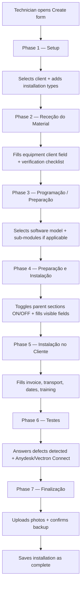
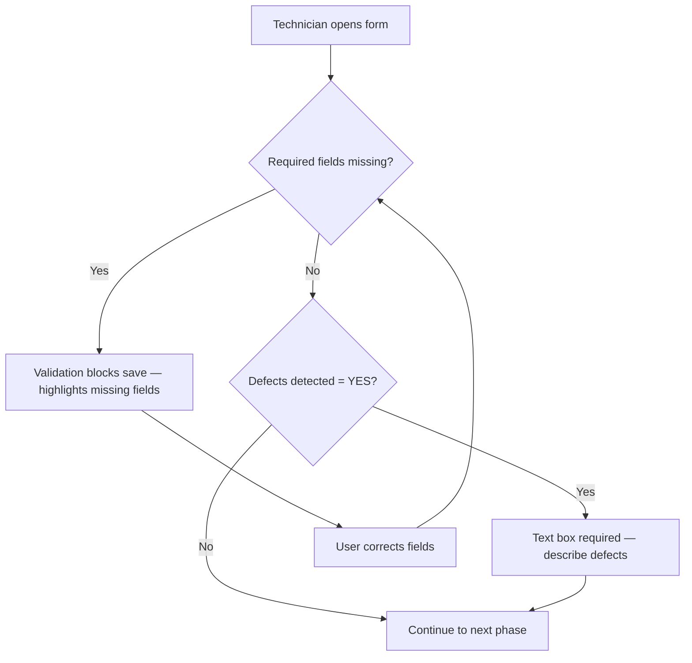

# Programação de Instalações (Phases Refactor) - Requirements

## Epic
[ ] **INST-E-001**: **As a** technician **I want** the Installations Programming form phases to be restructured with repeatable installation types, a clearer verification checklist, hierarchical software selection, conditional collapsible sections, and a defects detection field **So that** I can track each installation job more accurately and with less confusion

## User Flow

### Passing Cases Flow
[ ] Passing flow diagram

### Non-Passing Cases Flow
[ ] Non-passing flow diagram

## Technical Requirements

### Business Rules
[ ] **INST-BR-001**: Installation types in Setup are repeatable — same type can be added multiple times (same pattern as Daily Activity Records `atividades` array). Available types: POS, CPA, balanças, CCTV, Alarmes, Botões de chamada e relógios
[ ] **INST-BR-002**: "Equipamento do Cliente" field: when answer is NÃO, the text box is hidden; when SIM, the text box is visible
[ ] **INST-BR-003**: "Verificações" section replaces the old "Verificar condição do equipamento" — no SIM/NÃO toggle; items are always shown as a checklist. Items are optional — do not block phase progression
[ ] **INST-BR-004**: Software selection is single-choice hierarchical — technician selects one software brand, and if that brand has sub-products/modules, the sub-product and module must also be selected
[ ] **INST-BR-005**: In Phase 4 (Preparação e Instalação), each collapsible section has a parent TRUE/FALSE toggle — child fields are only considered/visible when parent = TRUE
[ ] **INST-BR-006**: "Equipamento adicional" moves to the end of Phase 4 with a TRUE/FALSE toggle — when FALSE, a text area appears with label "Porquê?" for the technician to justify why no additional equipment
[ ] **INST-BR-007**: In Phase 6 (Testes), "Falhas detectadas" is SIM/NÃO — when SIM, a text box appears for the technician to describe the defects

### Performance
[ ] **INST-NFR-001**: Form navigation between phases responds within 300ms on mobile devices

### Dependencies & Integration Requirements
**Internal**: Daily Activity Records (pattern for repeatable types), Content Relations (client link), BaseContent interface
**External**: None

## UI/UX Requirements
[ ] **UX-001**: All phase toggles and checkboxes use minimum 44px touch targets (mobile-first)
[ ] **UX-002**: Hierarchical software selection uses collapsible tree or nested dropdowns — not flat list
[ ] **UX-003**: Conditional fields animate in/out smoothly when toggled
[ ] **UX-004**: Parent TRUE/FALSE toggles in Phase 4 visually indicate collapsed vs expanded state

## User Stories

### Story: Setup — Multiple Installation Types
[ ] **INST-S-001**: **As a** technician **I want** to add multiple installation types (including repeated types) in the Setup phase **So that** I can track all equipment being installed in a single job

#### Acceptance Criteria
[ ] **INST-AC-001**: The system **SHALL** allow adding multiple installation type entries from the list (POS, CPA, balanças, CCTV, Alarmes, Botões de chamada e relógios) **WHEN** the technician is in the Setup phase
[ ] **INST-AC-002**: The system **SHALL** permit the same installation type to be selected more than once **WHEN** adding entries to the list
[ ] **INST-AC-003**: The system **SHALL** allow removing individual installation type entries **WHEN** the technician edits the Setup phase

### Story: Receção do Material — Verification Checklist
[ ] **INST-S-002**: **As a** technician **I want** to see a verification checklist (Cabo, Transformador, Fechadura, Chaves, Testes ao equipamento) without conditional toggles **So that** I can quickly mark each verification item

#### Acceptance Criteria
[ ] **INST-AC-004**: The system **SHALL** display the "Equipamento do Cliente" field with SIM/NÃO selection **WHEN** the technician enters Phase 2
[ ] **INST-AC-005**: The system **SHALL** hide the equipment description text box **WHEN** "Equipamento do Cliente" is NÃO
[ ] **INST-AC-006**: The system **SHALL** show the equipment description text box **WHEN** "Equipamento do Cliente" is SIM
[ ] **INST-AC-007**: The system **SHALL** display the "Verificações" section with 5 TRUE/FALSE items (Cabo, Transformador, Fechadura, Chaves, Testes ao equipamento) unconditionally **WHEN** the technician is in Phase 2
[ ] **INST-AC-008**: The system **SHALL** label the section "Verificações" instead of "Verificar condição do equipamento" **WHEN** displaying Phase 2
[ ] **INST-AC-009**: The system **SHALL** allow phase progression to Phase 3 regardless of whether verification items are answered **WHEN** the technician advances from Phase 2 [Kiro addition]

### Story: Programação — Hierarchical Software Selection
[ ] **INST-S-003**: **As a** technician **I want** to select one software from a hierarchical list (brand → product → modules) **So that** I can accurately record which software and modules are being programmed

#### Acceptance Criteria
[ ] **INST-AC-010**: The system **SHALL** present software brands at the top level (Vectron, Pix, Pix Orders, Pix Order Posto Adicional, Pix Monitor Pedidos, Pix RestFest, Zon Soft, Zon Soft Mobile, PT CERT, Dream Soft, Contas Certas) **WHEN** the technician enters Phase 3
[ ] **INST-AC-011**: The system **SHALL** expand sub-products for Pix (Pix Rest, Pix Gest, Pix POS, Pix AutoVenda) **WHEN** Pix is selected
[ ] **INST-AC-012**: The system **SHALL** require module selection (Modulo 1, Modulo 2, Modulo 3, Posto adicional) for each Pix sub-product **WHEN** a Pix sub-product is selected
[ ] **INST-AC-013**: The system **SHALL** expand sub-products for Zon Soft (ZS Rest, ZS POS) **WHEN** Zon Soft is selected
[ ] **INST-AC-014**: The system **SHALL** require tier selection (Basic, Light, Pro) for each Zon Soft sub-product **WHEN** a Zon Soft sub-product is selected
[ ] **INST-AC-015**: The system **SHALL** require license type selection (Licença definitiva, Licença Atual) **WHEN** PT CERT is selected
[ ] **INST-AC-016**: The system **SHALL** allow only one software selection per installation **WHEN** the technician is in Phase 3

### Story: Preparação e Instalação — Conditional Collapsible Sections
[ ] **INST-S-004**: **As a** technician **I want** each preparation section to have a parent toggle that hides/shows child fields **So that** I only fill in sections relevant to the current job

#### Acceptance Criteria
[ ] **INST-AC-017**: The system **SHALL** add a TRUE/FALSE toggle to each collapsible section in Phase 4 **WHEN** displaying the phase
[ ] **INST-AC-018**: The system **SHALL** hide all child fields of a section **WHEN** the parent toggle is set to FALSE
[ ] **INST-AC-019**: The system **SHALL** show all child fields of a section **WHEN** the parent toggle is set to TRUE
[ ] **INST-AC-020**: The system **SHALL** display "Equipamento adicional" as the last section in Phase 4 with its own TRUE/FALSE toggle **WHEN** the phase is rendered
[ ] **INST-AC-021**: The system **SHALL** show a text area labeled "Porquê?" in "Equipamento adicional" **WHEN** the toggle is set to FALSE
[ ] **INST-AC-022**: The system **SHALL** hide the "Porquê?" text area in "Equipamento adicional" **WHEN** the toggle is set to TRUE

### Story: Testes — Defects Detection
[ ] **INST-S-005**: **As a** technician **I want** to flag detected defects and describe them in a text box **So that** issues found during testing are documented

#### Acceptance Criteria
[ ] **INST-AC-023**: The system **SHALL** display a "Falhas detectadas" field with SIM/NÃO options **WHEN** the technician is in Phase 6
[ ] **INST-AC-024**: The system **SHALL** show a text box for defect description **WHEN** "Falhas detectadas" is SIM
[ ] **INST-AC-025**: The system **SHALL** hide the defect description text box **WHEN** "Falhas detectadas" is NÃO

### Story: Form Validation
[ ] **INST-S-006**: **As a** technician **I want** the form to prevent submission when required fields are empty **So that** incomplete installations are not recorded

#### Acceptance Criteria
[ ] **INST-AC-026**: **IF** required fields in the current phase are not filled, **THEN** the system **SHALL** block phase progression and highlight the missing fields
[ ] **INST-AC-027**: **IF** "Falhas detectadas" is SIM and the text box is empty, **THEN** the system **SHALL** block progression and indicate the text box is required
[ ] **INST-AC-028**: **IF** "Equipamento do Cliente" is SIM and the text box is empty, **THEN** the system **SHALL** block progression and indicate the text box is required

## Related Documentation
- Daily Activity Records — repeatable activities pattern (`atividades: Activity[]`)
- Existing 7-phase types in `types-seven-phases.ts` (current structure being refactored)

### Excluded scope
- Phase numbering remains unchanged (7 phases) — only content within phases changes
- No changes to Phase 5 (Instalação no Cliente) or Phase 7 (Finalização)
- No changes to the relations system (clientId resolution stays as-is)
- No changes to permission model
- No migration of existing data (new fields default to empty/false)
