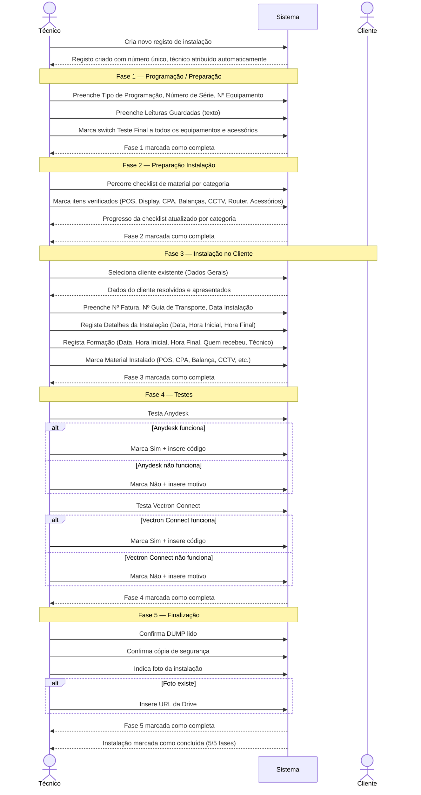

# Documento de Requisitos — Instalações e Programações (Refactor)

## Introdução

Este documento define os requisitos para o refactor do content type "Instalações e Programações" no dashboard CLEVER. O cliente solicitou a reestruturação do módulo, mantendo as 5 fases mas com nomes e formulários diferentes.

As principais alterações são:
- **Fase 1** — Reformulação completa dos campos (novos: Tipo de programação, Nº Série, Nº Equipamento, Leituras Guardadas, Teste Final)
- **Fase 2** — Sem alterações (manter campos e forms existentes)
- **Fase 3** — Reorganização dos campos em secções claras (Dados Gerais, Detalhes Instalação, Formação, Material Instalado)
- **Fase 4** — Sem alterações
- **Fase 5** — Sem alterações

Frequência estimada: média (~2-5/semana).

> **Nota:** A Fase 1 contém um elemento pendente de clarificação — "Várias programações possíveis" — que será detalhado quando a informação estiver disponível. Os requisitos desta fase serão atualizados nessa altura.

## Glossário

- **Instalação**: Registo completo do processo de instalação de equipamentos num cliente, composto por 5 fases
- **Fase**: Etapa do processo de instalação; cada fase agrupa um conjunto de campos e validações
- **Programação / Preparação**: Fase 1 — configuração e preparação inicial do equipamento
- **Preparação Instalação**: Fase 2 — verificação de todo o material necessário para a instalação
- **Checklist**: Conjunto de itens de verificação (switches) que confirmam a presença de material
- **Formação**: Sessão de treino dada ao cliente após a instalação do equipamento
- **DUMP**: Leitura de dados do equipamento para verificação pós-instalação
- **POS**: Terminal de ponto de venda (Point of Sale)
- **CPA**: Equipamento de contagem e pagamento automático
- **CCTV**: Sistema de videovigilância (Closed-Circuit Television)
- **Vectron Connect**: Software de gestão remota de equipamentos Vectron
- **Anydesk**: Software de acesso remoto a equipamentos
- **Técnico**: Utilizador do sistema responsável pela instalação
- **Cliente**: Entidade que recebe a instalação (content type Clientes existente)
- **Leituras Guardadas**: Registo textual das leituras efetuadas durante a programação
- **Teste Final**: Verificação switch de que todos os equipamentos e acessórios foram testados

## Requisitos

### REQ-01: Gestão de Registos de Instalação

**User Story:** Como técnico, quero criar e gerir registos de instalação, para acompanhar todo o processo de instalação de equipamentos em clientes.

#### Critérios de Aceitação

- CA-01.1: **WHEN** um técnico autenticado acede à criação de registo, o sistema **SHALL** criar um novo registo de instalação com um número único gerado automaticamente
- CA-01.2: **WHEN** um registo é aberto, o sistema **SHALL** apresentar as 5 fases: Programação / Preparação, Preparação Instalação, Instalação no Cliente, Testes e Finalização
- CA-01.3: **WHEN** um técnico edita um registo existente, o sistema **SHALL** permitir atualizar campos de qualquer fase
- CA-01.4: **WHEN** um registo é visualizado, o sistema **SHALL** apresentar o estado de progresso indicando quais fases estão completas
- CA-01.5: **WHEN** um técnico acede ao módulo de instalações, o sistema **SHALL** permitir listar, pesquisar e visualizar registos
- CA-01.6: **WHEN** um registo é criado, o sistema **SHALL** atribuir automaticamente o técnico autenticado como responsável

### REQ-02: Fase 1 — Programação / Preparação

**User Story:** Como técnico, quero registar a configuração inicial do equipamento com os novos campos simplificados, para preparar a programação antes da instalação.

#### Critérios de Aceitação

- CA-02.1: **WHEN** o técnico acede à Fase 1, o sistema **SHALL** apresentar um campo de texto para o Tipo de Programação
- CA-02.2: **WHEN** o técnico acede à Fase 1, o sistema **SHALL** apresentar um campo de texto para o Número de Série
- CA-02.3: **WHEN** o técnico acede à Fase 1, o sistema **SHALL** apresentar um campo de texto para o Nº Equipamento
- CA-02.4: **WHEN** o técnico acede à Fase 1, o sistema **SHALL** apresentar um campo de texto para Leituras Guardadas
- CA-02.5: **WHEN** o técnico acede à Fase 1, o sistema **SHALL** apresentar um switch para Teste Final a todos os equipamentos e acessórios
- CA-02.6: **WHEN** o técnico preenche os campos da Fase 1, o sistema **SHALL** guardar os dados no registo de instalação
- CA-02.7: **WHEN** o técnico edita campos da Fase 1 após o preenchimento inicial, o sistema **SHALL** permitir a edição e guardar as alterações
- CA-02.8: **WHEN** o módulo é atualizado com o refactor, o sistema **SHALL** remover todos os campos antigos da Fase 1 (PLUS, Departamento, Cabeçalho, Rede, switches de ligações, campos condicionais Vectron)

> **[Pendente]** O brief menciona "Várias programações possíveis (consultar folha)". Quando a informação estiver disponível, serão adicionados critérios de aceitação para suportar múltiplos tipos de programação com os respetivos campos.

### REQ-03: Fase 2 — Preparação Instalação

**User Story:** Como técnico, quero verificar todo o material necessário antes de ir ao cliente, para garantir que nada fica esquecido.

> Sem alterações face à versão original. Manter os mesmos campos e forms.

#### Critérios de Aceitação

- CA-03.1: **WHEN** o técnico acede à Fase 2, o sistema **SHALL** apresentar uma checklist de material organizada por categorias, onde cada item é um switch de verificação
- CA-03.2: **WHEN** a categoria POS é apresentada, o sistema **SHALL** incluir os itens: Cabo POS, WER, Transformador, Cabo Rede
- CA-03.3: **WHEN** a categoria Display Cliente é apresentada, o sistema **SHALL** incluir os itens: Impressora, Rolo, Cabo Power, Transformador, Cabo Ligação POS, Ficha Adaptador RS232, Autocolantes
- CA-03.4: **WHEN** a categoria Gaveta Metálica é apresentada, o sistema **SHALL** incluir os itens: Chaves, Autocolantes
- CA-03.5: **WHEN** a categoria CPA é apresentada, o sistema **SHALL** incluir os itens: Base, Parafusos, Cabo Power, Transformador, Cabo Comunicação Entre Moedas e Notas, Cabo Rede, Cabo Série, Cabo USB, Chaves, Site Gestiinforma no Display, Folha com Códigos, Autocolantes
- CA-03.6: **WHEN** a categoria Balanças é apresentada, o sistema **SHALL** incluir os itens: Cabo Power, Transformador, Folha 1ª Verificação, Autocolante
- CA-03.7: **WHEN** a categoria CCTV é apresentada, o sistema **SHALL** incluir os itens: DVR, Câmaras, Transformador, Cabo Power, Fichas, Placas Licença, Autocolantes
- CA-03.8: **WHEN** a categoria Router/Switch é apresentada, o sistema **SHALL** incluir os itens: Router, Switch, Cabo Power, Transformador, Cabo Rede, Autocolante
- CA-03.9: **WHEN** a categoria Acessórios é apresentada, o sistema **SHALL** incluir os itens: Bobine de Cabos, Fichas de Rede, Adaptadores de Impressora, Monitor Interno, Soprador, Álcool, Pincel, Panos, Braçadeiras, Mangueira, Mala de Ferramentas, Autocolantes
- CA-03.10: **WHEN** o técnico marca/desmarca itens da checklist, o sistema **SHALL** guardar o estado imediatamente no registo
- CA-03.11: **WHEN** uma categoria tem itens parcialmente verificados, o sistema **SHALL** apresentar um indicador visual do progresso por categoria (ex: 3/4 itens verificados)

### REQ-04: Fase 3 — Instalação no Cliente

**User Story:** Como técnico, quero registar os detalhes da instalação no local do cliente, organizados em secções claras, para documentar o trabalho realizado e a formação dada.

> Reorganização dos campos em secções: Dados Gerais, Detalhes da Instalação, Formação, Material Instalado. Conteúdo funcional mantido.

#### Critérios de Aceitação

**Dados Gerais:**
- CA-04.1: **WHEN** o técnico acede à Fase 3, secção Dados Gerais, o sistema **SHALL** permitir selecionar um cliente existente (relação com content type Clientes)
- CA-04.2: **WHEN** o técnico acede à Fase 3, secção Dados Gerais, o sistema **SHALL** apresentar campos de texto para: Nº Fatura, Nº Guia de Transporte
- CA-04.3: **WHEN** o técnico acede à Fase 3, secção Dados Gerais, o sistema **SHALL** apresentar um campo de data para Data de Instalação
- CA-04.4: **WHEN** o técnico acede à Fase 3, o sistema **SHALL** registar automaticamente o técnico de instalação a partir do utilizador autenticado

**Detalhes da Instalação:**
- CA-04.5: **WHEN** o técnico acede à Fase 3, secção Detalhes da Instalação, o sistema **SHALL** apresentar campos de data e hora para: Data, Hora Inicial, Hora Final

**Formação:**
- CA-04.6: **WHEN** o técnico acede à Fase 3, secção Formação, o sistema **SHALL** apresentar campos de data e hora para: Data de Formação, Hora Inicial, Hora Final
- CA-04.7: **WHEN** o técnico acede à Fase 3, secção Formação, o sistema **SHALL** apresentar um campo de texto para registar quem recebeu a formação
- CA-04.8: **WHEN** o técnico acede à Fase 3, secção Formação, o sistema **SHALL** apresentar um campo para o técnico responsável pela formação

**Material Instalado:**
- CA-04.9: **WHEN** o técnico acede à Fase 3, secção Material Instalado, o sistema **SHALL** apresentar switches para: POS, CPA, Balança, CCTV, Alarme, Impressora, UPS, Router, Switch
- CA-04.10: **WHEN** o material instalado inclui Rolos, o sistema **SHALL** apresentar um campo numérico para indicar a quantidade

**Erros:**
- CA-04.11: **IF** o cliente selecionado não for encontrado, **THEN** o sistema **SHALL** apresentar uma mensagem de erro adequada

### REQ-05: Fase 4 — Testes

**User Story:** Como técnico, quero registar os resultados dos testes pós-instalação, para confirmar que o equipamento está funcional e acessível remotamente.

> Sem alterações face à versão original.

#### Critérios de Aceitação

- CA-05.1: **WHEN** o técnico acede à Fase 4, o sistema **SHALL** apresentar um switch para o teste de Anydesk (Sim/Não)
- CA-05.2: **WHEN** o teste de Anydesk é marcado como Sim, o sistema **SHALL** apresentar um campo de texto para o código Anydesk
- CA-05.3: **WHEN** o teste de Anydesk é marcado como Não, o sistema **SHALL** apresentar um campo de texto para o motivo da falha
- CA-05.4: **WHEN** o técnico acede à Fase 4, o sistema **SHALL** apresentar um switch para o teste de Vectron Connect (Sim/Não)
- CA-05.5: **WHEN** o teste de Vectron Connect é marcado como Sim, o sistema **SHALL** apresentar um campo de texto para o código Vectron Connect
- CA-05.6: **WHEN** o teste de Vectron Connect é marcado como Não, o sistema **SHALL** apresentar um campo de texto para o motivo da falha

### REQ-06: Fase 5 — Finalização

**User Story:** Como técnico, quero registar as verificações finais da instalação, para confirmar que o processo está completo e documentado.

> Sem alterações face à versão original.

#### Critérios de Aceitação

- CA-06.1: **WHEN** o técnico acede à Fase 5, o sistema **SHALL** apresentar um switch para confirmar que o DUMP foi lido
- CA-06.2: **WHEN** o técnico acede à Fase 5, o sistema **SHALL** apresentar um switch para confirmar que a cópia de segurança foi feita
- CA-06.3: **WHEN** o técnico acede à Fase 5, o sistema **SHALL** apresentar um switch para indicar se existe foto da instalação
- CA-06.4: **WHEN** o switch de foto da instalação é marcado como Sim, o sistema **SHALL** apresentar um campo de texto para o URL da Drive com a foto
- CA-06.5: **WHEN** todas as verificações da Fase 5 estão completas, o sistema **SHALL** marcar a instalação como finalizada

### REQ-07: Relação com Cliente

**User Story:** Como técnico, quero associar a instalação a um cliente existente, para manter o histórico de instalações por cliente.

> Sem alterações face à versão original.

#### Critérios de Aceitação

- CA-07.1: **WHEN** o técnico cria ou edita uma instalação na Fase 3, o sistema **SHALL** permitir selecionar um cliente existente a partir da lista de Clientes
- CA-07.2: **WHEN** um cliente é selecionado e o registo é guardado, o sistema **SHALL** armazenar a relação usando o campo clientId
- CA-07.3: **WHEN** o registo de instalação é apresentado, o sistema **SHALL** resolver e exibir o nome do cliente associado
- CA-07.4: **IF** a relação com o cliente não puder ser resolvida, **THEN** o sistema **SHALL** apresentar uma mensagem de erro estruturada
- CA-07.5: **WHILE** um registo tem cliente associado, o sistema **SHALL** manter a integridade da relação em todas as vistas

### REQ-08: Fluxo de Fases e Progressão

**User Story:** Como técnico, quero navegar entre as fases da instalação e ver o progresso geral, para saber rapidamente o que já foi feito e o que falta.

> Sem alterações face à versão original.

#### Critérios de Aceitação

- CA-08.1: **WHEN** um registo de instalação é aberto, o sistema **SHALL** apresentar as 5 fases de forma sequencial e navegável (Programação / Preparação → Preparação Instalação → Instalação no Cliente → Testes → Finalização)
- CA-08.2: **WHEN** um registo é visualizado, o sistema **SHALL** apresentar um indicador visual de progresso que mostre quais fases estão completas, em curso ou por iniciar
- CA-08.3: **WHEN** o técnico tenta aceder a uma fase sem ter completado as anteriores, o sistema **SHALL** permitir a navegação livre entre fases
- CA-08.4: **WHEN** todos os campos obrigatórios de uma fase estão preenchidos, o sistema **SHALL** marcar essa fase como completa no indicador de progresso
- CA-08.5: **WHEN** todas as 5 fases estão completas, o sistema **SHALL** marcar o registo de instalação como concluído
- CA-08.6: **WHEN** o técnico acede à lista de instalações, o sistema **SHALL** apresentar o estado de progresso de cada registo (ex: 3/5 fases completas)

### REQ-09: Interface Mobile-First

**User Story:** Como técnico em campo, quero aceder ao registo de instalação no telemóvel, para preencher as fases durante o trabalho no local do cliente.

> Sem alterações face à versão original.

#### Critérios de Aceitação

- CA-09.1: **WHEN** o técnico acede ao módulo de instalações, o sistema **SHALL** disponibilizar 5 vistas: Home tile, Lista, Detalhe, Criar, Editar
- CA-09.2: **WHILE** o técnico usa um dispositivo móvel, o sistema **SHALL** garantir touch targets mínimos de 44px em todos os elementos interativos
- CA-09.3: **WHEN** qualquer vista é apresentada, o sistema **SHALL** apresentar todos os labels da interface em Português de Portugal
- CA-09.4: **WHILE** o técnico usa a checklist no telemóvel, o sistema **SHALL** otimizar os switches para uso táctil
- CA-09.5: **WHEN** a checklist tem múltiplas categorias num ecrã pequeno, o sistema **SHALL** apresentar as categorias de forma colapsável para reduzir scroll
- CA-09.6: **WHILE** o técnico usa o telemóvel, o sistema **SHALL** adaptar o layout das fases com navegação acessível por toque

### REQ-10: Persistência e Auditoria

**User Story:** Como administrador, quero que os dados de instalação sejam armazenados de forma consistente com os outros content types, para manter a integridade e rastreabilidade dos dados.

> Sem alterações face à versão original.

#### Critérios de Aceitação

- CA-10.1: **WHEN** um registo de instalação é criado, o sistema **SHALL** seguir a interface BaseContent para estrutura de dados consistente
- CA-10.2: **WHEN** um registo é criado ou atualizado, o sistema **SHALL** manter audit trail com timestamps e informação do utilizador
- CA-10.3: **WHEN** o técnico solicita eliminação de um registo, o sistema **SHALL** apresentar confirmação antes de eliminar
- CA-10.4: **WHEN** um registo é guardado, o sistema **SHALL** armazenar dados seguindo o padrão estabelecido de chaves de armazenamento
- CA-10.5: **WHEN** um registo é criado, atualizado ou eliminado, o sistema **SHALL** manter índices de pesquisa sincronizados
- CA-10.6: **WHEN** um utilizador acede ao módulo, o sistema **SHALL** integrar-se com o sistema de autenticação e respeitar as permissões (Admin/User)

## Âmbito Excluído

- Upload direto de ficheiros (fotos, documentos) — utilizar URL da Drive em vez disso
- Notificações automáticas entre fases
- Aprovação/validação de fases por outro utilizador (supervisor)
- Relatórios ou estatísticas de instalações
- Integração com sistemas externos (Vectron, Anydesk)
- Gestão de stock de material (a checklist é apenas verificação, não controlo de inventário)
- Histórico de alterações por campo (apenas audit trail de criação/atualização geral)
- Detalhamento de "Várias programações possíveis" na Fase 1 (pendente de clarificação do cliente)

## Restrições

- Todos os labels da interface em Português de Portugal; código em Inglês
- Mobile-first com touch targets mínimos de 44px
- Seguir os padrões existentes de content types do CLEVER (BaseContent, 5 vistas, R2, índices)
- Atribuição automática de técnico via contexto de autenticação Clerk
- Relação com Clientes segue o padrão existente (clientId + resolução automática)
- Sem dependência de serviços externos para funcionamento offline das checklists
- Refactor deve manter compatibilidade com registos existentes ou incluir migração de dados

## [MA] Mirror — Critérios de Aceitação

| REQ-ID | CA-ID | Given | When | Then | Prioridade |
|--------|-------|-------|------|------|------------|
| REQ-01 | CA-01.1 | Um técnico autenticado | Cria um novo registo de instalação | O sistema gera um número único e cria o registo | Alta |
| REQ-01 | CA-01.2 | Um registo de instalação existe | O registo é aberto | O sistema apresenta as 5 fases: Programação / Preparação, Preparação Instalação, Instalação no Cliente, Testes, Finalização | Alta |
| REQ-01 | CA-01.3 | Um registo de instalação existe | O técnico edita campos de qualquer fase | O sistema guarda as alterações no registo | Alta |
| REQ-01 | CA-01.4 | Um registo com fases parcialmente completas | O registo é visualizado | O sistema mostra o estado de progresso por fase | Média |
| REQ-01 | CA-01.5 | Existem registos no sistema | O técnico acede à lista de instalações | O sistema apresenta a lista com pesquisa disponível | Alta |
| REQ-01 | CA-01.6 | Um técnico autenticado | Cria um novo registo | O técnico autenticado é atribuído automaticamente como responsável | Alta |
| REQ-02 | CA-02.1 | O técnico está na Fase 1 | O formulário é apresentado | Campo de texto visível: Tipo de Programação | Alta |
| REQ-02 | CA-02.2 | O técnico está na Fase 1 | O formulário é apresentado | Campo de texto visível: Número de Série | Alta |
| REQ-02 | CA-02.3 | O técnico está na Fase 1 | O formulário é apresentado | Campo de texto visível: Nº Equipamento | Alta |
| REQ-02 | CA-02.4 | O técnico está na Fase 1 | O formulário é apresentado | Campo de texto visível: Leituras Guardadas | Alta |
| REQ-02 | CA-02.5 | O técnico está na Fase 1 | O formulário é apresentado | Switch visível: Teste Final a todos os equipamentos e acessórios | Alta |
| REQ-02 | CA-02.6 | O técnico preencheu campos da Fase 1 | Os dados são submetidos | O sistema guarda os dados no registo | Alta |
| REQ-02 | CA-02.7 | A Fase 1 já foi preenchida | O técnico edita um campo | O sistema permite a edição e guarda as alterações | Média |
| REQ-02 | CA-02.8 | O módulo é atualizado com o refactor | O formulário da Fase 1 é apresentado | Os campos antigos (PLUS, Departamento, Cabeçalho, Rede, switches de ligações, Vectron) não estão presentes | Alta |
| REQ-03 | CA-03.1 | O técnico está na Fase 2 | O formulário é apresentado | Checklist organizada por categorias com switches | Alta |
| REQ-03 | CA-03.2 | Categoria POS visível | O técnico verifica os itens | Itens disponíveis: Cabo POS, WER, Transformador, Cabo Rede | Alta |
| REQ-03 | CA-03.3 | Categoria Display Cliente visível | O técnico verifica os itens | Itens disponíveis: Impressora, Rolo, Cabo Power, Transformador, Cabo Ligação POS, Ficha Adaptador RS232, Autocolantes | Alta |
| REQ-03 | CA-03.4 | Categoria Gaveta Metálica visível | O técnico verifica os itens | Itens disponíveis: Chaves, Autocolantes | Alta |
| REQ-03 | CA-03.5 | Categoria CPA visível | O técnico verifica os itens | Itens disponíveis: Base, Parafusos, Cabo Power, Transformador, Cabo Comunicação, Cabo Rede, Cabo Série, Cabo USB, Chaves, Site Gestiinforma, Folha Códigos, Autocolantes | Alta |
| REQ-03 | CA-03.6 | Categoria Balanças visível | O técnico verifica os itens | Itens disponíveis: Cabo Power, Transformador, Folha 1ª Verificação, Autocolante | Alta |
| REQ-03 | CA-03.7 | Categoria CCTV visível | O técnico verifica os itens | Itens disponíveis: DVR, Câmaras, Transformador, Cabo Power, Fichas, Placas Licença, Autocolantes | Alta |
| REQ-03 | CA-03.8 | Categoria Router/Switch visível | O técnico verifica os itens | Itens disponíveis: Router, Switch, Cabo Power, Transformador, Cabo Rede, Autocolante | Alta |
| REQ-03 | CA-03.9 | Categoria Acessórios visível | O técnico verifica os itens | Itens disponíveis: Bobine de Cabos, Fichas de Rede, Adaptadores, Monitor Interno, Soprador, Álcool, Pincel, Panos, Braçadeiras, Mangueira, Mala Ferramentas, Autocolantes | Alta |
| REQ-03 | CA-03.10 | O técnico está na checklist | Marca ou desmarca um item | O estado é guardado imediatamente no registo | Alta |
| REQ-03 | CA-03.11 | Uma categoria tem itens parcialmente verificados | A categoria é visualizada | O sistema mostra indicador de progresso (ex: 3/4) | Média |
| REQ-04 | CA-04.1 | O técnico está na Fase 3, secção Dados Gerais | Acede ao campo de cliente | O sistema apresenta lista de clientes existentes para seleção | Alta |
| REQ-04 | CA-04.2 | O técnico está na Fase 3, secção Dados Gerais | O formulário é apresentado | Campos de texto visíveis: Nº Fatura, Nº Guia de Transporte | Alta |
| REQ-04 | CA-04.3 | O técnico está na Fase 3, secção Dados Gerais | O formulário é apresentado | Campo de data visível: Data de Instalação | Alta |
| REQ-04 | CA-04.4 | O técnico autenticado está na Fase 3 | O formulário é apresentado | O técnico de instalação é preenchido automaticamente | Alta |
| REQ-04 | CA-04.5 | O técnico está na Fase 3, secção Detalhes | O formulário é apresentado | Campos de data/hora visíveis: Data, Hora Inicial, Hora Final | Alta |
| REQ-04 | CA-04.6 | O técnico está na Fase 3, secção Formação | O formulário é apresentado | Campos de data/hora visíveis: Data Formação, Hora Inicial, Hora Final | Alta |
| REQ-04 | CA-04.7 | O técnico está na Fase 3, secção Formação | O formulário é apresentado | Campo de texto visível: Quem recebeu formação | Alta |
| REQ-04 | CA-04.8 | O técnico está na Fase 3, secção Formação | O formulário é apresentado | Campo para técnico responsável pela formação | Alta |
| REQ-04 | CA-04.9 | O técnico está na Fase 3, secção Material | O formulário é apresentado | Switches de material instalado: POS, CPA, Balança, CCTV, Alarme, Impressora, UPS, Router, Switch | Alta |
| REQ-04 | CA-04.10 | Material instalado inclui Rolos | O switch de Rolos é ativado | Campo numérico para quantidade de rolos é apresentado | Média |
| REQ-04 | CA-04.11 | O técnico seleciona um cliente | O cliente não é encontrado no sistema | O sistema apresenta mensagem de erro adequada | Alta |
| REQ-05 | CA-05.1 | O técnico está na Fase 4 | O formulário é apresentado | Switch de teste Anydesk visível (Sim/Não) | Alta |
| REQ-05 | CA-05.2 | Teste Anydesk marcado como Sim | O switch é ativado | Campo de texto para código Anydesk é apresentado | Alta |
| REQ-05 | CA-05.3 | Teste Anydesk marcado como Não | O switch está desativado | Campo de texto para motivo da falha é apresentado | Alta |
| REQ-05 | CA-05.4 | O técnico está na Fase 4 | O formulário é apresentado | Switch de teste Vectron Connect visível (Sim/Não) | Alta |
| REQ-05 | CA-05.5 | Teste Vectron Connect marcado como Sim | O switch é ativado | Campo de texto para código Vectron Connect é apresentado | Alta |
| REQ-05 | CA-05.6 | Teste Vectron Connect marcado como Não | O switch está desativado | Campo de texto para motivo da falha é apresentado | Alta |
| REQ-06 | CA-06.1 | O técnico está na Fase 5 | O formulário é apresentado | Switch para confirmar DUMP lido visível | Alta |
| REQ-06 | CA-06.2 | O técnico está na Fase 5 | O formulário é apresentado | Switch para confirmar cópia de segurança visível | Alta |
| REQ-06 | CA-06.3 | O técnico está na Fase 5 | O formulário é apresentado | Switch para indicar existência de foto da instalação visível | Alta |
| REQ-06 | CA-06.4 | Switch de foto marcado como Sim | O switch é ativado | Campo de texto para URL da Drive é apresentado | Alta |
| REQ-06 | CA-06.5 | Todas as verificações da Fase 5 completas | O técnico completa a última verificação | O sistema marca a instalação como finalizada | Alta |
| REQ-07 | CA-07.1 | O técnico está na Fase 3 | Acede ao campo de seleção de cliente | Lista de clientes existentes é apresentada | Alta |
| REQ-07 | CA-07.2 | Um cliente é selecionado | O registo é guardado | O clientId é armazenado no registo | Alta |
| REQ-07 | CA-07.3 | Um registo tem clientId associado | O registo é apresentado | O nome do cliente é resolvido e exibido | Alta |
| REQ-07 | CA-07.4 | Um registo tem clientId inválido | O registo é apresentado | Mensagem de erro estruturada é exibida | Alta |
| REQ-07 | CA-07.5 | Um registo tem cliente associado | O registo é visto em qualquer vista | A relação com o cliente é consistente em todas as vistas | Alta |
| REQ-08 | CA-08.1 | Um registo de instalação é aberto | O técnico navega entre fases | As 5 fases são apresentadas sequencialmente e navegáveis | Alta |
| REQ-08 | CA-08.2 | Um registo tem fases em diferentes estados | O registo é visualizado | Indicador visual mostra fases completas, em curso e por iniciar | Média |
| REQ-08 | CA-08.3 | Uma fase anterior não está completa | O técnico tenta aceder a outra fase | O sistema permite a navegação livre entre fases | Média |
| REQ-08 | CA-08.4 | Todos os campos obrigatórios de uma fase estão preenchidos | O técnico completa a fase | A fase é marcada como completa no indicador | Média |
| REQ-08 | CA-08.5 | Todas as 5 fases estão completas | A última fase é completada | O registo é marcado como concluído | Alta |
| REQ-08 | CA-08.6 | Existem registos com diferentes estados de progresso | O técnico acede à lista | O estado de progresso é visível por registo (ex: 3/5) | Média |
| REQ-09 | CA-09.1 | O módulo de instalações está disponível | O técnico acede ao módulo | 5 vistas disponíveis: Home tile, Lista, Detalhe, Criar, Editar | Alta |
| REQ-09 | CA-09.2 | O técnico usa um dispositivo móvel | Interage com qualquer elemento | Todos os touch targets têm mínimo 44px | Alta |
| REQ-09 | CA-09.3 | O técnico acede a qualquer vista | A interface é apresentada | Todos os labels estão em Português de Portugal | Alta |
| REQ-09 | CA-09.4 | O técnico usa a checklist no telemóvel | Toca nos switches | Os switches são otimizados para uso táctil | Alta |
| REQ-09 | CA-09.5 | A checklist tem múltiplas categorias | O técnico vê a Fase 2 no telemóvel | As categorias são colapsáveis para reduzir scroll | Média |
| REQ-09 | CA-09.6 | O técnico usa o telemóvel | Navega entre fases | A navegação entre fases é acessível por toque | Alta |
| REQ-10 | CA-10.1 | Um registo de instalação é criado | O registo é armazenado | Segue a estrutura BaseContent | Alta |
| REQ-10 | CA-10.2 | Um registo é criado ou atualizado | A operação é concluída | Timestamps e informação do utilizador são registados | Alta |
| REQ-10 | CA-10.3 | O técnico quer eliminar um registo | Confirma a eliminação | O registo é eliminado com confirmação prévia | Alta |
| REQ-10 | CA-10.4 | Um registo é guardado | A operação é concluída | Os dados são armazenados seguindo o padrão de chaves estabelecido | Alta |
| REQ-10 | CA-10.5 | Um registo é criado, atualizado ou eliminado | A operação é concluída | Os índices de pesquisa são atualizados | Alta |
| REQ-10 | CA-10.6 | Um utilizador acede ao módulo | O sistema verifica permissões | As permissões Admin/User são respeitadas | Alta |

## Fase 2 — Especificação Funcional

### Cenário Nominal

### Regras de Negócio

| RB-ID | Condição | Ação | Erro |
|-------|----------|------|------|
| RB-01 | Teste Anydesk = Sim (Fase 4) | Apresentar campo "Código Anydesk", ocultar campo "Motivo" | — |
| RB-02 | Teste Anydesk = Não (Fase 4) | Apresentar campo "Motivo da falha", ocultar campo "Código" | — |
| RB-03 | Teste Vectron Connect = Sim (Fase 4) | Apresentar campo "Código Vectron Connect", ocultar campo "Motivo" | — |
| RB-04 | Teste Vectron Connect = Não (Fase 4) | Apresentar campo "Motivo da falha", ocultar campo "Código" | — |
| RB-05 | Switch Foto Instalação = Sim (Fase 5) | Apresentar campo "URL da Drive" | — |
| RB-06 | Switch Foto Instalação = Não (Fase 5) | Ocultar campo "URL da Drive" | — |
| RB-07 | Todos os campos obrigatórios de uma fase preenchidos | Marcar fase como completa no indicador de progresso | — |
| RB-08 | Todas as 5 fases completas | Marcar registo de instalação como concluído | — |
| RB-09 | Criação de registo | Atribuir automaticamente o técnico autenticado como responsável | Erro se contexto de autenticação indisponível |
| RB-10 | Seleção de cliente na Fase 3 | Resolver e apresentar dados do cliente via relação clientId | Mensagem de erro se cliente não encontrado |
| RB-11 | Navegação entre fases | Permitir acesso livre a qualquer fase independentemente do estado das anteriores | — |
| RB-12 | Material instalado inclui Rolos (Fase 3) | Apresentar campo numérico para quantidade de rolos | — |
| RB-13 | Refactor da Fase 1 | Remover todos os campos antigos (PLUS, Departamento, Cabeçalho, Rede, switches de ligações, Vectron condicional) e substituir pelos novos | Migração de dados existentes necessária |

### Cenários Alternativos e de Erro

| Trigger | Comportamento | Resultado |
|---------|---------------|-----------|
| Cliente selecionado na Fase 3 não existe ou foi eliminado | O sistema tenta resolver a relação clientId | Mensagem de erro estruturada apresentada no campo de cliente |
| Técnico tenta guardar Fase 3 sem selecionar cliente | O sistema valida campos obrigatórios | Campo de cliente destacado como obrigatório |
| Técnico navega para outra fase sem guardar alterações | O sistema deteta alterações não guardadas | Dados da fase atual são preservados antes da navegação |
| Teste Anydesk marcado como Não sem preencher motivo | O sistema valida campo condicional obrigatório | Campo "Motivo" destacado como obrigatório |
| Teste Vectron Connect marcado como Não sem preencher motivo | O sistema valida campo condicional obrigatório | Campo "Motivo" destacado como obrigatório |
| Switch Foto ativado sem preencher URL da Drive | O sistema valida campo condicional obrigatório | Campo "URL da Drive" destacado como obrigatório |
| Contexto de autenticação indisponível na criação | O sistema não consegue atribuir técnico | Erro de autenticação apresentado, criação bloqueada |
| Técnico tenta eliminar registo de instalação | O sistema apresenta diálogo de confirmação | Registo eliminado após confirmação, ou operação cancelada |
| Utilizador com role "User" tenta eliminar registo | O sistema verifica permissões | Operação bloqueada conforme regras de permissão Admin/User |
| Registo parcialmente preenchido é aberto para edição | O sistema carrega o estado atual de todas as fases | Fases completas e incompletas apresentadas corretamente |
| Registo existente com campos antigos da Fase 1 é aberto após refactor | O sistema deteta dados no formato antigo | Dados antigos são apresentados como leitura ou migrados para o novo formato |

## Rastreabilidade Brief → Requisitos

| Elemento do Brief | REQ |
|-------------------|-----|
| Fase 1 — Programação / Preparação | REQ-02 |
| Tipo de programação | REQ-02 (CA-02.1) |
| Número Série | REQ-02 (CA-02.2) |
| Nº equipamento | REQ-02 (CA-02.3) |
| Várias programações possíveis | REQ-02 (pendente — ver nota) |
| Leituras Guardadas | REQ-02 (CA-02.4) |
| Teste Final a todos os equipamentos e acessórios | REQ-02 (CA-02.5) |
| Fase 2 — Preparação Instalação (manter mesmos campos) | REQ-03 |
| Fase 3 — Instalação no Cliente | REQ-04 |
| Selecionar Cliente | REQ-04 (CA-04.1), REQ-07 |
| Nº Fatura | REQ-04 (CA-04.2) |
| Nº Guia de Transporte | REQ-04 (CA-04.2) |
| Data Instalação | REQ-04 (CA-04.3) |
| Técnico Instalação | REQ-04 (CA-04.4) |
| Detalhes da Instalação (Data, Hora Inicial, Hora Final) | REQ-04 (CA-04.5) |
| Data Formação (Hora Inicial, Hora Final) | REQ-04 (CA-04.6) |
| Quem recebeu a formação | REQ-04 (CA-04.7) |
| Técnico (formação) | REQ-04 (CA-04.8) |
| Material Instalado | REQ-04 (CA-04.9) |
| Fase 4 — Testes | REQ-05 |
| Anydesk (Sim → Código / Não → Porquê) | REQ-05 (CA-05.1 a CA-05.3) |
| Vectron Connect (Sim → Código / Não → Porquê) | REQ-05 (CA-05.4 a CA-05.6) |
| Fase 5 — Finalização | REQ-06 |
| Dump Lido | REQ-06 (CA-06.1) |
| Cópia Segurança | REQ-06 (CA-06.2) |
| Foto Instalação | REQ-06 (CA-06.3, CA-06.4) |
