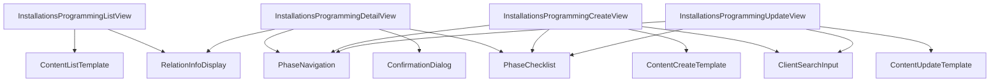

# Design Técnico — Instalações e Programações

## 1. Modelo de Dados

### 1.1 ContentType

- Adicionar `'installations-programming'` à union `ContentType` em `packages/shared/src/types.ts`

### 1.2 Interfaces principais

Ficheiro: `packages/shared/src/types/installations-programming/types.ts`

#### InstallationsProgrammingData

| Campo | Tipo | Obrigatório | Fase | Descrição |
|-------|------|-------------|------|-----------|
| `technician` | `TechnicianUser` | Sim | — | Técnico responsável (auto-assigned via Clerk) |
| `clientId` | `string` | Sim (Fase 3) | 3 | Relação com content type Clientes |
| `phase1` | `Phase1Data` | Sim | 1 | Dados de Programação |
| `phase2` | `Phase2Data` | Sim | 2 | Dados de Preparação |
| `phase3` | `Phase3Data` | Sim | 3 | Dados de Instalação no Cliente |
| `phase4` | `Phase4Data` | Sim | 4 | Dados de Testes |
| `phase5` | `Phase5Data` | Sim | 5 | Dados de Finalização |
| `completedPhases` | `number[]` | Sim | — | Array com índices das fases completas (ex: [1, 2, 3]) |
| `isCompleted` | `boolean` | Sim | — | `true` quando todas as 5 fases estão completas |

#### Phase1Data (Programação)

| Campo | Tipo | Obrigatório | Condicional |
|-------|------|-------------|-------------|
| `plus` | `string` | Não | — |
| `departamento` | `string` | Não | — |
| `cabecalho` | `string` | Não | — |
| `rede` | `string` | Não | — |
| `vectronConnect` | `string` | Não | — |
| `anydesk` | `string` | Não | — |
| `seriesEquipamentos` | `string` | Não | — |
| `ligacaoCPA` | `boolean` | Não | — |
| `ligacaoGaveta` | `boolean` | Não | — |
| `ligacaoImpressoraMonitor` | `boolean` | Não | — |
| `ligacaoFaturadora` | `boolean` | Não | — |
| `ligacaoDisplayClientes` | `boolean` | Não | — |
| `ligacaoScanner` | `boolean` | Não | — |
| `ligacaoLeitorCartoes` | `boolean` | Não | — |
| `ligacaoFechaduraChaves` | `boolean` | Não | — |
| `turnos` | `string` | Não | — |
| `isVectron` | `boolean` | Não | — |
| `vectronLeituraX` | `VectronLeituraXData` | Não | `isVectron === true` |
| `vectronConsultaDiaria` | `VectronConsultaDiariaData` | Não | `isVectron === true` |

#### VectronLeituraXData

| Campo | Tipo |
|-------|------|
| `plus1` | `string` |
| `plus2` | `string` |
| `departamentos` | `string` |
| `operadores` | `string` |
| `transacoesComIVA` | `string` |

#### VectronConsultaDiariaData

| Campo | Tipo |
|-------|------|
| `leituraGerenteNormal` | `string` |
| `leituraSupervisor` | `string` |

#### Phase2Data (Preparação)

| Campo | Tipo | Descrição |
|-------|------|-----------|
| `checklist` | `Record<string, Record<string, boolean>>` | Mapa categoria → item → estado. Ex: `{ "pos": { "caboPOS": true, "wer": false } }` |

Categorias e itens (chaves em camelCase):

| Categoria (chave) | Itens (chaves) |
|-------------------|----------------|
| `pos` | `caboPOS`, `wer`, `transformador`, `caboRede` |
| `displayCliente` | `impressora`, `rolo`, `caboPower`, `transformador`, `caboLigacaoPOS`, `fichaAdaptadorRS232`, `autocolantes` |
| `gavetaMetalica` | `chaves`, `autocolantes` |
| `cpa` | `base`, `parafusos`, `caboPower`, `transformador`, `caboComunicacaoMoedasNotas`, `caboRede`, `caboSerie`, `caboUSB`, `chaves`, `siteGestiinforma`, `folhaCodigos`, `autocolantes` |
| `balancas` | `caboPower`, `transformador`, `folhaPrimeiraVerificacao`, `autocolante` |
| `cctv` | `dvr`, `camaras`, `transformador`, `caboPower`, `fichas`, `placasLicenca`, `autocolantes` |
| `routerSwitch` | `router`, `switchEquip`, `caboPower`, `transformador`, `caboRede`, `autocolante` |
| `acessorios` | `bobineCabos`, `fichasRede`, `adaptadoresImpressora`, `monitorInterno`, `soprador`, `alcool`, `pincel`, `panos`, `bracadeiras`, `mangueira`, `malaFerramentas`, `autocolantes` |

#### Phase3Data (Instalação no Cliente)

| Campo | Tipo | Obrigatório | Condicional |
|-------|------|-------------|-------------|
| `nrFatura` | `string` | Não | — |
| `nrGuiaTransportes` | `string` | Não | — |
| `dataInstalacao` | `string` | Não | — |
| `horaInicialInstalacao` | `string` | Não | — |
| `horaFinalInstalacao` | `string` | Não | — |
| `dataFormacao` | `string` | Não | — |
| `horaInicialFormacao` | `string` | Não | — |
| `horaFinalFormacao` | `string` | Não | — |
| `quemRecebeuFormacao` | `string` | Não | — |
| `materialInstalado` | `MaterialInstaladoData` | Não | — |

#### MaterialInstaladoData

| Campo | Tipo | Condicional |
|-------|------|-------------|
| `pos` | `boolean` | — |
| `cpa` | `boolean` | — |
| `balanca` | `boolean` | — |
| `cctv` | `boolean` | — |
| `alarme` | `boolean` | — |
| `impressora` | `boolean` | — |
| `ups` | `boolean` | — |
| `router` | `boolean` | — |
| `switchEquip` | `boolean` | — |
| `rolos` | `boolean` | — |
| `rolosQuantidade` | `number` | `rolos === true` |

#### Phase4Data (Testes)

| Campo | Tipo | Condicional |
|-------|------|-------------|
| `anydeskTestado` | `boolean` | — |
| `anydeskCodigo` | `string` | `anydeskTestado === true` |
| `anydeskMotivo` | `string` | `anydeskTestado === false` |
| `vectronConnectTestado` | `boolean` | — |
| `vectronConnectCodigo` | `string` | `vectronConnectTestado === true` |
| `vectronConnectMotivo` | `string` | `vectronConnectTestado === false` |

#### Phase5Data (Finalização)

| Campo | Tipo | Condicional |
|-------|------|-------------|
| `dumpLido` | `boolean` | — |
| `copiaSeguranca` | `boolean` | — |
| `fotoInstalacao` | `boolean` | — |
| `fotoURL` | `string` | `fotoInstalacao === true` |

### 1.3 Interfaces derivadas

| Interface | Descrição |
|-----------|-----------|
| `InstallationsProgramming` | `extends BaseContent` com `contentType: 'installations-programming'` e `data: InstallationsProgrammingData` |
| `InstallationsProgrammingCreationData` | `extends InstallationsProgrammingData` — todos os campos para criação |
| `InstallationsProgrammingUpdateData` | `extends Partial<InstallationsProgrammingData>` — campos opcionais para atualização |
| `InstallationsProgrammingDisplayData` | Campos simplificados para lista: `uuid`, `clientName`, `technician` (display name), `completedPhases`, `isCompleted`, `createdAt`, `updatedAt` |

### 1.4 Constantes

Ficheiro: `packages/shared/src/types/installations-programming/types.ts`

| Constante | Tipo | Descrição |
|-----------|------|-----------|
| `CHECKLIST_CATEGORIES` | `Record<string, string[]>` | Mapa de categoria → lista de chaves de itens (fonte de verdade para a checklist da Fase 2) |
| `CHECKLIST_LABELS` | `Record<string, Record<string, string>>` | Mapa de categoria → item → label PT para UI |
| `PHASE_NAMES` | `Record<number, string>` | `{ 1: 'Programação', 2: 'Preparação', 3: 'Instalação no Cliente', 4: 'Testes', 5: 'Finalização' }` |

## 2. Armazenamento e Índices R2

### 2.1 Chaves R2

| Recurso | Padrão de chave | Exemplo |
|---------|----------------|---------|
| Documento | `content/installations-programming/{uuid}.json` | `content/installations-programming/a1b2c3d4.json` |
| Índice | `indexes/installations-programming-index.json` | — |

### 2.2 Campos do índice

O índice segue o padrão existente (`indexes/{type}-index.json`) com os seguintes campos por item:

| Campo | Tipo | Fonte | Descrição |
|-------|------|-------|-----------|
| `uuid` | `string` | `BaseContent.uuid` | Identificador único |
| `contentType` | `string` | `'installations-programming'` | Tipo de conteúdo |
| `createdAt` | `string` | `BaseContent.createdAt` | Data de criação |
| `updatedAt` | `string` | `BaseContent.updatedAt` | Data de atualização |
| `isDeleted` | `boolean` | `BaseContent.isDeleted` | Soft delete |
| `searchableText` | `string` | Concatenação (ver abaixo) | Texto pesquisável em minúsculas |
| `clientId` | `string` | `data.clientId` | ID do cliente associado |
| `clientName` | `string` | Resolvido via relação | Nome do cliente para exibição na lista |
| `technicianName` | `string` | `data.technician.firstName + lastName` | Nome do técnico para exibição |
| `completedPhasesCount` | `number` | `data.completedPhases.length` | Número de fases completas (0-5) |
| `isCompleted` | `boolean` | `data.isCompleted` | Instalação concluída |

### 2.3 Texto pesquisável

Concatenação em minúsculas dos seguintes campos:

- Nome do cliente (resolvido)
- Nome do técnico (`firstName + lastName`)

### 2.4 Ordenação

- Estratégia: `date-desc` (mais recentes primeiro, por `createdAt`)
- Consistente com work-sheets e remote-assistance

## 3. API Backend — Rotas e Configuração

### 3.1 Ficheiro de rotas

Ficheiro: `packages/backend/src/routes/installations-programming.ts`

Utiliza o `content-route-template` existente via `createContentRoutes` + `createStandardContentConfig`.

### 3.2 Configuração do content route

| Propriedade | Valor |
|-------------|-------|
| `contentType` | `'installations-programming'` |
| `sortStrategy` | `'date-desc'` |
| `searchFields` | `['searchableText']` |

### 3.3 Endpoints (herdados do template)

| Método | Rota | Descrição | REQ-ID |
|--------|------|-----------|--------|
| `GET` | `/api/content/installations-programming` | Listar com paginação, pesquisa e filtros | REQ-01 (CA-01.5) |
| `GET` | `/api/content/installations-programming/:uuid` | Obter registo com relações resolvidas | REQ-01, REQ-07 |
| `POST` | `/api/content/installations-programming` | Criar registo (auto-assign técnico) | REQ-01 (CA-01.1, CA-01.6) |
| `PUT` | `/api/content/installations-programming/:uuid` | Atualizar registo (qualquer fase) | REQ-01 (CA-01.3) |
| `DELETE` | `/api/content/installations-programming/:uuid` | Soft delete com permissão Admin | REQ-10 (CA-10.3) |

### 3.4 Validação na criação

- `validateCreate(data, userContext)`:
  - Auto-assign `technician` via `autoAssignTechnician()` a partir do `userContext`
  - Inicializar `completedPhases: []` e `isCompleted: false`
  - Inicializar `phase1` a `phase5` com valores default (strings vazias, booleans `false`, checklist vazia)
  - Não validar `clientId` na criação (validação display-time only, padrão existente)

### 3.5 Validação na atualização

- `validateUpdate(data, existingContent, userContext)`:
  - Auto-assign `technician` via `autoAssignTechnician()` para atualizar ao utilizador corrente
  - Recalcular `completedPhases` e `isCompleted` com base nos campos preenchidos (ver secção 4)
  - Preservar dados de fases não incluídas no payload (merge parcial)

### 3.6 Extração para índice

- `extractSearchableText(content)`: nome do técnico em minúsculas (nome do cliente resolvido via relação no template)
- `extractIndexFields(content)`: `clientId`, `technicianName`, `completedPhasesCount`, `isCompleted`

### 3.7 Registo da rota

- Adicionar import e mount em `packages/backend/src/routes/api.ts` (ou ficheiro equivalente de registo de rotas)
- Padrão: `app.route('/api/content/installations-programming', installationsProgrammingRoutes)`

## 4. Lógica de Progressão de Fases

### 4.1 Regras de completude por fase

Função utilitária em `packages/shared/src/types/installations-programming/validation.ts`: `calculateCompletedPhases(data: InstallationsProgrammingData): number[]`

| Fase | Condição de completude | Campos verificados |
|------|----------------------|-------------------|
| 1 — Programação | Pelo menos um campo de texto preenchido (não vazio) | `plus`, `departamento`, `cabecalho`, `rede`, `vectronConnect`, `anydesk`, `seriesEquipamentos` |
| 2 — Preparação | Pelo menos um item da checklist marcado como `true` | Qualquer item em `checklist[categoria][item] === true` |
| 3 — Instalação | `clientId` preenchido E pelo menos uma data preenchida | `clientId` (não vazio) + (`dataInstalacao` OU `dataFormacao` não vazio) |
| 4 — Testes | Ambos os switches de teste definidos (qualquer valor) E campos condicionais preenchidos | `anydeskTestado` definido + (se `true`: `anydeskCodigo` não vazio; se `false`: `anydeskMotivo` não vazio) + mesma lógica para `vectronConnect` |
| 5 — Finalização | Todos os 3 switches marcados como `true` + campo condicional preenchido | `dumpLido === true` E `copiaSeguranca === true` E `fotoInstalacao === true` E `fotoURL` não vazio, OU `fotoInstalacao === false` E `dumpLido === true` E `copiaSeguranca === true` |

### 4.2 Cálculo de isCompleted

- `isCompleted = completedPhases.length === 5`
- Recalculado no backend a cada `PUT` (update)
- Armazenado no documento e no índice

### 4.3 Navegação livre

- Nenhuma fase bloqueia o acesso a outra (REQ-08, CA-08.3)
- O indicador de progresso é informativo, não restritivo
- O técnico pode preencher fases em qualquer ordem

### 4.4 Indicador de progresso

- Na lista: exibir `completedPhasesCount/5` (ex: "3/5 fases")
- No detalhe/edição: indicador visual por fase (completa / em curso / por iniciar)
- Cores: completa = verde (#75AE93), em curso = amarelo, por iniciar = cinza

## 5. Campos Condicionais

### 5.1 Regras de visibilidade condicional

| Fase | Trigger (campo) | Condição | Campos visíveis quando `true` | Campos visíveis quando `false` |
|------|-----------------|----------|-------------------------------|-------------------------------|
| 1 | `phase1.isVectron` | `=== true` | `vectronLeituraX` (grupo completo), `vectronConsultaDiaria` (grupo completo) | — (grupos ocultos) |
| 3 | `phase3.materialInstalado.rolos` | `=== true` | `phase3.materialInstalado.rolosQuantidade` | — (campo oculto) |
| 4 | `phase4.anydeskTestado` | `=== true` | `phase4.anydeskCodigo` | `phase4.anydeskMotivo` |
| 4 | `phase4.vectronConnectTestado` | `=== true` | `phase4.vectronConnectCodigo` | `phase4.vectronConnectMotivo` |
| 5 | `phase5.fotoInstalacao` | `=== true` | `phase5.fotoURL` | — (campo oculto) |

### 5.2 Implementação frontend

- Usar `v-if` para remover campos condicionais do DOM (não `v-show`)
- Reactividade via `computed` ou `watch` no estado do formulário
- Quando um campo condicional é ocultado, o seu valor é preservado no modelo de dados (não limpo)
- Validação condicional: campos condicionais obrigatórios só são validados quando visíveis

### 5.3 Implementação backend

- O backend aceita todos os campos independentemente do estado dos switches
- A lógica de completude (secção 4) verifica os campos condicionais conforme o estado do trigger
- Sem rejeição de dados "extra" — se `isVectron === false` mas `vectronLeituraX` tem dados, são preservados

## 6. Frontend — Vistas e Componentes

### 6.1 Estrutura de ficheiros

Pasta: `packages/frontend/src/views/installations-programming/`

| Ficheiro | Responsabilidade | Composables usados | REQ-IDs |
|----------|-----------------|-------------------|---------|
| `InstallationsProgrammingListView.vue` | Lista com pesquisa, paginação, indicador de progresso por registo | `useApi`, `usePermissions` | REQ-01, REQ-08, REQ-09 |
| `InstallationsProgrammingDetailView.vue` | Detalhe completo com navegação entre fases, relação cliente resolvida, botões editar/eliminar | `useApi`, `usePermissions` | REQ-01, REQ-07, REQ-08, REQ-09 |
| `InstallationsProgrammingCreateView.vue` | Formulário de criação com 5 fases navegáveis, auto-assign técnico | `useApi`, `useSharedFormData` | REQ-01, REQ-02–06, REQ-09 |
| `InstallationsProgrammingUpdateView.vue` | Formulário de edição com dados pré-preenchidos, 5 fases navegáveis | `useApi`, `useSharedFormData` | REQ-01, REQ-02–06, REQ-09 |

### 6.2 Componentes específicos

Pasta: `packages/frontend/src/components/installations-programming/`

| Componente | Responsabilidade | Usado em |
|------------|-----------------|----------|
| `PhaseNavigation.vue` | Barra de navegação entre as 5 fases com indicador de progresso (tabs/stepper) | Create, Update, Detail |
| `PhaseChecklist.vue` | Checklist da Fase 2 com categorias colapsáveis e progresso por categoria | Create, Update, Detail |

### 6.3 Componentes reutilizados do sistema

| Componente | Uso neste content type |
|------------|----------------------|
| `ContentListTemplate` | Base da ListView (pesquisa, paginação, cards) |
| `ContentCreateTemplate` | Base da CreateView (formulário, submit, cancel) |
| `ContentUpdateTemplate` | Base da UpdateView (formulário, submit, cancel) |
| `RelationInfoDisplay` | Exibição do cliente resolvido na DetailView e ListView |
| `ConfirmationDialog` | Confirmação de eliminação na DetailView |
| `ClientSearchInput` | Seleção de cliente na Fase 3 (Create/Update) |

### 6.4 Diagrama de componentes

| Nó | Descrição |
|----|-----------|
| `InstallationsProgrammingListView` | Vista de lista com pesquisa e paginação |
| `ContentListTemplate` | Template genérico de lista reutilizado |
| `RelationInfoDisplay` | Exibição de relação cliente resolvida |
| `InstallationsProgrammingDetailView` | Vista de detalhe com fases |
| `PhaseNavigation` | Navegação entre 5 fases com indicador de progresso |
| `PhaseChecklist` | Checklist Fase 2 com categorias colapsáveis |
| `ConfirmationDialog` | Diálogo de confirmação de eliminação |
| `InstallationsProgrammingCreateView` | Formulário de criação |
| `ContentCreateTemplate` | Template genérico de criação |
| `ClientSearchInput` | Seletor de cliente existente |
| `InstallationsProgrammingUpdateView` | Formulário de edição |
| `ContentUpdateTemplate` | Template genérico de edição |

## 7. Formulários — Secções e Campos

O formulário de criação/edição é organizado em 5 fases navegáveis. Cada fase é uma secção do formulário, apresentada uma de cada vez via `PhaseNavigation`.

### 7.1 Fase 1 — Programação

| Campo | Label PT | Tipo input | Obrigatório | Condicional |
|-------|----------|-----------|-------------|-------------|
| `plus` | PLUS | `text` | Não | — |
| `departamento` | Departamento | `text` | Não | — |
| `cabecalho` | Cabeçalho | `text` | Não | — |
| `rede` | Rede | `text` | Não | — |
| `vectronConnect` | Vectron Connect | `text` | Não | — |
| `anydesk` | Anydesk | `text` | Não | — |
| `seriesEquipamentos` | Séries / Nº Equipamentos | `text` | Não | — |
| `ligacaoCPA` | Ligação a CPA | `switch` | Não | — |
| `ligacaoGaveta` | Ligação a Gaveta | `switch` | Não | — |
| `ligacaoImpressoraMonitor` | Ligação a Impressora ou Monitor de Pedidos | `switch` | Não | — |
| `ligacaoFaturadora` | Ligação a Faturadora | `switch` | Não | — |
| `ligacaoDisplayClientes` | Ligação a Display Clientes | `switch` | Não | — |
| `ligacaoScanner` | Ligação a Scanner | `switch` | Não | — |
| `ligacaoLeitorCartoes` | Ligação a Leitor de Cartões | `switch` | Não | — |
| `ligacaoFechaduraChaves` | Ligação a Fechadura de Chaves de Operador | `switch` | Não | — |
| `turnos` | Configuração dos Turnos | `textarea` | Não | — |
| `isVectron` | Equipamento Vectron | `switch` | Não | — |

Grupo condicional "Programação Leitura X" (visível quando `isVectron === true`):

| Campo | Label PT | Tipo input |
|-------|----------|-----------|
| `vectronLeituraX.plus1` | Plus 1 | `text` |
| `vectronLeituraX.plus2` | Plus 2 | `text` |
| `vectronLeituraX.departamentos` | Departamentos | `text` |
| `vectronLeituraX.operadores` | Operadores | `text` |
| `vectronLeituraX.transacoesComIVA` | Transações C/IVA | `text` |

Grupo condicional "Tecla Só Consulta Diária" (visível quando `isVectron === true`):

| Campo | Label PT | Tipo input |
|-------|----------|-----------|
| `vectronConsultaDiaria.leituraGerenteNormal` | Leitura Gerente Normal | `text` |
| `vectronConsultaDiaria.leituraSupervisor` | Leitura Supervisor | `text` |

### 7.2 Fase 2 — Preparação

Apresentada como checklist com categorias colapsáveis via `PhaseChecklist`. Cada item é um `switch`.

| Categoria (Label PT) | Itens (Label PT) |
|----------------------|-----------------|
| POS | Cabo POS, WER, Transformador, Cabo Rede |
| Display Cliente | Impressora, Rolo, Cabo Power, Transformador, Cabo Ligação POS, Ficha Adaptador RS232, Autocolantes |
| Gaveta Metálica | Chaves, Autocolantes |
| CPA | Base, Parafusos, Cabo Power, Transformador, Cabo Comunicação Entre Moedas e Notas, Cabo Rede, Cabo Série, Cabo USB, Chaves, Site Gestiinforma no Display, Folha com Códigos, Autocolantes |
| Balanças | Cabo Power, Transformador, Folha 1ª Verificação, Autocolante |
| CCTV | DVR, Câmaras, Transformador, Cabo Power, Fichas, Placas Licença, Autocolantes |
| Router/Switch | Router, Switch, Cabo Power, Transformador, Cabo Rede, Autocolante |
| Acessórios | Bobine de Cabos, Fichas de Rede, Adaptadores de Impressora, Monitor Interno, Soprador, Álcool, Pincel, Panos, Braçadeiras, Mangueira, Mala de Ferramentas, Autocolantes |

Cada categoria exibe indicador de progresso (ex: "3/4").

### 7.3 Fase 3 — Instalação no Cliente

| Campo | Label PT | Tipo input | Obrigatório | Condicional |
|-------|----------|-----------|-------------|-------------|
| `clientId` | Cliente | `ClientSearchInput` | Sim | — |
| `nrFatura` | Nº Fatura | `text` | Não | — |
| `nrGuiaTransportes` | Nº Guia de Transportes | `text` | Não | — |
| `dataInstalacao` | Data de Instalação | `date` | Não | — |
| `horaInicialInstalacao` | Hora Inicial | `time` | Não | — |
| `horaFinalInstalacao` | Hora Final | `time` | Não | — |
| `dataFormacao` | Data de Formação | `date` | Não | — |
| `horaInicialFormacao` | Hora Inicial | `time` | Não | — |
| `horaFinalFormacao` | Hora Final | `time` | Não | — |
| `quemRecebeuFormacao` | Quem Recebeu Formação | `text` | Não | — |
| `materialInstalado.pos` | POS | `switch` | Não | — |
| `materialInstalado.cpa` | CPA | `switch` | Não | — |
| `materialInstalado.balanca` | Balança | `switch` | Não | — |
| `materialInstalado.cctv` | CCTV | `switch` | Não | — |
| `materialInstalado.alarme` | Alarme | `switch` | Não | — |
| `materialInstalado.impressora` | Impressora | `switch` | Não | — |
| `materialInstalado.ups` | UPS | `switch` | Não | — |
| `materialInstalado.router` | Router | `switch` | Não | — |
| `materialInstalado.switchEquip` | Switch | `switch` | Não | — |
| `materialInstalado.rolos` | Rolos | `switch` | Não | — |
| `materialInstalado.rolosQuantidade` | Quantidade de Rolos | `number` | Não | `rolos === true` |

### 7.4 Fase 4 — Testes

| Campo | Label PT | Tipo input | Obrigatório | Condicional |
|-------|----------|-----------|-------------|-------------|
| `anydeskTestado` | Anydesk | `switch` | Não | — |
| `anydeskCodigo` | Código Anydesk | `text` | Não | `anydeskTestado === true` |
| `anydeskMotivo` | Motivo da Falha | `text` | Não | `anydeskTestado === false` |
| `vectronConnectTestado` | Vectron Connect | `switch` | Não | — |
| `vectronConnectCodigo` | Código Vectron Connect | `text` | Não | `vectronConnectTestado === true` |
| `vectronConnectMotivo` | Motivo da Falha | `text` | Não | `vectronConnectTestado === false` |

### 7.5 Fase 5 — Finalização

| Campo | Label PT | Tipo input | Obrigatório | Condicional |
|-------|----------|-----------|-------------|-------------|
| `dumpLido` | DUMP Lido | `switch` | Não | — |
| `copiaSeguranca` | Cópia de Segurança | `switch` | Não | — |
| `fotoInstalacao` | Foto da Instalação | `switch` | Não | — |
| `fotoURL` | URL da Drive | `text` | Não | `fotoInstalacao === true` |

## 8. Tratamento de Erros

### 8.1 Erros de relação (cliente)

| Cenário | Código | Mensagem PT | Comportamento UI | REQ-ID |
|---------|--------|-------------|-----------------|--------|
| `clientId` aponta para cliente inexistente | 404 | "Cliente não encontrado" | `RelationInfoDisplay` com estilo vermelho, texto de erro | REQ-07 (CA-07.4) |
| Falha ao resolver relação (erro de rede/R2) | 500 | "Erro ao carregar dados do cliente" | `RelationInfoDisplay` com estilo vermelho, texto de erro | REQ-07 (CA-07.4) |
| `clientId` vazio na Fase 3 (criação) | — | Não é erro — campo opcional até submissão | Campo destacado como obrigatório apenas na validação de completude | REQ-04 (CA-04.1) |

### 8.2 Erros de autenticação

| Cenário | Comportamento | REQ-ID |
|---------|---------------|--------|
| Contexto de autenticação indisponível na criação | Erro 401, criação bloqueada, mensagem "Autenticação necessária" | REQ-10 (CA-10.6) |
| `userContext` sem `firstName`/`lastName` | Usar dados disponíveis (email como fallback), não bloquear | REQ-01 (CA-01.6) |

### 8.3 Erros de permissão

| Cenário | Comportamento | REQ-ID |
|---------|---------------|--------|
| Utilizador "User" tenta eliminar | Botão de eliminar oculto via `v-if` + `usePermissions()`. Backend retorna 403 como fallback | REQ-10 (CA-10.6) |

### 8.4 Erros de formulário

| Cenário | Comportamento | REQ-ID |
|---------|---------------|--------|
| Campo condicional obrigatório não preenchido (ex: `anydeskMotivo` quando `anydeskTestado === false`) | Campo destacado com borda vermelha e mensagem inline | REQ-05, REQ-06 |
| `fotoURL` vazio quando `fotoInstalacao === true` | Campo destacado como obrigatório | REQ-06 (CA-06.4) |

### 8.5 Padrão de resposta de erro (API)

Segue o padrão existente `ApiResponse`:

| Campo | Tipo | Exemplo |
|-------|------|---------|
| `success` | `false` | `false` |
| `error` | `string` | `"Content not found"` |
| `timestamp` | `string` | `"2026-03-26T10:00:00Z"` |

## 9. Router e Dashboard

### 9.1 Alterações ao router

Ficheiro: `packages/frontend/src/router/index.ts`

- Adicionar `'installations-programming'` ao array `contentTypes`
- Adicionar entrada em `getContentTypeDisplayName()`:

| Chave | Valor |
|-------|-------|
| `'installations-programming'` | `'Instalações e Programações'` |

- Adicionar entrada em `getContentTypeIcon()`:

| Chave | Valor |
|-------|-------|
| `'installations-programming'` | `'🔧'` |

- Adicionar `'installations-programming'` à lista `hasSpecificComponents` para usar vistas específicas em vez das genéricas

### 9.2 Rotas geradas automaticamente

O `generateContentRoutes()` cria automaticamente:

| Rota | Nome | Componente |
|------|------|-----------|
| `/installations-programming` | `installations-programming-list` | `InstallationsProgrammingListView.vue` |
| `/installations-programming/criar` | `installations-programming-create` | `InstallationsProgrammingCreateView.vue` |
| `/installations-programming/:uuid/editar` | `installations-programming-update` | `InstallationsProgrammingUpdateView.vue` |
| `/installations-programming/:uuid` | `installations-programming-detail` | `InstallationsProgrammingDetailView.vue` |

### 9.3 Dashboard

- O `DashboardGrid` inclui automaticamente o novo tile ao iterar sobre `contentTypes`
- Tile exibe ícone 🔧 + label "Instalações e Programações"
- Sem alterações necessárias ao `DashboardGrid.vue` ou `HomeView.vue`

## 10. Permissões e Autenticação

### 10.1 Regras de permissão

Segue o padrão existente em `@clever/shared/permissions.ts`. Sem regras específicas para este content type — aplica-se o comportamento padrão:

| Ação | Admin | User |
|------|-------|------|
| Criar | ✅ | ✅ |
| Ler (lista, detalhe) | ✅ | ✅ |
| Editar | ✅ | ✅ |
| Eliminar | ✅ | ❌ |

### 10.2 Auto-assignment de técnico

- Na criação (`POST`): `autoAssignTechnician()` preenche `data.technician` com `TechnicianUser` do `userContext`
- Na atualização (`PUT`): `autoAssignTechnician()` atualiza `data.technician` para o utilizador corrente
- Sem campo manual de técnico nos formulários
- Display do técnico em ListView e DetailView via `getTechnicianDisplayName()`

### 10.3 Middleware aplicado

- `requireAuth` — todas as rotas (autenticação obrigatória)
- `requireUserContext` — rotas de criação e atualização (para auto-assign)
- `requireDeletePermission` — rota DELETE (apenas Admin)
