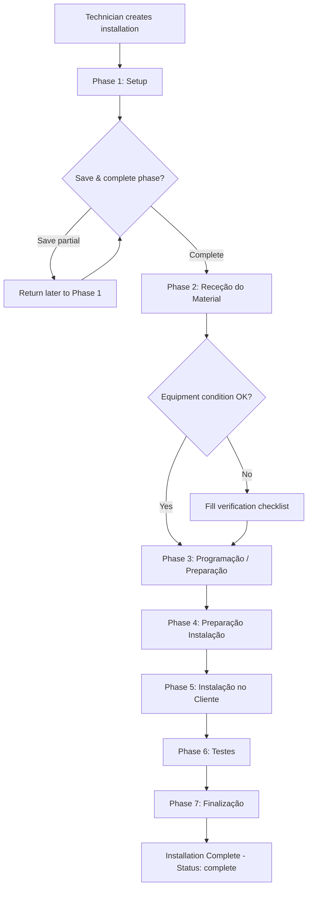
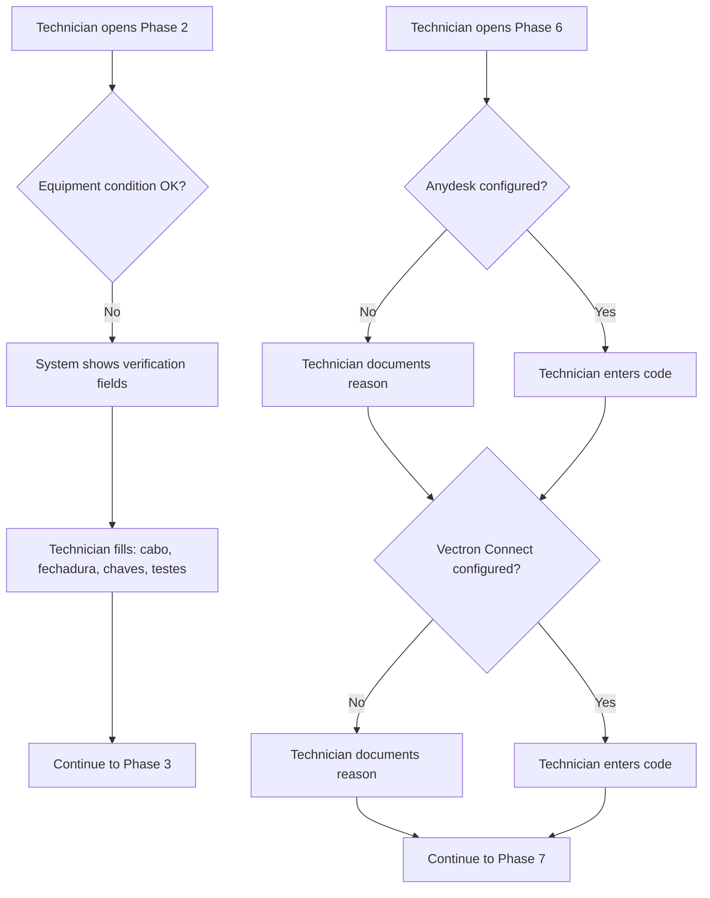

# Instalações 7 Fases - Requirements

## Epic
[ ] **INST7-E-001**: **As a** technician **I want** a structured 7-phase installation workflow **So that** I can track and document each stage of an equipment installation from setup to finalization

## User Flow

### Passing Cases Flow
[ ] Passing flow diagram

### Non-Passing Cases Flow
[ ] Non-passing flow diagram

## Technical Requirements

### Open questions
_(All resolved)_

### Business Rules
[ ] **INST7-BR-001**: Each installation follows exactly 7 sequential phases
[ ] **INST7-BR-002**: A phase cannot be completed without filling all mandatory fields for that phase
[ ] **INST7-BR-003**: Equipment condition check in Phase 2 triggers additional verification fields when marked as FALSE
[ ] **INST7-BR-004**: All equipment checklists are displayed regardless of installation type selected in Phase 1
[ ] **INST7-BR-005**: Remote access tools (Anydesk, Vectron Connect) require either a code (if configured) or a documented reason (if not)
[ ] **INST7-BR-006**: Once a phase is completed, a User cannot modify it (phases are locked after completion)
[ ] **INST7-BR-007**: A technician may save partial progress within a phase and return later to complete it
[ ] **INST7-BR-008**: When all 7 phases are completed, the installation status changes to "complete"
[ ] **INST7-BR-009**: The "folha 3 e 4" reference in Phase 3 corresponds to text fields for programming verification notes
[ ] **INST7-BR-010**: The "folha 5 e 6" reference in Phase 4 corresponds to the equipment checklists section
[ ] **INST7-BR-011**: An Admin may unlock and edit a completed phase
[ ] **INST7-BR-012**: An Admin may cancel or delete an installation at any point in the workflow
[ ] **INST7-BR-013**: A User (non-Admin) cannot cancel or delete an installation

### Performance
[ ] **INST7-NFR-001**: Phase transitions shall respond within 1 second

### Dependencies & Integration Requirements
**Internal**: Clients module (client selection in Phase 1)
**External**: None identified

## UI/UX Requirements
**UX-001**: Phase navigation shall display all 7 phases with visual indicator of current progress
**UX-002**: Conditional fields shall appear/hide dynamically based on user selections
**UX-003**: Equipment checklists shall use checkbox-style verification items
**UX-004**: Completed phases shall be visually distinct (locked state) from the current and upcoming phases
**UX-005**: The installation list shall display installation status (in progress / complete) and current active phase for in-progress installations

## User Stories

### Story: Technician creates a new installation (Phase 1 — Setup)
[ ] **INST7-S-001**: **As a** technician **I want** to create a new installation by selecting a client and installation type **So that** I can begin tracking the installation process

#### Acceptance Criteria
[ ] **INST7-AC-001**: The system **SHALL** allow the technician to select an existing client
[ ] **INST7-AC-002**: The system **SHALL** provide installation type options: POS, CPA, balanças, CCTV, Alarmes, Botões de chamada e relógios
[ ] **INST7-AC-003**: The system **SHALL** capture equipment details: marca, modelo, n.º série (text fields)
[ ] **INST7-AC-004**: The system **SHALL** capture fornecedor as a text field

### Story: Technician verifies received equipment (Phase 2 — Receção do Material)
[ ] **INST7-S-002**: **As a** technician **I want** to document the received equipment and verify its condition **So that** any issues are recorded before programming begins

#### Acceptance Criteria
[ ] **INST7-AC-005**: The system **SHALL** capture equipment details: número série, marca, modelo (text)
[ ] **INST7-AC-006**: The system **SHALL** provide an equipment condition verification toggle
[ ] **INST7-AC-007**: **WHEN** equipment condition is marked FALSE, the system **SHALL** display verification fields: cabo, fechadura, chaves, testes ao equipamento
[ ] **INST7-AC-008**: The system **SHALL** provide an observations text field

### Story: Technician programs equipment (Phase 3 — Programação / Preparação)
[ ] **INST7-S-003**: **As a** technician **I want** to document the programming and preparation of equipment **So that** the configuration is recorded

#### Acceptance Criteria
[ ] **INST7-AC-009**: The system **SHALL** capture software information
[ ] **INST7-AC-010**: The system **SHALL** capture identification reference (marked on sheet)
[ ] **INST7-AC-011**: The system **SHALL** capture n.º licença as text
[ ] **INST7-AC-012**: The system **SHALL** provide a toggle for programming initiation verification
[ ] **INST7-AC-013**: The system **SHALL** provide a toggle for final test of all equipment and accessories
[ ] **INST7-AC-041**: The system **SHALL** provide a multiline text area for programming verification notes (supports line breaks)

### Story: Technician prepares for on-site installation (Phase 4 — Preparação Instalação)
[ ] **INST7-S-004**: **As a** technician **I want** to verify all necessary equipment and materials before going on-site **So that** nothing is missing during installation

#### Acceptance Criteria
[ ] **INST7-AC-014**: The system **SHALL** capture additional material requirements as text
[ ] **INST7-AC-015**: The system **SHALL** display all equipment checklists (POS, Impressora, Gaveta Metálica, CPA, Acessórios) regardless of installation type
[ ] **INST7-AC-016**: The system **SHALL** present checklist items as verifiable checkboxes

### Story: Technician performs on-site installation (Phase 5 — Instalação no Cliente)
[ ] **INST7-S-005**: **As a** technician **I want** to document the on-site installation details **So that** there is a complete record of the installation event

#### Acceptance Criteria
[ ] **INST7-AC-017**: The system **SHALL** capture: nº fatura, nº guia de transporte, data instalação, técnico instalação
[ ] **INST7-AC-018**: The system **SHALL** capture installation timing: hora inicial, hora final
[ ] **INST7-AC-019**: The system **SHALL** capture training details: data formação, hora inicial, hora final, quem recebeu a formação

### Story: Technician runs connectivity tests (Phase 6 — Testes)
[ ] **INST7-S-006**: **As a** technician **I want** to verify remote access tools are configured **So that** the equipment can be supported remotely after installation

#### Acceptance Criteria
[ ] **INST7-AC-020**: The system **SHALL** provide a Yes/No toggle for Anydesk configuration
[ ] **INST7-AC-021**: **WHEN** Anydesk is Yes, the system **SHALL** capture the Anydesk code
[ ] **INST7-AC-022**: **WHEN** Anydesk is No, the system **SHALL** require documenting the reason
[ ] **INST7-AC-023**: The system **SHALL** provide a Yes/No toggle for Vectron Connect configuration
[ ] **INST7-AC-024**: **WHEN** Vectron Connect is Yes, the system **SHALL** capture the Vectron Connect code
[ ] **INST7-AC-025**: **WHEN** Vectron Connect is No, the system **SHALL** require documenting the reason

### Story: Technician finalizes installation (Phase 7 — Finalização)
[ ] **INST7-S-007**: **As a** technician **I want** to complete the final steps of the installation **So that** all records and backups are secured

#### Acceptance Criteria
[ ] **INST7-AC-026**: The system **SHALL** provide a toggle for dump lido verification
[ ] **INST7-AC-027**: The system **SHALL** provide a toggle for cópia segurança verification
[ ] **INST7-AC-028**: The system **SHALL** allow uploading multiple fotos de instalação
[ ] **INST7-AC-037**: **WHEN** Phase 7 is completed, the system **SHALL** set the installation status to "complete"

### Story: Technician navigates between phases
[ ] **INST7-S-010**: **As a** technician **I want** to save partial progress within a phase and return later **So that** I can work on installations across multiple sessions

#### Acceptance Criteria
[ ] **INST7-AC-033**: The system **SHALL** allow saving partial phase data without completing the phase
[ ] **INST7-AC-034**: **WHEN** a phase is completed, the system **SHALL** lock that phase from further editing
[ ] **INST7-AC-035**: The system **SHALL** only allow progressing to the next phase when the current phase is completed
[ ] **INST7-AC-036**: The system **SHALL** display the current phase as the active working area upon returning to an in-progress installation

### Story: Admin manages installation workflow
[ ] **INST7-S-011**: **As an** Admin **I want** to unlock completed phases and cancel installations **So that** I can correct data or remove invalid records

#### Acceptance Criteria
[ ] **INST7-AC-038**: **WHERE** the user has Admin role, the system **SHALL** allow unlocking a completed phase for editing
[ ] **INST7-AC-039**: **WHERE** the user has Admin role, the system **SHALL** allow deleting an installation at any workflow stage
[ ] **INST7-AC-040**: **IF** user has User role (non-Admin), **THEN** the system **SHALL** not display unlock or delete actions

### Story: Equipment condition fails verification (Non-passing)
[ ] **INST7-S-008**: **As a** technician **I want** to document specific equipment issues when condition check fails **So that** problems are tracked before proceeding

#### Acceptance Criteria
**Common Behavior** (see Story 2):
[ ] Applies: INST7-AC-005, INST7-AC-006, INST7-AC-008

**Failure-Specific Behavior**:
[ ] **INST7-AC-029**: **IF** equipment condition is FALSE, **THEN** the system **SHALL** display all verification sub-fields (cabo, fechadura, chaves, testes ao equipamento)
[ ] **INST7-AC-030**: **IF** equipment condition is FALSE, **THEN** the system **SHALL** require at least one verification sub-field to be documented before proceeding

### Story: Remote access not configured (Non-passing)
[ ] **INST7-S-009**: **As a** technician **I want** to document why remote access is not configured **So that** the team knows what follow-up is needed

#### Acceptance Criteria
**Common Behavior** (see Story 6):
[ ] Applies: INST7-AC-020, INST7-AC-023

**Failure-Specific Behavior**:
[ ] **INST7-AC-031**: **IF** Anydesk is marked No, **THEN** the system **SHALL** require a reason text field before allowing phase completion
[ ] **INST7-AC-032**: **IF** Vectron Connect is marked No, **THEN** the system **SHALL** require a reason text field before allowing phase completion

## Equipment Checklists

### POS Checklist
[ ] **INST7-CL-001**: Cabo Power, Transformador, Cabo Rede, Display cliente, Impressora, Autocolantes

### Impressora Checklist
[ ] **INST7-CL-002**: Rolo, Cabo Power, Transformador, Cabo Ligação POS, Ficha Adaptador RS232, Autocolantes

### Gaveta Metálica Checklist
[ ] **INST7-CL-003**: Chaves, Autocolantes

### CPA Checklist
[ ] **INST7-CL-004**: Base, Parafusos, Transformador, Cabo Comunicação entre Moedas e Notas, Cabo Rede, Cabo Série, Mini PC (text area with placeholder: Marca, Modelo, n.º série, materiais)

### Acessórios Checklist
[ ] **INST7-CL-005**: Bobine de Cabo, Fichas de Rede, Adaptadores de impressora, Monitor interior, Soprador, Álcool, Pincel, Panos, Braçadeiras, Mangueira, Mala de Ferramentas, Autocolantes

## Related Documentation
- Clients module (client selection dependency — only relation)
- Existing `installations-programming` content type (being replaced by this 7-phase workflow)

### Excluded scope
- Client creation (handled by Clients module)
- Invoice generation
- Scheduling/calendar integration
- Notifications or reminders
- Reporting or analytics on installations
