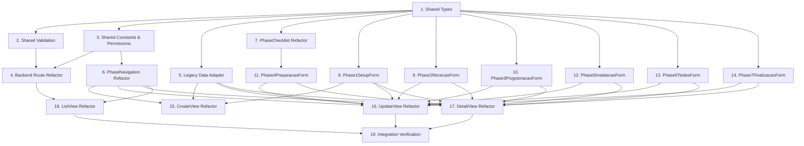

# Implementation Plan

## Overview

Implementation of the 7-phase installation workflow for CLEVER. This replaces the existing 5-phase system with a structured 7-phase workflow including phase navigation, validation, admin unlock, and legacy data compatibility.

## Task Dependency Graph



```json
{
  "waves": [
    { "wave": 1, "tasks": [1] },
    { "wave": 2, "tasks": [2, 3, 5, 7, 8, 9, 10, 12, 13, 14] },
    { "wave": 3, "tasks": [4, 6, 11] },
    { "wave": 4, "tasks": [15, 16, 17, 18] },
    { "wave": 5, "tasks": [19] }
  ]
}
```

## Tasks

- [x] 1. **Create new type definitions for the 7-phase installation workflow**
  - Design ref: [1.1 Installation Content Type](design.md#11-installation-content-type), [1.2 Phase Interfaces](design.md#12-phase-interfaces), [1.3 Equipment Checklist](design.md#13-equipment-checklist)
  - Scope:
    - create `packages/shared/src/types/installations-programming/types-seven-phases.ts`
  - Depends on: —
  - Covers: INST7-BR-001, INST7-BR-003, INST7-BR-005, INST7-AC-002
  - Done when: New file exports all interfaces (`InstallationSevenPhasesData`, `Phase1SetupData` through `Phase7FinalizacaoData`, `PhaseStatus`, `InstallationStatus`, `InstallationType`, `EquipmentChecklist`, `ChecklistCategory`, `CpaChecklistCategory`) and `pnpm type-check` passes

- [x] 2. **Create validation functions for the 7-phase completion criteria**
  - Design ref: [2.2 Phase Completion Logic](design.md#22-phase-completion-logic), [2.5 Derived State](design.md#25-derived-state)
  - Scope:
    - create `packages/shared/src/types/installations-programming/validation-seven-phases.ts`
  - Depends on: Task 1
  - Covers: INST7-BR-002, INST7-BR-003, INST7-BR-005, INST7-BR-008, INST7-AC-007, INST7-AC-030, INST7-AC-031, INST7-AC-032, INST7-AC-037
  - Done when: File exports `validatePhaseCompletion(phaseNumber, data): boolean`, `deriveCurrentPhase(phaseStatuses): number`, `deriveInstallationStatus(phaseStatuses): InstallationStatus` and `pnpm type-check` passes

- [x] 3. **Add 7-phase constants and unlock permission**
  - Design ref: [1.3 Equipment Checklist](design.md#13-equipment-checklist), [5.2 Implementation](design.md#52-implementation), [6.4 Shared Type Exports](design.md#64-shared-type-exports)
  - Scope:
    - modify `packages/shared/src/types/installations-programming/types-seven-phases.ts` (add constants: `PHASE_NAMES_SEVEN`, `CHECKLIST_ITEMS_SEVEN`, `CHECKLIST_LABELS_SEVEN`, `CHECKLIST_CATEGORY_LABELS_SEVEN`, `INSTALLATION_TYPES`)
    - modify `packages/shared/src/types/installations-programming/index.ts` (export new types, constants, validation)
    - modify `packages/shared/src/permissions.ts` (add `canUnlockPhase`)
  - Depends on: Task 1
  - Covers: INST7-BR-004, INST7-BR-006, INST7-BR-011, INST7-CL-001, INST7-CL-002, INST7-CL-003, INST7-CL-004, INST7-CL-005, INST7-AC-015, INST7-AC-038, INST7-AC-040
  - Done when: `PHASE_NAMES_SEVEN` has 7 entries, `CHECKLIST_ITEMS_SEVEN` matches design spec 5 categories, `canUnlockPhase` returns true only for Admin, `pnpm type-check` passes

- [x] 4. **Refactor backend route to support 7-phase workflow actions (save, complete-phase, unlock-phase)**
  - Design ref: [3.2 Request Payloads](design.md#32-request-payloads), [3.3 Backend Validation Hooks](design.md#33-backend-validation-hooks), [3.4 Index Fields](design.md#34-index-fields), [1.5 Defaults on Creation](design.md#15-defaults-on-creation)
  - Scope:
    - modify `packages/backend/src/routes/installations-programming.ts`
  - Depends on: Task 2, Task 3
  - Covers: INST7-BR-001, INST7-BR-002, INST7-BR-006, INST7-BR-007, INST7-BR-008, INST7-BR-011, INST7-BR-012, INST7-BR-013, INST7-AC-034, INST7-AC-035, INST7-AC-038, INST7-AC-039, INST7-AC-040, INST7-NFR-001
  - Done when: POST creates installation with 7-phase defaults + phaseStatuses array, PUT handles `action: 'save'` (partial merge), `action: 'complete-phase'` (validation + advance), `action: 'unlock-phase'` (Admin-only, 403 for User), `extractIndexFields` returns new fields, `pnpm type-check` passes

- [x] 5. **Create adapter function to transform old 5-phase records into new 7-phase format at read time**
  - Design ref: [6.2 Data Compatibility](design.md#62-data-compatibility)
  - Scope:
    - create `packages/shared/src/types/installations-programming/legacy-adapter.ts`
    - modify `packages/shared/src/types/installations-programming/index.ts` (export adapter)
  - Depends on: Task 1
  - Covers: INST7-BR-001 (backward compat)
  - Done when: `adaptLegacyData(data)` detects old format (has `completedPhases` array, no `phaseStatuses`), maps old phase1→phase3, phase2→phase4 checklist, phase3→phase5, phase4→phase6, phase5→phase7, returns new-format data unchanged, `pnpm type-check` passes

- [x] 6. **Update PhaseNavigation component to display 7 phases with locked/unlocked state**
  - Design ref: [4.7 PhaseNavigation Refactor](design.md#47-phasenavigation-refactor), [5.3 UI Behavior](design.md#53-ui-behavior)
  - Scope:
    - modify `packages/frontend/src/components/installations-programming/PhaseNavigation.vue`
  - Depends on: Task 3
  - Covers: INST7-S-010, INST7-AC-036, INST7-AC-034, UX-001, UX-004
  - Done when: Component renders 7 phase tabs using `PHASE_NAMES_SEVEN`, accepts `phaseStatuses: PhaseStatus[]` prop (replacing `completedPhases: number[]`), shows lock icon for `completed` status, amber styling for `unlocked`/`in_progress`, disabled navigation to `not_started` phases

- [x] 7. **Refactor PhaseChecklist to use new checklist structure with CPA miniPcDetails text area**
  - Design ref: [1.3 Equipment Checklist](design.md#13-equipment-checklist)
  - Scope:
    - modify `packages/frontend/src/components/installations-programming/PhaseChecklist.vue`
  - Depends on: Task 1
  - Covers: INST7-CL-001, INST7-CL-002, INST7-CL-003, INST7-CL-004, INST7-CL-005, INST7-AC-015, INST7-AC-016, UX-003
  - Done when: Component uses `CHECKLIST_ITEMS_SEVEN` and `CHECKLIST_LABELS_SEVEN` constants, renders 5 categories (POS, Impressora, Gaveta Metálica, CPA, Acessórios), CPA category includes miniPcDetails text area, v-model interface uses `EquipmentChecklist` type

- [x] 8. **Create Phase 1 form component for client selection, installation type, and equipment fields**
  - Design ref: [1.2 Phase Interfaces](design.md#12-phase-interfaces), [4.3 Phase Form Components](design.md#43-phase-form-components)
  - Scope:
    - create `packages/frontend/src/components/installations-programming/Phase1SetupForm.vue`
  - Depends on: Task 1
  - Covers: INST7-S-001, INST7-AC-001, INST7-AC-002, INST7-AC-003, INST7-AC-004
  - Done when: Component accepts `modelValue` (top-level fields: clientId, installationType, equipmentMarca, equipmentModelo, equipmentNumeroSerie, equipmentFornecedor) + `disabled` prop, uses `ClientSearchInput` for client selection, provides `INSTALLATION_TYPES` dropdown, emits `update:modelValue`

- [x] 9. **Create Phase 2 form component with equipment condition toggle and conditional verification fields**
  - Design ref: [1.2 Phase Interfaces](design.md#12-phase-interfaces)
  - Scope:
    - create `packages/frontend/src/components/installations-programming/Phase2RececaoForm.vue`
  - Depends on: Task 1
  - Covers: INST7-S-002, INST7-S-008, INST7-AC-005, INST7-AC-006, INST7-AC-007, INST7-AC-008, INST7-AC-029, INST7-AC-030, UX-002
  - Done when: Component accepts `modelValue: Phase2RececaoData` + `disabled`, shows equipmentConditionOk toggle, conditionally reveals verification fields (cabo, fechadura, chaves, testes) when false, emits `update:modelValue`

- [x] 10. **Create Phase 3 form component for programming data**
  - Design ref: [1.2 Phase Interfaces](design.md#12-phase-interfaces)
  - Scope:
    - create `packages/frontend/src/components/installations-programming/Phase3ProgramacaoForm.vue`
  - Depends on: Task 1
  - Covers: INST7-S-003, INST7-AC-009, INST7-AC-010, INST7-AC-011, INST7-AC-012, INST7-AC-013, INST7-AC-041
  - Done when: Component accepts `modelValue: Phase3ProgramacaoData` + `disabled`, renders software, identificacaoReferencia, numeroLicenca text fields, two boolean toggles, multiline text area for notasProgramacao, emits `update:modelValue`

- [x] 11. **Create Phase 4 form component wrapping material field and PhaseChecklist**
  - Design ref: [1.2 Phase Interfaces](design.md#12-phase-interfaces), [1.3 Equipment Checklist](design.md#13-equipment-checklist)
  - Scope:
    - create `packages/frontend/src/components/installations-programming/Phase4PreparacaoForm.vue`
  - Depends on: Task 7
  - Covers: INST7-S-004, INST7-AC-014, INST7-AC-015, INST7-AC-016
  - Done when: Component accepts `modelValue: Phase4PreparacaoData` + `disabled`, renders materialAdicional text input + PhaseChecklist sub-component for equipment checklist, emits `update:modelValue`

- [x] 12. **Create Phase 5 form component for on-site installation and training details**
  - Design ref: [1.2 Phase Interfaces](design.md#12-phase-interfaces)
  - Scope:
    - create `packages/frontend/src/components/installations-programming/Phase5InstalacaoForm.vue`
  - Depends on: Task 1
  - Covers: INST7-S-005, INST7-AC-017, INST7-AC-018, INST7-AC-019
  - Done when: Component accepts `modelValue: Phase5InstalacaoData` + `disabled`, renders all fields (nrFatura, nrGuiaTransporte, dataInstalacao, tecnicoInstalacao, horaInicial, horaFinal, dataFormacao, formacaoHoraInicial, formacaoHoraFinal, quemRecebeuFormacao), proper input types (date, time), emits `update:modelValue`

- [x] 13. **Create Phase 6 form component with conditional code/reason fields**
  - Design ref: [1.2 Phase Interfaces](design.md#12-phase-interfaces)
  - Scope:
    - create `packages/frontend/src/components/installations-programming/Phase6TestesForm.vue`
  - Depends on: Task 1
  - Covers: INST7-S-006, INST7-S-009, INST7-AC-020, INST7-AC-021, INST7-AC-022, INST7-AC-023, INST7-AC-024, INST7-AC-025, INST7-AC-031, INST7-AC-032, UX-002
  - Done when: Component accepts `modelValue: Phase6TestesData` + `disabled`, shows Yes/No toggles for both tools, conditionally shows code field (yes) or reason field (no), emits `update:modelValue`

- [x] 14. **Create Phase 7 form component with toggles and multi-photo upload**
  - Design ref: [1.2 Phase Interfaces](design.md#12-phase-interfaces)
  - Scope:
    - create `packages/frontend/src/components/installations-programming/Phase7FinalizacaoForm.vue`
  - Depends on: Task 1
  - Covers: INST7-S-007, INST7-AC-026, INST7-AC-027, INST7-AC-028
  - Done when: Component accepts `modelValue: Phase7FinalizacaoData` + `disabled` + `installationUuid`, renders dumpLido and copiaSeguranca toggles, integrates `FileUploadZone` for multiple photo uploads, displays existing photos via `FileDisplay`, emits `update:modelValue`

- [x] 15. **Refactor CreateView to show only Phase 1 fields, then redirect to UpdateView**
  - Design ref: [4.5 CreateView Workflow](design.md#45-createview-workflow)
  - Scope:
    - modify `packages/frontend/src/views/installations-programming/InstallationsProgrammingCreateView.vue`
  - Depends on: Task 5, Task 6, Task 8
  - Covers: INST7-S-001, INST7-AC-001, INST7-AC-002, INST7-AC-003, INST7-AC-004
  - Done when: View renders Phase1SetupForm only, POST creates installation with Phase 1 data, on success navigates to UpdateView (`/installations-programming/:uuid/editar`), no other phase forms visible

- [x] 16. **Refactor UpdateView to display active phase form with save/complete actions**
  - Design ref: [4.4 UpdateView Workflow](design.md#44-updateview-workflow), [2.3 Save vs Complete Actions](design.md#23-save-vs-complete-actions), [2.4 Admin Unlock Flow](design.md#24-admin-unlock-flow)
  - Scope:
    - modify `packages/frontend/src/views/installations-programming/InstallationsProgrammingUpdateView.vue`
  - Depends on: Task 5, Task 6, Task 8, Task 9, Task 10, Task 11, Task 12, Task 13, Task 14
  - Covers: INST7-S-010, INST7-BR-002, INST7-BR-006, INST7-BR-007, INST7-AC-033, INST7-AC-034, INST7-AC-035, INST7-AC-036, INST7-AC-038
  - Done when: View loads installation data (with `adaptLegacyData`), shows PhaseNavigation with 7 phases, renders the active phase's form component, "Guardar" saves partial (PUT action:'save'), "Concluir Fase" validates + completes (PUT action:'complete-phase'), Admin sees "Desbloquear" button on locked phases (PUT action:'unlock-phase'), on Phase 7 completion navigates to DetailView

- [x] 17. **Refactor DetailView to display all 7 phases in read-only mode with navigation**
  - Design ref: [4.1 View Structure](design.md#41-view-structure), [4.3 Phase Form Components](design.md#43-phase-form-components)
  - Scope:
    - modify `packages/frontend/src/views/installations-programming/InstallationsProgrammingDetailView.vue`
  - Depends on: Task 5, Task 6, Task 8, Task 9, Task 10, Task 11, Task 12, Task 13, Task 14
  - Covers: INST7-S-010, INST7-AC-036, UX-001, UX-004
  - Done when: View loads installation (with `adaptLegacyData`), shows PhaseNavigation with all 7 phases, renders each phase form in `disabled=true` mode, Admin can navigate to any phase, shows overall status badge ("Em curso" / "Completa")

- [x] 18. **Refactor ListView to show installation type, status, and 7-phase progress dots**
  - Design ref: [4.6 ListView Enhancements](design.md#46-listview-enhancements)
  - Scope:
    - modify `packages/frontend/src/views/installations-programming/InstallationsProgrammingListView.vue`
  - Depends on: Task 4, Task 6
  - Covers: UX-005
  - Done when: Each list item shows client name, installation type badge, status text ("Em curso — Fase N" or "Completa"), 7 progress dots (filled for completed phases), sorting/filtering works with new index fields

- [x] 19. **Verify the complete 7-phase workflow works end-to-end**
  - Design ref: [1.4 Invariants & Edge Cases](design.md#14-invariants--edge-cases)
  - Scope:
    - modify `packages/shared/src/types/installations-programming/index.ts` (final export cleanup if needed)
  - Depends on: Task 16, Task 17, Task 18
  - Covers: INST7-E-001, INST7-BR-001, INST7-BR-008
  - Done when: `pnpm type-check` passes, `pnpm build` succeeds, manual verification: create installation → complete all 7 phases → status becomes "complete", legacy records display correctly via adapter, Admin can unlock/re-complete phases

## Notes

- All UI labels are in Portuguese; code stays in English
- The content type slug `installations-programming` is reused to avoid migration overhead
- Legacy 5-phase data is handled at read time via the adapter (Task 5)
- Old code cleanup is out of scope for this implementation
