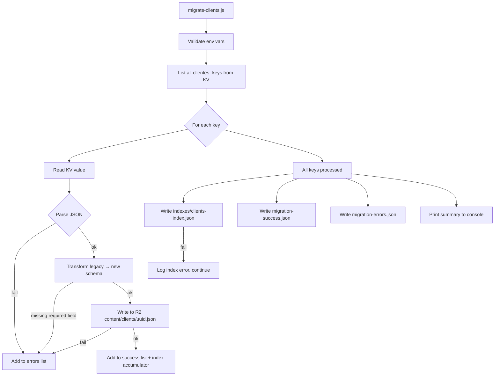
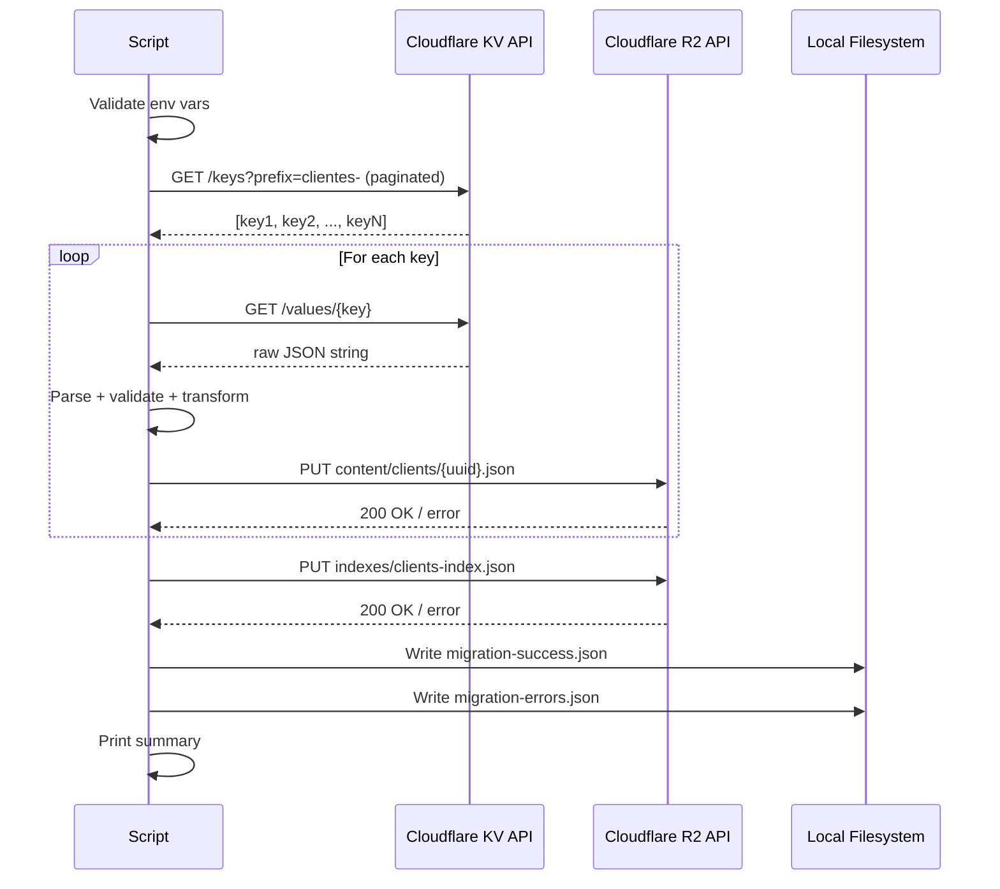

# Design — KV to R2 Clients Migration

## 1. Script Architecture

### Overview

- Standalone Node.js script (`scripts/migrate-clients.js`) — no Worker, no server
- Runs locally with a Cloudflare API token provided via environment variable
- Imports `createClientSearchText` from `@clever/shared` for index consistency
- Sequential processing: list all keys → read + transform + write each → build index in memory → write index once → write output files

### Script entry point and module structure

| Module | File | Responsibility |
|--------|------|----------------|
| Entry point | `scripts/migrate-clients.js` | CLI entry, env validation, orchestration |
| KV reader | inline in entry | List keys, read values via Cloudflare KV REST API |
| Transformer | inline in entry | Map legacy schema → new `BaseContent` + `ClientData` |
| R2 writer | inline in entry | Write individual records via Cloudflare R2 REST API |
| Index builder | inline in entry | Accumulate index items in memory, write once at end |
| Output writer | inline in entry | Write `migration-success.json` and `migration-errors.json` to local FS |

### Environment variables required

| Variable | Description |
|----------|-------------|
| `CF_API_TOKEN` | Cloudflare API token (read KV + write R2) |
| `CF_ACCOUNT_ID` | Cloudflare account ID (`98dfed939a59dca09770880eab939b79`) |
| `CF_KV_NAMESPACE_ID` | KV namespace ID for `clever-clever-kv` |
| `CF_R2_BUCKET_NAME` | R2 bucket name for the target environment |

### Architecture diagram

| Node | Description |
|------|-------------|
| Validate env vars | Exit immediately if any required variable is missing |
| List all clientes- keys | Paginated KV list with prefix filter |
| Read KV value | GET single key value |
| Parse JSON | Catch invalid JSON → error record |
| Transform | Map fields, apply defaults, validate required fields |
| Write to R2 | PUT `content/clients/{uuid}.json` |
| Index accumulator | In-memory array built during processing |
| Write index | Single PUT to `indexes/clients-index.json` after all records processed |
| Output files | Written to local filesystem regardless of index result |

## 2. Cloudflare KV API — Read Interface

### List keys endpoint

| Property | Value |
|----------|-------|
| Method | `GET` |
| URL | `https://api.cloudflare.com/client/v4/accounts/{accountId}/storage/kv/namespaces/{namespaceId}/keys` |
| Query params | `prefix=clientes-`, `limit=1000`, `cursor={cursor}` (pagination) |
| Auth header | `Authorization: Bearer {CF_API_TOKEN}` |
| Response shape | `{ result: [{ name: string }], result_info: { cursor: string, count: number } }` |

### Pagination rules

- Repeat requests with `cursor` from `result_info.cursor` until `result_info.count < limit`
- Collect all key names before starting any read/transform/write operations (REQ-01, CA-01.1)
- If namespace returns 0 keys with prefix `clientes-` → complete with 0 successes, 0 errors (CA-01.2)

### Read single key endpoint

| Property | Value |
|----------|-------|
| Method | `GET` |
| URL | `https://api.cloudflare.com/client/v4/accounts/{accountId}/storage/kv/namespaces/{namespaceId}/values/{keyName}` |
| Auth header | `Authorization: Bearer {CF_API_TOKEN}` |
| Success response | Raw JSON string (the stored value) |
| Error response | HTTP 4xx/5xx |

### Error handling for read operations

| Condition | Action |
|-----------|--------|
| HTTP 401/403 on list | Exit immediately — "KV namespace not accessible: {status}" |
| HTTP 404 on list | Exit immediately — "KV namespace not found" |
| HTTP 4xx/5xx on single key read | Add to errors list — "read failed: HTTP {status}" |
| Response body not valid JSON | Add to errors list — "invalid JSON: {parseError}" |
| Network error on list | Exit immediately — "Network error: {message}" |
| Network error on single key | Add to errors list — "read failed: {message}" |

## 3. Cloudflare R2 API — Write Interface

### Write single object endpoint

| Property | Value |
|----------|-------|
| Method | `PUT` |
| URL | `https://api.cloudflare.com/client/v4/accounts/{accountId}/r2/buckets/{bucketName}/objects/{key}` |
| Key format | `content/clients/{uuid}.json` |
| Auth header | `Authorization: Bearer {CF_API_TOKEN}` |
| Content-Type header | `application/json` |
| Body | `JSON.stringify(newRecord, null, 2)` |
| Success response | HTTP 200 |
| Error response | HTTP 4xx/5xx |

### Write index endpoint

| Property | Value |
|----------|-------|
| Method | `PUT` |
| URL | `https://api.cloudflare.com/client/v4/accounts/{accountId}/r2/buckets/{bucketName}/objects/indexes/clients-index.json` |
| Auth header | `Authorization: Bearer {CF_API_TOKEN}` |
| Content-Type header | `application/json` |
| Body | Full index JSON (see Section 5) |

### Error handling for write operations

| Condition | Action |
|-----------|--------|
| HTTP 401/403 on any write | Exit immediately — "R2 bucket not accessible: {status}" |
| HTTP 404 on bucket (first write) | Exit immediately — "R2 bucket not found" |
| HTTP 4xx/5xx on single record write | Add to errors list — "write failed: HTTP {status}" |
| Network error on single record write | Add to errors list — "write failed: {message}" |
| HTTP 4xx/5xx on index write | Log error to console — "index update failed: HTTP {status}" — continue to output files |
| Network error on index write | Log error to console — "index update failed: {message}" — continue to output files |

## 4. Data Transformation — Legacy → New Schema

### BaseContent wrapper fields (always set by migration)

| New field | Source | Value |
|-----------|--------|-------|
| `uuid` | `legacy.id` | Direct copy |
| `contentType` | — | `'clients'` (hardcoded) |
| `createdAt` | `legacy.createdAt` | Direct copy (preserve original) |
| `createdBy` | — | `'migration'` (hardcoded) |
| `updatedAt` | `legacy.updatedAt` | Direct copy (preserve original) |
| `updatedBy` | — | `'migration'` (hardcoded) |
| `version` | — | `1` (hardcoded) |
| `isDeleted` | — | `false` (hardcoded) |

### `data` fields — direct mapping

| New field (`data.*`) | Legacy field | Notes |
|----------------------|-------------|-------|
| `nomeEmpresa` | `nomeEmpresa` | Required — missing → error record |
| `nomeComercial` | `nomeComercial` | Required — missing → error record |
| `contribuinte` | `contribuinte` | Optional |
| `responsavel` | `responsavel` | Optional |
| `telefone` | `telefone` | Optional |
| `telefoneContato` | `telefoneContato` | Optional |
| `email` | `email` | Optional |
| `emailContato` | `emailContato` | Optional |
| `morada` | `morada` | Optional |
| `codigoPostal` | `codigoPostal` | Optional |
| `localidade` | `localidade` | Optional |
| `iban` | `iban` | Optional |
| `observacoes` | `observacoes` | Optional |
| `softwares` | `softwares` | Array — default `[]` if absent |
| `temAnydesk` | `temAnydesk` | Boolean — default `false` if absent |
| `manutencao` | `manutencao` | Boolean — default `false` if absent |
| `manutencao24` | `manutencao24` | Boolean — default `false` if absent |
| `dumps` | `dumps` | Boolean — default `false` if absent |
| `atcud` | `atcud` | Boolean — default `false` if absent |
| `vectronConnect` | `vectronConnect` | Boolean — default `false` if absent |
| `dumpsLink` | `dumpsLink` | Optional |
| `seriesDocumentos` | `seriesDocumentos` | Optional |
| `atUsername` | `atUsername` | Optional |
| `atPassword` | `atPassword` | Optional |
| `vectronAddress` | `vectronAddress` | Optional |
| `vectronConnect` | `vectronConnect` | Optional |
| `anydeskId` | `anydeskId` | Optional (legacy field) |
| `anydeskCPA` | `anydeskCPA` | Optional (legacy field) |

### `data` fields — legacy boolean flags (preserved)

| New field (`data.*`) | Legacy field | Default if absent |
|----------------------|-------------|-------------------|
| `vectron` | `vectron` | `false` |
| `dreamSoft` | `dreamSoft` | `false` |
| `ptcert` | `ptcert` | `false` |
| `pix` | `pix` | `false` |
| `zsrest` | `zsrest` | `false` |
| `contasCertas` | `contasCertas` | `false` |
| `contrato` | `contrato` | `false` |
| `contratoCPA` | `contratoCPA` | `false` |
| `contratoSoftware` | `contratoSoftware` | `false` |
| `dataInicio` | `dataInicio` | `undefined` |
| `dataTermino` | `dataTermino` | `undefined` |
| `atClient` | `atClient` | `undefined` |
| `anosPesquisa` | `anosPesquisa` | `undefined` |
| `quantMant` | `quantMant` | `undefined` |
| `dataAniversario` | `dataAniversario` | `undefined` |

### Transformation validation rules

| Rule | Condition | Result |
|------|-----------|--------|
| Required field check | `nomeEmpresa` is absent, null, or empty string | Error — "required field missing: nomeEmpresa" |
| Required field check | `nomeComercial` is absent, null, or empty string | Error — "required field missing: nomeComercial" |
| UUID source | `legacy.id` is absent or empty | Error — "required field missing: id" |
| Boolean coercion | Boolean flag is present but not a boolean | Coerce to `Boolean(value)` |
| Array default | `softwares` is absent or null | Default to `[]` |

## 5. Index Update Strategy

### Strategy: in-memory accumulation, single write at end

- During processing, each successfully written record is appended to an in-memory `indexAccumulator` array
- R2 is empty at migration time — no pre-existing index to read or merge
- After all records are processed, the index is written once via a single PUT to `indexes/clients-index.json`
- No per-record index writes — single atomic write at the end

### Index item structure (per successfully migrated client)

| Field | Source | Notes |
|-------|--------|-------|
| `uuid` | `newRecord.uuid` | |
| `contentType` | `'clients'` | |
| `createdAt` | `newRecord.createdAt` | |
| `updatedAt` | `newRecord.updatedAt` | |
| `isDeleted` | `false` | |
| `searchableText` | `createClientSearchText(newRecord.data)` | Imported from `@clever/shared` |
| `nomeEmpresa` | `newRecord.data.nomeEmpresa` | |
| `nomeComercial` | `newRecord.data.nomeComercial` | |
| `contribuinte` | `newRecord.data.contribuinte \|\| ''` | |
| `localidade` | `newRecord.data.localidade \|\| ''` | |
| `responsavel` | `newRecord.data.responsavel \|\| ''` | |
| `telefoneContato` | `newRecord.data.telefoneContato \|\| ''` | |
| `email` | `newRecord.data.email \|\| ''` | |
| `emailContato` | `newRecord.data.emailContato \|\| ''` | |
| `temAnydesk` | `newRecord.data.temAnydesk \|\| false` | |
| `manutencao` | `newRecord.data.manutencao \|\| false` | |
| `manutencao24` | `newRecord.data.manutencao24 \|\| false` | |
| `atcud` | `newRecord.data.atcud \|\| false` | |
| `dumps` | `newRecord.data.dumps \|\| false` | |
| `vectronConnect` | `newRecord.data.vectronConnect \|\| false` | |
| `softwareNames` | `newRecord.data.softwares.map(s => s.name)` | |
| `softwareProducts` | `newRecord.data.softwares.map(s => s.product).filter(Boolean)` | |

### Full index JSON written to R2

| Field | Value |
|-------|-------|
| `contentType` | `'clients'` |
| `lastUpdated` | `new Date().toISOString()` at time of write |
| `items` | All successfully migrated index items |

## 6. Output Files Contract

### `migration-success.json`

| Field | Type | Source | Notes |
|-------|------|--------|-------|
| _(root)_ | Array | — | Array of M success objects |
| `uuid` | string | `newRecord.uuid` | |
| `nomeEmpresa` | string | `newRecord.data.nomeEmpresa` | |
| `nomeComercial` | string | `newRecord.data.nomeComercial` | |

- Written to local filesystem at `./migration-success.json` (CWD of the script)
- Contains empty array `[]` if zero clients were successfully migrated (CA-06.2)
- Written regardless of index update result

### `migration-errors.json`

| Field | Type | Source | Notes |
|-------|------|--------|-------|
| _(root)_ | Array | — | Array of E error objects |
| `id` | string | `legacy.id` or KV key name | Original identifier — KV key used as fallback if `id` absent |
| `reason` | string | Error message | Describes the failure stage and cause |

- Written to local filesystem at `./migration-errors.json` (CWD of the script)
- Contains empty array `[]` if zero records failed (CA-07.2)
- Written regardless of index update result

### Console summary (REQ-08, CA-08.1)

| Line | Content |
|------|---------|
| 1 | `Migration complete.` |
| 2 | `Total records found: {N}` |
| 3 | `Successes: {M}` |
| 4 | `Errors: {E}` |
| 5 | `Success file: ./migration-success.json` |
| 6 | `Error file: ./migration-errors.json` |

## 7. Error Handling

### Fatal errors — script exits immediately, no output files written

| Trigger | Exit message |
|---------|-------------|
| `CF_API_TOKEN` missing | "Missing required env var: CF_API_TOKEN" |
| `CF_ACCOUNT_ID` missing | "Missing required env var: CF_ACCOUNT_ID" |
| `CF_KV_NAMESPACE_ID` missing | "Missing required env var: CF_KV_NAMESPACE_ID" |
| `CF_R2_BUCKET_NAME` missing | "Missing required env var: CF_R2_BUCKET_NAME" |
| KV list returns HTTP 401/403 | "KV namespace not accessible: HTTP {status}" |
| KV list returns HTTP 404 | "KV namespace not found" |
| KV list network error | "Network error listing KV keys: {message}" |
| R2 first write returns HTTP 401/403 | "R2 bucket not accessible: HTTP {status}" |
| R2 first write returns HTTP 404 | "R2 bucket not found" |

### Per-record errors — record added to errors list, processing continues

| Trigger | Error reason stored |
|---------|-------------------|
| KV single key read returns HTTP 4xx/5xx | `"read failed: HTTP {status}"` |
| KV single key read network error | `"read failed: {message}"` |
| KV value is not valid JSON | `"invalid JSON: {parseError.message}"` |
| `nomeEmpresa` absent/empty | `"required field missing: nomeEmpresa"` |
| `nomeComercial` absent/empty | `"required field missing: nomeComercial"` |
| `id` absent/empty | `"required field missing: id"` |
| R2 record write returns HTTP 4xx/5xx | `"write failed: HTTP {status}"` |
| R2 record write network error | `"write failed: {message}"` |

### Non-fatal post-processing errors — logged to console, output files still written

| Trigger | Console message |
|---------|----------------|
| R2 index write returns HTTP 4xx/5xx | `"index update failed: HTTP {status} — re-run index update manually"` |
| R2 index write network error | `"index update failed: {message} — re-run index update manually"` |
| Local FS write of `migration-success.json` fails | `"Failed to write migration-success.json: {message}"` |
| Local FS write of `migration-errors.json` fails | `"Failed to write migration-errors.json: {message}"` |

### Error record identifier fallback

- Primary: use `legacy.id` as the `id` field in the error record
- Fallback: if `legacy.id` is absent (e.g. JSON parse failed), use the KV key name

## 8. Execution Flow

### Ordered steps

| Step | Action | On failure |
|------|--------|-----------|
| 1 | Validate all 4 env vars are present | Exit immediately |
| 2 | List all KV keys with prefix `clientes-` (paginated) | Exit immediately |
| 3 | For each key: GET value from KV | Add to errors, continue |
| 4 | For each value: parse JSON | Add to errors, continue |
| 5 | For each parsed record: validate required fields (`id`, `nomeEmpresa`, `nomeComercial`) | Add to errors, continue |
| 6 | For each valid record: transform to new schema | Add to errors, continue |
| 7 | For each transformed record: PUT to R2 `content/clients/{uuid}.json` | Add to errors, continue |
| 8 | For each successful write: append index item to in-memory accumulator | — |
| 9 | After all keys processed: PUT index to R2 `indexes/clients-index.json` | Log error, continue |
| 10 | Write `migration-success.json` to local FS | Log error, continue |
| 11 | Write `migration-errors.json` to local FS | Log error, continue |
| 12 | Print summary to console | — |

### Sequence diagram

| Step | Description |
|------|-------------|
| Validate env vars | All 4 required vars checked before any network call |
| GET /keys (paginated) | Cursor-based pagination until all keys collected |
| GET /values/{key} | One request per key, sequential |
| Parse + validate + transform | In-memory, no I/O |
| PUT content/clients/{uuid}.json | One request per record |
| PUT indexes/clients-index.json | Single request after all records processed |
| Write output files | Local FS writes, independent of index result |
| Print summary | Always printed, even if index or FS writes failed |
