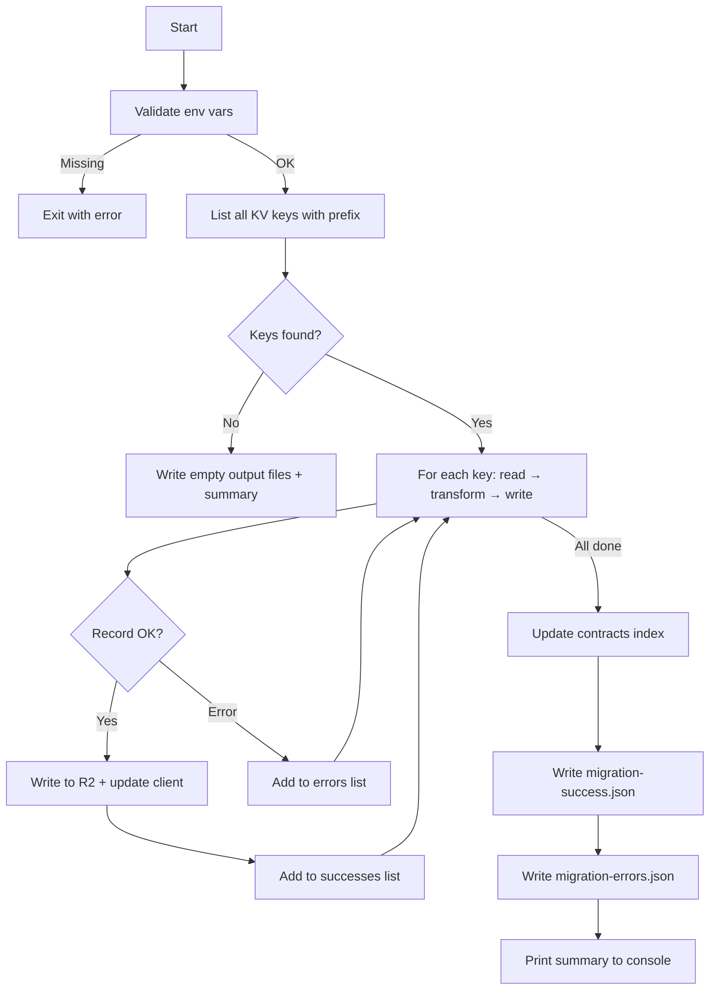

# Design — KV to R2 Contracts Migration

## 1. Script Architecture Overview

The migration script is a standalone Node.js script (`scripts/contracts/migrate-contracts.ts`) that follows the same pattern as the existing `scripts/clients/migrate-clients.js`. It runs outside the Cloudflare Worker — directly against the Cloudflare REST API.

### Execution Flow



### Flow — Structured Table

| Step | Action | Input | Output | Error behavior |
|------|--------|-------|--------|----------------|
| 1 | Validate environment | `CF_API_TOKEN`, `CF_ACCOUNT_ID`, `R2_BUCKET_NAME` | Validated config | Exit immediately |
| 2 | List KV keys | Account ID, namespace ID, prefix `contratos-` | Array of key names | Exit immediately |
| 3 | Read KV value | Key name | Legacy JSON record | Add to errors, continue |
| 4 | Parse JSON | Raw string | Parsed object | Add to errors, continue |
| 5 | Validate required fields | Parsed object | Validated record | Add to errors, continue |
| 6 | Transform record | Legacy record | New `BaseContent<ContractData>` | Add to errors, continue |
| 7 | Write to R2 | Transformed record, key `content/contracts/{uuid}.json` | Success confirmation | Add to errors, continue |
| 8 | Update client | Client ID, contract UUID | Updated client record | Log warning, contract still success |
| 9 | Update index | All successful records | `indexes/contracts-index.json` | Log error, still write output files |
| 10 | Write output files | Successes array, errors array | Two JSON files in `scripts/contracts/` | Log error to console |
| 11 | Print summary | Counters | Console output | — |

### File Location

- Script: `scripts/contracts/migrate-contracts.ts`
- Output: `scripts/contracts/migration-success.json`, `scripts/contracts/migration-errors.json`

## 2. Data Models — Legacy KV Schema & New R2 Schema

### Legacy KV Record (flat structure)

| Field | Type | Required | Notes |
|-------|------|----------|-------|
| `id` | string | Yes | Unique identifier, becomes `uuid` |
| `clienteId` | string | Yes | Reference to client record |
| `createdAt` | string (ISO) | Yes | Timestamp |
| `updatedAt` | string (ISO) | Yes | Timestamp |
| `hasCPAContract` | boolean | No | CPA contract active flag |
| `temCPA` | boolean | No | Fallback for `hasCPAContract` |
| `hasSHContract` | boolean | No | S&H contract active flag |
| `planIdCPA` | string | No | CPA plan identifier |
| `planoCPA` | string | No | CPA plan description (dropped) |
| `distanceCPA` | string | No | CPA distance |
| `modalidadePagamentoCPA` | string | No | CPA payment modality |
| `inicioContratoCPA` | string (ISO) | No | CPA start date |
| `fimContratoCPA` | string (ISO) | No | CPA end date |
| `modeloCPA` | string | No | CPA equipment model (single) |
| `numeroSerieCPA` | string | No | CPA equipment serial (single) |
| `planIdSH` | string | No | S&H plan identifier |
| `planoSH` | string | No | S&H plan description (dropped) |
| `distanceSH` | string | No | S&H distance |
| `modalidadePagamentoSH` | string | No | S&H payment modality |
| `inicioContratoSH` | string (ISO) | No | S&H start date |
| `fimContratoSH` | string (ISO) | No | S&H end date |
| `modeloPSO` | string | No | S&H equipment model (single) |
| `numeroSeriePSO` | string | No | S&H equipment serial (single) |
| `softwarePSO` | string | No | S&H equipment software |
| `horasAssistenciaAnual` | number | No | Shared — assigned to active type |
| `deslocacoesPorAno` | number | No | Shared — assigned to active type |
| `manutencoesPorAno` | number | No | Shared — assigned to active type |
| `nome`, `nomeComercial`, `nomeSocial`, `contribuinte`, `contacto`, `email`, `morada` | string | No | Client fields (dropped — resolved via relations) |
| `selectedClienteId` | string | No | Redundant with `clienteId` (dropped) |
| `planoContrato`, `planoContratoSoftHard`, `modelo180`, `modeloSoftware`, `temPSO` | various | No | Legacy fields (dropped) |

### New R2 Record — `BaseContent<ContractData>`

| Field | Type | Source | Notes |
|-------|------|--------|-------|
| `uuid` | string | `id` | Direct mapping |
| `contentType` | `'contracts'` | Fixed | Always `'contracts'` |
| `version` | number | Fixed | Always `1` |
| `isDeleted` | boolean | Fixed | Always `false` |
| `createdAt` | string (ISO) | `createdAt` | Preserved |
| `updatedAt` | string (ISO) | `updatedAt` | Preserved |
| `createdBy` | string | Fixed | Always `'migration'` |
| `updatedBy` | string | Fixed | Always `'migration'` |
| `data.clientId` | string | `clienteId` | Direct mapping |
| `data.hasCPAContract` | boolean | `hasCPAContract` or `temCPA` | Boolean coercion, fallback logic |
| `data.hasSHContract` | boolean | `hasSHContract` | Direct mapping |
| `data.planIdCPA` | string | `planIdCPA` | Direct mapping |
| `data.distanceCPA` | string | `distanceCPA` | Default `''` |
| `data.modalidadePagamentoCPA` | string | `modalidadePagamentoCPA` | Default `''` |
| `data.inicioContratoCPA` | string | `inicioContratoCPA` | Default `''` |
| `data.fimContratoCPA` | string | `fimContratoCPA` | Default `''` |
| `data.cpaEquipments` | array | `modeloCPA` + `numeroSerieCPA` | Single-item array or empty |
| `data.cpaContractType` | string | Fixed | Default `''` |
| `data.hasPOSPackage` | boolean | Fixed | Default `false` |
| `data.horasAssistenciaAnualCPA` | number | Conditional | From shared field if CPA-only active, else `0` |
| `data.deslocacoesPorAnoCPA` | number | Conditional | From shared field if CPA-only active, else `0` |
| `data.manutencoesPorAnoCPA` | number | Conditional | From shared field if CPA-only active, else `0` |
| `data.planIdSH` | string | `planIdSH` | Direct mapping |
| `data.distanceSH` | string | `distanceSH` | Default `''` |
| `data.modalidadePagamentoSH` | string | `modalidadePagamentoSH` | Default `''` |
| `data.inicioContratoSH` | string | `inicioContratoSH` | Default `''` |
| `data.fimContratoSH` | string | `fimContratoSH` | Default `''` |
| `data.shEquipments` | array | `modeloPSO` + `numeroSeriePSO` + `softwarePSO` | Single-item array or empty |
| `data.horasAssistenciaAnualSH` | number | Conditional | From shared field if S&H active (primary), else `0` |
| `data.deslocacoesPorAnoSH` | number | Conditional | From shared field if S&H active (primary), else `0` |
| `data.manutencoesPorAnoSH` | number | Conditional | From shared field if S&H active (primary), else `0` |
| `data.metodoPagamento` | string | Fixed | Default `''` |

### Equipment Array Item — CPA

| Field | Type | Source |
|-------|------|--------|
| `id` | string | Generated UUID (`crypto.randomUUID()`) |
| `modelo` | string | `modeloCPA` |
| `numeroSerie` | string | `numeroSerieCPA` |
| `desconto` | number | Fixed `0` |
| `observacoes` | string | Fixed `''` |

### Equipment Array Item — S&H

| Field | Type | Source |
|-------|------|--------|
| `id` | string | Generated UUID (`crypto.randomUUID()`) |
| `modelo` | string | `modeloPSO` |
| `numeroSerie` | string | `numeroSeriePSO` |
| `software` | string | `softwarePSO` |
| `observacoes` | string | Fixed `''` |

## 3. Transformation Logic — Field Mapping & Business Rules

### Pre-transformation Validation

| Check | Condition | Action on failure | Error message |
|-------|-----------|-------------------|---------------|
| Required `id` | `id` is missing or empty | Skip record, add to errors | `"required field missing: id"` |
| Required `clienteId` | `clienteId` is missing or empty | Skip record, add to errors | `"required field missing: clienteId"` |
| Active contract type | Neither `hasCPAContract` nor `hasSHContract` is truthy (after fallback) | Skip record, add to errors | `"no active contract type"` |
| Valid JSON | Value cannot be parsed as JSON | Skip record, add to errors | `"invalid JSON: {parseError}"` |

### `hasCPAContract` Resolution

- If `hasCPAContract` is present → use it (boolean coercion via `Boolean()`)
- If `hasCPAContract` is absent but `temCPA` is present → use `temCPA` (boolean coercion)
- If both absent → `false`

### Equipment Array Construction

| Contract type | Condition for non-empty array | Array content |
|---------------|-------------------------------|---------------|
| CPA | `hasCPAContract === true` AND (`modeloCPA` OR `numeroSerieCPA` is non-empty string) | Single item: `{ id: randomUUID(), modelo: modeloCPA, numeroSerie: numeroSerieCPA, desconto: 0, observacoes: '' }` |
| CPA | `hasCPAContract === false` OR both equipment fields empty | Empty array `[]` |
| S&H | `hasSHContract === true` AND (`modeloPSO` OR `numeroSeriePSO` is non-empty string) | Single item: `{ id: randomUUID(), modelo: modeloPSO, numeroSerie: numeroSeriePSO, software: softwarePSO, observacoes: '' }` |
| S&H | `hasSHContract === false` OR both equipment fields empty | Empty array `[]` |

### Shared Service Details Assignment

| Scenario | `horasAssistenciaAnualSH` | `deslocacoesPorAnoSH` | `manutencoesPorAnoSH` | `horasAssistenciaAnualCPA` | `deslocacoesPorAnoCPA` | `manutencoesPorAnoCPA` |
|----------|---------------------------|------------------------|------------------------|----------------------------|-------------------------|------------------------|
| S&H only active | From legacy `horasAssistenciaAnual` | From legacy `deslocacoesPorAno` | From legacy `manutencoesPorAno` | `0` | `0` | `0` |
| CPA only active | `0` | `0` | `0` | From legacy `horasAssistenciaAnual` | From legacy `deslocacoesPorAno` | From legacy `manutencoesPorAno` |
| Both active | From legacy (S&H is primary) | From legacy (S&H is primary) | From legacy (S&H is primary) | `0` | `0` | `0` |

### Default Values for Optional Fields

- String fields absent in legacy → `''`
- Numeric fields absent in legacy → `0`
- Boolean fields absent in legacy → `false`

## 4. Cloudflare API Contracts — KV Read & R2 Write

### Environment Variables

| Variable | Required | Description |
|----------|----------|-------------|
| `CF_API_TOKEN` | Yes | Cloudflare API token with KV read + R2 read/write |
| `CF_ACCOUNT_ID` | Yes | Cloudflare account ID (`98dfed939a59dca09770880eab939b79`) |
| `R2_BUCKET_NAME` | Yes | Target R2 bucket name (e.g. `clever-content-test`) |
| `KV_NAMESPACE_ID` | Yes | Legacy KV namespace ID for `clever-clever-kv` |

### API Endpoints

| Operation | Method | URL | Headers | Body |
|-----------|--------|-----|---------|------|
| List KV keys | GET | `https://api.cloudflare.com/client/v4/accounts/{accountId}/storage/kv/namespaces/{namespaceId}/keys?prefix=contratos-&limit=1000` | `Authorization: Bearer {token}` | — |
| List KV keys (paginated) | GET | Same + `&cursor={cursor}` | `Authorization: Bearer {token}` | — |
| Read KV value | GET | `https://api.cloudflare.com/client/v4/accounts/{accountId}/storage/kv/namespaces/{namespaceId}/values/{keyName}` | `Authorization: Bearer {token}` | — |
| Write R2 object | PUT | `https://api.cloudflare.com/client/v4/accounts/{accountId}/r2/buckets/{bucketName}/objects/{key}` | `Authorization: Bearer {token}`, `Content-Type: application/json` | JSON string |
| Read R2 object | GET | `https://api.cloudflare.com/client/v4/accounts/{accountId}/r2/buckets/{bucketName}/objects/{key}` | `Authorization: Bearer {token}` | — |

### Pagination Strategy for KV List

- Cloudflare KV list API returns max 1000 keys per request
- If `result_info.cursor` is non-empty in the response → fetch next page with `&cursor={cursor}`
- Repeat until cursor is empty
- Collect all keys before starting transformation

### Rate Limiting Considerations

- No explicit rate limiting needed — migration is a one-time batch operation
- Sequential processing (one record at a time) naturally avoids API rate limits
- If rate limit errors occur (HTTP 429) → add to errors, continue with next record

## 5. Index Update Strategy

### Approach: Full Rebuild After All Records

The index is built once after all individual records are processed — not updated per-record. This matches the existing clients migration pattern and avoids repeated R2 reads/writes.

### Index Structure — `indexes/contracts-index.json`

| Field | Type | Source | Notes |
|-------|------|--------|-------|
| `uuid` | string | Record `uuid` | Identifier |
| `contentType` | `'contracts'` | Fixed | Always `'contracts'` |
| `createdAt` | string (ISO) | Record `createdAt` | For sorting (most recent first) |
| `updatedAt` | string (ISO) | Record `updatedAt` | For sorting |
| `isDeleted` | boolean | Fixed `false` | All migrated records are active |
| `searchableText` | string | Computed | Concatenation of searchable fields |
| `clientId` | string | `data.clientId` | For filtering |
| `hasCPAContract` | boolean | `data.hasCPAContract` | For filtering |
| `hasSHContract` | boolean | `data.hasSHContract` | For filtering |
| `planIdCPA` | string | `data.planIdCPA` | For filtering |
| `planIdSH` | string | `data.planIdSH` | For filtering |
| `inicioContratoCPA` | string | `data.inicioContratoCPA` | For display |
| `fimContratoCPA` | string | `data.fimContratoCPA` | For display |
| `inicioContratoSH` | string | `data.inicioContratoSH` | For display |
| `fimContratoSH` | string | `data.fimContratoSH` | For display |

### searchableText Composition

- Concatenate: contract types active (`CPA`, `S&H`), equipment models, equipment serials, plan IDs
- Lowercase, trimmed, space-separated
- Matches the pattern used by the backend `buildContractSearchableText()` utility

### Index Build Steps

1. Read existing index from R2 (`indexes/contracts-index.json`) — may contain non-migrated records
2. Filter out any existing entries whose `uuid` matches a migrated record (avoid duplicates)
3. Append all successfully migrated records as index items
4. Sort by `createdAt` descending (most recent first)
5. Write the merged index back to R2

### Error Handling

- If the existing index read fails (404 = no index yet) → start with empty array
- If the index write fails → log error to console, still write output files (REQ-05 / CA-05.2)

## 6. Client Sync — contratoId Update

### Purpose

After a contract is successfully written to R2, the corresponding client record must be updated to set `data.contratoId` to the contract's UUID. This mirrors the `syncClientContratoId()` behavior in the backend.

### Flow Per Contract

| Step | Action | Error behavior |
|------|--------|----------------|
| 1 | Read client record from R2 at `content/clients/{clientId}.json` | Log warning to errors, contract still counted as success |
| 2 | Parse client JSON | Log warning to errors, contract still counted as success |
| 3 | Set `data.contratoId = contractUuid` | — |
| 4 | Set `updatedAt = new Date().toISOString()` | — |
| 5 | Write updated client back to R2 | Log warning to errors, contract still counted as success |

### Key Rules

- Client update failure never affects contract migration success count (REQ-06 / CA-06.2, CA-06.3)
- If client record does not exist (R2 returns 404) → log `"client update failed: client not found"` to errors
- If client update fails for any other reason → log `"client update failed: {errorMessage}"` to errors
- The `updatedBy` field on the client is NOT changed (only `contratoId` and `updatedAt` are modified)
- Track total client updates performed for the summary report

### Deduplication

- If multiple contracts reference the same `clientId`, the last one processed wins (overwrites `contratoId`)
- This is acceptable per requirements — no deduplication logic needed

## 7. Error Handling & Output Files

### Error Categories

| Category | Trigger | Severity | Script behavior |
|----------|---------|----------|-----------------|
| Fatal — missing env vars | `CF_API_TOKEN`, `CF_ACCOUNT_ID`, `R2_BUCKET_NAME`, or `KV_NAMESPACE_ID` not set | Critical | Exit immediately, no output files |
| Fatal — KV unreachable | KV list API returns non-200 | Critical | Exit immediately, no output files |
| Fatal — R2 unreachable | First R2 write attempt fails with auth/bucket error | Critical | Exit immediately, no output files |
| Record — read failure | KV value read returns non-200 | Per-record | Add to errors, continue |
| Record — parse failure | JSON.parse throws | Per-record | Add to errors, continue |
| Record — validation failure | Missing `id`, `clienteId`, or no active contract type | Per-record | Add to errors, continue |
| Record — write failure | R2 PUT returns non-200 | Per-record | Add to errors, continue |
| Warning — client update | Client read/write fails | Per-record | Add to errors as warning, contract still success |
| Post-processing — index | Index update fails | Non-fatal | Log to console, still write output files |
| Post-processing — output | Output file write fails | Non-fatal | Log to console |

### Success Output — `scripts/contracts/migration-success.json`

| Field | Type | Description |
|-------|------|-------------|
| `uuid` | string | Contract UUID |
| `clientId` | string | Associated client ID |
| `hasCPAContract` | boolean | CPA contract active |
| `hasSHContract` | boolean | S&H contract active |

### Error Output — `scripts/contracts/migration-errors.json`

| Field | Type | Description |
|-------|------|-------------|
| `id` | string | Original legacy key or `id` field (whichever is available) |
| `reason` | string | Human-readable error description |
| `type` | string | `'error'` for migration failures, `'warning'` for client update failures |

### Console Summary Format

```
=== Migration Summary ===
Total records found: {total}
Successfully migrated: {successes}
Errors: {errors}
Client updates: {clientUpdates}
Output files:
  - scripts/contracts/migration-success.json
  - scripts/contracts/migration-errors.json
```

## 8. Design Decisions

- **Sequential processing over parallel**: Records are processed one at a time to avoid Cloudflare API rate limits and simplify error handling. The dataset is small (~dozens of contracts), so parallelism adds complexity without meaningful speed gain.
- **TypeScript over JavaScript**: Unlike the existing `migrate-clients.js`, this script uses TypeScript for type safety with the `ContractData` and `BaseContent` interfaces. Run via `tsx` (no build step needed).
- **Direct Cloudflare REST API**: The script runs outside the Worker runtime, so it uses the Cloudflare REST API directly (same pattern as `migrate-clients.js`). No Wrangler bindings available.
- **Index merge strategy**: Read existing index, merge with migrated records, write back. This preserves any contracts already in R2 that were not part of this migration.
- **S&H as primary for dual contracts**: When both CPA and S&H are active, shared service details go to S&H. This is a business rule from requirements (RB-07), not a technical choice.
- **No rollback mechanism**: Per requirements scope exclusion. If something goes wrong, the operator re-runs the script (records are overwritten, not duplicated).
- **`await .then().catch()` pattern**: Per user preference for promise handling — no try/catch blocks.
- **Output files always written**: Even if zero records succeed or fail, the output files contain empty arrays. This ensures the operator always has a consistent result to inspect.
