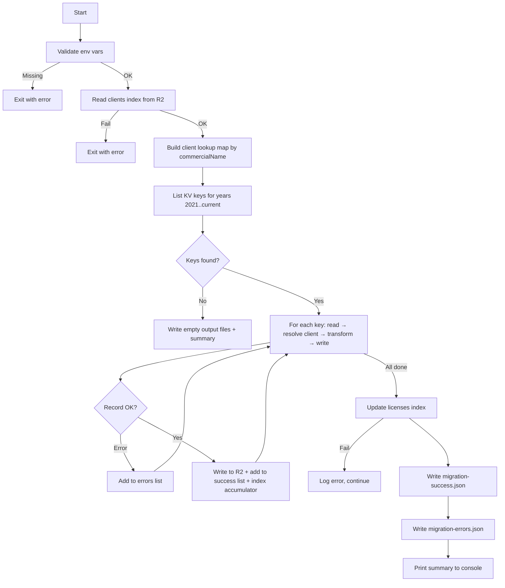

# Design — KV to R2 Licenses Migration

## 1. Script Architecture Overview

### Overview

- Standalone Node.js script (`scripts/licenses/migrate-licenses.js`) — no Worker, no server
- Runs locally with a Cloudflare API token provided via environment variables
- Sequential processing: build client lookup map → list all keys (year-based prefixes 2021–current) → read + resolve client + transform + write each → build index in memory → write index once → write output files
- Follows the same pattern as `scripts/migrate-clients.js`, `scripts/contracts/migrate-contracts.ts`, and `scripts/work-sheets/migrate-work-sheets.js`

### Script entry point and module structure

| Module | File | Responsibility |
|--------|------|----------------|
| Entry point | `scripts/licenses/migrate-licenses.js` | CLI entry, env validation, orchestration |
| Client lookup builder | inline in entry | Read clients index from R2, build commercialName → uuid map |
| KV reader | inline in entry | List keys by year prefix, read values via Cloudflare KV REST API |
| Client resolver | inline in entry | Two-step clientId resolution (direct or lookup) |
| Transformer | inline in entry | Map legacy schema → new `BaseContent<LicenseData>` |
| R2 writer | inline in entry | Write individual records via Cloudflare R2 REST API |
| Index builder | inline in entry | Accumulate index items in memory, calculate license status, write once at end |
| Output writer | inline in entry | Write `migration-success.json` and `migration-errors.json` to local FS |

### Environment variables required

| Variable | Description |
|----------|-------------|
| `CF_API_TOKEN` | Cloudflare API token (read KV + read/write R2) |
| `CF_ACCOUNT_ID` | Cloudflare account ID (`98dfed939a59dca09770880eab939b79`) |
| `CF_KV_NAMESPACE_ID` | KV namespace ID for `clever-clever-kv` |
| `CF_R2_BUCKET_NAME` | R2 bucket name for the target environment |

### Execution flow

### Flow — Structured table

| Step | Action | Input | Output | Error behavior |
|------|--------|-------|--------|----------------|
| 1 | Validate environment | `CF_API_TOKEN`, `CF_ACCOUNT_ID`, `CF_KV_NAMESPACE_ID`, `CF_R2_BUCKET_NAME` | Validated config | Exit immediately |
| 2 | Read clients index from R2 | `indexes/clients-index.json` | Clients array | Exit immediately (REQ-03, CA-03.2) |
| 3 | Build client lookup map | Clients array | Map: commercialName (lowercase) → uuid | Warn on duplicates, last wins (CA-03.3) |
| 4 | List KV keys | Year prefixes `licencas-2021-` through `licencas-{currentYear}-` | Array of key names | Exit immediately if API fails |
| 5 | Read KV value | Key name | Legacy JSON record | Add to errors, continue (CA-02.2) |
| 6 | Parse JSON | Raw string | Parsed object | Add to errors, continue (RB-02) |
| 7 | Validate required fields | Parsed object (`id`) | Validated record | Add to errors, continue (RB-01) |
| 8 | Resolve clientId | Two-step: use `clientId` if present, else lookup `cliente` in map | Resolved client uuid | Add to errors, continue (CA-04.1–04.4) |
| 9 | Transform record | Legacy record + resolved clientId | New `BaseContent<LicenseData>` | Add to errors, continue |
| 10 | Write to R2 | Transformed record, key `content/licenses/{uuid}.json` | Success confirmation | Add to errors, continue (CA-06.2) |
| 11 | Update index | All successful records | `indexes/licenses-index.json` | Log error, still write output files (CA-07.2) |
| 12 | Write output files | Successes array, errors array | Two JSON files in `scripts/licenses/` | Log error to console |
| 13 | Print summary | Counters | Console output | — |

### File location

- Script: `scripts/licenses/migrate-licenses.js`
- Output: `scripts/licenses/migration-success.json`, `scripts/licenses/migration-errors.json`

## 2. Data Models — Legacy KV Schema & New R2 Schema

### Legacy KV Record (flat structure)

KV key pattern: `licencas-{year}-{id}` (e.g., `licencas-2024-016b01de-a356-4a3b-afd8-1de60571b2ca`)

#### Root-level fields

| Field | Type | Required | Notes |
|-------|------|----------|-------|
| `id` | string | Yes | Unique identifier, becomes `uuid` |
| `createdAt` | string (ISO) | Yes | Timestamp |
| `updatedAt` | string (ISO) | Yes | Timestamp |
| `clientId` | string | No | Client UUID — used directly if present and non-empty (RB-03) |
| `cliente` | string | No | Client name — used for lookup when `clientId` absent; dropped after resolution (RB-09) |
| `versao` | string | No | Software version |
| `numeroSerie` | string | No | Serial number |
| `dataInicio` | string (ISO) | No | License start date |
| `dataVencimento` | string (ISO) | No | License expiration date |
| `modalidade` | string | No | ANUAL, SEMESTRAL, TRIMESTRAL, MENSAL |
| `duracaoContrato` | string | No | Contract duration |
| `invoices` | array | No | Array of invoice objects, preserved as-is |
| `tipoSoftware` | string[] | No | **Dropped** — redundant with `software.name` (RB-08) |

#### `software` sub-object

| Field | Type | Required | Notes |
|-------|------|----------|-------|
| `software.name` | string[] | No | Software names (multi-select) |
| `software.model` | string | No | Vectron-specific |
| `software.product` | string | No | Pix-specific |
| `software.version` | string | No | Zon Soft-specific |
| `software.licenseType` | string | No | Pt CERT-specific |
| `software.modules` | string[] | No | Pix-specific modules |
| `software.nEquipamento` | string | No | Equipment number |
| `software.versaoLicenca` | string | No | License version |

### New R2 Record — `BaseContent<LicenseData>`

R2 key: `content/licenses/{uuid}.json`

#### BaseContent wrapper fields

| Field | Type | Source | Notes |
|-------|------|--------|-------|
| `uuid` | string | `id` | Direct mapping |
| `contentType` | `'licenses'` | Fixed | Always `'licenses'` |
| `version` | number | Fixed | Always `1` |
| `isDeleted` | boolean | Fixed | Always `false` |
| `createdAt` | string (ISO) | `createdAt` | Preserved from legacy |
| `updatedAt` | string (ISO) | `updatedAt` | Preserved from legacy |
| `createdBy` | string | Fixed | Always `'migration'` |
| `updatedBy` | string | Fixed | Always `'migration'` |

#### LicenseData fields

| Field | Type | Source | Default |
|-------|------|--------|---------|
| `data.clientId` | string | Resolved | Two-step: use `clientId` if present, else lookup `cliente` in map |
| `data.versao` | string | `versao` | `''` |
| `data.numeroSerie` | string | `numeroSerie` | `''` |
| `data.dataInicio` | string | `dataInicio` | `''` |
| `data.dataVencimento` | string | `dataVencimento` | `''` |
| `data.modalidade` | string | `modalidade` | `''` |
| `data.duracaoContrato` | string | `duracaoContrato` | `''` |
| `data.software` | LicenseSoftware | `software` | `{ name: [], modules: [] }` (RB-10) |
| `data.invoices` | LicenseInvoice[] | `invoices` | `[]` (RB-11) |

#### LicenseSoftware fields (within `data.software`)

| Field | Type | Source | Default |
|-------|------|--------|---------|
| `name` | string[] | `software.name` | `[]` |
| `model` | string | `software.model` | `''` |
| `product` | string | `software.product` | `''` |
| `version` | string | `software.version` | `''` |
| `licenseType` | string | `software.licenseType` | `''` |
| `modules` | string[] | `software.modules` | `[]` |
| `nEquipamento` | string | `software.nEquipamento` | `''` |
| `versaoLicenca` | string | `software.versaoLicenca` | `''` |

### Dropped fields

| Legacy field | Reason |
|---|---|
| `tipoSoftware` | Redundant with `software.name` (RB-08) |
| `cliente` | Resolved through relations at display time (RB-09) |

## 3. Transformation Logic

### Pre-transformation validation

Before any field mapping, each legacy record must pass these checks in order. First failure → record added to errors list, skip to next record.

| # | Check | Condition | Error reason |
|---|-------|-----------|-------------|
| 1 | `id` present | `record.id` is a non-empty string | `"required field missing: id"` (RB-01) |
| 2 | `clientId` or `cliente` present | `record.clientId` is non-empty OR `record.cliente` is non-empty | `"required field missing: clientId or cliente"` (RB-06) |
| 3 | Client resolved | If `clientId` present → use directly; else `lookupMap.get(cliente.toLowerCase())` returns a uuid | `"client not found: {cliente}"` (RB-05) |

### Client resolution — two-step strategy

| Step | Condition | Action | Result |
|------|-----------|--------|--------|
| 1 | `record.clientId` is a non-empty string | Use `clientId` directly, skip lookup | Resolved clientId (RB-03) |
| 2a | `record.clientId` absent/empty AND `record.cliente` present | Lookup `cliente.toLowerCase()` in client map | Resolved clientId if found (RB-04) |
| 2b | `record.clientId` absent/empty AND `record.cliente` not in map | Add to errors | `"client not found: {cliente}"` (RB-05) |
| 2c | `record.clientId` absent/empty AND `record.cliente` absent/empty | Add to errors | `"required field missing: clientId or cliente"` (RB-06) |

### Client lookup map construction

- Read `indexes/clients-index.json` from R2 at script start (before any KV reading)
- Build a `Map<string, string>` keyed by `item.data.nomeComercial.toLowerCase()` → `item.uuid`
- If two clients share the same `nomeComercial` (case-insensitive), the last one in the index wins — log a warning to console (CA-03.3)
- If the index cannot be read → exit immediately with error message (CA-03.2)

### Field mapping — BaseContent wrapper

| New field | Source | Logic |
|-----------|--------|-------|
| `uuid` | `record.id` | Direct copy |
| `contentType` | — | Fixed `'licenses'` |
| `version` | — | Fixed `1` |
| `isDeleted` | — | Fixed `false` |
| `createdAt` | `record.createdAt` | Direct copy (ISO string) |
| `updatedAt` | `record.updatedAt` | Direct copy (ISO string) |
| `createdBy` | — | Fixed `'migration'` |
| `updatedBy` | — | Fixed `'migration'` |

### Field mapping — `data` (license period fields)

| New field | Source | Default |
|-----------|--------|---------|
| `data.clientId` | Resolved via two-step strategy | — (required, error if unresolved) |
| `data.versao` | `record.versao` | `''` |
| `data.numeroSerie` | `record.numeroSerie` | `''` |
| `data.dataInicio` | `record.dataInicio` | `''` |
| `data.dataVencimento` | `record.dataVencimento` | `''` |
| `data.modalidade` | `record.modalidade` | `''` |
| `data.duracaoContrato` | `record.duracaoContrato` | `''` |

### Field mapping — `data.software`

| New field | Source | Default |
|-----------|--------|---------|
| `data.software.name` | `record.software?.name` | `[]` |
| `data.software.model` | `record.software?.model` | `''` |
| `data.software.product` | `record.software?.product` | `''` |
| `data.software.version` | `record.software?.version` | `''` |
| `data.software.licenseType` | `record.software?.licenseType` | `''` |
| `data.software.modules` | `record.software?.modules` | `[]` |
| `data.software.nEquipamento` | `record.software?.nEquipamento` | `''` |
| `data.software.versaoLicenca` | `record.software?.versaoLicenca` | `''` |

- If `record.software` is absent entirely → default to `{ name: [], modules: [] }` with all string fields as `''` (RB-10)

### Field mapping — `data.invoices`

| New field | Source | Default |
|-----------|--------|---------|
| `data.invoices` | `record.invoices` | `[]` (RB-11) |

- Invoices are preserved as-is — no validation or transformation (CA-05.5)

### Default value rules summary

| Field type | Default | Business rule |
|-----------|---------|---------------|
| Optional string | `''` | RB-12 |
| Optional string array | `[]` | RB-10 |
| `software` sub-object absent | `{ name: [], model: '', product: '', version: '', licenseType: '', modules: [], nEquipamento: '', versaoLicenca: '' }` | RB-10 |
| `invoices` array absent | `[]` | RB-11 |

## 4. Cloudflare API Contracts

### Read clients index from R2

| Property | Value |
|----------|-------|
| Method | `GET` |
| URL | `https://api.cloudflare.com/client/v4/accounts/{accountId}/r2/buckets/{bucketName}/objects/indexes/clients-index.json` |
| Auth header | `Authorization: Bearer {CF_API_TOKEN}` |
| Success response | JSON body: `{ contentType, lastUpdated, items: [{ uuid, data: { nomeComercial } }] }` |
| Error response | HTTP 4xx/5xx |

- Called once at script start, before any KV operations
- If this fails → exit immediately (REQ-03, CA-03.2)

### List KV keys endpoint

| Property | Value |
|----------|-------|
| Method | `GET` |
| URL | `https://api.cloudflare.com/client/v4/accounts/{accountId}/storage/kv/namespaces/{namespaceId}/keys` |
| Query params | `prefix=licencas-{year}-`, `limit=1000`, `cursor={cursor}` (pagination) |
| Auth header | `Authorization: Bearer {CF_API_TOKEN}` |
| Response shape | `{ result: [{ name: string }], result_info: { cursor: string, count: number } }` |

### Pagination rules

- For each year from 2021 to current year: send paginated requests with prefix `licencas-{year}-`
- Repeat requests with `cursor` from `result_info.cursor` until `result_info.count < limit`
- Collect all key names across all years before starting any read/transform/write operations (REQ-01, CA-01.1)
- If a year prefix returns 0 keys → move to next year without error (CA-01.2)

### Read single KV value endpoint

| Property | Value |
|----------|-------|
| Method | `GET` |
| URL | `https://api.cloudflare.com/client/v4/accounts/{accountId}/storage/kv/namespaces/{namespaceId}/values/{keyName}` |
| Auth header | `Authorization: Bearer {CF_API_TOKEN}` |
| Success response | Raw JSON string (the stored value) |
| Error response | HTTP 4xx/5xx |

### Write R2 object endpoint

| Property | Value |
|----------|-------|
| Method | `PUT` |
| URL | `https://api.cloudflare.com/client/v4/accounts/{accountId}/r2/buckets/{bucketName}/objects/content/licenses/{uuid}.json` |
| Auth header | `Authorization: Bearer {CF_API_TOKEN}` |
| Body | JSON string of the transformed `BaseContent<LicenseData>` record |
| Content-Type | `application/json` |
| Success response | HTTP 200 |
| Error response | HTTP 4xx/5xx |

### Write R2 index endpoint

| Property | Value |
|----------|-------|
| Method | `PUT` |
| URL | `https://api.cloudflare.com/client/v4/accounts/{accountId}/r2/buckets/{bucketName}/objects/indexes/licenses-index.json` |
| Auth header | `Authorization: Bearer {CF_API_TOKEN}` |
| Body | JSON string of the complete index object |
| Content-Type | `application/json` |

### Error handling for API operations

| Condition | Action |
|-----------|--------|
| HTTP 401/403 on any initial call (clients index, KV list) | Exit immediately — "API token invalid or insufficient permissions" |
| HTTP 404 on clients index | Exit immediately — "Clients index not found in R2" |
| HTTP 404 on KV namespace | Exit immediately — "KV namespace not found" |
| HTTP error on individual KV read | Add to errors list, continue — `"read failed: HTTP {status}"` |
| JSON parse error on KV value | Add to errors list, continue — `"invalid JSON: {parseError}"` |
| HTTP 401/403 on individual R2 write | Exit immediately — "R2 bucket not accessible" (fatal, affects all subsequent writes) |
| HTTP 404 on individual R2 write | Exit immediately — "R2 bucket not found" |
| HTTP error (other) on individual R2 write | Add to errors list, continue — `"write failed: HTTP {status}"` |
| HTTP error on index write | Log error to console, still write output files |

## 5. Index Update Strategy

### Approach

- Accumulate index items in memory during processing (one item per successful migration)
- After all records are processed, read the existing `indexes/licenses-index.json` from R2 (if it exists)
- Merge: keep existing non-deleted items that were not part of this migration, add/overwrite migrated items
- Write the complete index once at the end
- If the index write fails → log error to console, still write output files (REQ-07, CA-07.2)

### Index wrapper structure

| Field | Type | Value |
|-------|------|-------|
| `contentType` | string | `'licenses'` |
| `lastUpdated` | string (ISO) | Current timestamp at write time |
| `items` | array | Array of index items |

### Index item fields

Each successfully migrated license produces one index item matching the `LicenseIndexItem` interface:

| Field | Type | Source | Default |
|-------|------|--------|---------|
| `uuid` | string | `newRecord.uuid` | — |
| `contentType` | string | Fixed `'licenses'` | — |
| `createdAt` | string | `newRecord.createdAt` | — |
| `updatedAt` | string | `newRecord.updatedAt` | — |
| `isDeleted` | boolean | Fixed `false` | — |
| `searchableText` | string | Built from record fields (see below) | — |
| `clientId` | string | `data.clientId` | — |
| `clientName` | string | Resolved from lookup map or legacy `cliente` | `''` |
| `software` | string[] | `data.software.name` | `[]` |
| `versao` | string | `data.versao` | `''` |
| `numeroSerie` | string | `data.numeroSerie` | `''` |
| `modalidade` | string | `data.modalidade` | `''` |
| `status` | string | Calculated from `data.dataVencimento` | `'active'` |

### License status calculation

Status is calculated at index build time from `data.dataVencimento` (REQ-07, CA-07.3):

| Condition | Status | Business rule |
|-----------|--------|---------------|
| `dataVencimento` is empty or absent | `'active'` | RB-16 |
| `dataVencimento` is a past date (before today) | `'expired'` | RB-14 |
| `dataVencimento` is within 30 days from today (inclusive) | `'expiring'` | RB-15 |
| `dataVencimento` is more than 30 days from today | `'active'` | RB-16 |

### Searchable text construction

The migration script builds `searchableText` by concatenating relevant fields:

| Source field | Condition | Terms added |
|-------------|-----------|-------------|
| `data.clientId` | Non-empty | clientId value |
| `clientName` | Non-empty | client name (from lookup or legacy `cliente`) |
| `data.software.name` | Non-empty array | All software names joined |
| `data.versao` | Non-empty | version string |
| `data.numeroSerie` | Non-empty | serial number |
| `data.modalidade` | Non-empty | modality string |
| `data.dataVencimento` | Non-empty | expiration date |

- All terms lowercased, joined with space separator

## 6. Output Files & Summary

### Success entry fields

Each successfully migrated license produces one entry in `scripts/licenses/migration-success.json` (REQ-08, CA-08.1):

| Field | Type | Source |
|-------|------|--------|
| `uuid` | string | `newRecord.uuid` |
| `clientId` | string | `newRecord.data.clientId` |
| `clientName` | string | Resolved from lookup map (by uuid → find original item) or legacy `cliente` field |
| `software` | string[] | `newRecord.data.software.name` |
| `modalidade` | string | `newRecord.data.modalidade` |
| `dataVencimento` | string | `newRecord.data.dataVencimento` |

- If zero licenses migrated → write empty array `[]` (CA-08.2)

### Error entry fields

Each failed record produces one entry in `scripts/licenses/migration-errors.json` (REQ-09, CA-09.1):

| Field | Type | Source |
|-------|------|--------|
| `id` | string | `record.id` if available, otherwise the KV key name |
| `reason` | string | Descriptive error message |

- If zero errors → write empty array `[]` (CA-09.2)

### Console summary format

Printed at the end of the script (REQ-10, CA-10.1):

| Line | Content |
|------|---------|
| 1 | `=== Licenses Migration Summary ===` |
| 2 | `Years scanned: 2021, 2022, 2023, 2024, 2025, 2026` |
| 3 | `Total records found: {total}` |
| 4 | `Successfully migrated: {successes}` |
| 5 | `Errors: {errors}` |
| 6 | `Success file: scripts/licenses/migration-success.json` |
| 7 | `Errors file: scripts/licenses/migration-errors.json` |

## 7. Error Handling

### Fatal errors — script exits immediately

| Trigger | Message | Output files written? |
|---------|---------|----------------------|
| `CF_API_TOKEN` missing | `"Missing required env var: CF_API_TOKEN"` | No |
| `CF_ACCOUNT_ID` missing | `"Missing required env var: CF_ACCOUNT_ID"` | No |
| `CF_KV_NAMESPACE_ID` missing | `"Missing required env var: CF_KV_NAMESPACE_ID"` | No |
| `CF_R2_BUCKET_NAME` missing | `"Missing required env var: CF_R2_BUCKET_NAME"` | No |
| Clients index read fails (HTTP error or network) | `"Failed to read clients index: {reason}"` | No |
| KV list returns 401/403 | `"API token invalid or insufficient permissions"` | No |
| KV list returns 404 | `"KV namespace not found"` | No |
| R2 write returns 401/403 | `"R2 bucket not accessible: HTTP {status}"` | Yes (partial — writes what's accumulated so far) |
| R2 write returns 404 | `"R2 bucket not found"` | Yes (partial — writes what's accumulated so far) |

### Per-record errors — script continues

| Trigger | Error reason | Business rule |
|---------|-------------|---------------|
| KV read fails (HTTP error) | `"read failed: HTTP {status}"` | CA-02.2 |
| KV value is not valid JSON | `"invalid JSON: {parseError}"` | RB-02 |
| Record missing `id` field | `"required field missing: id"` | RB-01 |
| Record has no `clientId` and no `cliente` | `"required field missing: clientId or cliente"` | RB-06 |
| Record has no `clientId` and `cliente` not in lookup map | `"client not found: {cliente}"` | RB-05 |
| R2 write fails (non-fatal HTTP error) | `"write failed: HTTP {status}"` | RB-07 |

### Non-fatal post-processing errors

| Trigger | Behavior | Business rule |
|---------|----------|---------------|
| Index update fails | Log error to console, still write output files | RB-13, CA-07.2 |
| Output file write fails | Log error to console | — |

## 8. Design Decisions

| Decision | Rationale | REQ-ID |
|----------|-----------|--------|
| Plain JavaScript (`.js`), not TypeScript | Consistent with `migrate-clients.js` and `migrate-work-sheets.js`. Migration scripts are throwaway tooling, not production code. | All |
| Single file, all functions inline | Keeps the script self-contained and easy to run without build steps. | All |
| Cloudflare REST API (not Wrangler bindings) | The script runs locally, not inside a Worker. Direct HTTP calls to KV and R2 APIs. | REQ-01, REQ-02, REQ-06 |
| Sequential processing (no parallelism) | Simpler error handling, predictable console output, avoids rate limiting on Cloudflare API. | All |
| Year-based prefix iteration (2021–current) | Licenses span more years than work sheets (which start at 2024). The year range covers all possible legacy data. | REQ-01 |
| Two-step client resolution | Unlike work sheets (which always resolve via `client.commercialName`), licenses may already have a `clientId` from a previous partial migration. Using it directly avoids unnecessary lookups. | REQ-04 |
| Client lookup map keyed by `nomeComercial` | Matches the actual field name in the clients index items (`data.nomeComercial`), consistent with the clients migration script. | REQ-03 |
| Status calculation at index time | `expired`/`expiring`/`active` is computed once during migration. Acceptable because the index will be refreshed by the backend on subsequent license updates. | REQ-07 |
| `clientName` in index and success output | Resolved from the client lookup map or from the legacy `cliente` field. Provides human-readable output without requiring a separate lookup at display time. | REQ-07, REQ-08 |
| Invoices preserved as-is | No validation or transformation per requirements. The `LicenseInvoice` interface exists in the types but the migration does not enforce it. | REQ-05 |
