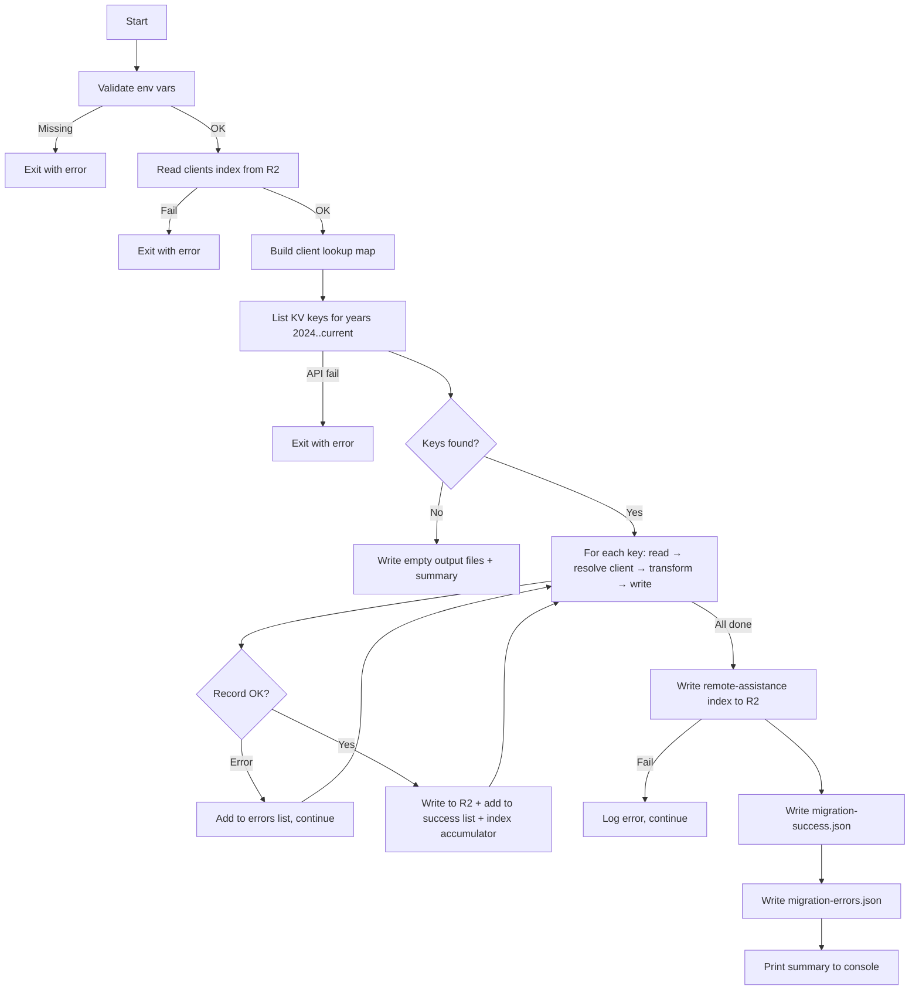

# Design — KV to R2 Remote Assistance Migration

## 1. Script Architecture Overview

### Overview

- Standalone Node.js script (`scripts/remote-assistance/migrate-remote-assistance.js`) — no Worker, no server
- Runs locally with a Cloudflare API token provided via environment variables
- Sequential processing: validate env → read clients index → build client lookup map → list all KV keys (year-filtered) → read + resolve client + transform + write each → build index in memory → write index once → write output files
- Follows the same pattern as `scripts/migrate-clients.js`, `scripts/contracts/migrate-contracts.ts`, `scripts/licenses/migrate-licenses.js`, and `scripts/work-sheets/migrate-work-sheets.js`

### Script entry point and module structure

| Module | File | Responsibility |
|--------|------|----------------|
| Entry point | `scripts/remote-assistance/migrate-remote-assistance.js` | CLI entry, env validation, orchestration |
| Client lookup builder | inline in entry | Read clients index from R2, build name → uuid map |
| KV reader | inline in entry | List keys by year prefix, read values via Cloudflare KV REST API |
| Client resolver | inline in entry | Match `cliente` name against lookup map to obtain `clientId` |
| Transformer | inline in entry | Map legacy schema → new `BaseContent<RemoteAssistanceData>` |
| R2 writer | inline in entry | Write individual records via Cloudflare R2 REST API |
| Index builder | inline in entry | Accumulate index items in memory, write once at end |
| Output writer | inline in entry | Write `migration-success.json` and `migration-errors.json` to local FS |

### Environment variables required

| Variable | Description |
|----------|-------------|
| `CF_API_TOKEN` | Cloudflare API token (read KV + read/write R2) |
| `CF_ACCOUNT_ID` | Cloudflare account ID (`98dfed939a59dca09770880eab939b79`) |
| `CF_KV_NAMESPACE_ID` | KV namespace ID for `clever-clever-kv` |
| `CF_R2_BUCKET_NAME` | R2 bucket name for the target environment |

### Execution flow

### Flow — Structured table

| Step | Action | Input | Output | Error behavior | REQ |
|------|--------|-------|--------|----------------|-----|
| 1 | Validate environment | `CF_API_TOKEN`, `CF_ACCOUNT_ID`, `CF_KV_NAMESPACE_ID`, `CF_R2_BUCKET_NAME` | Validated config | Exit immediately | — |
| 2 | Read clients index from R2 | `indexes/clients-index.json` | Clients array | Exit immediately | REQ-03 |
| 3 | Build client lookup map | Clients array | Map: name (lowercase) → uuid | Warn on duplicates, first wins | REQ-03 |
| 4 | List KV keys | Year prefixes `assistencias-remotas-2024-` through `assistencias-remotas-{currentYear}-` | Array of key names | Exit immediately if API fails | REQ-01 |
| 5 | Read KV value | Key name | Legacy JSON record | Add to errors, continue | REQ-02 |
| 6 | Parse JSON | Raw string | Parsed object | Add to errors, continue | REQ-02 |
| 7 | Validate required fields | Parsed object (`cliente`) | Validated record | Add to errors, continue | REQ-03 |
| 8 | Resolve clientId | Lookup `cliente` in map (case-insensitive) | Resolved client uuid | Add to errors, continue | REQ-03 |
| 9 | Transform record | Legacy record + resolved clientId | New `BaseContent<RemoteAssistanceData>` | Add to errors, continue | REQ-04 |
| 10 | Write to R2 | Transformed record, key `content/remote-assistance/{uuid}.json` | Success confirmation | Add to errors, continue | REQ-05 |
| 11 | Update index | All successful records | `indexes/remote-assistance-index.json` | Log error, still write output files | REQ-06 |
| 12 | Write output files | Successes array, errors array | Two JSON files in `scripts/remote-assistance/` | Log error to console | REQ-07, REQ-08 |
| 13 | Print summary | Counters | Console output | — | REQ-09 |

### File location

- Script: `scripts/remote-assistance/migrate-remote-assistance.js`
- Output: `scripts/remote-assistance/migration-success.json`, `scripts/remote-assistance/migration-errors.json`

## 2. Cloudflare KV API — Read Interface

### List keys endpoint

| Property | Value |
|----------|-------|
| Method | `GET` |
| URL | `https://api.cloudflare.com/client/v4/accounts/{accountId}/storage/kv/namespaces/{namespaceId}/keys` |
| Query params | `prefix=assistencias-remotas-{year}-`, `limit=1000`, `cursor={cursor}` (pagination) |
| Auth header | `Authorization: Bearer {CF_API_TOKEN}` |
| Response shape | `{ result: [{ name: string }], result_info: { cursor: string, count: number } }` |

### Pagination rules

- For each year from 2024 to current year: send requests with prefix `assistencias-remotas-{year}-`
- Repeat requests with `cursor` from `result_info.cursor` until `result_info.count < limit`
- Collect all key names across all years before starting any read/transform/write operations (REQ-01, CA-01.1)
- If all years return 0 keys → complete with 0 successes, 0 errors (CA-01.2)

### Read single key endpoint

| Property | Value |
|----------|-------|
| Method | `GET` |
| URL | `https://api.cloudflare.com/client/v4/accounts/{accountId}/storage/kv/namespaces/{namespaceId}/values/{keyName}` |
| Auth header | `Authorization: Bearer {CF_API_TOKEN}` |
| Success response | Raw JSON string (the stored value) |
| Error response | HTTP 4xx/5xx |

### Error handling for read operations

| Condition | Action | REQ |
|-----------|--------|-----|
| HTTP 401/403 on list | Exit immediately — "KV namespace not accessible: {status}" | Error scenario |
| HTTP 404 on list | Exit immediately — "KV namespace not found" | Error scenario |
| HTTP 4xx/5xx on single key read | Add to errors list — "read failed: HTTP {status}" | REQ-02, CA-02.2 |
| Response body not valid JSON | Add to errors list — "invalid JSON: {parseError}" | REQ-02, CA-02.2, RB-01 |
| Network error on list | Exit immediately — "Network error: {message}" | Error scenario |
| Network error on single key | Add to errors list — "read failed: {message}" | REQ-02, CA-02.2 |

## 3. Cloudflare R2 API — Write Interface

### Read clients index endpoint

| Property | Value |
|----------|-------|
| Method | `GET` |
| URL | `https://api.cloudflare.com/client/v4/accounts/{accountId}/r2/buckets/{bucketName}/objects/indexes/clients-index.json` |
| Auth header | `Authorization: Bearer {CF_API_TOKEN}` |
| Success response | JSON array of client index items |
| Error response | HTTP 4xx/5xx |

- If clients index cannot be read → exit immediately (cannot resolve client names)

### Write single object endpoint

| Property | Value |
|----------|-------|
| Method | `PUT` |
| URL | `https://api.cloudflare.com/client/v4/accounts/{accountId}/r2/buckets/{bucketName}/objects/{key}` |
| Key format | `content/remote-assistance/{uuid}.json` |
| Auth header | `Authorization: Bearer {CF_API_TOKEN}` |
| Content-Type header | `application/json` |
| Body | `JSON.stringify(newRecord, null, 2)` |
| Success response | HTTP 200 |
| Error response | HTTP 4xx/5xx |

### Write index endpoint

| Property | Value |
|----------|-------|
| Method | `PUT` |
| URL | `https://api.cloudflare.com/client/v4/accounts/{accountId}/r2/buckets/{bucketName}/objects/indexes/remote-assistance-index.json` |
| Auth header | `Authorization: Bearer {CF_API_TOKEN}` |
| Content-Type header | `application/json` |
| Body | Full index JSON (see Section 6) |

### Error handling for write operations

| Condition | Action | REQ |
|-----------|--------|-----|
| HTTP 401/403 on first write | Exit immediately — "R2 bucket not accessible: {status}" | Error scenario |
| HTTP 404 on bucket (first write) | Exit immediately — "R2 bucket not found" | Error scenario |
| HTTP 4xx/5xx on single record write | Add to errors list — "write failed: HTTP {status}" | REQ-05, CA-05.2, RB-13 |
| Network error on single record write | Add to errors list — "write failed: {message}" | REQ-05, CA-05.2 |
| HTTP 4xx/5xx on index write | Log error to console — "index update failed: HTTP {status}" — continue to output files | REQ-06, CA-06.2, RB-14 |
| Network error on index write | Log error to console — "index update failed: {message}" — continue to output files | REQ-06, CA-06.2 |

## 4. Client Resolution — Clients Index Lookup

### Client lookup map construction

- Read `indexes/clients-index.json` from R2 at startup (before processing any records)
- Build an in-memory map: `clientName (lowercase, trimmed) → uuid`
- For each client in the index, register two keys: `nomeComercial` and `nomeEmpresa` (both lowercased and trimmed)
- If a name maps to multiple clients → keep the first encountered, log warning to console (RB-04, CA-03.3)

### Lookup map structure

| Map key | Map value | Source field |
|---------|-----------|-------------|
| `client.nomeComercial.toLowerCase().trim()` | `client.uuid` | Clients index item |
| `client.nomeEmpresa.toLowerCase().trim()` | `client.uuid` | Clients index item |

### Resolution rules

| Step | Condition | Action | REQ |
|------|-----------|--------|-----|
| 1 | Legacy record missing `cliente` field | Add to errors — "required field missing: cliente" | RB-02 |
| 2 | `cliente.toLowerCase().trim()` found in lookup map | Use mapped `uuid` as `clientId` | REQ-03, CA-03.1 |
| 3 | `cliente` not found in lookup map | Add to errors — "client not found: {clienteName}" | REQ-03, CA-03.2, RB-03 |

### Duplicate name handling

- During map construction: if a lowercased name already exists in the map, keep the first entry and log: `"Warning: duplicate client name '{name}' — using first match (uuid: {uuid})"`
- This covers CA-03.3 (multiple matches → first match used, warning logged)

## 5. Data Transformation — Legacy → New Schema

### BaseContent wrapper fields (always set by migration)

| New field | Source | Value | REQ |
|-----------|--------|-------|-----|
| `uuid` | `legacy.id` | Direct copy | REQ-04, CA-04.1 |
| `contentType` | — | `'remote-assistance'` (hardcoded) | REQ-04, CA-04.8 |
| `createdAt` | `legacy.createdAt` | Direct copy (preserve original) | REQ-04, CA-04.2 |
| `createdBy` | — | `'migration'` (hardcoded) | REQ-04, CA-04.8 |
| `updatedAt` | `legacy.updatedAt` | Direct copy (preserve original) | REQ-04, CA-04.2 |
| `updatedBy` | — | `'migration'` (hardcoded) | REQ-04, CA-04.8 |
| `version` | — | `1` (hardcoded) | REQ-04, CA-04.8 |
| `isDeleted` | — | `false` (hardcoded) | REQ-04, CA-04.8 |

### `data` fields — direct mapping

| New field (`data.*`) | Legacy field | Default if absent | REQ |
|----------------------|-------------|-------------------|-----|
| `clientId` | resolved from `cliente` | — (error if unresolved) | REQ-03 |
| `clienteName` | `cliente` | — (error if missing) | REQ-03 |
| `dataPedido` | `dataPedido` | `''` | REQ-04 |
| `dataAssistencia` | `dataAssistencia` | `''` | REQ-04 |
| `inicioAssistencia` | `inicioAssistencia` | `''` | REQ-04 |
| `fimAssistencia` | `fimAssistencia` | `''` | REQ-04 |
| `motivoPedido` | `motivoPedido` | `''` | REQ-04 |
| `relatorioAssistencia` | `relatorioAssistencia` | `''` | REQ-04 |
| `valorAssist` | `valorAssist` | `0` | REQ-04, CA-04.7, RB-12 |
| `resolvido` | `resolvido` | `false` | REQ-04, RB-11 |
| `relatorio` | `relatorio` | `''` | REQ-04 |
| `anexos` | `anexos` | `''` | REQ-04 |

### `data` fields — derived

| New field (`data.*`) | Derivation logic | REQ |
|----------------------|-----------------|-----|
| `paymentMethod` | `contrato === true` → `'Contrato'`; else `garantia === true` → `'Garantia'`; else → `'Faturação'` | REQ-04, CA-04.3, CA-04.4, CA-04.5, RB-05, RB-06, RB-07 |
| `tipoAssistencia` | If value is one of `'REMOTA'`, `'TELEFÓNICA'`, `'TELEMÓVEL'` → preserve; otherwise → `''` | REQ-04, CA-04.9, RB-10 |
| `tecnicoResponsavel` | See TechnicianUser derivation below | REQ-04, CA-04.6 |

### TechnicianUser derivation from legacy `tecnicoResponsavel` string

| Condition | `userId` | `firstName` | `lastName` | `userType` | REQ |
|-----------|----------|-------------|------------|------------|-----|
| String with spaces (e.g. "João Bernardino") | `'migration'` | First word (`'João'`) | Remaining words (`'Bernardino'`) | `'Admin'` | CA-04.6, RB-08 |
| Single word or empty string | `'migration'` | The word (or `''`) | `''` | `'Admin'` | CA-04.6, RB-09 |

### Legacy fields dropped (not in new schema)

| Legacy field | Reason |
|-------------|--------|
| `quemAtendeu` | Not present in `RemoteAssistanceData` |
| `contratoValor` | Not present in `RemoteAssistanceData` |
| `totalComIva` | Not present in `RemoteAssistanceData`; `valorAssist` is the stored value |
| `pertenceAnoContrato` | Not present in `RemoteAssistanceData` |

### Fields left undefined during migration

| New field (`data.*`) | Reason |
|----------------------|--------|
| `horasTotais` | Not calculated during migration — left `undefined` |
| `contractId` | No contract resolution during migration — left `undefined` |

## 6. Index Update — Remote Assistance Index

### Index file structure

| Property | Value |
|----------|-------|
| R2 key | `indexes/remote-assistance-index.json` |
| Top-level fields | `contentType: 'remote-assistance'`, `lastUpdated: ISO string`, `items: array` |

### Index item fields (per migrated record)

| Field | Source | Notes |
|-------|--------|-------|
| `uuid` | `record.uuid` | From BaseContent wrapper |
| `contentType` | `'remote-assistance'` | Hardcoded |
| `createdAt` | `record.createdAt` | From BaseContent wrapper |
| `updatedAt` | `record.updatedAt` | From BaseContent wrapper |
| `isDeleted` | `false` | Hardcoded |
| `searchableText` | Built from record fields | See construction below |
| `clientId` | `record.data.clientId` | Resolved uuid |
| `clienteName` | `record.data.clienteName` | Original legacy name |
| `tipoAssistencia` | `record.data.tipoAssistencia` | Preserved value |
| `tecnicoResponsavel` | `record.data.tecnicoResponsavel` | TechnicianUser object |
| `dataPedido` | `record.data.dataPedido` | ISO date string |
| `dataAssistencia` | `record.data.dataAssistencia` | ISO date string |
| `inicioAssistencia` | `record.data.inicioAssistencia` | ISO date string |
| `fimAssistencia` | `record.data.fimAssistencia` | ISO date string |
| `valorAssist` | `record.data.valorAssist` | Numeric value |
| `paymentMethod` | `record.data.paymentMethod` | Derived string |
| `resolvido` | `record.data.resolvido` | Boolean |
| `motivoPedido` | `record.data.motivoPedido` | String |

### `searchableText` construction

- Collect terms into array, join with space, lowercase the result
- Terms included:

| Term source | Value |
|-------------|-------|
| `clientId` | Resolved uuid |
| `clienteName` | Original legacy name |
| `tipoAssistencia` | Assistance type |
| `tecnicoResponsavel.firstName` | Technician first name |
| `tecnicoResponsavel.lastName` | Technician last name |
| `tecnicoResponsavel` full name | `"{firstName} {lastName}"` |
| `motivoPedido` | Request reason |
| `relatorioAssistencia` | Assistance report |
| `paymentMethod` | Payment method string |

### Merge strategy (preserve existing records)

| Step | Action |
|------|--------|
| 1 | Read existing `indexes/remote-assistance-index.json` from R2 (if it fails, start with empty array) |
| 2 | Build set of migrated UUIDs |
| 3 | Filter existing items: keep only those whose `uuid` is NOT in the migrated set |
| 4 | Concatenate preserved items + new migrated items |
| 5 | Write merged index back to R2 with `lastUpdated` timestamp |

- This ensures pre-existing non-migrated records are preserved (CA-06.1)
- If index write fails → log error to console, continue to output files (CA-06.2, RB-14)

## 7. Output Files & Console Summary

### Success output file

| Property | Value |
|----------|-------|
| File path | `scripts/remote-assistance/migration-success.json` |
| Format | JSON array |

### Success record structure

| Field | Source | REQ |
|-------|--------|-----|
| `uuid` | `record.uuid` | REQ-07, CA-07.1 |
| `cliente` | Original legacy `cliente` value | REQ-07, CA-07.1 |
| `tipoAssistencia` | `record.data.tipoAssistencia` | REQ-07, CA-07.1 |
| `dataAssistencia` | `record.data.dataAssistencia` | REQ-07, CA-07.1 |

- If zero records succeeded → write empty array `[]` (CA-07.2)

### Error output file

| Property | Value |
|----------|-------|
| File path | `scripts/remote-assistance/migration-errors.json` |
| Format | JSON array |

### Error record structure

| Field | Source | REQ |
|-------|--------|-----|
| `id` | Legacy `id` or KV key name (if `id` unavailable) | REQ-08, CA-08.1 |
| `cliente` | Legacy `cliente` value (if available, otherwise `null`) | REQ-08, CA-08.1 |
| `reason` | Descriptive error string | REQ-08, CA-08.1 |

- If zero records failed → write empty array `[]` (CA-08.2)

### Error handling for output file writes

| Condition | Action | REQ |
|-----------|--------|-----|
| `migration-success.json` write fails | Log error to console — "Failed to write success file: {message}" | Error scenario |
| `migration-errors.json` write fails | Log error to console — "Failed to write errors file: {message}" | Error scenario |

- Output file write failures do not affect the migration itself — records are already in R2
- Both files are written independently — failure of one does not prevent the other

### Console summary

- Printed after output files are written (REQ-09, CA-09.1)
- Format:

| Line | Content |
|------|---------|
| 1 | `Migration complete.` |
| 2 | `Total records found: {total}` |
| 3 | `Successes: {successCount}` |
| 4 | `Errors: {errorCount}` |
| 5 | `Success file: scripts/remote-assistance/migration-success.json` |
| 6 | `Error file: scripts/remote-assistance/migration-errors.json` |
