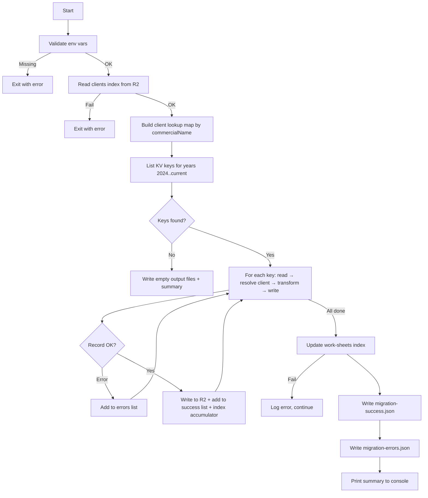

# Design — KV to R2 Work Sheets Migration

## 1. Script Architecture Overview

### Overview

- Standalone Node.js script (`scripts/work-sheets/migrate-work-sheets.js`) — no Worker, no server
- Runs locally with a Cloudflare API token provided via environment variables
- Sequential processing: build client lookup map → list all keys (year-based prefixes) → read + transform + write each → build index in memory → write index once → write output files
- Follows the same pattern as `scripts/migrate-clients.js` and `scripts/contracts/migrate-contracts.ts`

### Script entry point and module structure

| Module                | File                                         | Responsibility                                                         |
| -----------------------| ----------------------------------------------| ------------------------------------------------------------------------|
| Entry point           | `scripts/work-sheets/migrate-work-sheets.js` | CLI entry, env validation, orchestration                               |
| Client lookup builder | inline in entry                              | Read clients index from R2, build commercialName → uuid map            |
| KV reader             | inline in entry                              | List keys by year prefix, read values via Cloudflare KV REST API       |
| Transformer           | inline in entry                              | Map legacy schema → new `BaseContent<WorkSheetData>`                   |
| R2 writer             | inline in entry                              | Write individual records via Cloudflare R2 REST API                    |
| Index builder         | inline in entry                              | Accumulate index items in memory, write once at end                    |
| Output writer         | inline in entry                              | Write `migration-success.json` and `migration-errors.json` to local FS |

### Environment variables required

| Variable | Description |
|----------|-------------|
| `CF_API_TOKEN` | Cloudflare API token (read KV + read/write R2) |
| `CF_ACCOUNT_ID` | Cloudflare account ID (`98dfed939a59dca09770880eab939b79`) |
| `CF_KV_NAMESPACE_ID` | KV namespace ID for `clever-clever-kv` |
| `CF_R2_BUCKET_NAME` | R2 bucket name for the target environment |

### Execution flow

### Flow — Structured table

| Step | Action | Input | Output | Error behavior |
|------|--------|-------|--------|----------------|
| 1 | Validate environment | `CF_API_TOKEN`, `CF_ACCOUNT_ID`, `CF_KV_NAMESPACE_ID`, `CF_R2_BUCKET_NAME` | Validated config | Exit immediately |
| 2 | Read clients index from R2 | `indexes/clients-index.json` | Clients array | Exit immediately |
| 3 | Build client lookup map | Clients array | Map: commercialName (lowercase) → uuid | Warn on duplicates, last wins |
| 4 | List KV keys | Year prefixes `folhas-obra-2024-` through `folhas-obra-{currentYear}-` | Array of key names | Exit immediately if API fails |
| 5 | Read KV value | Key name | Legacy JSON record | Add to errors, continue |
| 6 | Parse JSON | Raw string | Parsed object | Add to errors, continue |
| 7 | Validate required fields | Parsed object (`id`, `client.commercialName`) | Validated record | Add to errors, continue |
| 8 | Resolve clientId | `client.commercialName` + lookup map | Matched client uuid | Add to errors, continue |
| 9 | Transform record | Legacy record + clientId | New `BaseContent<WorkSheetData>` | Add to errors, continue |
| 10 | Write to R2 | Transformed record, key `content/work-sheets/{uuid}.json` | Success confirmation | Add to errors, continue |
| 11 | Update index | All successful records | `indexes/work-sheets-index.json` | Log error, still write output files |
| 12 | Write output files | Successes array, errors array | Two JSON files in `scripts/work-sheets/` | Log error to console |
| 13 | Print summary | Counters | Console output | — |

### File location

- Script: `scripts/work-sheets/migrate-work-sheets.js`
- Output: `scripts/work-sheets/migration-success.json`, `scripts/work-sheets/migration-errors.json`

## 2. Data Models — Legacy KV Schema & New R2 Schema

### Legacy KV Record (semi-structured with sub-objects)

KV key pattern: `folhas-obra-{year}-{id}` (e.g., `folhas-obra-2024-abc123`)

#### Root-level fields

| Field | Type | Required | Notes |
|-------|------|----------|-------|
| `id` | string | Yes | Unique identifier, becomes `uuid` |
| `createdAt` | string (ISO) | Yes | Timestamp |
| `updatedAt` | string (ISO) | Yes | Timestamp |
| `clientName` | string | No | Dropped — resolved via relations |
| `date` | string (ISO) | No | Dropped — redundant with `request.assistanceDate` |
| `number` | number | No | Dropped — legacy sequential number |

#### `client` sub-object

| Field | Type | Required | Notes |
|-------|------|----------|-------|
| `client.commercialName` | string | Yes | Used for clientId resolution via lookup map |
| `client.socialName` | string | No | Dropped — resolved via relations |
| `client.taxNumber` | string | No | Dropped — resolved via relations |
| `client.address` | string | No | Dropped — resolved via relations |
| `client.location` | string | No | Dropped — resolved via relations |

#### `request` sub-object

| Field | Type | Required | Notes |
|-------|------|----------|-------|
| `request.date` | string (ISO) | No | Direct mapping → `data.request.date` |
| `request.receivedBy` | string | No | Direct mapping → `data.request.receivedBy` |
| `request.assistanceDate` | string (ISO) | No | Direct mapping → `data.request.assistanceDate` |
| `request.reason` | string | No | Direct mapping → `data.request.reason` |
| `request.arrivalTime` | string (HH:MM) | No | Direct mapping → `data.request.arrivalTime` |
| `request.departureTime` | string (HH:MM) | No | Direct mapping → `data.request.departureTime` |
| `request.totalHours` | string (HH:MM:SS) | No | Direct mapping → `data.request.totalHours` |

#### `displacement` sub-object

| Field | Type | Required | Notes |
|-------|------|----------|-------|
| `displacement.hasDisplacement` | boolean | No | Direct mapping |
| `displacement.weekendHoliday` | boolean | No | Direct mapping |
| `displacement.oneWayKms` | number | No | Direct mapping |
| `displacement.totalKms` | number | No | Direct mapping |
| `displacement.paymentMethod` | string | No | Direct mapping |
| `displacement.roundTripKm` | number | No | **Dropped** — legacy price field |
| `displacement.totalCalculatedHours` | number | No | **Dropped** — legacy price field |
| `displacement.displacementCost` | number | No | **Dropped** — legacy price field |
| `displacement.laborCost` | number | No | **Dropped** — legacy price field |
| `displacement.totalCostWithTax` | number | No | **Dropped** — legacy price field |
| `displacement.clientContract` | string | No | **Dropped** — redundant with paymentMethod |
| `displacement.totalToPay` | number | No | **Dropped** — legacy price field |

#### `otherData` sub-object

| Field | Type | Required | Notes |
|-------|------|----------|-------|
| `otherData.serviceType` | string | No | Direct mapping — values preserved as-is (may include legacy "ASSISTÊNCIA REMOTA") |
| `otherData.technician` | string | No | Preserved as plain string (backward compatible, not converted to TechnicianUser) |
| `otherData.serviceObservations` | string | No | Direct mapping |
| `otherData.warranty` | boolean | No | Direct mapping |
| `otherData.contract` | boolean | No | Direct mapping |
| `otherData.contractYear` | string | No | Direct mapping |
| `otherData.materialUsed` | boolean | No | Direct mapping |
| `otherData.materialDetails` | string | No | Direct mapping |
| `otherData.equipment` | boolean | No | Direct mapping |
| `otherData.equipmentDetails` | string | No | Direct mapping |
| `otherData.totallyResolved` | boolean | No | Direct mapping |
| `otherData.resolutionIssues` | string | No | Direct mapping |
| `otherData.dumpReading` | boolean | No | Direct mapping |
| `otherData.backup` | boolean | No | Direct mapping |
| `otherData.remoteAccessCheck` | boolean | No | Direct mapping |
| `otherData.anydesk` | boolean | No | Direct mapping |
| `otherData.serviceReport` | string | No | Direct mapping |
| `otherData.clientSignature` | string | No | Direct mapping — base64 PNG preserved as-is |

### New R2 Record — `BaseContent<WorkSheetData>`

R2 key: `content/work-sheets/{uuid}.json`

#### BaseContent wrapper fields

| Field | Type | Source | Notes |
|-------|------|--------|-------|
| `uuid` | string | `id` | Direct mapping |
| `contentType` | `'work-sheets'` | Fixed | Always `'work-sheets'` |
| `version` | number | Fixed | Always `1` |
| `isDeleted` | boolean | Fixed | Always `false` |
| `createdAt` | string (ISO) | `createdAt` | Preserved from legacy |
| `updatedAt` | string (ISO) | `updatedAt` | Preserved from legacy |
| `createdBy` | string | Fixed | Always `'migration'` |
| `updatedBy` | string | Fixed | Always `'migration'` |

#### WorkSheetData fields

| Field | Type | Source | Notes |
|-------|------|--------|-------|
| `data.clientId` | string | Resolved | `client.commercialName` → lookup map → uuid |
| `data.request.date` | string | `request.date` | Default: `''` |
| `data.request.receivedBy` | string | `request.receivedBy` | Default: `''` |
| `data.request.assistanceDate` | string | `request.assistanceDate` | Default: `''` |
| `data.request.reason` | string | `request.reason` | Default: `''` |
| `data.request.arrivalTime` | string | `request.arrivalTime` | Default: `''` |
| `data.request.departureTime` | string | `request.departureTime` | Default: `''` |
| `data.request.totalHours` | string | `request.totalHours` | Default: `''` |
| `data.displacement.hasDisplacement` | boolean | `displacement.hasDisplacement` | Default: `false` |
| `data.displacement.weekendHoliday` | boolean | `displacement.weekendHoliday` | Default: `false` |
| `data.displacement.oneWayKms` | number | `displacement.oneWayKms` | Default: `0` |
| `data.displacement.totalKms` | number | `displacement.totalKms` | Default: `0` |
| `data.displacement.paymentMethod` | string | `displacement.paymentMethod` | Default: `'PENDENTE'` |
| `data.otherData.serviceType` | string | `otherData.serviceType` | Default: `''` |
| `data.otherData.technician` | string | `otherData.technician` | Preserved as plain string |
| `data.otherData.serviceObservations` | string | `otherData.serviceObservations` | Default: `''` |
| `data.otherData.warranty` | boolean | `otherData.warranty` | Default: `false` |
| `data.otherData.contract` | boolean | `otherData.contract` | Default: `false` |
| `data.otherData.contractYear` | string | `otherData.contractYear` | Default: `''` |
| `data.otherData.materialUsed` | boolean | `otherData.materialUsed` | Default: `false` |
| `data.otherData.materialDetails` | string | `otherData.materialDetails` | Default: `''` |
| `data.otherData.equipment` | boolean | `otherData.equipment` | Default: `false` |
| `data.otherData.equipmentDetails` | string | `otherData.equipmentDetails` | Default: `''` |
| `data.otherData.totallyResolved` | boolean | `otherData.totallyResolved` | Default: `false` |
| `data.otherData.resolutionIssues` | string | `otherData.resolutionIssues` | Default: `''` |
| `data.otherData.dumpReading` | boolean | `otherData.dumpReading` | Default: `false` |
| `data.otherData.backup` | boolean | `otherData.backup` | Default: `false` |
| `data.otherData.remoteAccessCheck` | boolean | `otherData.remoteAccessCheck` | Default: `false` |
| `data.otherData.anydesk` | boolean | `otherData.anydesk` | Default: `false` |
| `data.otherData.serviceReport` | string | `otherData.serviceReport` | Default: `''` |
| `data.otherData.clientSignature` | string | `otherData.clientSignature` | Default: `''` — base64 preserved |

## 3. Transformation Logic

### Pre-transformation validation

Before any field mapping, each legacy record must pass these checks in order. First failure → record added to errors list, skip to next record.

| # | Check | Condition | Error reason |
|---|-------|-----------|-------------|
| 1 | `id` present | `record.id` is a non-empty string | `"required field missing: id"` |
| 2 | `request` sub-object present | `record.request` is an object | `"required field missing: request"` |
| 3 | `client.commercialName` present | `record.client?.commercialName` is a non-empty string | `"required field missing: client.commercialName"` |
| 4 | Client found in lookup map | `lookupMap.get(commercialName.toLowerCase())` returns a uuid | `"client not found: {commercialName}"` |

### Client lookup map construction

- Read `indexes/clients-index.json` from R2 at script start (before any KV reading)
- Build a `Map<string, string>` keyed by `commercialName.toLowerCase()` → `uuid`
- If two clients share the same `commercialName` (case-insensitive), the last one in the index wins — log a warning to console
- If the index cannot be read → exit immediately with error message

### Field mapping — BaseContent wrapper

| New field | Source | Logic |
|-----------|--------|-------|
| `uuid` | `record.id` | Direct copy |
| `contentType` | — | Fixed `'work-sheets'` |
| `version` | — | Fixed `1` |
| `isDeleted` | — | Fixed `false` |
| `createdAt` | `record.createdAt` | Direct copy (ISO string) |
| `updatedAt` | `record.updatedAt` | Direct copy (ISO string) |
| `createdBy` | — | Fixed `'migration'` |
| `updatedBy` | — | Fixed `'migration'` |

### Field mapping — `data.clientId`

| New field | Source | Logic |
|-----------|--------|-------|
| `data.clientId` | `record.client.commercialName` | Lookup in client map → uuid |

### Field mapping — `data.request`

| New field | Source | Default |
|-----------|--------|---------|
| `data.request.date` | `record.request.date` | `''` |
| `data.request.receivedBy` | `record.request.receivedBy` | `''` |
| `data.request.assistanceDate` | `record.request.assistanceDate` | `''` |
| `data.request.reason` | `record.request.reason` | `''` |
| `data.request.arrivalTime` | `record.request.arrivalTime` | `''` |
| `data.request.departureTime` | `record.request.departureTime` | `''` |
| `data.request.totalHours` | `record.request.totalHours` | `''` |

### Field mapping — `data.displacement`

| New field | Source | Default | Notes |
|-----------|--------|---------|-------|
| `data.displacement.hasDisplacement` | `record.displacement?.hasDisplacement` | `false` | RB-15: entire sub-object defaults if absent |
| `data.displacement.weekendHoliday` | `record.displacement?.weekendHoliday` | `false` | |
| `data.displacement.oneWayKms` | `record.displacement?.oneWayKms` | `0` | |
| `data.displacement.totalKms` | `record.displacement?.totalKms` | `0` | |
| `data.displacement.paymentMethod` | `record.displacement?.paymentMethod` | `'PENDENTE'` | |

- Legacy price fields (`roundTripKm`, `totalCalculatedHours`, `displacementCost`, `laborCost`, `totalCostWithTax`, `clientContract`, `totalToPay`) are silently dropped — no error, no warning (RB-06)

### Field mapping — `data.otherData`

| New field | Source | Default | Notes |
|-----------|--------|---------|-------|
| `data.otherData.serviceType` | `record.otherData?.serviceType` | `''` | Preserved as-is, including legacy values like "ASSISTÊNCIA REMOTA" (RB-08) |
| `data.otherData.technician` | `record.otherData?.technician` | `''` | Preserved as plain string (RB-07) |
| `data.otherData.serviceObservations` | `record.otherData?.serviceObservations` | `''` | |
| `data.otherData.warranty` | `record.otherData?.warranty` | `false` | |
| `data.otherData.contract` | `record.otherData?.contract` | `false` | |
| `data.otherData.contractYear` | `record.otherData?.contractYear` | `''` | |
| `data.otherData.materialUsed` | `record.otherData?.materialUsed` | `false` | |
| `data.otherData.materialDetails` | `record.otherData?.materialDetails` | `''` | |
| `data.otherData.equipment` | `record.otherData?.equipment` | `false` | |
| `data.otherData.equipmentDetails` | `record.otherData?.equipmentDetails` | `''` | |
| `data.otherData.totallyResolved` | `record.otherData?.totallyResolved` | `false` | |
| `data.otherData.resolutionIssues` | `record.otherData?.resolutionIssues` | `''` | |
| `data.otherData.dumpReading` | `record.otherData?.dumpReading` | `false` | |
| `data.otherData.backup` | `record.otherData?.backup` | `false` | |
| `data.otherData.remoteAccessCheck` | `record.otherData?.remoteAccessCheck` | `false` | |
| `data.otherData.anydesk` | `record.otherData?.anydesk` | `false` | |
| `data.otherData.serviceReport` | `record.otherData?.serviceReport` | `''` | |
| `data.otherData.clientSignature` | `record.otherData?.clientSignature` | `''` | Base64 PNG preserved as-is (RB-09) |

### Default value rules summary

| Field type | Default | Business rule |
|-----------|---------|---------------|
| Optional string | `''` | RB-10 |
| Optional boolean | `false` | RB-11 |
| Optional number | `0` | RB-12 |
| `displacement` sub-object absent | `hasDisplacement: false`, `weekendHoliday: false`, `oneWayKms: 0`, `totalKms: 0`, `paymentMethod: 'PENDENTE'` | RB-15 |

## 4. Cloudflare API Contracts

### Read clients index from R2

| Property | Value |
|----------|-------|
| Method | `GET` |
| URL | `https://api.cloudflare.com/client/v4/accounts/{accountId}/r2/buckets/{bucketName}/objects/indexes/clients-index.json` |
| Auth header | `Authorization: Bearer {CF_API_TOKEN}` |
| Success response | JSON body: `{ contentType, lastUpdated, items: [{ uuid, data: { nomeComercial } }] }` |
| Error response | HTTP 4xx/5xx |

- Called once at script start, before any KV operations
- If this fails → exit immediately (REQ-03, CA-03.2)

### List KV keys endpoint

| Property | Value |
|----------|-------|
| Method | `GET` |
| URL | `https://api.cloudflare.com/client/v4/accounts/{accountId}/storage/kv/namespaces/{namespaceId}/keys` |
| Query params | `prefix=folhas-obra-{year}-`, `limit=1000`, `cursor={cursor}` (pagination) |
| Auth header | `Authorization: Bearer {CF_API_TOKEN}` |
| Response shape | `{ result: [{ name: string }], result_info: { cursor: string, count: number } }` |

### Pagination rules

- For each year from 2024 to current year: send paginated requests with prefix `folhas-obra-{year}-`
- Repeat requests with `cursor` from `result_info.cursor` until `result_info.count < limit`
- Collect all key names across all years before starting any read/transform/write operations (REQ-01, CA-01.1)
- If a year prefix returns 0 keys → move to next year without error (CA-01.2)

### Read single KV value endpoint

| Property | Value |
|----------|-------|
| Method | `GET` |
| URL | `https://api.cloudflare.com/client/v4/accounts/{accountId}/storage/kv/namespaces/{namespaceId}/values/{keyName}` |
| Auth header | `Authorization: Bearer {CF_API_TOKEN}` |
| Success response | Raw JSON string (the stored value) |
| Error response | HTTP 4xx/5xx |

### Write R2 object endpoint

| Property | Value |
|----------|-------|
| Method | `PUT` |
| URL | `https://api.cloudflare.com/client/v4/accounts/{accountId}/r2/buckets/{bucketName}/objects/content/work-sheets/{uuid}.json` |
| Auth header | `Authorization: Bearer {CF_API_TOKEN}` |
| Body | JSON string of the transformed `BaseContent<WorkSheetData>` record |
| Content-Type | `application/json` |
| Success response | HTTP 200 |
| Error response | HTTP 4xx/5xx |

### Write R2 index endpoint

| Property | Value |
|----------|-------|
| Method | `PUT` |
| URL | `https://api.cloudflare.com/client/v4/accounts/{accountId}/r2/buckets/{bucketName}/objects/indexes/work-sheets-index.json` |
| Auth header | `Authorization: Bearer {CF_API_TOKEN}` |
| Body | JSON string of the complete index object |
| Content-Type | `application/json` |

### Error handling for API operations

| Condition | Action |
|-----------|--------|
| HTTP 401/403 on any initial call (clients index, KV list) | Exit immediately — "API token invalid or insufficient permissions" |
| HTTP 404 on clients index | Exit immediately — "Clients index not found in R2" |
| HTTP 404 on KV namespace | Exit immediately — "KV namespace not found" |
| HTTP error on individual KV read | Add to errors list, continue — `"read failed: HTTP {status}"` |
| JSON parse error on KV value | Add to errors list, continue — `"invalid JSON: {parseError}"` |
| HTTP error on individual R2 write | Add to errors list, continue — `"write failed: HTTP {status}"` |
| HTTP error on index write | Log error to console, still write output files |

## 5. Index Update Strategy

### Approach

- Accumulate index items in memory during processing (one item per successful migration)
- After all records are processed, read the existing `indexes/work-sheets-index.json` from R2 (if it exists)
- Merge: keep existing non-deleted items that were not part of this migration, add/overwrite migrated items
- Write the complete index once at the end
- If the index write fails → log error to console, still write output files (REQ-07, CA-07.2)

### Index wrapper structure

| Field | Type | Value |
|-------|------|-------|
| `contentType` | string | `'work-sheets'` |
| `lastUpdated` | string (ISO) | Current timestamp at write time |
| `items` | array | Array of index items |

### Index item fields

Each successfully migrated work sheet produces one index item:

| Field | Type | Source | Default |
|-------|------|--------|---------|
| `uuid` | string | `newRecord.uuid` | — |
| `contentType` | string | Fixed `'work-sheets'` | — |
| `createdAt` | string | `newRecord.createdAt` | — |
| `updatedAt` | string | `newRecord.updatedAt` | — |
| `isDeleted` | boolean | Fixed `false` | — |
| `searchableText` | string | Built from record fields (see below) | — |
| `clientId` | string | `data.clientId` | `''` |
| `assistanceDate` | string | `data.request.assistanceDate` | `''` |
| `requestDate` | string | `data.request.date` | `''` |
| `reason` | string | `data.request.reason` | `''` |
| `arrivalTime` | string | `data.request.arrivalTime` | `''` |
| `departureTime` | string | `data.request.departureTime` | `''` |
| `totalHours` | string | `data.request.totalHours` | `''` |
| `serviceType` | string | `data.otherData.serviceType` | `''` |
| `technician` | string | `data.otherData.technician` | `''` |
| `totallyResolved` | boolean | `data.otherData.totallyResolved` | `false` |
| `hasDisplacement` | boolean | `data.displacement.hasDisplacement` | `false` |
| `weekendHoliday` | boolean | `data.displacement.weekendHoliday` | `false` |
| `oneWayKms` | number | `data.displacement.oneWayKms` | `0` |
| `totalKms` | number | `data.displacement.totalKms` | `0` |
| `paymentMethod` | string | `data.displacement.paymentMethod` | `'PENDENTE'` |
| `warranty` | boolean | `data.otherData.warranty` | `false` |
| `contract` | boolean | `data.otherData.contract` | `false` |
| `contractYear` | string | `data.otherData.contractYear` | `''` |
| `materialUsed` | boolean | `data.otherData.materialUsed` | `false` |
| `equipment` | boolean | `data.otherData.equipment` | `false` |
| `dumpReading` | boolean | `data.otherData.dumpReading` | `false` |
| `backup` | boolean | `data.otherData.backup` | `false` |
| `remoteAccessCheck` | boolean | `data.otherData.remoteAccessCheck` | `false` |
| `anydesk` | boolean | `data.otherData.anydesk` | `false` |

- Pricing fields (`displacementRate`, `kmsPrice`, `hourlyRate`, `laborPrice`, `totalPrice`) and `summary` are omitted — they are computed dynamically by the backend's `calculateWorkSheetTotals()` and `getWorkSheetSummary()` at runtime. The migration script does not replicate this calculation.

### Searchable text construction

The migration script builds `searchableText` using a simplified version of the backend's `createWorkSheetSearchText`:

| Source field | Condition | Terms added |
|-------------|-----------|-------------|
| `data.clientId` | Non-empty | clientId (lowercased) |
| `data.request.reason` | Non-empty | reason text (lowercased) |
| `data.otherData.serviceType` | Non-empty | serviceType (lowercased) |
| `data.otherData.technician` | Non-empty string | technician name (lowercased) |
| `data.otherData.serviceObservations` | Non-empty | observations (lowercased) |
| `data.otherData.serviceReport` | Non-empty | report text (lowercased) |
| `data.otherData.contractYear` | Non-empty | year (lowercased) |
| `data.otherData.materialDetails` | Non-empty | details (lowercased) |
| `data.otherData.equipmentDetails` | Non-empty | details (lowercased) |
| `data.otherData.resolutionIssues` | Non-empty | issues (lowercased) |
| `data.displacement.paymentMethod` | Non-empty | method (lowercased) |
| `data.otherData.totallyResolved` | `true` | `'resolvido completo'` |
| `data.displacement.hasDisplacement` | `true` | `'deslocação deslocacao'` |
| `data.displacement.weekendHoliday` | `true` | `'fim-de-semana feriado'` |
| `data.otherData.warranty` | `true` | `'garantia'` |
| `data.otherData.contract` | `true` | `'contrato'` |
| `data.otherData.materialUsed` | `true` | `'material'` |
| `data.otherData.equipment` | `true` | `'equipamento'` |

- All terms joined with space separator
- Technician is a plain string in migrated records (not TechnicianUser object), so it's added directly as lowercased text

### Merge strategy

- Read existing index from R2 (if it exists)
- For each migrated record: if `uuid` already exists in the index → overwrite; otherwise → append
- Existing items not touched by this migration are preserved
- Write the merged index back to R2

## 6. Error Handling & Output Files

### Error categories

| Category | Behavior | Output files written? |
|----------|----------|----------------------|
| Fatal — missing env vars | Exit immediately | No |
| Fatal — clients index unreadable | Exit immediately | No |
| Fatal — KV namespace inaccessible | Exit immediately | No |
| Fatal — R2 bucket inaccessible | Exit immediately | No |
| Per-record — read/parse/validate/resolve/write | Add to errors list, continue | Yes |
| Post-processing — index update fails | Log to console, continue | Yes |
| Post-processing — output file write fails | Log to console | Partial |

### Error handling for pure functions

| Function | Error behavior |
|----------|---------------|
| `transformRecord` | Pure function — cannot fail if pre-validation passed. All fields use defaults (RB-10/11/12). No external calls. |
| `buildSuccessEntry` | Pure function — extracts fields from already-validated records. Cannot fail. |
| `buildErrorEntry` | Pure function — constructs error object from key/reason strings. Cannot fail. |
| `printSummary` | Console output only — if `console.log` fails, no recovery needed. |

### Success output file — `scripts/work-sheets/migration-success.json`

Array of objects, one per successfully migrated work sheet:

| Field | Type | Source |
|-------|------|--------|
| `uuid` | string | Transformed record uuid |
| `clientId` | string | Resolved client uuid |
| `clientName` | string | Original `client.commercialName` from legacy record |
| `assistanceDate` | string | `request.assistanceDate` from legacy record |
| `technician` | string | `otherData.technician` from legacy record |

- If zero successes → empty array `[]`

### Error output file — `scripts/work-sheets/migration-errors.json`

Array of objects, one per failed record:

| Field | Type | Source |
|-------|------|--------|
| `id` | string | Legacy record `id` (or KV key name if `id` not available) |
| `reason` | string | Descriptive error message |

- If zero errors → empty array `[]`

### Console summary format

Printed after all processing and file writes are complete:

| Line | Content |
|------|---------|
| 1 | `=== Work Sheets Migration Summary ===` |
| 2 | `Years scanned: 2024, 2025, 2026` |
| 3 | `Total records found: {N}` |
| 4 | `Successfully migrated: {M}` |
| 5 | `Errors: {E}` |
| 6 | `Success file: scripts/work-sheets/migration-success.json` |
| 7 | `Errors file: scripts/work-sheets/migration-errors.json` |

## 7. Design Decisions

| Decision | Rationale |
|----------|-----------|
| Plain JavaScript (`.js`), not TypeScript | Consistent with `scripts/migrate-clients.js`. Migration scripts are one-shot tools, not production code. Avoids build step and TypeScript compilation overhead. |
| Single file, all logic inline | No module extraction. The script is small enough to be self-contained. Follows the clients migration pattern. |
| Cloudflare REST API, not Wrangler bindings | The script runs outside the Worker runtime (local Node.js). Wrangler bindings are only available inside Workers. REST API is the only option for standalone scripts. |
| Sequential processing, no parallelism | Cloudflare API rate limits make parallel writes risky. Sequential processing is simpler, debuggable, and sufficient for the expected volume (~hundreds of records, not thousands). |
| Year-based prefix iteration | Legacy KV uses `folhas-obra-{year}-` prefixes. The script iterates 2024 through current year. This is the only way to discover all records without a global list (KV requires prefix-based listing). |
| Client lookup map built upfront | Reading the clients index once and building an in-memory map is more efficient than querying R2 per record. The clients index is small enough to fit in memory. |
| Technician preserved as plain string | The new schema uses `TechnicianUser` objects for new records (auto-assigned from Clerk auth context). Legacy records have plain strings. Converting would require mapping technician names to Clerk user IDs, which is out of scope. Display components already handle both formats (backward compatibility). |
| Pricing fields omitted from index | The backend's `calculateWorkSheetTotals()` and `getWorkSheetSummary()` compute pricing dynamically. Replicating this logic in the migration script would create duplication and drift risk. The first time each record is accessed via the API, the index will be updated with computed fields. |
| Merge strategy for index | The migration script merges with the existing index rather than replacing it. This preserves any work sheets already created through the normal CRUD flow before migration runs. |
| `commercialName` case-insensitive lookup | Legacy data may have inconsistent casing. Lowercasing both the lookup key and the search term prevents false negatives. Last-wins on duplicates is acceptable given the small client count. |
| No duplicate detection | If a work sheet already exists in R2 (same uuid), it is overwritten. This makes the script idempotent — safe to re-run without cleanup. |
