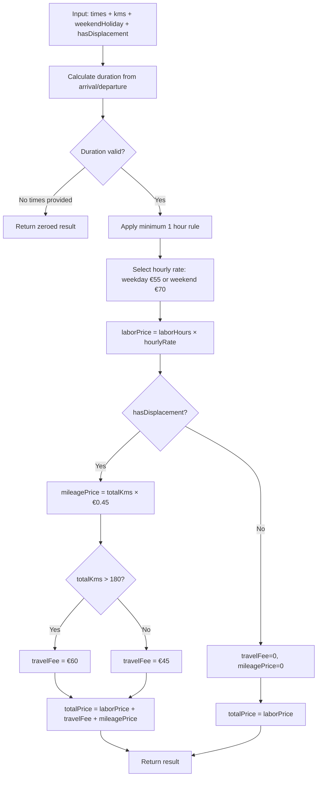
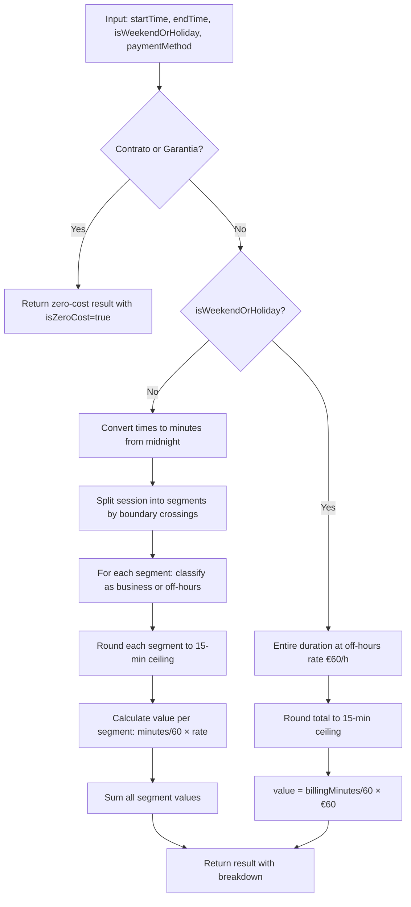

# Pricing Update (Worksheets & Remote Assistance) — Design

## 1. Pricing Constants Centralization

### Rationale

Remote Assistance already uses a centralized `REMOTE_ASSISTANCE_CONSTANTS` object in `shared/types/remote-assistance/types.ts`. Work Sheets have pricing values hardcoded inline in 4 places (shared validation + 3 Vue views). This design centralizes both to single sources of truth.

### Work Sheet Constants

**File**: `packages/shared/src/types/work-sheets/types.ts`

```typescript
export const WORK_SHEET_CONSTANTS = {
  /** Hourly rate for weekdays (€) */
  HOURLY_RATE_WEEKDAY: 55.0,
  /** Hourly rate for weekends/holidays (€) */
  HOURLY_RATE_WEEKEND_HOLIDAY: 70.0,
  /** Mileage rate per km (€) */
  MILEAGE_RATE_PER_KM: 0.45,
  /** Travel fee for distances up to 180km (€) */
  TRAVEL_FEE_SHORT: 45.0,
  /** Travel fee for distances over 180km (€) */
  TRAVEL_FEE_LONG: 60.0,
  /** Distance threshold for travel fee tiers (km) */
  TRAVEL_FEE_THRESHOLD_KM: 180,
  /** Minimum chargeable time in hours */
  MINIMUM_HOURS: 1,
  /** VAT rate */
  IVA_RATE: 0.23,
} as const;
```

### Remote Assistance Constants — Updated

**File**: `packages/shared/src/types/remote-assistance/types.ts`

Current → New:

| Constant | Current | New |
|----------|---------|-----|
| `PRICE_BUSINESS_HOURS` | 30.0 | 45.0 |
| `PRICE_AFTER_HOURS` | 45.0 | 60.0 |
| `BUSINESS_HOURS_START` | 9 | _(removed — replaced by time windows)_ |
| `BUSINESS_HOURS_END` | 18 | _(removed — replaced by time windows)_ |

New constants added:

```typescript
export const REMOTE_ASSISTANCE_CONSTANTS = {
  /** Business hours rate (€/hour) */
  PRICE_BUSINESS_HOURS: 45.0,
  /** Off-hours/weekends/holidays rate (€/hour) */
  PRICE_AFTER_HOURS: 60.0,
  /** Business hours windows (morning) */
  BUSINESS_HOURS_MORNING_START: 9 * 60,      // 09:00 in minutes
  BUSINESS_HOURS_MORNING_END: 12 * 60 + 30,  // 12:30 in minutes
  /** Business hours windows (afternoon) */
  BUSINESS_HOURS_AFTERNOON_START: 14 * 60 + 30, // 14:30 in minutes
  BUSINESS_HOURS_AFTERNOON_END: 18 * 60,        // 18:00 in minutes
  /** Billing increment in minutes */
  BILLING_INCREMENT_MINUTES: 15,
  /** VAT rate */
  IVA_RATE: 0.23,
  /** Valid billing minute intervals */
  VALID_MINUTES: [0, 15, 30, 45],
} as const;
```

**Decision: Time representation**
Options: [A] hours as integers / [B] minutes from midnight
Chosen: [B] minutes from midnight
Reason: Enables arithmetic comparisons without conversion when splitting sessions across boundaries (12:30, 14:30 are not representable as integer hours).

### Invariants

- All rate values are positive numbers > 0
- `TRAVEL_FEE_SHORT < TRAVEL_FEE_LONG`
- `HOURLY_RATE_WEEKDAY < HOURLY_RATE_WEEKEND_HOLIDAY`
- `PRICE_BUSINESS_HOURS < PRICE_AFTER_HOURS`
- Morning window end < Afternoon window start (lunch gap exists)
- `BILLING_INCREMENT_MINUTES` divides 60 evenly

### Deletions

- Remove hardcoded values `55`, `40`, `60`, `45`, `0.45` from:
  - `WorkSheetsCreateView.vue` inline functions
  - `WorkSheetsUpdateView.vue` inline functions
  - `WorkSheetsDetailView.vue` inline functions
- Remove `BUSINESS_HOURS_START` and `BUSINESS_HOURS_END` integer fields from `REMOTE_ASSISTANCE_CONSTANTS`


## 2. Work Sheet Price Calculation

### Current state

`shared/types/work-sheets/validation.ts` contains `calculateWorkSheetTotals()` which returns a breakdown object. The 3 Vue views (Create, Update, Detail) each have their own inline copies of `getDisplacementRate()`, `getHourlyRate()`, `getKmsPrice()`, `getLaborPrice()`, `getTotalPrice()` with hardcoded values.

### Target state

A single exported function in `shared/types/work-sheets/validation.ts` that all views import. The inline functions in Vue views are deleted.

### Interface

**File**: `packages/shared/src/types/work-sheets/validation.ts`

```typescript
export interface WorkSheetPricingInput {
  weekendHoliday: boolean;
  hasDisplacement: boolean;
  totalKms: number;
  arrivalTime: string;   // HH:MM format
  departureTime: string; // HH:MM format
}

export interface WorkSheetPricingResult {
  hourlyRate: number;
  laborHours: number;       // actual chargeable hours (minimum 1h applied)
  laborPrice: number;
  hasDisplacement: boolean;
  travelFee: number;        // 0 if no displacement
  mileagePrice: number;     // 0 if no displacement
  totalKms: number;
  totalPrice: number;       // laborPrice + travelFee + mileagePrice (only displacement costs when hasDisplacement)
}

export function calculateWorkSheetPricing(input: WorkSheetPricingInput): WorkSheetPricingResult;
```

### Calculation logic



### Edge cases and error handling

| Case | Behavior |
|------|----------|
| Missing arrival or departure time | Return zeroed result (all values 0) |
| Invalid time format | Return zeroed result |
| Duration < 1 hour | Charge minimum 1 hour |
| Duration exactly 0 minutes | Return zeroed result |
| `totalKms` exactly 180 | Apply short-distance fee (€45) — threshold is "over 180km" |
| `totalKms` = 0, hasDisplacement = true | travelFee applies, mileagePrice = 0 |
| `totalKms` negative | Treat as 0 |
| Departure before arrival (next day) | Handle wrap-around (add 24h to departure) |

### Deletions

Remove from each of the 3 Vue files (`WorkSheetsCreateView.vue`, `WorkSheetsUpdateView.vue`, `WorkSheetsDetailView.vue`):
- `getDisplacementRate()` function
- `getHourlyRate()` function  
- `getKmsPrice()` function
- `getLaborPrice()` function
- `getTotalPrice()` function

Replace with a single import and computed property:
```typescript
import { calculateWorkSheetPricing, WORK_SHEET_CONSTANTS } from '@clever/shared';
```

### Backward compatibility

The existing `calculateWorkSheetTotals()` function used by backend routes will be replaced by `calculateWorkSheetPricing()`. The backend route (`extractIndexFields`) will be updated to use the new function — same index field names, updated values.


## 3. Remote Assistance Price Calculation — Split Billing

### Current state

Two calculation functions exist:
1. `calculateAssistanceValueWithBusinessHours()` — simplified: if either start/end is outside 09:00-18:00, charge after-hours rate for entire duration. Used by Create/Update views.
2. `calculateAssistanceValue()` — hour-by-hour split billing. Used by Detail view and backend.

Both use a single continuous business hours window (09:00-18:00).

### Target state

A single calculation function that implements proper **minute-level split billing** across two business hour windows with a lunch gap. The simplified function is removed — all views use the same accurate split calculation.

### Interface

**File**: `packages/shared/src/types/remote-assistance/validation.ts`

```typescript
export interface RemoteAssistancePricingInput {
  startTime: string;         // HH:MM format
  endTime: string;           // HH:MM format
  isWeekendOrHoliday: boolean;
  paymentMethod?: 'Contrato' | 'Faturação' | 'Garantia' | '';
}

export interface RemoteAssistancePricingResult {
  totalValue: number;
  businessHoursValue: number;
  offHoursValue: number;
  totalMinutes: number;          // raw duration
  billingMinutes: number;        // rounded up to 15-min increments
  businessMinutes: number;       // minutes in business hours windows
  offHoursMinutes: number;       // minutes outside business hours
  isZeroCost: boolean;           // true when Contrato or Garantia
  breakdown: TimeSegment[];
}

export interface TimeSegment {
  startMinute: number;   // minutes from midnight
  endMinute: number;     // minutes from midnight
  isBusinessHours: boolean;
  rate: number;
  minutes: number;
  value: number;
}

export function calculateRemoteAssistancePricing(
  input: RemoteAssistancePricingInput
): RemoteAssistancePricingResult;
```

### Split billing algorithm



### Business hours classification

A minute `m` (from midnight) is classified as **business hours** if and only if:

```
(BUSINESS_HOURS_MORNING_START ≤ m < BUSINESS_HOURS_MORNING_END)
OR
(BUSINESS_HOURS_AFTERNOON_START ≤ m < BUSINESS_HOURS_AFTERNOON_END)
```

i.e., `(540 ≤ m < 750) OR (870 ≤ m < 1080)`

Everything else (including lunch 12:30-14:30 = minutes 750-870) is **off-hours**.

### Segment splitting algorithm

Given start minute `S` and end minute `E` on a weekday:

1. Define boundary points: `[540, 750, 870, 1080]` (09:00, 12:30, 14:30, 18:00)
2. Collect all boundaries `B` where `S < B < E`
3. Create segments: `[S, B1], [B1, B2], ..., [Bn, E]`
4. Classify each segment using the business hours rule above
5. For each segment: `minutes = endMinute - startMinute`, round up to 15-min
6. Apply rate: business = €45/h, off-hours = €60/h

**Rounding rule**: Each individual segment is billed at its rate, but the **total billing time** is rounded up to the nearest 15 minutes (not each segment individually). This means:
- Calculate raw total minutes first
- Round total up to 15-min ceiling → `billingMinutes`
- Distribute the rounded minutes proportionally across segments

**Decision: Rounding granularity**
Options: [A] Round total duration, distribute proportionally / [B] Round each segment individually
Chosen: [A] Round total duration
Reason: Matches existing behavior (single `calculateRoundedTotalHours` call on total duration) and is fairer to the client — avoids over-billing from multiple roundings.

### Edge cases and error handling

| Case | Behavior |
|------|----------|
| Missing start or end time | Return zeroed result |
| Invalid time format | Return zeroed result |
| End time before start time | Wrap-around (add 24h), treat as overnight session |
| Session entirely within morning window | 100% business rate |
| Session entirely within lunch gap | 100% off-hours rate |
| Session spanning 12:00-13:00 | Split at 12:30: business [12:00-12:30] + off-hours [12:30-13:00] |
| Session spanning 14:00-15:00 | Split at 14:30: off-hours [14:00-14:30] + business [14:30-15:00] |
| Weekend or holiday | Entire duration at off-hours rate regardless of time |
| Duration < 15 minutes | Round up to 15 minutes (minimum billing) |
| Duration exactly 0 | Return zeroed result |
| Payment method Contrato/Garantia | Return zero-cost result immediately |

### Deletions

- Remove `calculateAssistanceValueWithBusinessHours()` — replaced by the unified function
- Remove `isBusinessHours(hour: number)` helper — replaced by minute-based classification
- Remove the old hour-by-hour `calculateAssistanceValue()` — replaced by minute-level split
- Keep `calculateRoundedTotalHours()` (used for duration display, not billing)
- Keep `calculateTotalHours()` (used for raw duration display)


## 4. Frontend — Work Sheet Views (Create, Update, Detail)

### Current state

- Pricing section only shown when `hasDisplacement === true` in Create/Update views
- Detail view always shows pricing
- Each view has its own inline pricing calculation functions with hardcoded rates
- Labels reference old rates implicitly

### Target state

- Pricing section (hourly rate + labor cost) always visible in all 3 views regardless of displacement (PRICE-UX-004)
- Displacement-specific costs (travel fee, mileage) shown conditionally
- All views import and use `calculateWorkSheetPricing()` from `@clever/shared`
- Constants referenced via `WORK_SHEET_CONSTANTS`

### Component changes

#### Create & Update Views

**Visibility change**: Remove the `v-if="formData?.hasDisplacement === true"` condition from the pricing section wrapper. Replace with two sub-sections:

```vue
<!-- Always visible: Labor pricing -->
<div class="pricing-section">
  <h3>Cálculo de Preços <span class="vat-note">(sem IVA)</span></h3>
  <div class="pricing-table">
    <!-- Always shown -->
    <div class="pricing-row">
      <span class="pricing-label">Valor Hora:
        <span class="pricing-detail">{{ pricing.weekendHoliday ? 'Fim de semana / Feriado' : 'Semana' }}</span>
      </span>
      <span class="pricing-value">{{ pricing.hourlyRate }}€</span>
    </div>
    <div class="pricing-row">
      <span class="pricing-label">Preço Mão Obra:
        <span class="pricing-detail">{{ pricing.laborHours }}h × {{ pricing.hourlyRate }}€</span>
      </span>
      <span class="pricing-value">{{ pricing.laborPrice }}€</span>
    </div>

    <!-- Conditional: displacement costs -->
    <template v-if="pricing.hasDisplacement">
      <div class="pricing-row">
        <span class="pricing-label">Taxa Deslocação:</span>
        <span class="pricing-value">{{ pricing.travelFee }}€</span>
      </div>
      <div class="pricing-row">
        <span class="pricing-label">Preço KMs:
          <span class="pricing-detail">{{ pricing.totalKms }} km × {{ WORK_SHEET_CONSTANTS.MILEAGE_RATE_PER_KM }}€</span>
        </span>
        <span class="pricing-value">{{ pricing.mileagePrice }}€</span>
      </div>
    </template>

    <!-- Always shown -->
    <div class="pricing-row total">
      <span class="pricing-label">PREÇO TOTAL:</span>
      <span class="pricing-value">{{ pricing.totalPrice }}€ <span class="vat-indicator">sem IVA</span></span>
    </div>
  </div>
</div>
```

**Script logic**: Single computed property:

```typescript
import { calculateWorkSheetPricing, WORK_SHEET_CONSTANTS } from '@clever/shared';

const pricing = computed(() => {
  return calculateWorkSheetPricing({
    weekendHoliday: formData.value?.weekendHoliday ?? false,
    hasDisplacement: formData.value?.hasDisplacement ?? false,
    totalKms: formData.value?.totalKms ?? 0,
    arrivalTime: formData.value?.arrivalTime ?? '',
    departureTime: formData.value?.departureTime ?? '',
  });
});
```

#### Detail View

Same pattern — replace the existing inline functions with:

```typescript
const pricing = computed(() => {
  if (!item.value?.data) return null;
  return calculateWorkSheetPricing({
    weekendHoliday: item.value.data.displacement?.weekendHoliday ?? false,
    hasDisplacement: item.value.data.displacement?.hasDisplacement ?? false,
    totalKms: item.value.data.displacement?.totalKms ?? 0,
    arrivalTime: item.value.data.request?.arrivalTime ?? '',
    departureTime: item.value.data.request?.departureTime ?? '',
  });
});
```

### Slot placement

The pricing section currently uses `#after-section-displacement` slot. With the "always visible" requirement:
- Move pricing display to `#after-section-request` slot (appears after the time/date section)
- This ensures pricing shows even when displacement section is collapsed or disabled

### Error state

When `calculateWorkSheetPricing` returns zeroed result (missing times):
- Show the hourly rate row with the applicable rate value
- Show labor and total as "—" or "0,00€"
- Do not hide the section — user sees which rate will apply once times are entered


## 5. Frontend — Remote Assistance Views (Create, Update, Detail)

### Current state

- Pricing note displays: `"30€/hora (09:00-18:00) | 45€/hora (outras horas) - sem IVA"`
- Breakdown distinguishes "Horário Comercial (09:00-18:00)" vs "Fora do Horário Comercial"
- Create/Update use `calculateAssistanceValueWithBusinessHours()` (simplified)
- Detail uses `calculateAssistanceValue()` (hour-by-hour)

### Target state

- All 3 views use the unified `calculateRemoteAssistancePricing()`
- Updated pricing note: `"€45/hora (09:00-12:30, 14:30-18:00) | €60/hora (outras horas) + IVA"`
- Breakdown shows new time windows with lunch gap distinction

### Pricing note update (PRICE-AC-010)

All 3 views share the same pricing note text. Replace the current note with:

```vue
<span class="text-sm text-gray-600">
  💶 Preço: {{ REMOTE_ASSISTANCE_CONSTANTS.PRICE_BUSINESS_HOURS }}€/hora
  (09:00-12:30, 14:30-18:00) |
  {{ REMOTE_ASSISTANCE_CONSTANTS.PRICE_AFTER_HOURS }}€/hora (outras horas) + IVA
</span>
```

### Breakdown labels update (PRICE-UX-002)

Current labels → New labels:

| Current | New |
|---------|-----|
| "Horário Comercial (09:00-18:00)" | "Horário Comercial (09:00-12:30, 14:30-18:00)" |
| "Fora do Horário Comercial" | "Fora do Horário Comercial (inclui 12:30-14:30)" |

### Script logic — Create & Update Views

Replace the current calculation calls:

```typescript
import { calculateRemoteAssistancePricing, REMOTE_ASSISTANCE_CONSTANTS } from '@clever/shared';

const pricingResult = computed(() => {
  return calculateRemoteAssistancePricing({
    startTime: formData.value?.startTime ?? '',
    endTime: formData.value?.endTime ?? '',
    isWeekendOrHoliday: formData.value?.weekendHoliday ?? false,
    paymentMethod: formData.value?.paymentMethod ?? '',
  });
});

// For valorAssist field (stored value) — watcher remains
watch(
  () => [formData.value?.startTime, formData.value?.endTime, formData.value?.paymentMethod, formData.value?.weekendHoliday],
  () => {
    const result = pricingResult.value;
    updateFieldValue('valorAssist', result.totalValue);
  }
);
```

### Script logic — Detail View

```typescript
const pricingResult = computed(() => {
  if (!item.value?.data) return null;
  return calculateRemoteAssistancePricing({
    startTime: item.value.data.startTime ?? '',
    endTime: item.value.data.endTime ?? '',
    isWeekendOrHoliday: item.value.data.weekendHoliday ?? false,
    paymentMethod: item.value.data.paymentMethod ?? '',
  });
});
```

### Breakdown display template

```vue
<div v-if="pricingResult && !pricingResult.isZeroCost" class="pricing-breakdown">
  <div class="pricing-table">
    <div v-if="pricingResult.businessMinutes > 0" class="pricing-row">
      <span class="pricing-label">Horário Comercial (09:00-12:30, 14:30-18:00):</span>
      <span class="pricing-value">
        {{ formatMinutesAsHours(pricingResult.businessMinutes) }} ×
        {{ formatCurrency(REMOTE_ASSISTANCE_CONSTANTS.PRICE_BUSINESS_HOURS) }}/h =
        {{ formatCurrency(pricingResult.businessHoursValue) }}
      </span>
    </div>
    <div v-if="pricingResult.offHoursMinutes > 0" class="pricing-row">
      <span class="pricing-label">Fora do Horário Comercial (inclui 12:30-14:30):</span>
      <span class="pricing-value">
        {{ formatMinutesAsHours(pricingResult.offHoursMinutes) }} ×
        {{ formatCurrency(REMOTE_ASSISTANCE_CONSTANTS.PRICE_AFTER_HOURS) }}/h =
        {{ formatCurrency(pricingResult.offHoursValue) }}
      </span>
    </div>
    <div class="pricing-row total">
      <span class="pricing-label">VALOR TOTAL:</span>
      <span class="pricing-value">{{ formatCurrency(pricingResult.totalValue) }}</span>
    </div>
  </div>
</div>
```

### Zero-cost notice (unchanged behavior)

The existing Contract/Warranty notice remains identical in structure. The `isZeroCost` flag from the pricing result controls its visibility:

```vue
<div v-if="pricingResult?.isZeroCost" class="no-charge-notice">
  <!-- existing green check icon + text -->
  <span class="text-green-700 font-medium">
    Assistência coberta por {{ formData?.paymentMethod?.toLowerCase() }} - Sem custo
  </span>
</div>
```

### Deletions

- Remove imports of `calculateAssistanceValueWithBusinessHours` from Create/Update views
- Remove imports of `calculateAssistanceValue` from Detail view
- Remove `pricingBreakdown` computed properties that use old functions
- Remove old `formatHours()` helper if replaced by `formatMinutesAsHours()`


## 6. Contract/Warranty Zero-Cost Handling

### Current behavior (preserved)

Both content types already handle Contrato/Garantia payment methods:
- **Remote Assistance**: `calculateAssistanceValueWithBusinessHours()` returns zeroed result when paymentMethod is `'Contrato'` or `'Garantia'`
- **Work Sheets**: The `paymentMethod` field in displacement data can be `'CONTRATO'` or `'GARANTIA'` — pricing section shows values but the cost is covered by the contract

### Design decision — no changes to zero-cost logic

The new calculation functions preserve existing zero-cost behavior:

| Content Type | Payment Method | Behavior |
|--------------|---------------|----------|
| Remote Assistance | `Contrato` or `Garantia` | `isZeroCost = true`, `totalValue = 0`, breakdown empty |
| Remote Assistance | `Faturação` or empty | Normal pricing calculation applies |
| Work Sheet | `CONTRATO` or `GARANTIA` | Pricing calculated and displayed (informational) — no stored invoice amount |
| Work Sheet | Other methods | Pricing calculated and displayed |

### Verification scope

No new code needed for this section. During implementation, verify:
1. `calculateRemoteAssistancePricing()` returns `isZeroCost: true` and zeroed values for Contrato/Garantia
2. `calculateWorkSheetPricing()` always returns calculated values (Work Sheets don't suppress pricing for contract payment — they show it for reference)
3. Frontend zero-cost notice renders correctly with new function output
4. Switching payment method in Create/Update views triggers recalculation watcher

### Edge case: Payment method change mid-session

When user selects `Contrato` → sees zero-cost notice → changes to `Faturação`:
- Watcher fires → recalculates with new payment method → pricing breakdown appears
- No stale state: computed property reacts to `paymentMethod` change immediately


## Appendix: Backend Index Extraction — Interface

### Work Sheet `extractIndexFields`

**File**: `packages/backend/src/routes/work-sheets.ts`

Called during content creation/update to store precomputed pricing in the search index.

**Input**: `WorkSheetData` object (the `data` field of the stored R2 document)

**Output** (stored in index):

```typescript
interface WorkSheetIndexPricing {
  displacementRate: number;  // travel fee applied (0 if no displacement)
  kmsPrice: number;          // mileage cost (0 if no displacement)
  hourlyRate: number;        // applicable rate (€55 or €70)
  laborPrice: number;        // hours × rate
  totalPrice: number;        // sum of all costs
}
```

**Error handling**:
- If `calculateWorkSheetPricing()` receives invalid/missing data → returns zeroed result → index stores zeros
- No HTTP error possible — function is called during the existing write flow, never fails independently
- If the entire write operation fails → standard R2 error propagation (500), index not updated

### Remote Assistance `extractIndexFields`

**File**: `packages/backend/src/routes/remote-assistance.ts`

**Input**: `RemoteAssistanceData` object

**Output** (stored in index):

```typescript
interface RemoteAssistanceIndexPricing {
  businessHoursValue: number;
  afterHoursValue: number;
  valorAssist: number;       // total value
  hasBillableValue: boolean; // true when paymentMethod = 'Faturação' and value > 0
}
```

**Error handling**:
- If `calculateRemoteAssistancePricing()` receives invalid/missing data → returns zeroed result → index stores zeros
- No HTTP error possible — same flow as WS above
- `hasBillableValue` uses existing helper logic: `paymentMethod === 'Faturação' && valorAssist > 0`

### `/api/content/remote-assistance/calculate-value` endpoint

Existing POST endpoint — no schema change needed. Input/output unchanged, but internal calculation now uses `calculateRemoteAssistancePricing()`:

**Request**: `{ startTime: string, endTime: string, paymentMethod?: string, weekendHoliday?: boolean }`

**Response 200**: `{ totalValue: number, businessHoursValue: number, afterHoursValue: number, totalHours: number, businessHours: number, afterHours: number, breakdown: TimeSegment[] }`

**Response 400**: `{ error: "Start time and end time are required" }` — when missing inputs

**Response 500**: Standard Hono error — unexpected failure
