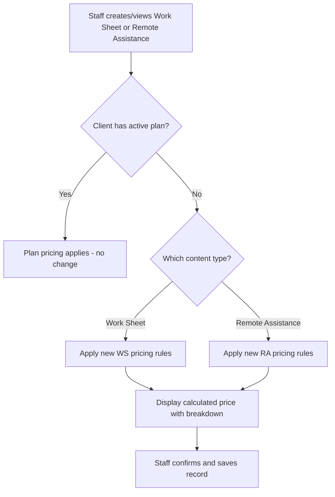
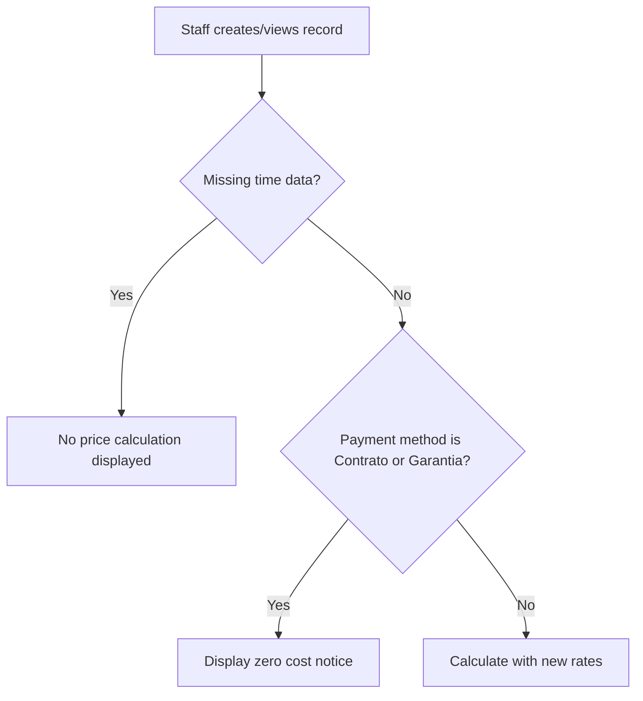

# Pricing Update (Worksheets & Remote Assistance) - Requirements

## Epic
[ ] **PRICE-E-001**: **As a** staff member managing work sheets and remote assistance records **I want** the system to reflect the updated pricing rules for non-subscribed clients **So that** billing calculations are accurate and consistent with the new company rates

## User Flow

### Passing Cases Flow
[ ] Passing flow diagram

### Non-Passing Cases Flow
[ ] Non-passing flow diagram

## Business Rules

[ ] **PRICE-BR-001**: Work Sheet weekday hourly rate SHALL be €55.00 (previously €45.00)
[ ] **PRICE-BR-002**: Work Sheet weekend/holiday hourly rate SHALL be €70.00 (previously €60.00)
[ ] **PRICE-BR-003**: Work Sheet mileage rate SHALL be €0.45/km (unchanged)
[ ] **PRICE-BR-004**: Work Sheet travel fee SHALL be €45.00 for distances up to 180km (previously €40.00)
[ ] **PRICE-BR-005**: Work Sheet travel fee SHALL be €60.00 for distances over 180km (previously €55.00)
[ ] **PRICE-BR-006**: Remote Assistance business hours rate SHALL be €45.00/hour (previously €30.00), applicable Mon–Fri 9:00–12:30 and 14:30–18:00
[ ] **PRICE-BR-007**: Remote Assistance off-hours/weekends/holidays rate SHALL be €60.00/hour (previously €45.00)
[ ] **PRICE-BR-008**: Remote Assistance business hours window SHALL be Mon–Fri 9:00–12:30 and 14:30–18:00 (previously 09:00–18:00 continuous). The lunch period (12:30–14:30) SHALL be billed at the off-hours rate.
[ ] **PRICE-BR-009**: VAT at 23% SHALL apply to all pricing values for both content types
[ ] **PRICE-BR-010**: Remote Assistance time billing SHALL remain in 15-minute increments rounded up
[ ] **PRICE-BR-011**: Work Sheet minimum chargeable time SHALL remain 1 hour
[ ] **PRICE-BR-012**: Remote Assistance split billing: WHEN a session crosses business/off-hours boundaries, each time segment SHALL be billed at its applicable rate independently

## UI/UX Requirements

[ ] **PRICE-UX-001**: The pricing note displayed in Remote Assistance views SHALL reflect the new rates and time windows
[ ] **PRICE-UX-002**: The pricing breakdown in Remote Assistance views SHALL distinguish between business hours (9:00–12:30, 14:30–18:00) and off-hours periods
[ ] **PRICE-UX-003**: Work Sheet pricing display SHALL show the updated rates in the calculation section
[ ] **PRICE-UX-004**: Work Sheet hourly rate and labor cost SHALL always be visible regardless of whether displacement is enabled

## User Stories

### Story: Pricing calculation for Work Sheets
[ ] **PRICE-S-001**: **As a** staff member creating a Work Sheet **I want** the system to calculate costs using the new rates **So that** the client is billed correctly

#### Acceptance Criteria
[ ] **PRICE-AC-001**: **WHEN** a Work Sheet is created or viewed for a non-subscribed client on a weekday, the system **SHALL** use €55.00/hour for labor calculation
[ ] **PRICE-AC-002**: **WHEN** a Work Sheet is created or viewed for a non-subscribed client on a weekend or holiday, the system **SHALL** use €70.00/hour for labor calculation
[ ] **PRICE-AC-003**: **WHEN** a Work Sheet includes displacement up to 180km, the system **SHALL** apply a €45.00 travel fee
[ ] **PRICE-AC-004**: **WHEN** a Work Sheet includes displacement over 180km, the system **SHALL** apply a €60.00 travel fee
[ ] **PRICE-AC-005**: The system **SHALL** calculate mileage cost at €0.45 per km traveled
[ ] **PRICE-AC-012**: The system **SHALL** display hourly rate and labor cost calculation in Work Sheet views regardless of whether displacement is enabled

### Story: Pricing calculation for Remote Assistance
[ ] **PRICE-S-002**: **As a** staff member creating a Remote Assistance record **I want** the system to calculate costs using the new rates and time windows **So that** billing accurately reflects business hours vs off-hours

#### Acceptance Criteria
[ ] **PRICE-AC-006**: **WHEN** a Remote Assistance session occurs entirely within business hours (Mon–Fri 9:00–12:30 or 14:30–18:00), the system **SHALL** charge €45.00/hour
[ ] **PRICE-AC-007**: **WHEN** a Remote Assistance session occurs outside business hours (weekends, holidays, or outside 9:00–12:30 / 14:30–18:00 on weekdays), the system **SHALL** charge €60.00/hour
[ ] **PRICE-AC-008**: **WHEN** a Remote Assistance session spans both business hours and off-hours periods (including the 12:30–14:30 lunch gap), the system **SHALL** split the duration and apply the respective rate to each portion independently
[ ] **PRICE-AC-009**: The system **SHALL** round billing time up to the next 15-minute interval
[ ] **PRICE-AC-010**: The system **SHALL** display a pricing note showing "€45/hora (09:00-12:30, 14:30-18:00) | €60/hora (outras horas) + IVA"

### Story: Contract/Warranty coverage
[ ] **PRICE-S-003**: **As a** staff member **I want** the system to show zero cost when payment is covered by contract or warranty **So that** no incorrect billing is generated

#### Acceptance Criteria
**Common Behavior** (see Story 1 and 2):
[ ] Applies: PRICE-AC-001 through PRICE-AC-009

**Coverage-Specific Behavior**:
[ ] **PRICE-AC-011**: **WHEN** the payment method is "Contrato" or "Garantia", the system **SHALL** display a zero-cost notice and skip pricing calculation

## Dependencies & Integration Requirements
**Internal**: Pricing constants configuration, Work Sheet views (Create, Update, Detail), Remote Assistance views (Create, Update, Detail), price calculation service
**External**: None

## Excluded Scope
- Plan pricing logic (only non-subscribed clients are affected)
- Client management or contract management changes
- Historical record repricing (existing records keep their original calculated values)
- VAT rate changes (remains 23%)
- Changes to payment method options
