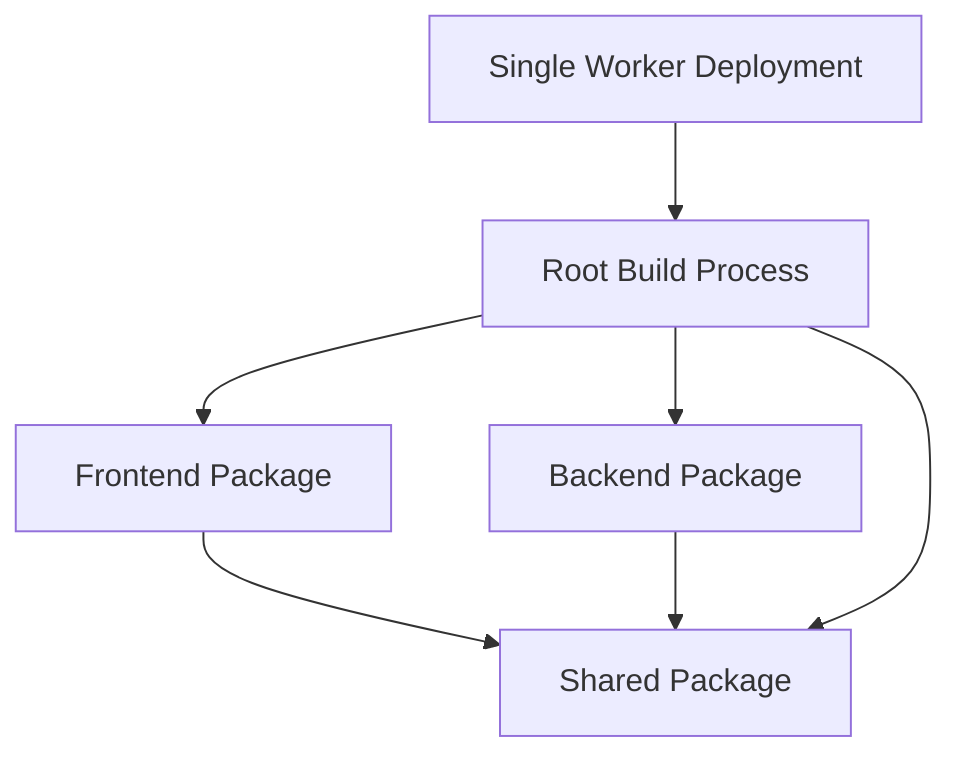

# Design Document

## Overview

This design outlines the architecture and implementation approach for initializing a monorepo-based CLEVER internal dashboard application. The system combines a Vue 3 frontend with a Hono API backend, deployed as a single Cloudflare Worker with shared TypeScript types ensuring type safety across all packages.

The design follows the established technical constraints and architecture patterns, creating a foundation that supports incremental feature growth while maintaining simplicity and avoiding over-engineering.

## Architecture

### Monorepo Structure

The project uses npm workspaces to manage a monorepo with three main packages:

```
clever-root/
├── packages/
│   ├── shared/           # Shared types and utilities
│   ├── frontend/         # Vue 3 application
│   └── backend/          # Hono API server
├── package.json          # Root workspace configuration
├── tsconfig.json         # Root TypeScript configuration
├── wrangler.toml         # Cloudflare deployment configuration
└── dist/                 # Build output directory
```

### Package Dependencies



### TypeScript Project References

The monorepo uses TypeScript project references to enforce proper dependency boundaries and enable incremental compilation:

- **Root tsconfig.json**: Orchestrates all packages with project references
- **Package-level tsconfig.json**: Each package has its own configuration with composite mode enabled
- **Build tsconfig.json**: Separate configuration for production builds

## Components and Interfaces

### Shared Package (`packages/shared`)

**Purpose**: Centralized type definitions and utilities shared between frontend and backend.

**Key Components**:

1. **BaseContent Interface**
```typescript
interface BaseContent {
  uuid: string;
  contentType: string;
  createdAt: string;
  createdBy: string;
  updatedAt: string;
  updatedBy: string;
  version: number;
  isDeleted: boolean;
  deletedAt?: string;
  deletedBy?: string;
  data: Record<string, any>;
}
```

2. **Content Type Interfaces**
```typescript
interface Client extends BaseContent {
  data: {
    name: string;
    email: string;
    // Additional client-specific fields
  };
}

interface Contract extends BaseContent {
  data: {
    clientId: string;
    title: string;
    // Additional contract-specific fields
  };
}
// Similar interfaces for all content types
```

3. **API Types**
```typescript
interface ApiResponse<T> {
  success: boolean;
  data?: T;
  error?: string;
  timestamp: string;
}

interface ListResponse<T> extends ApiResponse<T[]> {
  pagination: {
    page: number;
    limit: number;
    total: number;
  };
}
```

4. **Utility Types**
```typescript
type ContentType = 'clients' | 'contracts' | 'licenses' | 'work-sheets' | 
                   'daily-records' | 'remote-assistance' | 'reminders' | 'pending';

type CreateContentRequest<T extends BaseContent> = Omit<T, 
  'uuid' | 'createdAt' | 'createdBy' | 'updatedAt' | 'updatedBy' | 'version' | 'isDeleted'>;

type UpdateContentRequest<T extends BaseContent> = Partial<Pick<T, 'data'>>;
```

### Frontend Package (`packages/frontend`)

**Purpose**: Vue 3 single-page application with TailwindCSS styling.

**Key Components**:

1. **Main Application Structure**
```
src/
├── main.ts              # Application entry point
├── App.vue              # Root component
├── router/
│   └── index.ts         # Vue Router configuration
├── stores/
│   └── index.ts         # Pinia store setup
├── components/
│   ├── layout/
│   │   ├── AppLayout.vue
│   │   └── AppNavigation.vue
│   └── common/
│       └── ErrorBoundary.vue
├── views/
│   ├── HomeView.vue
│   ├── ClientsView.vue
│   └── [ContentType]View.vue
└── services/
    └── api.ts           # API client using shared types
```

2. **API Service Layer**
```typescript
import type { ApiResponse, ListResponse, Client, Contract } from '@clever/shared';

class ApiService {
  private baseUrl = '/api';

  async getContent<T>(type: ContentType): Promise<ListResponse<T>> {
    // Implementation using shared types
  }

  async createContent<T>(type: ContentType, data: CreateContentRequest<T>): Promise<ApiResponse<T>> {
    // Implementation using shared types
  }
}
```

3. **Vue Router Configuration**
```typescript
const routes = [
  { path: '/', component: HomeView },
  { path: '/clients', component: ClientsView },
  { path: '/contracts', component: ContractsView },
  // Routes for all content types
];
```

### Backend Package (`packages/backend`)

**Purpose**: Hono-based API server with middleware for static asset serving and SPA fallback.

**Key Components**:

1. **Main Application Structure**
```
src/
├── index.ts             # Worker entry point
├── app.ts               # Hono app configuration
├── routes/
│   ├── api.ts           # API route handlers
│   └── content.ts       # Content-specific routes
├── middleware/
│   ├── cors.ts          # CORS configuration
│   ├── error.ts         # Error handling
│   └── static.ts        # Static asset serving
└── services/
    └── content.ts       # Content management logic
```

2. **Route Structure**
```typescript
import { Hono } from 'hono';
import type { ApiResponse, BaseContent, ContentType } from '@clever/shared';

const api = new Hono();

// CRUD endpoints for all content types
api.get('/content/:type', async (c) => {
  // List content with pagination and filtering
});

api.get('/content/:type/:uuid', async (c) => {
  // Get single content item
});

api.post('/content/:type', async (c) => {
  // Create new content item
});

api.put('/content/:type/:uuid', async (c) => {
  // Update existing content item
});

api.delete('/content/:type/:uuid', async (c) => {
  // Soft delete content item
});
```

3. **Static Asset Middleware**
```typescript
import { serveStatic } from 'hono/cloudflare-workers';

app.use('/*', serveStatic({ 
  root: './',
  getContent: (path) => {
    // Serve from KV binding
    return env.ASSETS.get(path);
  }
}));

// SPA fallback for client-side routing
app.get('*', async (c) => {
  const indexHtml = await env.ASSETS.get('index.html');
  return c.html(indexHtml);
});
```

## Data Models

### Content Storage Pattern

All content follows the BaseContent interface pattern with audit trail fields and a flexible data property for content-specific fields.

### R2 Storage Structure

```
R2 Bucket: clever-dashboard-{env}
├── content/
│   ├── clients/
│   │   └── clients-{uuid}.json
│   ├── contracts/
│   │   └── contracts-{uuid}.json
│   └── [other content types]/
├── indexes/
│   ├── clients-index.json
│   └── [other content type indexes]
└── migrations/
    └── [migration files]
```

### KV Storage Structure

```
KV Namespace: ASSETS_{ENV}
├── index.html
├── assets/
│   ├── index-{hash}.js
│   ├── index-{hash}.css
│   └── [other static assets]
└── [Vue build artifacts]
```

## Correctness Properties

*A property is a characteristic or behavior that should hold true across all valid executions of a system—essentially, a formal statement about what the system should do. Properties serve as the bridge between human-readable specifications and machine-verifiable correctness guarantees.*

Let me analyze the acceptance criteria for testability:

Based on the prework analysis, most acceptance criteria involve configuration verification and setup validation, which are best tested through unit tests. However, two universal properties emerge:

**Property 1: Type Sharing Consistency**
*For any* type modification in the shared package, both frontend and backend packages should have access to the updated types after compilation.
**Validates: Requirements 2.5**

**Property 2: Build Artifact Generation**
*For any* valid project state, the build process should produce a single deployable Worker artifact that contains both frontend assets and backend code.
**Validates: Requirements 6.6**

## Error Handling

### Build-Time Error Handling

1. **TypeScript Compilation Errors**
   - Project references ensure proper dependency resolution
   - Strict mode catches type errors early
   - Incremental compilation provides fast feedback

2. **Package Dependency Errors**
   - Workspace configuration validates package relationships
   - Missing dependencies fail fast during installation
   - Version conflicts are resolved at the workspace level

3. **Configuration Validation**
   - Wrangler validates deployment configuration
   - ESLint catches code quality issues
   - Prettier ensures consistent formatting

### Runtime Error Handling

1. **API Error Responses**
   - Standardized error response format using shared types
   - HTTP status codes follow REST conventions
   - Error middleware catches and formats unhandled exceptions

2. **Frontend Error Boundaries**
   - Vue error handling for component failures
   - API request error handling with user feedback
   - Graceful degradation for network issues

3. **Development Environment Errors**
   - Clear error messages for configuration issues
   - Hot reload error recovery
   - TypeScript error reporting in development

## Testing Strategy

### Dual Testing Approach

The testing strategy combines unit tests for specific configurations and property-based tests for universal behaviors:

**Unit Tests**:
- Configuration verification (package.json, tsconfig.json, wrangler.toml)
- Component existence and structure validation
- API endpoint definition verification
- Build output validation
- Development tooling setup verification

**Property-Based Tests**:
- Type sharing consistency across package modifications
- Build process reliability across different project states
- Each property test runs minimum 100 iterations
- Tests tagged with: **Feature: project-initialization, Property {number}: {property_text}**

### Testing Framework Configuration

**Frontend Testing**:
- Vitest for unit tests and component testing
- Vue Test Utils for component testing
- Property-based testing using fast-check library

**Backend Testing**:
- Vitest for unit tests and API testing
- Hono test utilities for request/response testing
- Property-based testing using fast-check library

**Integration Testing**:
- End-to-end build process validation
- Cross-package type sharing verification
- Development server functionality testing

### Test Organization

```
packages/
├── shared/
│   ├── src/
│   └── tests/
│       ├── types.test.ts
│       └── exports.test.ts
├── frontend/
│   ├── src/
│   └── tests/
│       ├── components/
│       ├── router.test.ts
│       └── api.test.ts
└── backend/
    ├── src/
    └── tests/
        ├── routes/
        ├── middleware.test.ts
        └── app.test.ts
```

### Property Test Implementation

Each correctness property will be implemented as a separate property-based test:

1. **Property 1 Test**: Modify shared types, rebuild packages, verify both frontend and backend can import and use updated types
2. **Property 2 Test**: Generate various valid project configurations, run build process, verify single Worker artifact is produced with correct structure

The property tests will use TypeScript compilation APIs and file system operations to validate the universal behaviors across many generated scenarios.