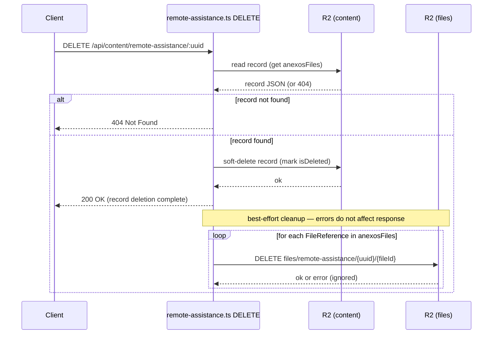
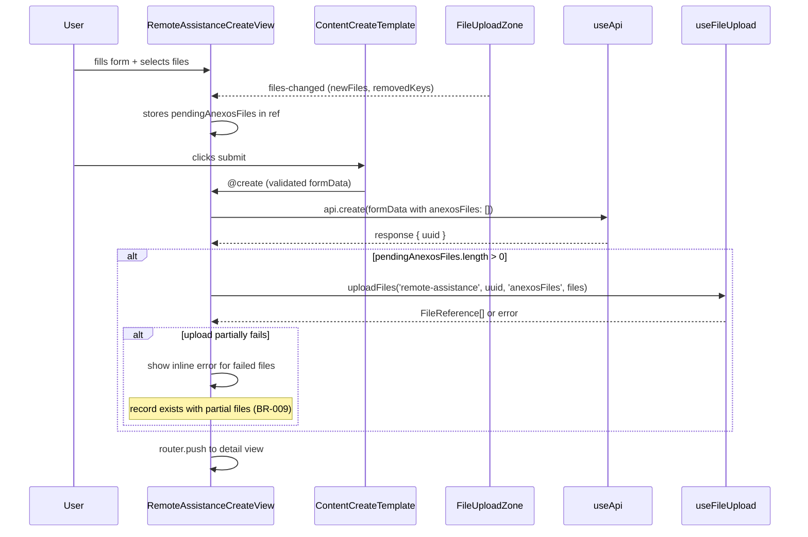
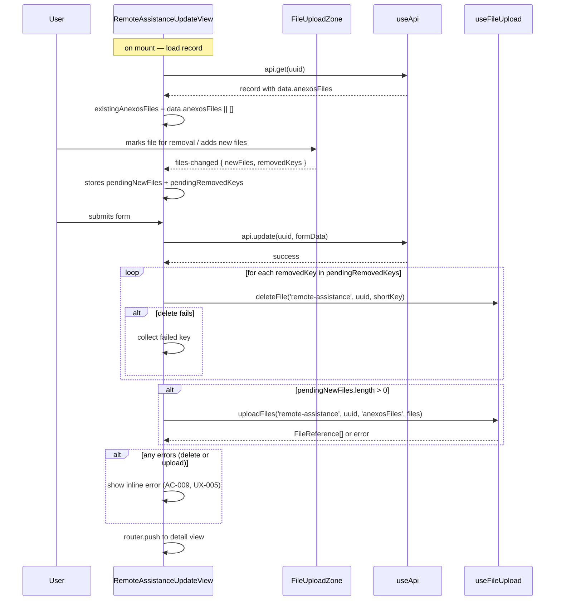

# Remote Assistance — Anexos Refactor — Design

## Section 1: Data Model

### 1.1 New field — `RemoteAssistanceData.anexosFiles`

The existing `anexos: string` field is **preserved as-is** — it remains a free-text textarea for notes. A new, separate field `anexosFiles` is added to hold file attachments.

**File:** `packages/shared/src/types/remote-assistance/types.ts`

```typescript
import type { BaseContent } from '../base';
import type { TechnicianUser } from '../../types';
import type { FileReference } from '../../file-validation';  // ADD

export interface RemoteAssistanceData {
  // ... all existing fields unchanged ...

  // Existing — free-text notes, preserved as-is
  anexos: string;

  // New — structured file attachments
  anexosFiles: FileReference[];
}
```

**`FileReference` schema** (already defined in `packages/shared/src/file-validation.ts`, no changes):

```typescript
interface FileReference {
  key: string;      // R2 full key — e.g. "files/remote-assistance/{uuid}/{fileId}.jpg"
  name: string;     // original filename
  mimeType: string; // e.g. "image/jpeg", "application/pdf"
  size: number;     // bytes
}
```

**Invariants for `anexosFiles`:**
- Always an array — never `null`, never `undefined`. Default: `[]`.
- Each element must have all four fields (`key`, `name`, `mimeType`, `size`) present and non-empty.
- `size` must be > 0 and ≤ 10 485 760 (10 MB).
- `mimeType` must be one of the values in `ACCEPTED_MIME_TYPES` from `file-validation.ts`.
- `key` must follow the pattern `files/remote-assistance/{uuid}/{fileId}.{ext}`.
- Array length has no enforced upper bound (BR-004).

**Edge cases:**
- `anexosFiles` absent from a stored record (old records): treated as `[]` at read time — no migration needed.
- Empty array `[]` is valid — record with no file attachments (BR-001, AC-004).
- `anexos` string remains independent; it is not affected by file operations.

### 1.2 Downstream type propagation

`RemoteAssistanceCreationData` and `RemoteAssistanceUpdateData` both extend `RemoteAssistanceData` (via `Omit` and `Partial` respectively). Adding `anexosFiles` to `RemoteAssistanceData` propagates automatically. No structural changes needed to those interfaces beyond ensuring `anexosFiles` defaults to `[]` in creation data.

### 1.3 Missing field guard

Old records in R2 will not have `anexosFiles`. A simple fallback is applied wherever the field is read:

```typescript
const files: FileReference[] = Array.isArray(data.anexosFiles) ? data.anexosFiles : [];
```

This one-liner is inlined at the two read sites (backend route validation default, frontend view data loading). No shared utility needed.

**Decision: field naming**
Options: [A] Replace `anexos: string` with `anexos: FileReference[]` / [B] Keep `anexos: string`, add `anexosFiles: FileReference[]`
Chosen: B — additive, no migration, text notes preserved
Reason: Existing records and the textarea UX are unaffected; files live in a clearly distinct field.

## Section 2: Backend — Type Fix & Delete Cleanup

### 2.1 Validation default fix

**File:** `packages/backend/src/routes/remote-assistance.ts`

In `validateRemoteAssistanceCreate()`, the object built for `RemoteAssistanceCreationData` currently sets `anexos: remoteAssistanceData.anexos || ''`. Two changes:

```typescript
// Before
const remoteAssistanceCreationData: RemoteAssistanceCreationData = {
  // ...
  anexos: remoteAssistanceData.anexos || '',
  // anexosFiles not present
};

// After
const remoteAssistanceCreationData: RemoteAssistanceCreationData = {
  // ...
  anexos: remoteAssistanceData.anexos || '',                                    // unchanged
  anexosFiles: Array.isArray(remoteAssistanceData.anexosFiles)                  // ADD
    ? remoteAssistanceData.anexosFiles
    : [],
};
```

Same pattern applies to the update path wherever `RemoteAssistanceUpdateData` is assembled — `anexosFiles` defaults to `[]` if absent or not an array.

No validation logic is added for `anexosFiles` content in the route — file-level validation (type, size) is handled by the generic `file-routes.ts` at upload time.

### 2.2 Custom DELETE handler — best-effort file cleanup

The generic `content-route-template` DELETE does not clean up R2 files. The Remote Assistance route already has a custom POST handler (for balance integration). A custom DELETE handler is added alongside it.

**Decision: file cleanup on delete**
Options: [A] Custom DELETE handler with best-effort R2 cleanup / [B] No cleanup (match IP pattern, accept orphaned files)
Chosen: A — required by BR-005, AC-014, AC-015
Reason: The spec explicitly mandates best-effort cleanup; failure must not block the record deletion.

**Sequence:**



**Key behaviors:**
- The `200 OK` response is sent **before** file cleanup attempts — record deletion is never blocked by file cleanup (AC-015).
- File cleanup errors are logged (`console.error`) but swallowed.
- If `anexosFiles` is empty or absent, no R2 calls are made.
- The handler reads the record first to obtain the file list, then delegates the soft-delete to the existing storage utility, then fires cleanup.

**File:** `packages/backend/src/routes/remote-assistance.ts`

```typescript
// Custom DELETE handler — replaces generic template DELETE for this route
app.delete('/:uuid', clerkMiddleware, permissionsMiddleware, async (c) => {
  const uuid = c.req.param('uuid');
  const env = c.env as Env;

  // 1. Read record to get file list before deletion
  const record = await storage.get('remote-assistance', uuid, env)
    .catch(() => null);

  if (!record || record.isDeleted) {
    return c.json({ error: { message: 'Not found' } }, 404);
  }

  const anexosFiles: FileReference[] = Array.isArray(record.data?.anexosFiles)
    ? record.data.anexosFiles
    : [];

  // 2. Soft-delete the record
  await storage.softDelete('remote-assistance', uuid, env, c.get('userContext'));

  // 3. Best-effort file cleanup — response already committed conceptually
  for (const fileRef of anexosFiles) {
    await env.R2.delete(fileRef.key)
      .catch((err: Error) => {
        console.error('File cleanup failed during record delete:', JSON.stringify({
          uuid,
          key: fileRef.key,
          error: err.message,
        }, null, 2));
      });
  }

  return c.json({ data: { success: true } });
});
```

### 2.3 No other backend changes

The generic file routes (`POST /api/content/{type}/{uuid}/files` and `DELETE /api/content/{type}/{uuid}/files/{fileKey}`) already support any content type including `remote-assistance`. They handle:
- Multipart upload → R2 store → update content JSON field by dot-notation name (`anexosFiles`)
- Single file delete → R2 delete → remove reference from content JSON array

No changes needed to `file-routes.ts`.

## Section 3: Frontend — Create Form

### 3.1 Overview

**File:** `packages/frontend/src/views/remote-assistance/RemoteAssistanceCreateView.vue`

The Create form uses `ContentCreateTemplate` with custom slot templates. A `FileUploadZone` is added in a new "Anexos" section for file attachments. The existing `anexos` textarea field remains unchanged.

### 3.2 Component integration



### 3.3 Implementation details

**Imports to add:**
```typescript
import FileUploadZone from '@/components/common/FileUploadZone.vue';
import { useFileUpload } from '@/composables/useFileUpload';
```

**State:**
```typescript
const { uploadFiles, uploading, error: uploadError } = useFileUpload();
const pendingAnexosFiles = ref<File[]>([]);
```

**Event handler:**
```typescript
const handleAnexosFilesChanged = (payload: { fieldName: string; newFiles: File[]; removedKeys: string[] }) => {
  pendingAnexosFiles.value = payload.newFiles;
};
```

**Template — FileUploadZone placement:**

Added as a custom section after the existing form fields (before submit button area), using a slot or appended section:

```vue
<template #after-fields>
  <div class="form-section">
    <h3 class="form-section-title">Anexos</h3>
    <FileUploadZone
      field-name="anexosFiles"
      label="Ficheiros"
      :multiple="true"
      :accept-images="true"
      :accept-documents="true"
      :disabled="isSaving || uploading"
      @files-changed="handleAnexosFilesChanged"
    />
    <p v-if="uploadError" class="text-sm text-red-600 mt-2">{{ uploadError }}</p>
  </div>
</template>
```

**Post-create upload logic** (inside `handleCreateSuccess`):

```typescript
// After api.create() returns successfully with response.uuid:
if (pendingAnexosFiles.value.length > 0) {
  const uploaded = await uploadFiles(
    'remote-assistance',
    response.uuid,
    'anexosFiles',
    pendingAnexosFiles.value,
  );
  // uploadFiles handles errors internally — sets uploadError ref
  // If partial failure: record exists with whatever files succeeded (BR-009)
  if (uploadError.value) {
    // Error is shown inline via the template binding above
    // Still navigate — record is saved, user can retry via Update
  }
}
router.push(`/remote-assistance/${response.uuid}`);
```

### 3.4 Form data defaults

In the `formData` reactive object or wherever `RemoteAssistanceCreationData` is assembled:

```typescript
anexos: formData.anexos || '',           // existing textarea — unchanged
anexosFiles: [],                          // new field — always starts empty on create
```

### 3.5 Error handling (AC-005, BR-009)

- If `uploadFiles` returns fewer `FileReference[]` than files sent, the composable sets `uploadError`.
- The error message is displayed inline below the `FileUploadZone` (UX-RA-ANEXOS-005).
- The record is already saved — navigation proceeds. The user can add missing files via the Update form.
- Upload feedback (loading indicator) is provided by the `uploading` ref binding to the `:disabled` prop (NFR-001 — feedback within 300ms is inherent since the disabled state applies immediately on submit).

## Section 4: Frontend — Update Form

### 4.1 Overview

**File:** `packages/frontend/src/views/remote-assistance/RemoteAssistanceUpdateView.vue`

The Update form is more complex than Create because it must:
1. Display existing attached files with individual remove controls (AC-006, UX-004)
2. Allow adding new files (AC-008)
3. Handle file removal from storage on submit (AC-007)
4. Handle removal failure gracefully (AC-009)

### 4.2 Component integration



### 4.3 Implementation details

**Imports to add:**
```typescript
import FileUploadZone from '@/components/common/FileUploadZone.vue';
import { useFileUpload } from '@/composables/useFileUpload';
import type { FileReference } from '@clever/shared';
```

**State:**
```typescript
const { uploadFiles, deleteFile, uploading, deleting, error: fileError } = useFileUpload();
const existingAnexosFiles = ref<FileReference[]>([]);
const pendingNewFiles = ref<File[]>([]);
const pendingRemovedKeys = ref<string[]>([]);
```

**On record load:**
```typescript
// Inside the data loading logic after api.get(uuid) succeeds:
existingAnexosFiles.value = Array.isArray(record.data.anexosFiles)
  ? record.data.anexosFiles
  : [];
```

**Event handler:**
```typescript
const handleAnexosFilesChanged = (payload: { fieldName: string; newFiles: File[]; removedKeys: string[] }) => {
  pendingNewFiles.value = payload.newFiles;
  pendingRemovedKeys.value = payload.removedKeys;
};
```

**Template — FileUploadZone placement:**

```vue
<template #after-fields>
  <div class="form-section">
    <h3 class="form-section-title">Anexos</h3>
    <FileUploadZone
      field-name="anexosFiles"
      label="Ficheiros"
      :multiple="true"
      :accept-images="true"
      :accept-documents="true"
      :existing-files="existingAnexosFiles"
      :disabled="isSaving || uploading || deleting"
      @files-changed="handleAnexosFilesChanged"
    />
    <p v-if="fileError" class="text-sm text-red-600 mt-2">{{ fileError }}</p>
  </div>
</template>
```

### 4.4 Post-update file operations

Inside `handleUpdate` after `api.update()` succeeds:

```typescript
const fileErrors: string[] = [];

// 1. Delete removed files from R2
for (const fileKey of pendingRemovedKeys.value) {
  const shortKey = fileKey.split('/').pop() || fileKey;
  const deleted = await deleteFile('remote-assistance', uuid.value, shortKey);
  if (!deleted) {
    fileErrors.push(`Não foi possível remover: ${shortKey}`);
  }
}

// 2. Upload new files
if (pendingNewFiles.value.length > 0) {
  await uploadFiles('remote-assistance', uuid.value, 'anexosFiles', pendingNewFiles.value);
  if (fileError.value) {
    fileErrors.push(fileError.value);
  }
}

// 3. Show errors inline if any (AC-009, UX-005)
if (fileErrors.length > 0) {
  // Display combined error — record is saved, file ops partially failed
  fileError.value = fileErrors.join('. ');
  // Still navigate after a short delay so user sees the error
  setTimeout(() => router.push(`/remote-assistance/${uuid.value}`), 2000);
  return;
}

router.push(`/remote-assistance/${uuid.value}`);
```

### 4.5 Form data defaults

```typescript
anexos: formData.anexos || '',           // existing textarea — unchanged
anexosFiles: existingAnexosFiles.value,   // populated from loaded record
```

### 4.6 Error handling

| Scenario | Behavior | REQ |
|----------|----------|-----|
| File delete fails | Record saved, error shown inline, navigation proceeds | AC-009, UX-005 |
| File upload partially fails | Record saved with successful files, error shown | BR-009, AC-005 |
| Record update fails | Standard error handling — no file ops attempted | existing pattern |

## Section 5: Frontend — Detail View

### 5.1 Overview

**File:** `packages/frontend/src/views/remote-assistance/RemoteAssistanceDetailView.vue`

The Detail view currently renders `anexos` as plain text in a `<div class="detail-value whitespace-pre-line">`. This section is replaced with the `FileDisplay` component for `anexosFiles`, while the existing `anexos` text display remains for the textarea notes.

### 5.2 Changes

**Replace the current file display logic:**

```vue
<!-- BEFORE — plain text display of anexos -->
<div v-if="remoteAssistance.data.anexos" class="detail-section">
  <h3 class="detail-section-title">Anexos</h3>
  <div class="detail-value whitespace-pre-line">{{ remoteAssistance.data.anexos }}</div>
</div>

<!-- AFTER — structured file display + text notes -->

<!-- File attachments section — only shown when files exist (AC-011) -->
<FileDisplay
  v-if="anexosFiles.length > 0"
  :files="anexosFiles"
  label="Anexos"
  content-type="remote-assistance"
  :content-uuid="remoteAssistance.uuid"
/>

<!-- Text notes section — only shown when text exists (existing behavior) -->
<div v-if="remoteAssistance.data.anexos" class="detail-section">
  <h3 class="detail-section-title">Notas Anexas</h3>
  <div class="detail-value whitespace-pre-line">{{ remoteAssistance.data.anexos }}</div>
</div>
```

**Imports to add:**
```typescript
import FileDisplay from '@/components/common/FileDisplay.vue';
import type { FileReference } from '@clever/shared';
```

**Computed property for safe access:**
```typescript
const anexosFiles = computed((): FileReference[] => {
  const raw = remoteAssistance.value?.data?.anexosFiles;
  return Array.isArray(raw) ? raw : [];
});
```

### 5.3 Behavior matrix

| Record state | `anexosFiles` | `anexos` (text) | Rendered |
|---|---|---|---|
| New record, no files, no text | `[]` | `''` | Neither section shown |
| New record with files, no text | `[{...}]` | `''` | FileDisplay only |
| New record with files + text | `[{...}]` | `'some note'` | FileDisplay + "Notas Anexas" |
| Legacy record (no `anexosFiles` field) | `undefined` → `[]` | `'old text'` | "Notas Anexas" only (AC-016) |
| Files exist but one unavailable in R2 | `[{key: '...'}]` | — | FileDisplay shows unavailable indicator (AC-013, UX-003) |

### 5.4 FileDisplay component behavior (already implemented, no changes)

The `FileDisplay` component already handles:
- **Image files**: clickable thumbnails that open full-size in a new tab (AC-010, AC-012, UX-002)
- **Document files**: download links with file name and size (AC-010, UX-002)
- **Unavailable files**: `@error` handler on `` adds the key to `unavailableKeys` set, rendering a red "Ficheiro indisponível" indicator instead of a broken image (AC-013, UX-003)
- **Empty array**: component renders nothing (`v-if="files.length > 0"` is internal) — but we also guard externally with `v-if="anexosFiles.length > 0"` for clarity (AC-011)

### 5.5 Section label

The `FileDisplay` component receives `label="Anexos"` — this satisfies UX-RA-ANEXOS-006 (section label remains "Anexos" in Portuguese). The text notes section is relabeled to "Notas Anexas" to distinguish it from the file section.

### 5.6 No changes to list view

`RemoteAssistanceListView.vue` does not display `anexos` or `anexosFiles` — no changes needed.
