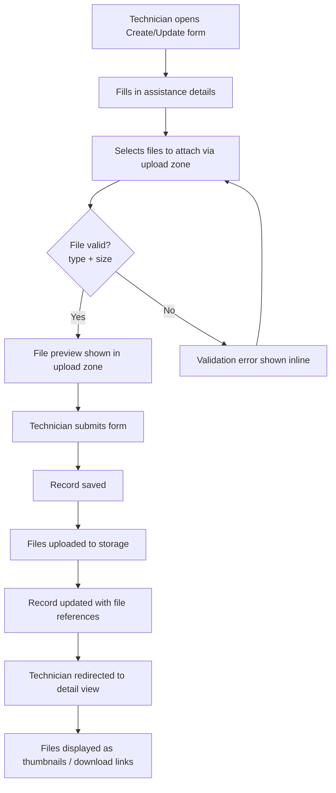
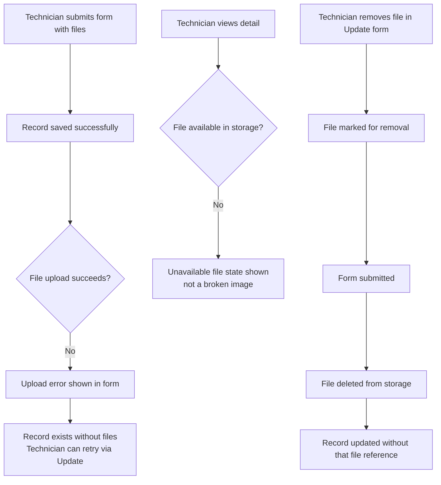

# Remote Assistance — Anexos Refactor — Requirements

## Epic

[ ] **RA-ANEXOS-E-001**: **As a** technician **I want** to attach files (photos, documents) to a remote assistance record **So that** I can provide supporting evidence and documentation for the assistance performed.

---

## User Flow

### Passing Cases Flow

### Non-Passing Cases Flow

---

## Technical Requirements

### Open questions

_None at this time._

### Business Rules

[ ] **RA-ANEXOS-BR-001**: The attachments field accepts zero or more files — it is optional; a remote assistance record is valid with no attachments.

[ ] **RA-ANEXOS-BR-002**: Accepted file types are images (JPEG, PNG, GIF, WebP) and documents (PDF) — consistent with the existing file upload system constraints.

[ ] **RA-ANEXOS-BR-003**: Maximum file size per file is 10 MB — consistent with the existing file upload system constraints.

[ ] **RA-ANEXOS-BR-004**: Multiple files may be attached to a single remote assistance record.

[ ] **RA-ANEXOS-BR-005**: When a remote assistance record is deleted, its attached files are removed from storage on a best-effort basis — failure to remove files does not block the record deletion.

[ ] **RA-ANEXOS-BR-006**: Existing remote assistance records that have a plain-text value in the attachments field are treated as having no file attachments — no data migration is performed; the old text value is discarded on the next update.

[ ] **RA-ANEXOS-BR-007**: Each attached file is stored as a self-contained reference within the remote assistance record — not as a separate independent record.

[ ] **RA-ANEXOS-BR-008**: If files are uploaded successfully but the record save subsequently fails, the uploaded files remain in storage without being linked to any record. The technician must retry the full operation.

[ ] **RA-ANEXOS-BR-009**: If a batch of files is submitted and one or more fail to upload, the successfully uploaded files are retained and their references saved; only the failed files are reported as errors. The record is saved with the successfully uploaded files.

[ ] **RA-ANEXOS-BR-010**: File operations (upload, delete) are subject to the same authentication and role requirements as the remote assistance record itself — only authenticated users with access to the record may upload or delete its files.

### Performance

[ ] **RA-ANEXOS-NFR-001**: **WHEN** a user initiates a file upload, **THEN** the system **SHALL** display upload feedback (progress or loading indicator) within 300 ms.

[ ] **RA-ANEXOS-NFR-002**: **WHEN** a user opens the detail view of a remote assistance record with attachments, **THEN** the system **SHALL** display file thumbnails and download links without requiring a separate page load.

### Dependencies & Integration Requirements

**Internal**:
- Existing file upload infrastructure — already implemented and in use by Installations Programming; covers file type validation, upload handling, file display, and server-side file storage and retrieval
- Remote assistance record management — already implemented

**External**: None

---

## UI/UX Requirements

**UX-RA-ANEXOS-001**: The file upload zone in Create and Update forms must meet the 44px minimum touch target requirement (mobile-first).

**UX-RA-ANEXOS-002**: Image files must display as clickable thumbnails in the detail view; document files must display as download links.

**UX-RA-ANEXOS-003**: When a file is unavailable in storage, a clear unavailable state must be shown — not a broken image or blank space.

**UX-RA-ANEXOS-004**: In the Update form, existing attached files must be visible and individually removable before submitting.

**UX-RA-ANEXOS-005**: Upload errors must be shown inline in the form — not in a modal or separate page.

**UX-RA-ANEXOS-006**: The section label in the UI remains "Anexos" (Portuguese).

---

## User Stories

### Story: Attach files when creating a remote assistance record

[ ] **RA-ANEXOS-S-001**: **As a** technician **I want** to attach one or more files when creating a remote assistance record **So that** I can include supporting photos or documents from the start.

#### Acceptance Criteria

[ ] **RA-ANEXOS-AC-001**: **WHEN** a technician opens the Create form for a remote assistance record, **THEN** the system **SHALL** display a file upload zone in the "Anexos" section.

[ ] **RA-ANEXOS-AC-002**: **WHEN** a technician selects a file that exceeds 10 MB or has an unsupported type, **THEN** the system **SHALL** display an inline validation error and reject the file before upload.

[ ] **RA-ANEXOS-AC-003**: **WHEN** a technician selects valid files and submits the form, **THEN** the system **SHALL** save the record and upload the files, storing a reference for each uploaded file in the record.

[ ] **RA-ANEXOS-AC-004**: **WHEN** the form is submitted with no files selected, **THEN** the system **SHALL** save the record successfully with an empty attachments list.

[ ] **RA-ANEXOS-AC-005**: **IF** one or more files fail to upload after the record is saved, **THEN** the system **SHALL** display an inline error identifying which files could not be uploaded, and the record **SHALL** be saved with the references of any successfully uploaded files.

---

### Story: Attach or remove files when updating a remote assistance record

[ ] **RA-ANEXOS-S-002**: **As a** technician **I want** to add or remove files when editing an existing remote assistance record **So that** I can keep the attachments up to date.

#### Acceptance Criteria

[ ] **RA-ANEXOS-AC-006**: **WHEN** a technician opens the Update form for a remote assistance record that has existing attachments, **THEN** the system **SHALL** display the existing files in the upload zone with individual remove controls.

[ ] **RA-ANEXOS-AC-007**: **WHEN** a technician marks an existing file for removal and submits the form, **THEN** the system **SHALL** delete that file from storage and remove its reference from the record.

[ ] **RA-ANEXOS-AC-008**: **WHEN** a technician adds new files in the Update form and submits, **THEN** the system **SHALL** upload the new files and add their references to the record alongside any retained existing files.

---

### Story: File removal fails during update

[ ] **RA-ANEXOS-S-003**: **As a** technician **I want** to be informed if a file could not be removed during an update **So that** I know the record may still reference a file I intended to delete.

#### Acceptance Criteria

[ ] **RA-ANEXOS-AC-009**: **IF** a file marked for removal cannot be deleted from storage during an update, **THEN** the system **SHALL** still save the record update and display an error message indicating which file could not be removed.

---

### Story: View attachments in the remote assistance detail view

[ ] **RA-ANEXOS-S-004**: **As a** technician or admin **I want** to see the files attached to a remote assistance record in the detail view **So that** I can review supporting documentation.

#### Acceptance Criteria

[ ] **RA-ANEXOS-AC-010**: **WHEN** a user views the detail of a remote assistance record that has attachments, **THEN** the system **SHALL** display image files as clickable thumbnails and document files as download links in the "Anexos" section.

[ ] **RA-ANEXOS-AC-011**: **WHEN** a user views the detail of a remote assistance record with no attachments, **THEN** the system **SHALL** not render the "Anexos" section.

[ ] **RA-ANEXOS-AC-012**: **WHEN** a user clicks on an image thumbnail in the "Anexos" section, **THEN** the system **SHALL** open the full-size image in a new browser tab.

[ ] **RA-ANEXOS-AC-013**: **WHEN** a file reference exists in the record but the file is no longer available in storage, **THEN** the system **SHALL** display an unavailable file indicator instead of a broken image or blank space.

---

### Story: Files are cleaned up when a remote assistance record is deleted

[ ] **RA-ANEXOS-S-005**: **As an** admin **I want** attached files to be removed when a remote assistance record is deleted **So that** storage is not left with unlinked files.

#### Acceptance Criteria

[ ] **RA-ANEXOS-AC-014**: **WHEN** a remote assistance record is deleted, **THEN** the system **SHALL** attempt to remove all files associated with that record from storage on a best-effort basis.

[ ] **RA-ANEXOS-AC-015**: **IF** file removal fails during record deletion, **THEN** the system **SHALL** still complete the record deletion — file cleanup failure must not block the delete operation.

---

### Story: Existing records with plain-text attachments are handled gracefully

[ ] **RA-ANEXOS-S-006**: **As a** technician **I want** existing records with old plain-text attachment data to not cause errors **So that** the transition is seamless.

#### Acceptance Criteria

[ ] **RA-ANEXOS-AC-016**: **WHEN** a user views the detail of a remote assistance record that has a legacy plain-text value in the attachments field, **THEN** the system **SHALL** treat it as having no file attachments and display no broken UI.

[ ] **RA-ANEXOS-AC-017**: **WHEN** a technician updates a remote assistance record that had a legacy plain-text attachment value, **THEN** the system **SHALL** replace it with the new structured file references (or an empty list if no files are attached).

---

## Related Documentation

- File Upload System spec: `.kiro/specs/file-upload-system/` — full specification of the file upload infrastructure (all implemented)
- Installations Programming integration: reference implementation for the same file upload pattern applied to another content type

### Traceability

| Requirement | Traced to |
|---|---|
| RA-ANEXOS-BR-001 | RA-ANEXOS-AC-004, RA-ANEXOS-AC-011 |
| RA-ANEXOS-BR-002 | RA-ANEXOS-AC-002 |
| RA-ANEXOS-BR-003 | RA-ANEXOS-AC-002 |
| RA-ANEXOS-BR-004 | RA-ANEXOS-AC-003, RA-ANEXOS-AC-008 |
| RA-ANEXOS-BR-005 | RA-ANEXOS-AC-014, RA-ANEXOS-AC-015 |
| RA-ANEXOS-BR-006 | RA-ANEXOS-AC-016, RA-ANEXOS-AC-017 |
| RA-ANEXOS-BR-007 | RA-ANEXOS-AC-003, RA-ANEXOS-AC-008 |
| RA-ANEXOS-BR-008 | RA-ANEXOS-AC-005 |
| RA-ANEXOS-BR-009 | RA-ANEXOS-AC-005 |
| RA-ANEXOS-BR-010 | RA-ANEXOS-S-001, RA-ANEXOS-S-002, RA-ANEXOS-S-005 |
| UX-RA-ANEXOS-001 | RA-ANEXOS-AC-001, RA-ANEXOS-AC-006 |
| UX-RA-ANEXOS-002 | RA-ANEXOS-AC-010, RA-ANEXOS-AC-012 |
| UX-RA-ANEXOS-003 | RA-ANEXOS-AC-013 |
| UX-RA-ANEXOS-004 | RA-ANEXOS-AC-006 |
| UX-RA-ANEXOS-005 | RA-ANEXOS-AC-005, RA-ANEXOS-AC-009 |
| UX-RA-ANEXOS-006 | RA-ANEXOS-AC-001, RA-ANEXOS-AC-010 |

### Excluded scope

- Migration of existing plain-text attachment data to file references — no automated migration
- Adding file attachments to other content types (work sheets, daily records, etc.) — out of scope for this spec
- Building new file upload infrastructure — all infrastructure already exists
- Changing any other field in the remote assistance data model
- File size or type limit changes — reuse existing constraints as-is
- Bulk file operations (download all, delete all)
