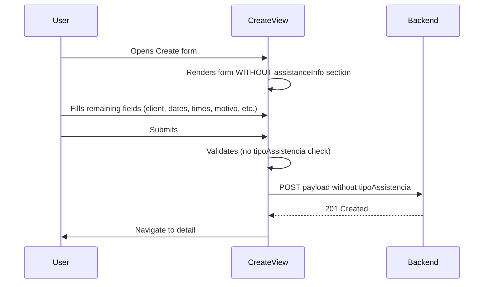

# Remote Assistance Remove Type Section — Design

## 1. Form Configuration Changes

**REQ-IDs**: RA-RTS-BR-001, RA-RTS-AC-001, RA-RTS-AC-002, RA-RTS-UX-001

### Current state

`packages/frontend/src/config/remote-assistance-form-sections.ts` contains an `assistanceInfo` section:

```typescript
{
  key: 'assistanceInfo',
  title: 'Informação da Assistência',
  description: 'Detalhes sobre o tipo de assistência',
  fields: [
    {
      key: 'tipoAssistencia',
      label: 'Tipo de Assistência',
      type: 'select',
      required: true,
      fullWidth: false,
      options: [
        { value: '', label: 'Selecionar tipo...' },
        { value: 'REMOTA', label: 'REMOTA' },
        { value: 'TELEFÓNICA', label: 'TELEFÓNICA' },
      ],
    },
  ],
}
```

### Target state

**Delete** the entire `assistanceInfo` section object from the exported array. No replacement section.

### Error cases

None — removing a form section has no failure mode. If the section is absent, ContentFormTemplate simply does not render it.

---

## 2. Frontend View Changes

**REQ-IDs**: RA-RTS-AC-001, RA-RTS-AC-002, RA-RTS-AC-003, RA-RTS-BR-002

### 2.1 RemoteAssistanceCreateView.vue

| What | Action |
|------|--------|
| `tipoAssistencia` in `RemoteAssistanceCreationData` payload | Remove field from payload object |
| Validation block checking `tipoAssistencia` emptiness + valid type | Delete both conditions |
| Error mapping for `tipoAssistencia` in `fieldErrors` | Delete the two `else if` branches |

### 2.2 RemoteAssistanceUpdateView.vue

| What | Action |
|------|--------|
| `tipoAssistencia` in `initialFormData` | Remove field |
| `tipoAssistencia` in `RemoteAssistanceUpdateData` payload | Remove field from payload |
| Validation block checking `tipoAssistencia` emptiness + valid type | Delete both conditions |
| Error mapping for `tipoAssistencia` in `fieldErrors` | Delete the two `else if` branches |

### 2.3 RemoteAssistanceDetailView.vue

| What | Action |
|------|--------|
| "Tipo de Assistência" detail item with badge display | Delete the entire `<div class="detail-item">` block |
| `getAssistanceTypeClass` helper function (if unused after removal) | Delete |

### 2.4 RemoteAssistanceListView.vue

| What | Action |
|------|--------|
| `getAssistanceTypeDisplay()` helper | Delete |
| `getAssistanceTypeClass()` helper | Delete |
| `tipoAssistencia` in local search filter | Remove from the search condition |
| `tipoAssistencia` in `getRemoteAssistanceSubtitle()` | Remove from subtitle parts |

### Flow diagram — Create view after removal



### Error cases

- No new error paths introduced — removing validation and payload fields simplifies the flow.
- If an existing record has `tipoAssistencia` stored, the Detail view will simply not display it (the rendering block is removed). Data is preserved in R2, just not shown.

---

## 3. Backend Search Index Cleanup

**REQ-IDs**: RA-RTS-AC-004, RA-RTS-BR-002

### Current state

In `packages/backend/src/routes/remote-assistance.ts`:

1. `createRemoteAssistanceSearchText()` includes `tipoAssistencia` in searchable terms
2. `extractIndexFields()` includes `tipoAssistencia` in the returned index object

### Target state

| Function | Change |
|----------|--------|
| `createRemoteAssistanceSearchText()` | Remove the line that pushes `data.tipoAssistencia` to `searchTerms` |
| `extractIndexFields()` | Remove the `tipoAssistencia` field from the returned object |

### Effect on existing records

When an existing record is **updated** after this change, its search index entry will be regenerated **without** `tipoAssistencia`. This is expected and desired per RA-RTS-AC-004.

Records that are never updated keep their existing index entry (which still contains `tipoAssistencia`). This is acceptable — the field is inert in search results since the UI no longer uses it for display or filtering.

### Error cases

None — omitting a field from the index is safe. The index remains valid JSON.

---

## 4. Shared Validation Changes

**REQ-IDs**: RA-RTS-BR-001

### Current state

In `packages/shared/src/types/remote-assistance/validation.ts`:

1. `validateRemoteAssistanceCreation()` — checks `tipoAssistencia` is non-empty and is a valid value from `ASSISTANCE_TYPES`
2. `validateRemoteAssistanceUpdate()` — same validation
3. `getRemoteAssistanceSummary()` — includes `assistanceType: data.tipoAssistencia` in the returned summary object

### Target state

| Function | Change |
|----------|--------|
| `validateRemoteAssistanceCreation()` | Remove the `tipoAssistencia` validation block (empty check + valid type check) |
| `validateRemoteAssistanceUpdate()` | Remove the `tipoAssistencia` validation block |
| `getRemoteAssistanceSummary()` | Remove `assistanceType` from the returned summary |

### Error cases

- Removing validation means the field is no longer required. Payloads without it will pass validation — this is the intended behavior.
- Existing records that still have the field stored are unaffected; validation only runs on create/update.

---

## 5. Backward Compatibility

**REQ-IDs**: RA-RTS-BR-003

### Explicit non-changes

The following are **intentionally preserved** per the requirements excluded scope:

| File | What stays |
|------|-----------|
| `types.ts` — `RemoteAssistanceData` | `tipoAssistencia` field definition remains |
| `types.ts` — `RemoteAssistanceDisplayData` | `tipoAssistencia` field remains |
| `types.ts` — `RemoteAssistanceSearchFilters` | `tipoAssistencia` filter option remains |
| `types.ts` — `REMOTE_ASSISTANCE_CONSTANTS.ASSISTANCE_TYPES` | Constant remains |
| `types.ts` — `AssistanceType` type alias | Type remains |
| R2 stored documents | No data migration — existing `tipoAssistencia` values stay in JSON |

### Rationale

Keeping the type definitions ensures:
- No TypeScript compilation errors in code that reads existing records
- Backward compatibility if the field is ever reintroduced
- Zero risk of breaking existing stored data structure expectations

