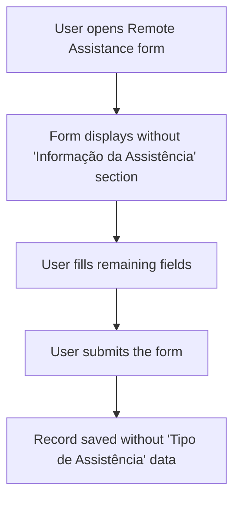

# Remote Assistance Remove Type Section - Requirements

## Epic
[ ] **RA-RTS-E-001**: **As a** user of the dashboard **I want** the "Informação da Assistência" section (containing only "Tipo de Assistência") removed from Remote Assistance records **So that** the form is simplified and no longer collects unnecessary data

## User Flow
### Passing Cases Flow
[ ] Passing flow diagram

### Non-Passing Cases Flow
[ ] No non-passing cases — this is a removal feature with no new error paths

## Technical Requirements

### Open questions
No open questions remaining.

### Business Rules
[ ] **RA-RTS-BR-001**: The "Informação da Assistência" section shall not appear in Create, Update, or Detail views for Remote Assistance
[ ] **RA-RTS-BR-002**: The "Tipo de Assistência" field shall not appear in search results or be used for filtering Remote Assistance records
[ ] **RA-RTS-BR-003**: Existing records that already have "Tipo de Assistência" data stored shall remain unchanged (no data migration required)

### Performance
No performance requirements — this is a removal that reduces form complexity.

### Dependencies & Integration Requirements
**Internal**: Remote Assistance views (Create, Update, Detail), Remote Assistance search listing
**External**: None

## UI/UX Requirements
[ ] **RA-RTS-UX-001**: The "Informação da Assistência" section shall not be visible in any Remote Assistance view (Create, Update, Detail)

## User Stories

### Story: Section removal from form views
[ ] **RA-RTS-S-001**: **As a** dashboard user **I want** the "Informação da Assistência" section removed from the Remote Assistance Create view **So that** I no longer see or fill unnecessary fields

#### Acceptance Criteria
[ ] **RA-RTS-AC-001**: **WHEN** a user opens the Remote Assistance Create view, the system **SHALL** display the form without the "Informação da Assistência" section
[ ] **RA-RTS-AC-002**: **WHEN** a user opens the Remote Assistance Update view, the system **SHALL** display the form without the "Informação da Assistência" section
[ ] **RA-RTS-AC-003**: **WHEN** a user opens the Remote Assistance Detail view, the system **SHALL** display the record without the "Informação da Assistência" section

### Story: Search data cleanup
[ ] **RA-RTS-S-002**: **As a** system maintainer **I want** the "Tipo de Assistência" field removed from Remote Assistance search data **So that** the system does not carry unused information

#### Acceptance Criteria
[ ] **RA-RTS-AC-004**: **WHEN** a new Remote Assistance record is created or updated, the system **SHALL** not store "Tipo de Assistência" for search or listing purposes

## Related Documentation
- Remote Assistance module (Assistências Remotas)

### Excluded scope
- No data migration of existing records — old data with "Tipo de Assistência" is left as-is
- No removal of the field from internal data definitions (kept for backward compatibility)
- No changes to the Remote Assistance List view layout beyond search data cleanup
