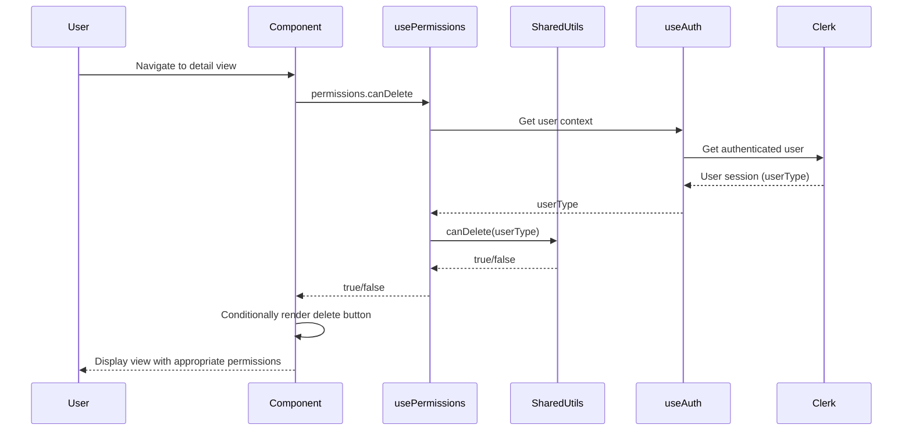
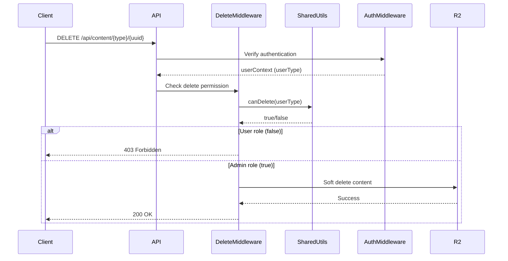

# Design Document: User Permissions System

## Overview

The user permissions system implements role-based access control (RBAC) for the CLEVER dashboard using the existing Clerk authentication infrastructure. The system enforces two permission levels: Admin (full access) and User/Employee (restricted access). The design prioritizes simplicity by leveraging existing authentication context and implementing frontend-only permission checks without requiring backend modifications.

The system restricts two key capabilities for User role:
1. **Delete Operations**: Users cannot delete any content type
2. **Audit Trail Viewing**: Users cannot view the Histórico (audit trail) section in detail views

This design follows the principle of least privilege while maintaining the existing user experience for Admin users.

## Architecture

### High-Level Architecture

```
┌─────────────────────────────────────────────────────────────┐
│                   @clever/shared Package                     │
│  ┌────────────────────────────────────────────────────────┐ │
│  │           Permission Utility Functions                  │ │
│  │  ┌──────────────────────────────────────────────────┐  │ │
│  │  │  - canDelete(userType)                           │  │ │
│  │  │  - canViewAuditTrail(userType)                   │  │ │
│  │  │  - isAdmin(userType)                             │  │ │
│  │  │  - getPermissions(userType)                      │  │ │
│  │  └──────────────────────────────────────────────────┘  │ │
│  └────────────────────────────────────────────────────────┘ │
└─────────────────────────────────────────────────────────────┘
                ↓                              ↓
┌───────────────────────────┐    ┌───────────────────────────┐
│   Frontend Application    │    │   Backend API             │
│                           │    │                           │
│  ┌─────────────────────┐  │    │  ┌─────────────────────┐  │
│  │ usePermissions      │  │    │  │ Delete Middleware   │  │
│  │ Composable          │  │    │  │                     │  │
│  │  - Uses shared      │  │    │  │  - Uses shared      │  │
│  │    permission utils │  │    │  │    permission utils │  │
│  │  - Reactive wrapper │  │    │  │  - Checks userType  │  │
│  │  - Vue integration  │  │    │  │  - Returns 403      │  │
│  └─────────────────────┘  │    │  └─────────────────────┘  │
│           ↓               │    │           ↓               │
│  ┌─────────────────────┐  │    │  ┌─────────────────────┐  │
│  │ UI Components       │  │    │  │ DELETE Endpoints    │  │
│  │  - Delete button    │  │    │  │  - Protected by     │  │
│  │  - Histórico section│  │    │  │    middleware       │  │
│  └─────────────────────┘  │    │  └─────────────────────┘  │
└───────────────────────────┘    └───────────────────────────┘
                ↓                              ↓
┌─────────────────────────────────────────────────────────────┐
│              Clerk Authentication Service                    │
│  - Provides user session with userType field                │
│  - No modifications required                                 │
└─────────────────────────────────────────────────────────────┘
```

### Permission Flow

**Frontend Flow:**



**Backend Flow:**



## Components and Interfaces

### 1. Shared Permission Utilities

**Location:** `packages/shared/src/permissions.ts`

**Purpose:** Provides core permission logic that can be used in both frontend and backend.

**Interface:**

```typescript
export type UserType = 'Admin' | 'User' | null;

export interface Permissions {
  canDelete: boolean;
  canViewAuditTrail: boolean;
}

/**
 * Check if user type is Admin
 */
export function isAdmin(userType: UserType): boolean;

/**
 * Check if user can delete content
 */
export function canDelete(userType: UserType): boolean;

/**
 * Check if user can view audit trail
 */
export function canViewAuditTrail(userType: UserType): boolean;

/**
 * Get all permissions for a user type
 */
export function getPermissions(userType: UserType): Permissions;
```

**Implementation:**

```typescript
export type UserType = 'Admin' | 'User' | null;

export interface Permissions {
  canDelete: boolean;
  canViewAuditTrail: boolean;
}

/**
 * Check if user type is Admin
 */
export function isAdmin(userType: UserType): boolean {
  return userType === 'Admin';
}

/**
 * Check if user can delete content
 * Only Admins can delete content
 */
export function canDelete(userType: UserType): boolean {
  return isAdmin(userType);
}

/**
 * Check if user can view audit trail
 * Only Admins can view audit trail
 */
export function canViewAuditTrail(userType: UserType): boolean {
  return isAdmin(userType);
}

/**
 * Get all permissions for a user type
 * Returns an object with all permission flags
 */
export function getPermissions(userType: UserType): Permissions {
  const admin = isAdmin(userType);
  
  return {
    canDelete: admin,
    canViewAuditTrail: admin,
  };
}
```

**Key Design Decisions:**

1. **Pure Functions**: All functions are pure with no side effects
2. **Type Safety**: Strong TypeScript typing for userType
3. **Deny by Default**: null userType results in all permissions denied
4. **Simple Logic**: Straightforward boolean checks
5. **Reusable**: Can be used in both frontend and backend
6. **Extensible**: Easy to add new permissions in the future

### 2. Frontend usePermissions Composable

**Location:** `packages/frontend/src/composables/usePermissions.ts`

**Purpose:** Provides reactive permission checking for Vue components using shared permission utilities.

**Interface:**

```typescript
interface PermissionsComposable {
  userType: ComputedRef<UserType>;
  permissions: ComputedRef<Permissions>;
  isAuthenticated: ComputedRef<boolean>;
}

function usePermissions(): PermissionsComposable;
```

**Implementation:**

```typescript
import { computed } from 'vue';
import { useAuth } from './useAuth';
import { getPermissions, type UserType, type Permissions } from '@clever/shared';

export function usePermissions() {
  const { user, isAuthenticated } = useAuth();
  
  // Extract userType from authenticated user
  const userType = computed<UserType>(() => {
    if (!isAuthenticated.value || !user.value) {
      return null;
    }
    return user.value.userType || null;
  });
  
  // Compute all permissions using shared utility
  const permissions = computed<Permissions>(() => {
    return getPermissions(userType.value);
  });
  
  return {
    userType,
    permissions,
    isAuthenticated,
  };
}
```

**Key Design Decisions:**

1. **Thin Wrapper**: Composable is a thin reactive wrapper around shared utilities
2. **Computed Properties**: Reactive values that update with authentication state
3. **Shared Logic**: Uses @clever/shared for actual permission logic
4. **Vue Integration**: Provides Vue-specific reactivity
5. **Simple API**: Clean interface for components to consume

### 3. Backend Delete Permission Middleware

**Location:** `packages/backend/src/middleware/permissions.ts`

**Purpose:** Enforces delete permissions at the API level before processing delete operations.

**Interface:**

```typescript
import { Context, Next } from 'hono';

/**
 * Middleware to check if user has permission to delete content
 * Returns 403 Forbidden if user is not Admin
 */
export async function requireDeletePermission(c: Context, next: Next): Promise<Response | void>;
```

**Implementation:**

```typescript
import { Context, Next } from 'hono';
import { canDelete, type UserType } from '@clever/shared';

/**
 * Middleware to check if user has permission to delete content
 * Expects userContext to be set by authentication middleware
 */
export async function requireDeletePermission(c: Context, next: Next): Promise<Response | void> {
  const userContext = c.get('userContext');
  
  if (!userContext) {
    console.error('Delete permission check: No user context available');
    return c.json(
      { error: 'Não autenticado' },
      401
    );
  }
  
  const userType: UserType = userContext.userType || null;
  
  if (!canDelete(userType)) {
    console.warn('Delete permission denied:', JSON.stringify({
      userId: userContext.userId,
      userType: userType,
      path: c.req.path,
    }, null, 2));
    
    return c.json(
      { error: 'Não tem permissão para eliminar conteúdo' },
      403
    );
  }
  
  // User has permission, continue to delete handler
  await next();
}
```

**Integration with Delete Routes:**

```typescript
// In packages/backend/src/routes/content.ts

import { requireDeletePermission } from '../middleware/permissions';

// Apply middleware to delete endpoint
app.delete('/api/content/:type/:uuid', requireDeletePermission, async (c) => {
  // Existing delete logic
  // This code only runs if permission check passes
});
```

**Key Design Decisions:**

1. **Middleware Pattern**: Uses Hono middleware for clean separation of concerns
2. **Shared Logic**: Uses @clever/shared canDelete function for consistency
3. **Early Return**: Returns 403 before processing delete if permission denied
4. **Logging**: Logs permission denials for security auditing
5. **Portuguese Messages**: Error messages in Portuguese for consistency
6. **Authentication Required**: Assumes authentication middleware runs first
7. **Fail Closed**: Denies access if userContext is missing

### 4. ContentDetailTemplate Enhancement
  };
}
```

**Key Design Decisions:**

1. **Thin Wrapper**: Composable is a thin reactive wrapper around shared utilities
2. **Computed Properties**: Reactive values that update with authentication state
3. **Shared Logic**: Uses @clever/shared for actual permission logic
4. **Vue Integration**: Provides Vue-specific reactivity
5. **Simple API**: Clean interface for components to consume

### 4. ContentDetailTemplate Enhancement

**Location:** `packages/frontend/src/components/templates/ContentDetailTemplate.vue`

**Changes Required:**

```vue
<script setup lang="ts">
import { usePermissions } from '@/composables/usePermissions';

// Existing props and setup...
const { permissions } = usePermissions();

// Modify showDeleteButton to respect permissions
const shouldShowDeleteButton = computed(() => {
  return props.showDeleteButton && permissions.value.canDelete;
});
</script>

<template>
  <!-- Desktop actions -->
  <div v-if="shouldShowDeleteButton" class="hidden md:flex items-center gap-2">
    <button
      type="button"
      class="delete-button"
      @click="handleDelete"
    >
      {{ deleteButtonText }}
    </button>
  </div>

  <!-- Mobile actions -->
  <div v-if="shouldShowDeleteButton" class="mobile-actions">
    <button
      type="button"
      class="delete-button-mobile"
      @click="handleDelete"
    >
      {{ deleteButtonText }}
    </button>
  </div>
</template>
```

**Key Design Decisions:**

1. **Computed Property**: Combines existing `showDeleteButton` prop with permission check
2. **Backward Compatible**: Existing prop behavior is preserved, just adds permission layer
3. **Consistent Rendering**: Same permission check applies to both desktop and mobile views
4. **No Breaking Changes**: Components using ContentDetailTemplate don't need modifications

### 5. Detail View Audit Trail Sections

**Pattern for All Detail Views:**

```vue
<script setup lang="ts">
import { usePermissions } from '@/composables/usePermissions';

const { permissions } = usePermissions();
</script>

<template>
  <!-- Content sections... -->
  
  <!-- Histórico section with permission check -->
  <section v-if="permissions.canViewAuditTrail" class="detail-section">
    <h3 class="section-title">Histórico</h3>
    <div class="audit-trail-content">
      <!-- Existing audit trail display -->
    </div>
  </section>
</template>
```

**Affected Views:**

- `ClientsDetailView.vue`
- `ContractsDetailView.vue`
- `LicensesDetailView.vue`
- `WorkSheetsDetailView.vue`
- `DailyRecordsDetailView.vue`
- `RemoteAssistanceDetailView.vue`
- `RemindersDetailView.vue`
- `PendingDetailView.vue`

**Key Design Decisions:**

1. **v-if Directive**: Use v-if to completely remove section from DOM when not permitted
2. **Consistent Pattern**: Same implementation across all detail views
3. **No Visual Artifacts**: Section is completely hidden, no empty space or placeholders
4. **Reactive**: Automatically updates if user authentication state changes

## Data Models

### Permission Types (Shared Package)

**Location:** `packages/shared/src/permissions.ts`

```typescript
/**
 * User type from Clerk authentication
 */
export type UserType = 'Admin' | 'User' | null;

/**
 * Permission flags for a user
 */
export interface Permissions {
  canDelete: boolean;
  canViewAuditTrail: boolean;
}
```

**Note:** These types are defined in the shared package and used by both frontend and backend. No new data models are required in the database or R2 storage - the userType field already exists in Clerk authentication.

## Correctness Properties

*A property is a characteristic or behavior that should hold true across all valid executions of a system—essentially, a formal statement about what the system should do. Properties serve as the bridge between human-readable specifications and machine-verifiable correctness guarantees.*


### Property 1: Admin Full Access

*For any* authenticated user with userType 'Admin', all permission check methods (canDelete, canViewAuditTrail) should return true.

**Validates: Requirements 1.2**

### Property 2: User Restricted Access

*For any* authenticated user with userType 'User', the permission check methods canDelete and canViewAuditTrail should return false.

**Validates: Requirements 1.3**

### Property 3: Delete Button Visibility by Role

*For any* content type detail view, when rendered with an authenticated user, the delete button should be visible if and only if the user's userType is 'Admin'.

**Validates: Requirements 2.1, 2.2**

### Property 4: Backend Delete Permission Enforcement

*For any* DELETE API request to /api/content/{type}/{uuid}, when the authenticated user's userType is 'User', the API should return a 403 Forbidden error without processing the delete operation.

**Validates: Requirements 2.4, 2.5, 5.1**

### Property 5: Audit Trail Visibility by Role

*For any* content type detail view, when rendered with an authenticated user, the Histórico (audit trail) section should be visible if and only if the user's userType is 'Admin'.

**Validates: Requirements 3.1, 3.2**

### Property 6: Unauthenticated User Denial

*For any* permission check method, when called without an authenticated user context, the method should return false (deny by default).

**Validates: Requirements 4.5**

### Property 7: Reactive Permission Updates

*For any* permission check, when the authentication state changes from unauthenticated to authenticated (or vice versa), or when userType changes, the permission values should update reactively to reflect the new authentication state.

**Validates: Requirements 6.3**

### Property 8: Permission Check Performance

*For any* permission check method call, the execution should complete in less than 10 milliseconds to ensure no noticeable delay in UI rendering.

**Validates: Requirements 9.1**

## Error Handling

### Authentication Errors

**Scenario:** User authentication fails or session expires

**Handling:**
- Permission checks default to false (deny access)
- No error messages displayed to user
- Existing authentication error handling remains unchanged
- User is redirected to login by existing auth middleware

**Implementation:**

```typescript
const userType = computed(() => {
  try {
    if (!isAuthenticated.value || !user.value) {
      return null;
    }
    return user.value.userType || null;
  } catch (error) {
    console.error('Error getting user type:', error);
    return null; // Fail closed
  }
});
```

### Missing UserType Field

**Scenario:** Authenticated user object doesn't contain userType field

**Handling:**
- Treat as null userType
- Deny all permissions (fail closed)
- Log warning for debugging
- Don't break UI rendering

**Implementation:**

```typescript
const userType = computed(() => {
  try {
    if (!isAuthenticated.value || !user.value) {
      return null;
    }
    return user.value.userType || null;
  } catch (error) {
    console.error('Error getting user type:', error);
    return null; // Fail closed
  }
});

const permissions = computed<Permissions>(() => {
  if (!userType.value) {
    console.warn('UserType not available, denying all permissions');
    return {
      canDelete: false,
      canViewAuditTrail: false,
    };
  }
  
  const isAdmin = userType.value === 'Admin';
  return {
    canDelete: isAdmin,
    canViewAuditTrail: isAdmin,
  };
});
```

### Component Rendering Errors

**Scenario:** Permission check fails during component rendering

**Handling:**
- Catch errors in computed properties
- Default to most restrictive permissions
- Log error for debugging
- Allow component to render without permission-restricted features

**Implementation:**

```typescript
const permissions = computed<Permissions>(() => {
  try {
    const isAdmin = userType.value === 'Admin';
    
    return {
      canDelete: isAdmin,
      canViewAuditTrail: isAdmin,
    };
  } catch (error) {
    console.error('Error computing permissions:', error);
    // Fail closed - deny all permissions
    return {
      canDelete: false,
      canViewAuditTrail: false,
    };
  }
});
```

### Key Error Handling Principles

1. **Fail Closed**: Always deny permissions when errors occur
2. **Silent Failures**: Don't show permission errors to users (they see restricted UI)
3. **Logging**: Log all permission-related errors for debugging
4. **Graceful Degradation**: UI continues to function with restricted access
5. **No Breaking Changes**: Errors don't break existing functionality

## Testing Strategy

### Dual Testing Approach

The testing strategy combines unit tests for specific scenarios with property-based tests for comprehensive coverage:

**Unit Tests:**
- Test specific user role scenarios (Admin with all permissions, User with restrictions)
- Test edge cases (unauthenticated user, missing userType)
- Test component integration (delete button visibility, audit trail visibility)
- Test error handling (authentication failures, missing fields)

**Property-Based Tests:**
- Test permission consistency across all content types
- Test reactive updates with various authentication state transitions
- Test performance characteristics across many permission checks
- Test permission logic with generated user contexts

### Property Test Configuration

All property-based tests will:
- Run minimum 100 iterations per test
- Use fast-check library for property-based testing in TypeScript
- Tag each test with feature name and property number
- Reference the design document property being validated

**Example Test Tags:**

```typescript
// Feature: user-permissions, Property 1: Admin Full Access
test('Admin users have full access to all features', async () => {
  await fc.assert(
    fc.asyncProperty(
      fc.record({
        userType: fc.constant('Admin' as const),
        userId: fc.uuid(),
        email: fc.emailAddress(),
      }),
      async (adminUser) => {
        // Test that permissions.canDelete and permissions.canViewAuditTrail are true
      }
    ),
    { numRuns: 100 }
  );
});
```

### Test Coverage Areas

**Composable Tests:**
- usePermissions composable with various user contexts
- Permission method return values for each role
- Reactive updates when authentication state changes
- Error handling and fallback behavior

**Component Tests:**
- ContentDetailTemplate delete button visibility
- Detail view audit trail section visibility
- Consistent behavior across all content types
- Mobile and desktop rendering with permissions

**Backend Tests:**
- requireDeletePermission middleware with Admin user
- requireDeletePermission middleware with User role
- DELETE endpoint returns 403 for User role
- DELETE endpoint processes successfully for Admin
- Permission denial logging

**Integration Tests:**
- End-to-end permission flow from authentication to UI
- Permission checks across navigation
- Authentication state changes during session
- Frontend-backend permission consistency
- Multiple content types with different user roles

### Manual Testing Checklist

- [ ] Admin user can see delete buttons in all detail views
- [ ] Admin user can see Histórico section in all detail views
- [ ] User role cannot see delete buttons in any detail view
- [ ] User role cannot see Histórico section in any detail view
- [ ] Unauthenticated users see most restrictive UI
- [ ] Permissions update when switching between Admin and User accounts
- [ ] No UI flickering when permissions are applied
- [ ] Mobile and desktop views respect permissions consistently
- [ ] All content types enforce permissions uniformly
- [ ] No console errors related to permission checks

## Implementation Notes

### Development Approach

1. **Create usePermissions Composable First**: Implement and test the core permission logic before UI integration
2. **Update ContentDetailTemplate**: Add permission check for delete button visibility
3. **Update Detail Views**: Add permission checks for audit trail sections one content type at a time
4. **Test Incrementally**: Test each content type as it's updated
5. **No Backend Changes**: This is a frontend-only implementation

### Code Organization

```
packages/shared/src/
└── permissions.ts                     # New: Shared permission utilities

packages/frontend/src/
├── composables/
│   └── usePermissions.ts              # New: Frontend composable
├── components/
│   └── templates/
│       └── ContentDetailTemplate.vue  # Modified
└── views/
    ├── clients/
    │   └── ClientsDetailView.vue      # Modified
    ├── contracts/
    │   └── ContractsDetailView.vue    # Modified
    ├── licenses/
    │   └── LicensesDetailView.vue     # Modified
    ├── work-sheets/
    │   └── WorkSheetsDetailView.vue   # Modified
    ├── daily-records/
    │   └── DailyRecordsDetailView.vue # Modified
    ├── remote-assistance/
    │   └── RemoteAssistanceDetailView.vue # Modified
    ├── reminders/
    │   └── RemindersDetailView.vue    # Modified
    └── pending/
        └── PendingDetailView.vue      # Modified

packages/backend/src/
├── middleware/
│   └── permissions.ts                 # New: Backend middleware
└── routes/
    └── content.ts                     # Modified: Add middleware to DELETE routes
```

### Performance Considerations

1. **Shared Package**: Permission logic in shared package has zero runtime overhead
2. **Computed Properties**: Use Vue's computed properties for automatic caching and reactivity
3. **No API Calls**: Frontend permission checks use existing authentication context (no additional network requests)
4. **Minimal Overhead**: Permission checks are simple boolean comparisons
5. **Lazy Evaluation**: Computed properties only recalculate when dependencies change
6. **No Watchers**: Rely on computed properties instead of watchers for better performance
7. **Backend Middleware**: Middleware runs only on DELETE requests, no impact on other operations

### Security Considerations

1. **Defense in Depth**: Both frontend and backend enforce permissions
2. **Backend Enforcement**: DELETE endpoints protected by middleware
3. **Fail Closed**: All permission checks deny by default when userType is unavailable
4. **No Security Bypass**: Frontend restrictions prevent UI access, backend prevents API access
5. **Audit Trail**: Backend logs all permission denials for security auditing
6. **Shared Logic**: Same permission logic in frontend and backend ensures consistency
7. **Type Safety**: TypeScript ensures correct userType handling throughout

### Migration Strategy

1. **No Data Migration**: No database changes required
2. **No User Migration**: Existing users already have userType in Clerk
3. **Gradual Rollout**: Can deploy to test environment first
4. **Backward Compatible**: No breaking changes to existing functionality
5. **Rollback Plan**: Can revert by removing permission checks from components

### Future Enhancements

Potential future improvements (not in current scope):

1. **Granular Permissions**: More fine-grained permissions beyond Admin/User
2. **Content-Type Specific Permissions**: Different permissions for different content types
3. **Permission Groups**: Group permissions into reusable sets
4. **Permission Audit Log**: Enhanced tracking of permission checks and denials
5. **Dynamic Permissions**: Load permissions from backend configuration
6. **Role Management UI**: Admin interface for managing user roles
7. **Additional Protected Operations**: Extend permissions to other sensitive operations beyond delete

## Dependencies

### Existing Dependencies

- **Clerk Authentication**: Provides user session with userType field
- **useAuth Composable**: Existing composable for accessing authentication state
- **Vue 3 Composition API**: For reactive permission checks in frontend
- **ContentDetailTemplate**: Existing template component for detail views
- **Hono Framework**: For backend middleware implementation

### No New Dependencies Required

This implementation uses only existing dependencies and doesn't require:
- New npm packages
- New backend services
- New database tables
- New authentication providers
- New API endpoints (only modifies existing DELETE endpoints)

## Deployment Considerations

### Test Environment

1. Create test users with both Admin and User roles in Clerk test environment
2. Verify permission behavior for each role
3. Test all content types systematically
4. Verify mobile and desktop experiences
5. Check for console errors or warnings

### Production Deployment

1. Deploy to production during low-traffic period
2. Monitor for authentication-related errors
3. Verify existing Admin users retain full access
4. Verify User role users see restricted UI
5. Have rollback plan ready if issues arise

### Rollback Plan

If issues arise:
1. Revert frontend deployment to previous version
2. No backend changes to revert (none were made)
3. No data cleanup required (no data changes)
4. Users automatically get previous behavior

### Monitoring

Monitor these metrics after deployment:
- Authentication error rates
- Permission check errors in logs
- User complaints about missing features
- Admin user workflow disruptions
- Performance impact on page load times
